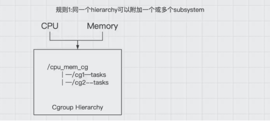
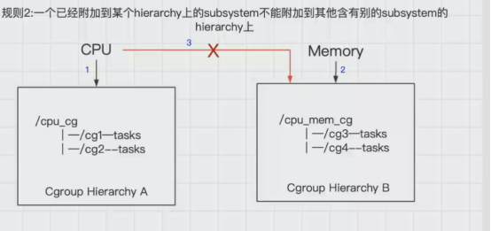
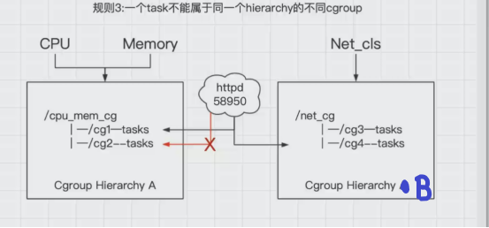
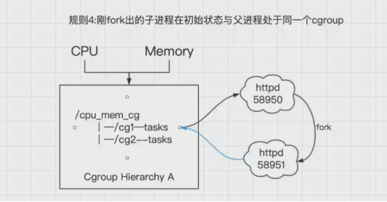

## 前言
内核中强大的工具cgroup，不仅可以限制被NameSpace隔离起来的资源，还可以为资源设置权重，计算用量等

## 什么是cgroup
cgroup全称是control groups

control groups：控制组，被整合在了linux内核当中，把进程（tasks）放到组里面，对组设置权限，对进程进行控制。可以理解为用户和组的概念，用户会继承它所在组的权限。

cgroups是linux内核中的机制，这种机制可以根据特定的行为把一系列的任务，子任务整合或者分离，按照资源划分的等级的不同，从而实现资源统一控制的框架，cgroup可以控制、限制、隔离进程所需要的物理资源，包括cpu、内存、IO，为容器虚拟化提供了最基本的保证，是构建docker一系列虚拟化的管理工具

### 对于开发cgroup的特点
```
API：实现管理

cgroup管理可以管理到线程界别

所有线程功能都是subsystem（子系统）统一的管理方式

子进程和父进程在一个cgroup里面，只需要控制父进程就可以
```

## cgroup的作用
cgroup的内核通过hook钩子来实现管理进程资源，提供了一个统一的接口，从单个进程的资源控制到操作系统层面的虚拟卡的过渡

### cgroup提供了四个功能：

- 资源控制：cgroup通过进程组对资源总额进行限制。如：程序使用内存时，要为程序设定可以使用主机的多少内存，也叫作限额
- 优先级分配：使用硬件的权重值。当两个程序都需要进程读取cpu，哪个先哪个后，通过优先级来进行控制
- 资源统计：可以统计硬件资源的用量，如：cpu、内存…使用了多长时间
- 进程控制：可以对进程组实现挂起/恢复的操作，
## 术语表
- task：表示系统中的某一个进程—PID
- cgroup：资源控制，以控制组（cgroup）为单位实现，cgroup中有都是task，可以有多个cgroup组，可以限制不同的内容，组名不能相同。
- subsystem：子系统。资源调度控制器。具体控制内容。如：cpu的子系统控制cpu的时间分配，内存的子系统可以控制某个cgroup内的内存使用量，硬盘的子系统，可以控制硬盘的读写等等。
- hierarchy：层级树，一堆cgroup构成，包含多个cgroup的叫层级树，，每个hierarchy通过绑定的子系统对资源进行调度，可以包含0个或多个子节点，子节点继承父节点的属性，整个系统可以有多个hierarchy，是一个逻辑概念

关系：一个cgroup里可以有多个task，subsystem相当于控制cgroup限制的类型， hierarchy里可以有多个cgroup，一个系统可以有多个hierarchy。

## 层级树的四大规则
传统的进程启动，是以init为根节点，也叫父进程，由它来创建子进程，作为子节点，而每个子节点还可以创建新的子节点，这样构成了树状结构。而cgroup的结构跟他类似的。子节点继承父节点的属性。他们最大的不同在于，系统的cgroup构成的层级树允许有多个存在，如果进程模型是init为根节点形成一个树，那cgroup的模型由多个层级树来构成。

如果只有一个层级树，所有的task都会受到一个subsystem的相同的限制，会给不需要这种限制的task造成麻烦

1.同一个层级树（hierarchy）可以附加一个或多个子系统（subsystem）



可以看到在一个层级树中，有一个cpu_mem_cg的cgroup组下还有两个子节点cg1和cg2，如图所示，也就意味着在cpu_mem_cg的组中，附加了cpu和mem内存两个子系统，同时来控制cg1和cg2的cpu和内存的硬件资源使用

2.一个子系统（subsystem）可以附加到多个层级树（hierarchy）中，但是仅仅是可以附加到多个没有任何子系统的层级树中。



如图所示，cpu子系统先附加到层级树A上，同时就不能附加到层级树B上，因为B上已经有了一个mem子系统，如果B和A同时都是没有任何子系统时，这时，cpu子系统可以同时附加到A和B两个层级树中

言外之意就是，如果多个层级树中都没有子系统，这个时候一个cpu子系统依次可以附加到这些层级树中

3.一个进程（task）不能属于同一个层级树（hierarchy）的不同cgroup



系统每次新建一个层级树（hierarchy）时，默认的构成了新的层级树的初始化的cgroup，这个cgroup被称为root cgroup，对于你自己成功的层级树（hierarchy）来说，task只能存在这个层级树的一个cgroup当中，意思就是一个层级树中不能出现两个相同的task，但是它可以存在不同的层级树中的其他cgroup。

如果要将一个层级树cgroup中的task添加到这个层级树的其他cgroup时，会被从之前task所在的cgroup移除

如以上图中示例：

httpd已经加入到层级树（hierarchy）A中的cg1中，且pid为58950，此时就不能将这个httpd进程放入到cg2中，不然cg1中的httpd进程就会被删除，但是可以放到层级树（hierarchy）B的cg3控制组中

其实是为了防止出现进程矛盾，如：在层级树A中的cg1中存在httpd进程，这时cpu对cg1的限制使用率为30%，cg2的限制使用率为50%，如果再将httpd进程添加到cg2中，这时httpd的cpu使用率限制就有了矛盾。

4.刚fork出的子进程在初始状态与父进程处于同一个cgroup



进程task新开的一个子进程（child_task）默认是和原来的task在同一个cgroup中，但是child_task允许被移除到该层级树的其他不同的cgroup中。

当fork刚完成之后，父进程和子进程是完全独立的

如图中所示中，httpd58950进程，当有人访问时，会fork出另外一个子进程httpd58951，这个时候默认httpd58951和httpd58950都在cg1中，他们的关系也是父子进程，httpd58951是可以移动到cg2中，这时候就改变了他们的关系，都变为了独立的进程。

## Subsystem子系统
### subsystem究竟可以控制什么东西
通过以下的操作来验证
```shell script
sudo apt install cgroup-tools
```

安装这个工具后就看可以通过使用lscgroup命令来查看,列出系统中所有的cgroup控制组

```shell script
yuanshuai@ys-villager:~$ lssubsys -a
cpuset
cpu,cpuacct
blkio
memory
devices
freezer
net_cls,net_prio
perf_event
hugetlb
pids
rdma
```
以上查看到的，有存在的对应目录，/sys/fs/cgroup

```shell script
yuanshuai@ys-villager:~$ ll /sys/fs/cgroup/
total 0
drwxr-xr-x 15 root root 380 10月  4 09:10 ./
drwxr-xr-x  9 root root   0 10月  4 09:10 ../
dr-xr-xr-x  4 root root   0 10月  4 09:10 blkio/
lrwxrwxrwx  1 root root  11 10月  4 09:10 cpu -> cpu,cpuacct/
lrwxrwxrwx  1 root root  11 10月  4 09:10 cpuacct -> cpu,cpuacct/
dr-xr-xr-x  4 root root   0 10月  4 09:10 cpu,cpuacct/
dr-xr-xr-x  2 root root   0 10月  4 09:10 cpuset/
dr-xr-xr-x  4 root root   0 10月  4 09:10 devices/
dr-xr-xr-x  3 root root   0 10月  4 09:10 freezer/
dr-xr-xr-x  2 root root   0 10月  4 09:10 hugetlb/
dr-xr-xr-x  4 root root   0 10月  4 09:10 memory/
lrwxrwxrwx  1 root root  16 10月  4 09:10 net_cls -> net_cls,net_prio/
dr-xr-xr-x  2 root root   0 10月  4 09:10 net_cls,net_prio/
lrwxrwxrwx  1 root root  16 10月  4 09:10 net_prio -> net_cls,net_prio/
dr-xr-xr-x  2 root root   0 10月  4 09:10 perf_event/
dr-xr-xr-x  4 root root   0 10月  4 09:10 pids/
dr-xr-xr-x  2 root root   0 10月  4 09:10 rdma/
dr-xr-xr-x  5 root root   0 10月  4 09:10 systemd/
dr-xr-xr-x  5 root root   0 10月  4 09:10 unified/

```
可以看到目录中的内容是比命令查看到的多，是因为有几个软链接文件

``` 以下三个都属于cpu,cpuacct
cpu -> cpu,cpuacct
cpuacct -> cpu,cpuacct
cpu,cpuacct
 以下三个都属于net_cls,net_prio
net_cls -> net_cls,net_prio
net_prio -> net_cls,net_prio
net_cls,net_prio
```
### Subsystem可以控制的内容分别代表什么
1. blkio（对块设备提供输入输出的限制):光盘、固态磁盘、USB…。
2. cpu:可以调控task对cpu的使用。
3. cpuacct:自动生成task对cpu资源使用情况的报告。
4. cpuset（针对多处理器的物理机使用）: 对task单独分配某个cpu使用的。
5. device（设备是指键盘、鼠标…）:关闭和开启task对设备的访问。
6. freezer: 控制task的挂起和恢复，如不允许某个task使用cpu被称之为挂起。
7. memory: 控制task对内存使用量的限定，自动生成对内存资源使用的报告
8. perf_event: 对task可以进行统一的性能测试，如探测linxu的cpu性能以及硬盘的读写效率等等。
9. net_cls: 在docker中没有直接被使用，它通过使用等级识别符(classid)标记网络数据包，从而允许 Linux 流量控制程序识别从具体cgroup中生成的数据包。

注意：到现在为止，还没有可以对容器硬盘大小进行限制的工具，只能限制硬盘的读写频率

## cgroup的工作原理
查看cgroup中的CPU控制中的tasks文件，存放了对文件中的进程的cpu的控制，如果要添加某个进程对cpu的控制，将进程的pid加入tasks文件即可，包括其他的硬件资源控制也是如此
```shell script
yuanshuai@ys-villager:~$ cat /sys/fs/cgroup/cpu/tasks 
1
2
3
4
6
9
10
...
10613
10649
10662
10663
```

cgroup真正的工作原理就是hook钩子，cgroup的实现本质上是给系统进程挂上钩子实现的，当task进程运行的过程中，设计到某个资源是，就会触发钩子上附带的subsystem子系统进行资源检测，最终根据资源类别的不同使用对应的技术进行资源限制和优先级分配。

### 钩子是怎么实现的

简单来说，linux中管理task进程的数据结构，在cgroup的每个task设置一个关键词，将关键词都指向钩子，叫做指针。

一个task只对应一个指针结构时，一个指针结构可以被多个task进行使用

当一个指针一旦读取到唯一指针数据的内容，task就会被触发，就可以进行资源控制

在实际的使用过程中，用户需要使用mount来挂载cgroup控制组

例如，我的jetbrains-toolbox进程10613，查看它pid号目录中的mounts文件，存放了大量的关于cgroup的挂载
```shell script
yuanshuai@ys-villager:~$ cat /proc/10613/mounts
sysfs /sys sysfs rw,nosuid,nodev,noexec,relatime 0 0
proc /proc proc rw,nosuid,nodev,noexec,relatime 0 0
udev /dev devtmpfs rw,nosuid,noexec,relatime,size=12157332k,nr_inodes=3039333,mode=755 0 0
devpts /dev/pts devpts rw,nosuid,noexec,relatime,gid=5,mode=620,ptmxmode=000 0 0
tmpfs /run tmpfs rw,nosuid,nodev,noexec,relatime,size=2437104k,mode=755 0 0
/dev/nvme0n1p2 / ext4 rw,relatime,errors=remount-ro 0 0
securityfs /sys/kernel/security securityfs rw,nosuid,nodev,noexec,relatime 0 0
tmpfs /dev/shm tmpfs rw,nosuid,nodev 0 0
tmpfs /run/lock tmpfs rw,nosuid,nodev,noexec,relatime,size=5120k 0 0
tmpfs /sys/fs/cgroup tmpfs ro,nosuid,nodev,noexec,mode=755 0 0
cgroup2 /sys/fs/cgroup/unified cgroup2 rw,nosuid,nodev,noexec,relatime,nsdelegate 0 0
cgroup /sys/fs/cgroup/systemd cgroup rw,nosuid,nodev,noexec,relatime,xattr,name=systemd 0 0
pstore /sys/fs/pstore pstore rw,nosuid,nodev,noexec,relatime 0 0
efivarfs /sys/firmware/efi/efivars efivarfs rw,nosuid,nodev,noexec,relatime 0 0
none /sys/fs/bpf bpf rw,nosuid,nodev,noexec,relatime,mode=700 0 0
cgroup /sys/fs/cgroup/perf_event cgroup rw,nosuid,nodev,noexec,relatime,perf_event 0 0
cgroup /sys/fs/cgroup/cpu,cpuacct cgroup rw,nosuid,nodev,noexec,relatime,cpu,cpuacct 0 0
cgroup /sys/fs/cgroup/cpuset cgroup rw,nosuid,nodev,noexec,relatime,cpuset 0 0
cgroup /sys/fs/cgroup/pids cgroup rw,nosuid,nodev,noexec,relatime,pids 0 0
cgroup /sys/fs/cgroup/hugetlb cgroup rw,nosuid,nodev,noexec,relatime,hugetlb 0 0
cgroup /sys/fs/cgroup/rdma cgroup rw,nosuid,nodev,noexec,relatime,rdma 0 0
cgroup /sys/fs/cgroup/net_cls,net_prio cgroup rw,nosuid,nodev,noexec,relatime,net_cls,net_prio 0 0
cgroup /sys/fs/cgroup/memory cgroup rw,nosuid,nodev,noexec,relatime,memory 0 0
cgroup /sys/fs/cgroup/freezer cgroup rw,nosuid,nodev,noexec,relatime,freezer 0 0
cgroup /sys/fs/cgroup/blkio cgroup rw,nosuid,nodev,noexec,relatime,blkio 0 0
cgroup /sys/fs/cgroup/devices cgroup rw,nosuid,nodev,noexec,relatime,devices 0 0
systemd-1 /proc/sys/fs/binfmt_misc autofs rw,relatime,fd=28,pgrp=1,timeout=0,minproto=5,maxproto=5,direct,pipe_ino=16843 0 0
hugetlbfs /dev/hugepages hugetlbfs rw,relatime,pagesize=2M 0 0
mqueue /dev/mqueue mqueue rw,nosuid,nodev,noexec,relatime 0 0
debugfs /sys/kernel/debug debugfs rw,nosuid,nodev,noexec,relatime 0 0
tracefs /sys/kernel/tracing tracefs rw,nosuid,nodev,noexec,relatime 0 0
fusectl /sys/fs/fuse/connections fusectl rw,nosuid,nodev,noexec,relatime 0 0
configfs /sys/kernel/config configfs rw,nosuid,nodev,noexec,relatime 0 0
/dev/loop0 /snap/core18/1880 squashfs ro,nodev,relatime 0 0
/dev/loop1 /snap/gnome-3-28-1804/128 squashfs ro,nodev,relatime 0 0
/dev/loop3 /snap/gnome-3-34-1804/36 squashfs ro,nodev,relatime 0 0
/dev/loop2 /snap/gtk-common-themes/1506 squashfs ro,nodev,relatime 0 0
/dev/loop4 /snap/core18/1885 squashfs ro,nodev,relatime 0 0
/dev/loop5 /snap/gnome-3-34-1804/60 squashfs ro,nodev,relatime 0 0
/dev/loop6 /snap/snap-store/415 squashfs ro,nodev,relatime 0 0
/dev/loop7 /snap/snapd/8790 squashfs ro,nodev,relatime 0 0
/dev/loop8 /snap/snap-store/467 squashfs ro,nodev,relatime 0 0
/dev/loop9 /snap/snapd/9279 squashfs ro,nodev,relatime 0 0
/dev/nvme0n1p1 /boot/efi vfat rw,relatime,fmask=0077,dmask=0077,codepage=437,iocharset=iso8859-1,shortname=mixed,errors=remount-ro 0 0
tmpfs /run/user/1000 tmpfs rw,nosuid,nodev,relatime,size=2437100k,mode=700,uid=1000,gid=1000 0 0
gvfsd-fuse /run/user/1000/gvfs fuse.gvfsd-fuse rw,nosuid,nodev,relatime,user_id=1000,group_id=1000 0 0
/dev/fuse /run/user/1000/doc fuse rw,nosuid,nodev,relatime,user_id=1000,group_id=1000 0 0
tmpfs /run/snapd/ns tmpfs rw,nosuid,nodev,noexec,relatime,size=2437104k,mode=755 0 0
nsfs /run/snapd/ns/snap-store.mnt nsfs rw 0 0
jetbrains-toolbox /tmp/.mount_jetbraWv9hqc fuse.jetbrains-toolbox ro,nosuid,nodev,relatime,user_id=1000,group_id=1000 0 0
```
可以看到每一个cgoup后面的目录，如/sys/fs/cgroup/cpu,cpuacct，说明这个进程受到了cpu使用的限制，该文件中还有很多类似的挂载项，可以看到的有blkio/perf_event/memory等的硬件资源控制。

这就是通过mount控制cgroup的，所有的程序都是这样的，子系统上所有的系统都把文件mount上以后，就可以像操作系统一样操作cgroup和层级树进行管理，包括权限管理、子文件系统，除了cgroup文件系统以外，内核中没有为cgroup的访问提供添加其他任何的操作，想要去操作cgroup，就必须使用mount挂到某一个cgroup控制组内才行。

## 资源控制操作
我们需要知道每一个硬件资源的具体怎么去控制的操作

如：

cgroup组中的cpu目录里具体的每一项的具体的含义，都是对cpu具体的控制的细节

```shell script
yuanshuai@ys-villager:~$ cd /sys/fs/cgroup/
yuanshuai@ys-villager:/sys/fs/cgroup$ ls
blkio    cpu,cpuacct  freezer  net_cls           perf_event  systemd
cpu      cpuset       hugetlb  net_cls,net_prio  pids        unified
cpuacct  devices      memory   net_prio          rdma

```
这些具体的使用方法会在下一篇文章中来逐个去解释用法

### Docker命令行限制内容
```-c/--cpu-shares:限制cpu优先级
 
-m/--memory:限制内存的使用容量
--memory-swap:限制内存+swap的大小
 
--blkil-weight
bps/iops
--device-read-bps
--device-write-bps
--device-read-iops
--device-write-iops
```

## cgroup目录结构如下


/sys/fs/cgroup中存放了所有进程的硬件资源控制

/sys/fs/cgroup/{cpu,memory,blkio...}/目录下存放了特定硬件资源的默认的非docker进程的控制，docker的进程号不会在这些目录下

/sys/fs/cgroup/cpu/docker/目录下存放了docker在主机内的进程控制

/sys/fs/cgroup/cpu/docker/容器id/目录下存放了对docker产生的容器的控制