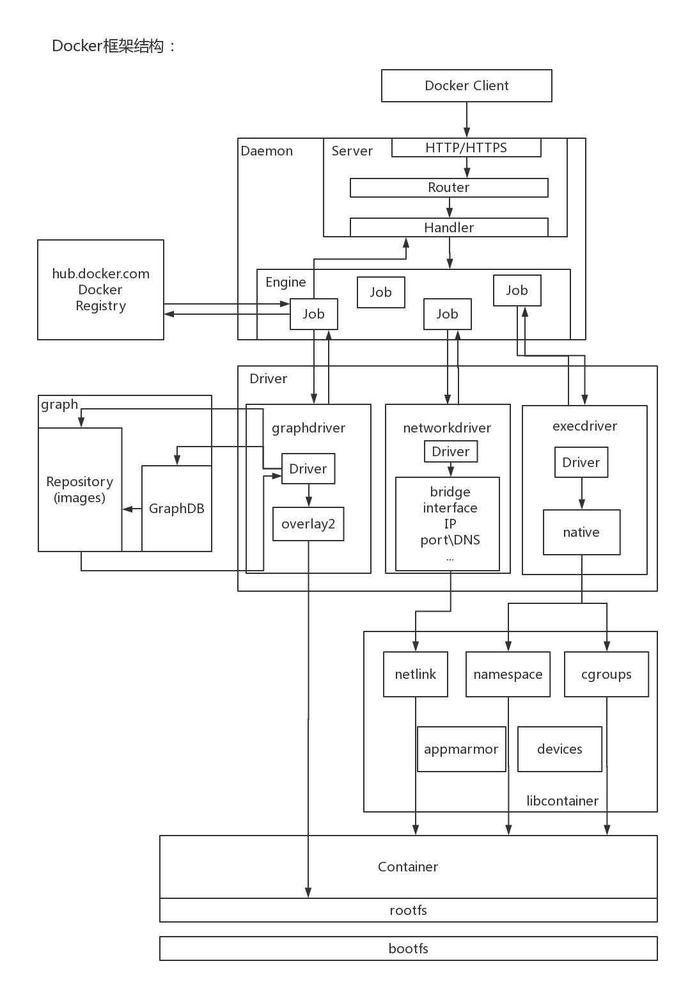
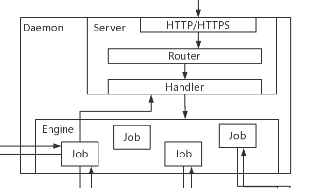
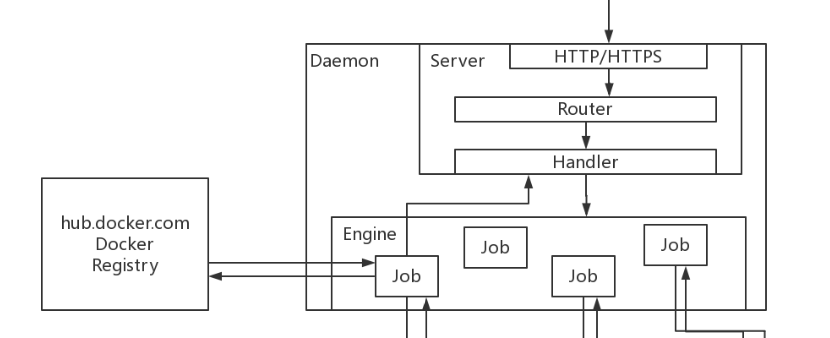
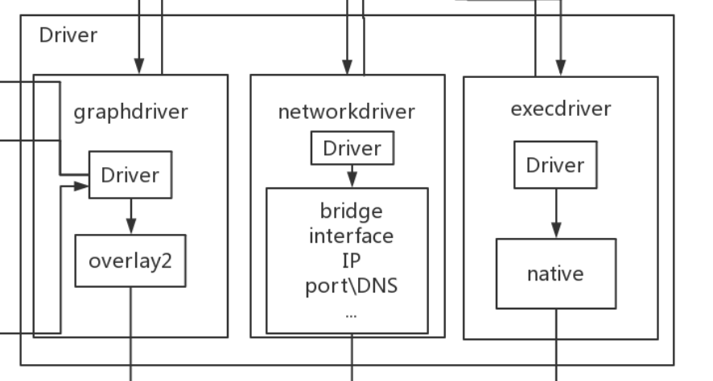
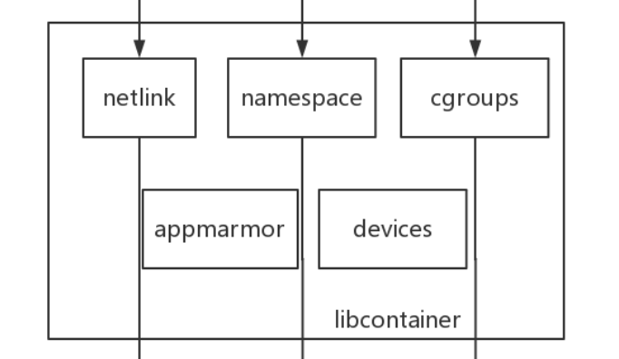

## Docker总体框架结构
Docker对使用者来讲是一个C/S模式的架构，而Docker的后端是一个非常松耦合的架构，模块各司其职，并有机组合，支撑Docker的运行。


在docker version命令输出信息中，可以看到有两个端，一个Client，一个Server，默认情况下两个端口是在一起使用的，也可以通过手动将它们分开

接下来我们来介绍结构图的总览,方便接下来对逐个模块的理解

用户使用Docker Client与Docker Daemon建立通信，并发送请求给Daemon。

而Docker Daemon作为Docker架构中的主体部分，首先提供了Server的功能，使其可以接收Docker Client的请求；而后由Engine执行Docker内部的一系列工作，每一项工作都是以一个Job的形式存在。

Job的运行过程中，当需要容器镜像时，则从Docker Registry中下载镜像，并通过镜像管理驱动graphdriver将下载镜像以Graph的形式存储；当需要为Docker创建网络环境时，通过网络管理驱动networkdriver创建并配置Docker容器网络环境；当需要限制Docker容器运行资源或执行用户指令等操作时，则通过execdriver来完成。

而libcontainer是一项独立的容器管理包，networkdriver和execdriver都是通过libcontainer来实现具体容器进行的操作。当执行完运行容器的命令后，一个实际的Docker容器就处于运行状态，该容器拥有独立的文件系统，独立并且安全的运行环境等。

## 框架结构中各模块的功能与实现分析
先来看一下要从那些开始分析，在整个架构中，主要的模块有：Docker Client、Docker Daemon、Docker Registry、Graph、Driver、libcontainer以及Docker container。

### Docker Client
Docker Client是Docker架构中用户用来和Docker Daemon建立通信的客户端。用户使用的可执行文件docker，通过docker命令行工具可以发起众多管理container（容器）的请求。

Docker Client可以通过三种方式和Docker Daemon建立通信：

```tcp://host:port
unix://path_to_socket
fd://socketfd
```
为了简单起见，一般Client和Server是不会分开的，一律使用第一种方法tcp://host:port进行通信。与此同时，与Docker Daemon建立连接并传输请求的时候，Docker Client可以通过设置命令行flag参数的形式设置安全传输层协议（TLS）的有关参数，保证传输的安全性。如将http设置ssl变为https来保证传输的安全性。

Docker Client发送容器管理请求后，由Docker Daemon接收并处理请求，当Docker Client接收到返回的请求响应并简单处理后，Docker Client一次完整的声明周期就结束了。当要继续发送容器管理请求时，用户必须再次通过docker可执行文件创建连接Docker Client。

### Docker Daemon
Docker Daemon是Docker架构中一个常驻在后台的系统进程，功能是：接受并处理Docker Client发送的请求。该守护进程在后台启动了一个Server，Server负责接受Docker Client发送的请求；接收请求后，Server通过路由与分发调度，找到相应的处理者（Handler）来执行请求。

Docker Daemon启动所使用的可执行文件也为docker，与Docker Client启动所使用的可执行文件docker相同。在docker命令执行时，通过传入的参数来判别Docker Daemon与Docker Client。

Docker Daemon的架构，大致可以分为三个部分：Docker Server、Engine和Job。



### Docker Server
Docker Server在Docker架构中是专门服务于Docker Client的server。该server的功能是：接收并调度分发Docker Client发送的请求

Docker在启动过程中，通过包头，创建一个Router（路由），提供请求的路由功能。在包头中有一个强大的URL路由器以及调度分发器。这个router中添加了众多的路由项，每一个路由项由HTTP请求方法（post/get/put/delete）、URL、Handler三部分组成。

如果Docker Client通过HTTP的形式访问Docker Daemon，创建完成Router后，Docker将Server的监听地址以及Router作为参数，创建一个http请求，最终执行http转发给某个server的请求。

在Server的服务过程中，Server在listener上接受Docker Client的访问请求，并创建一个全新的routine响应来访问该请求。在routine中，首选读取请求内容（这个请求要干嘛），然后做解析工作，接着找到相应的路由项，随后调用相应的Handler来处理该请求，最后Handler处理完请求之后回复该请求。

需要注意的是：Docker Server的运行在Docker的启动过程中，是靠一个名为”serveapi”的job的运行来完成的。原则上，Docker Server的运行是众多job中的一个，但是为了强调Docker Server的重要性以及为后续job服务的重要特性，将该”serveapi”的job单独抽离出来分析，理解为Docker Server。

### Engine
Engine是Docker架构中的运行引擎，同时也Docker运行的核心模块。它扮演Docker container存储仓库的角色，并且通过执行job的方式来操纵管理这些容器。

在Engine数据结构的设计与实现过程中，有一个handler对象。该handler对象存储的都是关于众多特定job的handler处理访问。举例说明，Engine的handler对象中有一项为：{“create”: daemon.ContainerCreate,}，则说明当名为”create”的job在运行时，create就是创建一个容器，执行的是daemon.ContainerCreate的handler。

### Job
一个Job可以认为是Docker架构中Engine内部最基本的工作执行单元。Docker可以做的每一项工作，都可以抽象为一个job。例如：在容器内部运行一个进程，这是一个job；创建一个新的容器，这是一个job，从Internet上下载一个文档，这是一个job；包括之前在Docker Server部分说过的，创建Server服务于HTTP的API，这也是一个job，等等。

Job的设计者，把Job设计得与Unix进程相仿。比如说：Job有一个名称，有参数，有环境变量，有标准的输入输出，有错误处理，有返回状态等。

结合Engine和Job来看，Engine在计算机中为每个handler功能创建了一个job，都是以docker客户端的参数来创建的，一个参数为一个job。如：运行一个create的job时，就创建一个create的job；运行一个run的job时，就先创建create的job，在创建running的job，然后容器才能运行

### Docker Registry
Docker Registry是一个存储容器镜像的仓库。而容器镜像是在容器被创建时，被加载用来初始化容器的文件架构与目录。

通常Docker仓库分为网络端和本地端，网络端是docker官方的仓库或者阿里云的缓存仓库等。本地端是docker私有仓库，自己搭建的。

在Docker的运行过程中，Docker Daemon会与Docker Registry通信，并实现搜索镜像、下载镜像、上传镜像三个功能，这三个功能对应的job名称分别为”search”，”pull” 与 “push”。



其中，在Docker架构中，Docker可以使用公有的Docker Registry，即大家熟知的Docker Hub，如此一来，Docker获取容器镜像文件时，必须通过互联网访问Docker Hub；同时Docker也允许用户构建本地私有的Docker Registry，这样可以保证容器镜像的获取在内网完成。

### Graph
Graph在Docker架构中扮演已下载容器镜像的保管者，以及已下载容器镜像之间关系的记录者。

也就是说通过pull下载到的镜像，可以进行重复使用是因为它已经被保存到了Graph中。

一方面，Graph存储着本地具有版本信息的文件系统镜像，另一方面也通过GraphDB记录着所有文件系统镜像彼此之间的关系。


GraphDB是一个构建在SQLite之上的小型图数据库，SQLite是一个特别小的数据库，实现了节点的命名以及节点之间关联关系的记录。所有的镜像是按照分层结构来的

如：下载一个nginx镜像
```[root@localhost ~]# docker pull nginx
Using default tag: latest
latest: Pulling from library/nginx
68ced04f60ab: Already exists 
28252775b295: Pull complete 
a616aa3b0bf2: Pull complete 
Digest: sha256:2539d4344dd18e1df02be842ffc435f8e1f699cfc55516e2cf2cb16b7a9aea0b
Status: Downloaded newer image for nginx:latest
docker.io/library/nginx:latest
```
下载的过程中会看到下载了好几个内容，这就是将镜像分层来进行下载的，包括其他的镜像也是这样的，它的先后顺序，和上下也必须严格的，这些内容就是由GraphDB来保存的。它仅仅实现了大多数图数据库所拥有的一个小的子集，但是提供了简单的接口表示节点之间的关系。

同时在Graph的本地目录中，关于每一个的容器镜像，具体存储的信息有：该容器镜像的元数据，容器镜像的大小信息，以及该容器镜像所代表的具体rootfs。

使用docker info可以看到这样一条信息Docker Root Dir: /var/lib/docker

该目录中的image/overlay2/imagedb记录了层关系数据

```[root@localhost ~]# ls /var/lib/docker/image/overlay2/imagedb/metadata/sha256/
5e35e350aded98340bc8fcb0ba392d809c807bc3eb5c618d4a0674d98d88bccd
```
该目录中的image/overlay2/layerdb/sha256/记录了镜像数据

```[root@localhost ~]# ls /var/lib/docker/image/overlay2/layerdb/sha256/
0f29a08770415263e178a4fd0114fe05e6dcc7d0c7922d5ee5430ad29dde9aef
1541955a517830d061b79f2b52b1aed297d81c009ce7766a15527979b6e719c4
3105dd416ca73edaeedb5c15a853bc5aed51045a250cb544b0e936c94932dfcf
77b174a6a187b610e4699546bd973a8d1e77663796e3724318a2a4b24cb07ea0
7e07c23416eb19df1444ae11062dc553d9e8eb8fd91f866b2ad2aa22954597b9
997f97a68088ee2a31925e6deefcc690d8b45f2d795a5ce540e4d540d838fca7
a6d503001157aedc826853f9b67f26d35966221b158bff03849868ae4a821116
af0b15c8625bb1938f1d7b17081031f649fd14e6b233688eea3c5483994a66a3
c61f156b49aa9f766f67b79ee6d7df6e83a4a2a0bda8da0c5ff19b3ea480cbd3
f2cb0ecef392f2a630fa1205b874ab2e2aedf96de04d0b8838e4e728e28142da
```
### Driver
Driver是Docker架构中的驱动模块。通过Driver驱动，Docker可以实现对Docker容器执行环境的定制。由于Docker运行的生命周期中，并非用户所有的操作都是针对Docker容器的管理，另外还有关于Docker运行信息的获取，Graph的存储与记录等。因此，为了将Docker容器的管理从Docker Daemon内部业务逻辑中区分开来，设计了Driver层驱动来接管所有这部分请求。

在Docker Driver的实现中，可以分为以下三类驱动：graphdriver、networkdriver和execdriver。



#### graphdriver
主要用于完成容器镜像的管理，包括存储与获取。即当用户需要下载指定的容器镜像时，graphdriver将容器镜像存储在本地的指定目录；同时当用户需要使用指定的容器镜像来创建容器的rootfs时，graphdriver从本地镜像存储目录中获取指定的容器镜像。

在graphdriver的初始化过程之前，有4种文件系统或类文件系统在其内部注册，它们分别是aufs、btrfs、vfs和overlay。而Docker在初始化之时，通过获取系统环境变量”DOCKER_DRIVER”来提取所使用driver的指定类型。而之后所有的graph操作，都使用该driver来执行。

这些文件系统类型都是跟着操作系统来的，如：

- centos docker：overlay
- Ubuntu docker：aufs

使用docker info命令可以找到以下关键信息，就是基于系统的docker使用什么样的存储驱动

```
Storage Driver: overlay2
```
#### networkdriver
networkdriver的用途是完成Docker容器网络环境的配置，其中包括Docker启动时为Docker环境创建网桥；Docker容器创建时为其创建专属虚拟网卡设备；以及为Docker容器分配IP、端口并与宿主机做端口映射，设置容器防火墙策略等。

#### execdriver
execdriver作为Docker容器的执行驱动，负责创建容器运行命名空间（namespace），负责容器资源使用的统计与限制（cgroup），负责容器内部进程的真正运行等。

在执行docker exec命令时就是在这个驱动中来执行的

在execdriver的实现过程中，原先可以使用LXC驱动调用LXC的接口，来操纵容器的配置以及生命周期，而现在execdriver默认使用native驱动，不依赖于LXC。具体体现在Daemon启动过程中加载的ExecDriverflag参数，该参数在配置文件已经被设为”native”

execdriver的出现，也使docker为实现跨平台奠定了基础。

### libcontainer
libcontainer是Docker架构中一个使用Go语言设计实现的库，设计初衷是希望该库可以不依靠任何依赖，直接访问内核中与容器相关的API。

正是由于libcontainer的存在，Docker可以直接调用libcontainer，而最终操纵容器的namespace、cgroups、网络设备以及防火墙规则等。这一系列操作的完成都不需要依赖LXC或者其他包



另外，libcontainer提供了一整套标准的接口来满足上层对容器管理的需求。或者说，libcontainer屏蔽了Docker上层对容器的直接管理（这里说到的上层即就是除Grapdriver以外的两个driver）。又由于libcontainer使用Go这种跨平台的语言开发实现，且本身又可以被上层多种不同的编程语言访问，因此很难说，未来的Docker就一定会紧紧地和Linux捆绑在一起。而于此同时，Microsoft在其著名云计算平台Azure中，也添加了对Docker的支持，可见Docker的开放程度与业界的火热度。


### Docker container
Docker container（Docker容器）是Docker架构中服务交付的最终体现形式。

Docker按照用户的需求与指令，订制相应的Docker容器：

用户通过指定容器镜像，使得Docker容器可以自定义rootfs等文件系统； 用户通过指定计算资源的配额，使得Docker容器使用指定的计算资源； 用户通过配置网络及其安全策略，使得Docker容器拥有独立且安全的网络环境； 用户通过指定运行的命令，使得Docker容器执行指定的工作。

## 框架总结
### Client/Server/Engine
当Client发送一个http请求时，由Server端来接收，Server中的Router用来判断该请求的请求方式（POST|PUT|GET|DELETE）,然后转交给特定的Handler去具体的判断该消息如何处理。接着生成对应的Job去执行具体的指令，比如去寻找镜像

### Docker Registry
Job回去Driver的Graph的Repository中去寻找镜像，找到直接使用，找不到则进入镜像的公共仓库（Docker Registry）中去寻找下载，下载后还是要进入Driver的Graph中进行存储

### Graph Driver（overlay2）
Job在仓库中下载完镜像后会进入驱动程序中（Driver）找到Graph，Graph中的overlay2用来管理镜像的存储（Repository）和镜像层之间的关系记录（GrpahDB），镜像层后面会讲到。所以现在Job下载完的镜像已经在Graph中的Repository中了

### Rootfs
当镜像操作完成后，overlay2会启动镜像中的rootfs。实际上，镜像中只存在两个东西，一个是rootfs，一个是bootfs。

bootfs用来引导镜像实例化后的容器启动，rootfs是镜像中所有的目录结构（如：./bin、/root/、/dev/、/proc/、/tmp/….）和数据结构，也就是系统所需的运行必要的目录。

bootfs引导操作系统启动，用来加载内核（rootfs）和bootfs提供的文件系统，然后bootfs会被卸载

rootfs是从镜像中抽离出来启动实例化后的容器的，用于将目录等结构加载到内存中，完成之后，就会去启动容器

既然要启动容器，就不再是操作镜像的指令了，需要客户端重新发起启动容器的请求，并生成启动容器的Job

### Network Driver
启动容器首先会使用网络驱动器（Network Driver），所以Job找到了Driver中的Network Driver，会根据需要的网络类型（bridge/host/ipvlan/macvlan/null/overlay）去驱动网络的启动，并开启一个接口（interface），去分配ip和端口

### Libcontainer-netlink
驱动会去通过库（Lib）文件来进行一系列的操作，所以会去创建一个库容器（Libcontainer），在库容器中会存在一个专门用来管理网络的库文件，这里包括netlink（网络链接文件），可以对ip、端口等等配置好去放到Docker容器层中去（镜像分层会讲到）加载网络，然后需要为容器分配一系列的硬件资源（devices）软件资源（appmarmor）以及资源使用限制等等

### Exec Driver（运行驱动器）
对于资源的分配，由它来完成。由于启动容器的准备工作已经完成，会重新生成一个Job用来进行资源分配，native用来调取物理机系统中的各项API接口等去和操作系统进行融合，在和操作系统产生六项隔离去完成分配资源以及资源限制，这时候就会用到namespace和cgroup

### Libcontainer-namespace/cgroup
隔离和限制的工作需要通过Libcontainer中的namespace和cgroup去完成，然后与netlink一样，将配置加载到需要运行的容器中，容器通过加载镜像就可以启动了

## 举例
docker pull和docker run两条命令怎么通过这个框架体系来实现

### docker pull
docker pull的作用是在Docker Registry上下载镜像，并存储在本地的graph中，以便后续使用

首先用户输入docker pull命令后，Docker Client端接收到执行这条命令的请求，会先完成信息解析之后，发送一个http请求，请求方式为post，URL为images（因为是去下载镜像，肯定回去找关于镜像的URL），这个请求会被交给Docker Server，由Router通过URL请求方式来判断计算机中应该怎么去做，然后就交给Handler去执行，Handler会去分析具体的这个请求，然后去产生一个pull的job，pull的工作就是去找docker Registry去下载镜像。下载之后job会将镜像就交付给graph，由它的驱动把这个镜像的分层关系以及数据进行存储。

### docker run
docker run作用是在一个全新的docker容器内，运行某个指令，docker在运行这条命令时，所做的工作分为两部分：

1.创建docker容器所需要的rootfs以及镜像

2.创建容器的网络环境以及真正的指令和命令

所以在docker run运行时，Docker Client会发送两次请求，第二次发送的请求取决于第一次请求时返回的状态是什么

docker run命令发起之后，Docker Client收到这条命令，进行解析，知道了需要去创建容器，所以http的请求方法是post，这个请求会被交给Docker Server，由Router通过URL请求方式来判定这个请求要做什么，转发给特定的Handler，Handler会去分析具体的这个请求，知道了是要创建一个容器，去产生一个create的job，进行执行create操作，创建容器是基于镜像的操作，所以这个job要去graph中获取该镜像，也可以找到rootfs所需要的镜像，graph会将rootfs的镜像交给overlay2，第一个请求已经结束了，返回的状态告诉Client镜像的rootfs已经找到了。

接着开始第二个请求，仍然是post的请求方式，发送了一个代码是start，通过http发送给router，router根基请求判断计算机要干什么，转交给Handler进行分析，然后产生一个start的job，然后就需要去配置启动容器所需要的环境，也就是配置网络环境，由networkdriver来进行配置，netlink完成网络环境的创建，返回给start的job，然后会交给另一个job调用execdriver，会进行初始化相应的namespace和cgroup，然后交给libcontainer来调取数据的最终内容限制内存、硬盘灯，最后启动容器。