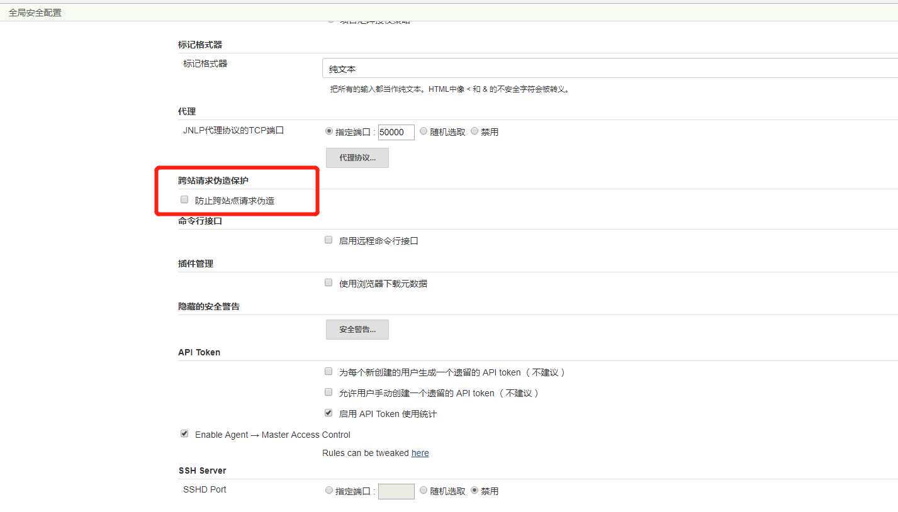

调用Jenkins Api出现“Error 403 No valid crumb was included in the request ”问题

原因
```
Jenkins在http请求头部中放置了一个名为.crumb的token。在使用反向代理时，
如果Jenkins设置中勾选了“Prevent Cross Site Request Forgery exploits”，
代理服务器会认为.crumb为非法头部而去掉，导致跳转失败
```

解决方法：

