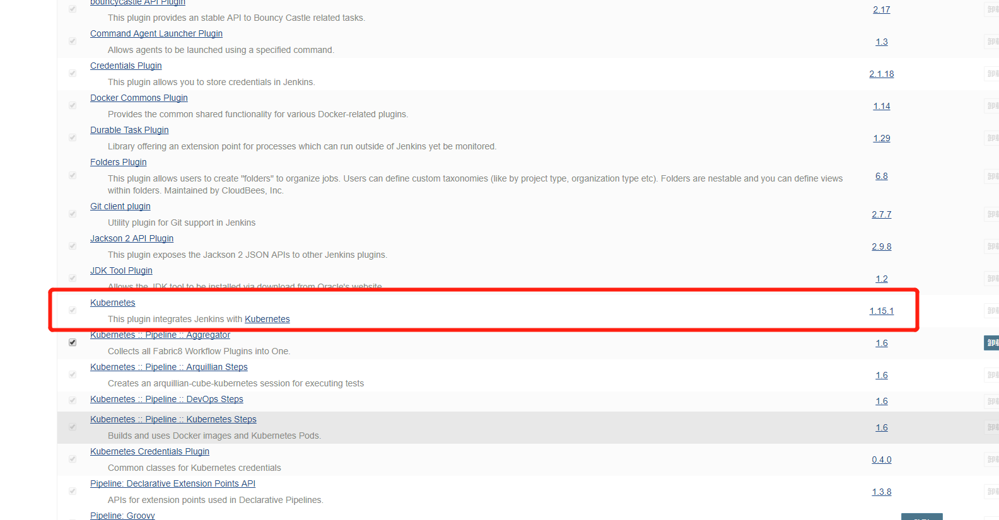
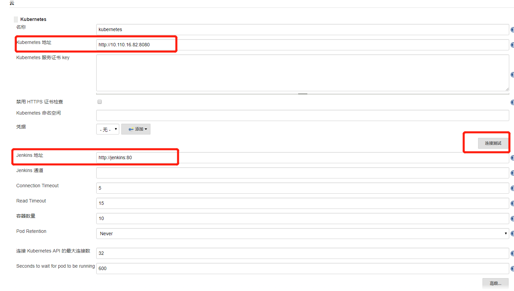
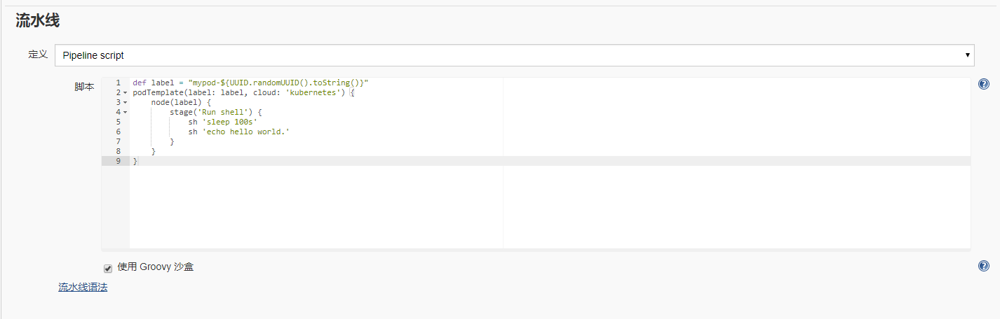
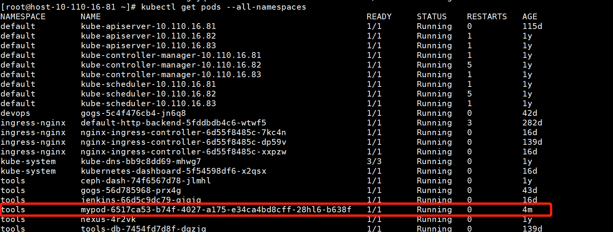
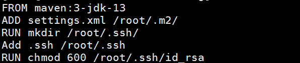

#### 准备工作：
在kubenetss中部署Jenkins server,初始化用户密码，插件安装

#### 使用jenkins kubernetes plugin实现动态分配资源构建:
jenkins接收到立即构建任务，调用k8s api，创造新的pod，将任务分发给这些pod，pod执行任务，任务完成后删除完成任务的pod。

##### - 1, 安装jenkins kubernetes plugin：

安装完成后，需要配置插件:
点击 “系统管理” —> “系统设置” —> “新增一个云” —> 选择 “Kubernetes”，然后填写 Kubernetes 和 Jenkins 配置信息。

配置完毕，可以点击 "连接测试"
按钮测试是否能够连接的到 Kubernetes，如果显示 Connection test successful 则表示连接成功，配置没有问题。

##### - 2, 简单测试：
创建一个 Pipeline 类型 Job 并命名为 my-k8s-jenkins-pipeline，然后在 Pipeline 脚本处填写一个简单的测试脚本如下：


```groovy
def label = "mypod-${UUID.randomUUID().toString()}"
podTemplate(label: label, cloud: 'kubernetes') {
    node(label) {
        stage('Run shell') {
            sh 'sleep 100s'
            sh 'echo hello world.'
        }
    }
}
```
点"立即构建",job就会出现在构建队列里，我们可以通过kubectl命令看到整个创建和删除过程


#### helloworld maven项目
- 1,自定义maven镜像

vim Dockerfile



```shell script
docker build .-t mvn:1.0
docker login
docker tag <imageId> 仓库名/镜像名:tag
docker push 1179325921/test
```
- 2,编写pipeline

```
podTemplate(label: 'mypod', cloud: 'kubernetes', containers: [
   containerTemplate(
         name: 'maven',
         image: '1179325921/test:1.0',
         ttyEnabled: true,
         command: 'cat'
     )
])
{
    node ('mypod') {
     container('maven') {
         git url: 'http://gitlab.xxx.com/xxx/demo.git', 
                credentialsId: '6033483b-5125-4ce1-941d-83b23ae64ba6'

         stage('create-archetype') {

            sh 'mvn archetype:create-from-project'

        }

        stage('update-local-catalog') {
            sh 'cd target/generated-sources/archetype'
            sh 'mvn clean install'
            sh 'mvn archetype:update-local-catalog'
        }

        stage('deploy') {
            sh 'mvn deploy'
        }

        stage('build-tag') {
            build_tag = sh(returnStdout: true, script: 'git rev-parse --short HEAD').trim()
            echo build_tag
        }

     }
 }
}
```
