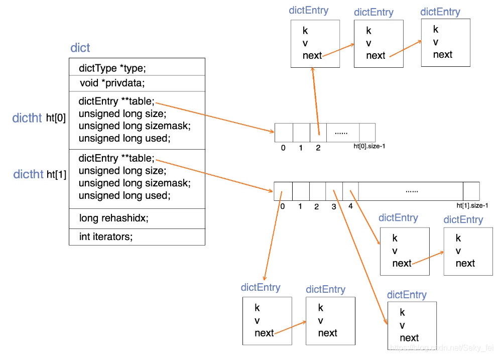
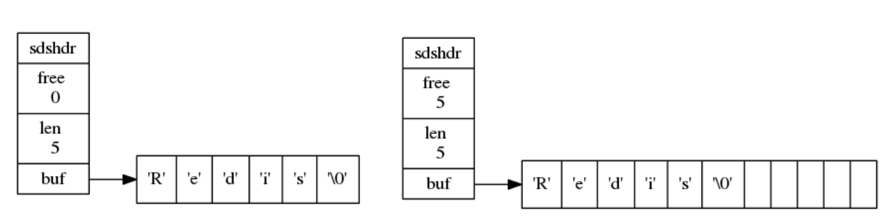
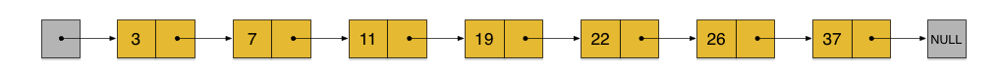
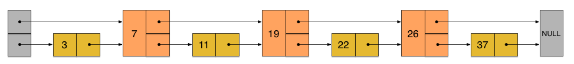
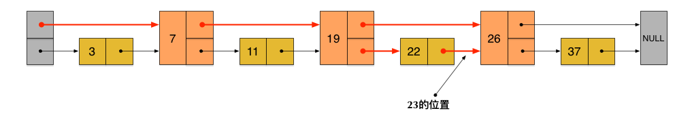
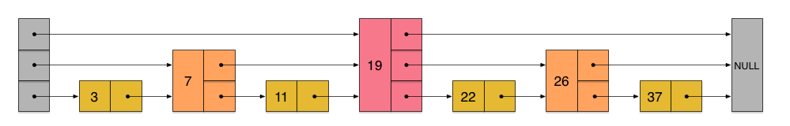
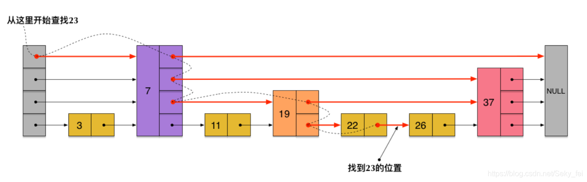
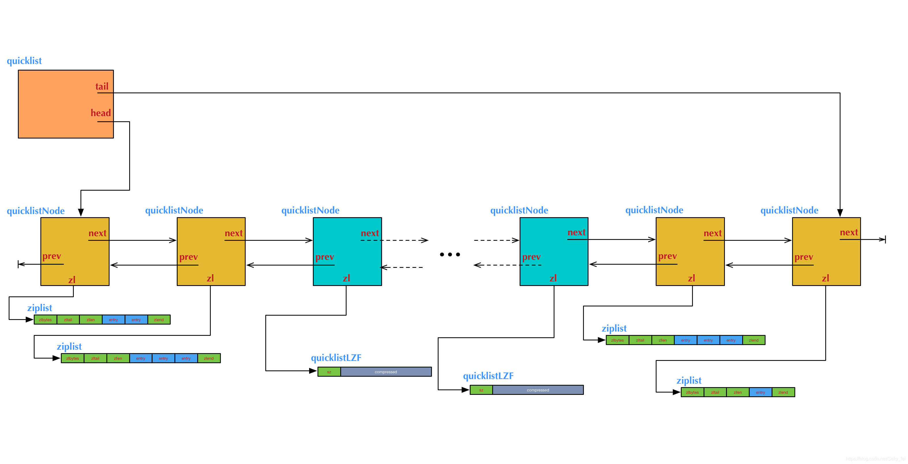

### 前言
Redis的数据结构，可能是在两个不同的层面来讨论它，第一个层面，是从使用者的角度。比如：string、list、hash、set、zset(sorted set)五种数据类型，这一层面也是Redis暴露给外部的调用接口。第二个层面，就是这五种数据类型的内部实现结构，属于更底层的实现。比如：dict(字典)、sds(simple dynamic string简单动态字符串)、intset(整数集合)、ziplist(压缩列表)、quicklist(快速列表)、skiplist(跳跃表)数据结构。

### 1. dict(字典)
dict是一个用于维护key和value映射关系的数据结构，与很多语言中的Map或dictionary类似。Redis的一个database中所有key到value的映射，就是使用一个dict来维护的。dict本质上是为了解决算法中的查找问题(Searching)。

#### 一般查找问题的解法分为两个大类
一个是基于各种平衡树，一个是基于哈希表，平常使用的各种Map或dictionary，大都是基于哈希表实现的。
 
#### dict的算法实现
dict也是一个基于哈希表的算法，跟java中的hashMap类似，dict采用某个哈希函数从key计算得到在哈希表中的位置，采用拉链法解决冲突，并在装载因子（load factor）超过预定值时自动扩展内存，引发重哈希（rehashing）

#### dict的数据结构定义
```
typedef struct dict{
    dictType *type; //直线dictType结构，dictType结构中包含自定义的函数，这些函数使得key和value能够存储任何类型的数据
    void *privdata; //私有数据，保存着dictType结构中函数的 参数
    dictht ht[2]; //两张哈希表
    long rehashidx; //rehash的标记，rehashidx == -1,表示没有进行 rehash
    int itreators;  //正在迭代的迭代器数量
  }dict;
```
为了能更清楚地展示dict的数据结构定义，用一张结构图来表示dict(字典)的构成。如下图：



需要注意几点：

- dict采用哈希函数对key取哈希值，得到在哈希表中的位置(桶的位置)，再采用拉链法解决hash冲突。

- 两个哈希表（ht[2]）：只有在重哈希的过程中，ht[0]和ht[1]才都有效。而在平常情况下，只有ht[0]有效，ht[1]里面没有任何数据。上图表示的就是重哈希进行到中间某一步时的情况。

- 重哈希过程：跟HashMap一样，当装载因子（load factor）超过预定值时就会进行rehash。dict进行重hash扩容是将ht[0]上某一个bucket（即一个dictEntry链表）上的每一个dictEntry移动到扩容后的ht[1]上，更触发rehash的操作有查询、插入和删除元素。每次移动一个链表（即渐进式rehash）原因是为了防止redis长时间的堵塞导致不可用。

- dict添加操作：如果正在重哈希中，会把数据插入到ht[1]；否则插入到ht[0]。

- dict查询操作：先在第一个哈希表ht[0]上进行查找，再判断当前是否在重哈希，如果没有，那么在ht[0]上的查找结果就是最终结果。否则，再在ht[1]上进行查找。查询时会先根据key计算出桶的位置，在到桶里的链表上寻找key。

- dict删除操作：判断当前是不是在重哈希过程中，如果是只在ht[0]中查找要删除的key；否则ht[0]和ht[1]它都要查找删除。

### 2. sds(简单动态字符串)
Redis的String底层数据结构实现并没有直接使用C语言中的字符串，Redis中为了实现方便的扩展，考虑到安全和性能，自己定义了一个结构用来存储字符串，这个数据结构就是：简单动态字符串(Simple Dynamic String 简称sds)，并将 SDS 用作 Redis 的默认字符串。

#### sds数据结构
```
/*
 * redis中保存字符串对象的结构
 */
struct sdshdr {
    //用于记录buf数组中使用的字节的数目，和SDS存储的字符串的长度相等 
    int len;
    //用于记录buf数组中没有使用的字节的数目 
    int free;
    //字节数组，用于储存字符串
    char buf[]; //buf的大小等于len+free+1，其中多余的1个字节是用来存储’\0’的
}
```


#### SDS和C字符串的区别
- 获取字符串长度

由于C字符串没有记录自身的长度信息，所以获取C字符串长度的时候，必须遍历整个字符串，其时间复杂度是O(n)，而SDS中有len属性，所以在获取其长度时，时间复杂度为O(1)。

- 内存分配释放策略

对于C字符串而言，不管是字符串拼接，还是字符串缩短，都要扩展底层的char数组的空间大小，再将旧char数据拷贝过来。

SDS的内存分配策略就不一样，可以概括为预分配 + 惰性释放。

预分配：

（1）如果对SDS字符串修改后，len的值小于1MB，那么程序会分配和len同样大小的空间给free，此时len和free的值是相同。
例如：如果SDS的字符串长度修改为15字节，那么会分配15字节空间给free，SDS的buf属性长度为15（len）+15（free）+1（空字符） = 31字节。
 
（2）如果SDS字符串修改后，len大于等于1MB，那么程序会分配1MB的空间给free。
例如：SDS字符串长度修改为50MB那么程序会分配1MB的未使用空间给free，SDS的buf属性长度为 50MB（len）+1MB（free）+1byte（空字符）。

惰性释放：

 当需要缩短SDS字符串时，程序并不立刻将内存释放，而是使用free属性将这些空间记录下来，实际的buf大小不会变，以备将来使用。
 
- 缓冲区溢出问题

SDS的字符串的内存预分配策略能有效避免缓冲区溢出问题；C字符串每次操作增加长度时，都要分配足够长度的内存空间，否则就会产生缓冲区溢出（buffer overflow）。

- 二进制安全

（1）C字符串的编码是ASCII编码，在字符串的末尾是以”\0“结束，也就是空字符，所以在字符串中不能包含空字符，要不然会让程序误以为结束，这也限制了C字符串只能保存文本数据，不能保存图片，音频，视频等二进制数据。

（2）SDS以二进制存储数据的，可以存储任意数据。因此不管buf保存什么格式的数据，都是存入什么数据，读取就什么数据，二进制安全。
- SDS兼容部分C字符串函数

SDS总会在buf[]数组分配空间时，多分配一个字节来存储空字符(’\0’)，便于重用C中的函数。

### 3. intset(整数集合)
intset是Redis集合的底层实现之一，当存储整数集合并且数据量较小的情况下Redis会使用intset作为set的底层实现，当数据量较大或者集合元素为字符串时则会使用dict实现set。

#### intset的数据结构定义
```
typedef struct intset {
    uint32_t encoding; //intset的类型编码
    uint32_t length; //集合包含的元素数量
    int8_t contents[]; //保存元素的数组
}
```
#### inset数据集合具有以下特点：
- 所有的元素都保存在contents 数组中，且按照从小到大的顺序排列，并且不包含任何重复项。
- intset将整数元素按顺序存储在数组里，并通过二分法降低查找元素的时间复杂度。
- 虽然contents 数组申明成了int8_t类型，但contents数组中具体存储什么类型完全取决于encoding变量的值，类似于继承。它可以保存具体类型为int16_t、int32_t 或者int64_t 的整数值。

#### 元素升级
当新增的元素类型比原集合元素类型的长度要大时(比如：原来是int16_t，现在新增一个int64_t的元素)，需要对整数集合进行升级，才能将新元素放入整数集合中。具体步骤：
1. 根据新元素类型，扩展整数集合底层数组的大小，并为新元素分配空间。
2. 将底层数组现有的所有元素都转成与新元素相同类型的元素，并将转换后的元素放到正确的位置，放置过程中，维持整个元素顺序都是有序的。
3. 将新元素添加到整数集合中（保证有序）

注意：升级能极大地节省内存；整数集合不支持降级操作，一旦对数组进行了升级，编码就会一直保持升级后的状态。

### 4.skiplist(跳表)
skiplist查找效率很高，堪比优化过的二叉平衡树(红黑树)，且比平衡树的实现简单，查找单个key，skiplist和平衡树的时间复杂度都为O(log n)。平衡树的插入和删除操作可能引发树的旋转调整，逻辑复杂，而skiplist的插入和删除只需要修改相邻节点的指针，操作简单又快速。

skiplist首先它是一个list。实际上，它是在有序链表的基础上发展起来的。先来看一个有序链表，如下图（最左侧的灰色节点表示一个空的头结点）：



这样种链表中，如果要查找某个数据，需要从头开始逐个进行比较，直到找到等于 或 大于(没找到)给定数据为止，时间复杂度为O(n)。同样，当插入新数据的时候，也要经历同样的查找过程，从而确定插入位置。

有了上面出现的问题后进一步优化，假如我们这样来设计，在每相邻两个节点增加一个指针，让指针指向下下个节点，如下图：



这样所有新增加的指针连成了一个新的链表，但它包含的节点个数只有原来的一半（上图中是7, 19, 26）。现在当查找数据的时候，可以先沿着这个新链表(第一层链表)进行查找。当碰到比待查数据大的节点时，再回到第二层链表进行查找。

比如，要查找23，查找的路径是沿着下图中标红的指针所指向的方向进行的：整个查询路线如红色箭头。



在这个查找过程中，由于新增加的指针，不再需要向原链表一样，每个节点都逐个进行比较。需要比较的节点数大概只有原来的一半。 利用同样的方式，可以在上层新产生的链表上，继续为每相邻的两个节点增加一个指针，从而产生第三层链表



在这个新的三层链表结构上，如果还是查找23，那么沿着最上层链表首先要比较的是19，发现23比19大，接下来我们就知道只需要到19的后面去继续查找，从而一下子跳过了19前面的所有节点。可以想象，当链表足够长的时候，这种多层链表的查找方式能让我们跳过很多下层节点，大大加快查找的速度。

skiplist正是受这种多层链表的想法的启发而设计出来的，实际上，按照上面生成链表的方式，上面每一层链表的节点个数，是下面一层的节点个数的一半，这样查找过程就非常类似于一个二分查找，使得查找的时间复杂度可以降低到O(log n)。但是，这种方法在插入数据的时候有很大的问题。新插入一个节点之后，就会打乱上下相邻两层链表上节点个数严格的2:1的对应关系。如果要维持这种对应关系，就必须把新插入的节点后面的所有节点（也包括新插入的节点）重新进行调整，这会让时间复杂度重新蜕化成O(n)。删除数据也有同样的问题。

skiplist为了避免这一问题，它不要求上下相邻两层链表之间的节点个数有严格的对应关系，而是为每个节点随机出一个层数(level)。比如：一个节点随机出的层数是3，那么就把它链入到第1层到第3层这三层链表中。

skiplist中一个节点的层数（level）是随机出来的，而且新插入一个节点不会影响其它节点的层数。因此，插入操作只需要修改插入节点前后的指针，而不需要对很多节点都进行调整。这就降低了插入操作的复杂度。而节点的层数（level）也不全是没有规则随机的，而是按照节点平均指针数目计算出来的。如下图各个节点层数（level）是随机出来的一个skiplist，我们依然查找23，查找路径如图：



#### skiplist与平衡树、哈希表的比较
- skiplist 和 各种平衡树（如AVL、红黑树等）的元素是有序排列的，而哈希表不是有序的。因此，在哈希表上只能做单个key的查找，不适宜做范围查找。

- 平衡树的插入 和 删除操作可能引发树的旋转调整，逻辑复杂，而skiplist的插入和删除只需要修改相邻节点的指针，操作简单又快速。

- 查找单个key，skiplist和平衡树的时间复杂度都为O(log n)，大体相当；而哈希表在保持较低的哈希值冲突概率的前提下，查找时间复杂度接近O(1)，性能更高一些。

- 从内存占用上来说，skiplist比平衡树更灵活一些。平衡树一般每个节点包含2个指针，而skiplist每个节点包含的指针数目平均为1/(1-p)，具体取决于一个概率参数p。如果像Redis里的实现一样，取p=1/4，那么平均每个节点包含1.33个指针，比平衡树更有优势。

### 5. ziplist(压缩表)
ziplist是一个经过特殊编码的双向链表，它的设计目标就是为了提高存储效率。ziplist可以用于存储字符串或整数，其中整数是按真正的二进制表示进行编码的，而不是编码成字符串序列。

Redis对外暴露的hash数据类型，在field比较少，各个value值也比较小的时候，hash采用ziplist来实现；而随着field增多和value值增大，hash可能会变成dict来实现。当hash底层变成dict来实现的时候，它的存储效率就没法跟那些序列化方式相比了

#### ziplist的数据结构
```
#ziplist在内存中的结构大致如下：
<zlbytes><zltail><zllen><entry>...<entry><zlend>
 
#1.结构说明：
(1)zlbytes: 表示整个ziplist占用的字节总数。
(2)zltail：表示ziplist表中最后一项（entry）在ziplist中的偏移字节数。
(3)zllen：16bit，表示ziplist中数据项（entry）的个数。当ziplist里数据大于2^16-1后，再获取元素个数时，ziplist从头到尾遍历。
(4)entry：表示真正存放数据的数据项，长度不定，采用变长编码(对于大的数据，就多用一些字节来存储，而对于小的数据，就少用一些字节来存储)。
(5)zlend: ziplist最后1个字节，是一个结束标记，值固定等于255。
 
#2.entry的内部结构：<prevrawlen><len><data>
(1)prevrawlen: 表示前一个数据项占用的总字节数。作用是为了让ziplist能够从后向前遍历（从后一项的位置，只需向前偏移prevrawlen个字节，就找到了前一项）,这个字段采用变长编码。
(2)len: 表示当前数据项的数据长度（即<data>部分的长度）。也采用变长编码。
(3)data：存储的数据。
```
注意：ziplist虽然是个特殊编码的双向链表，但为了提高存储效率，内存地址空间是连续的，更像是一个list，只是比list多了一个链表的首尾操作而已。

#### ziplist(压缩表)的特点
- 内存空间连续：ziplist为了提高存储效率，从存储结构上看ziplist更像是一个表(list)，但不是一个链表(linkedlist)。ziplist将每一项数据存放在前后连续的地址空间内，一个ziplist整体占用一大块内存。而普通的双向链表每一项都占用独立的一块内存，各项之间用指针连接，这样会带来大量内存碎片，而且指针也会占用额外内存。
- 查询元素：查找指定的数据项就会性能变得很低，需要进行遍历整个zipList。
- 插入和修改：每次插入或修改引发的重新分配内存(realloc)操作会有更大的概率造成内存拷贝，从而降低性能。跟list一样，一旦发生内存拷贝，内存拷贝的成本也相应增加，因为要拷贝更大的一块数据。

ziplist提高了存储效率，是内存紧缩的列表，多个数据在一起的连续空间，不擅长修改，在两端pop,push快。

#### hash为什么要转为dict

(1)ziplist的数据发生改动(插入或修改)，会引发内存realloc(内存重新分配)，可能导致内存拷贝。

(2)ziplist里查找数据时需要进行遍历(跟双向链表一样)，数据项过多会变慢。

总之，ziplist本来就设计为各个数据项挨在一起组成连续的内存空间，虽然高存储效率高了，但这种结构并不擅长做修改操作。一旦数据发生改动，就会引发内存realloc，可能导致内存拷贝。

### 6.quicklist(快速列表)
Redis对外暴露的list数据类型，它底层实现所依赖的内部数据结构就是quicklist。先来看看Redis对外暴露的list数据类型操作特点 :
- Redis对外暴露的上层list数据类型，它支持的一些修改操作如下：

（1）lpush: 在左侧（即列表头部）插入数据。

（2）rpop: 在右侧（即列表尾部）删除数据。

（3）rpush: 在右侧（即列表尾部）插入数据。

（4）lpop: 在左侧（即列表头部）删除数据。
 
- list也支持在任意中间位置的存取操作，比如lindex和linsert，但它们都需要对list进行遍历，所以时间复杂度较高，为O(N)。 
- list具有的特点：list的内部实现quicklist正是一个双向链表。它是一个能维持数据项先后顺序的列表（各个数据项的先后顺序由插入位置决定），便于在表的两端追加和删除数据，而对于中间位置的存取具有O(N)的时间复杂度。这正是一个双向链表所具有的特点。

#### quicklist(快速表)的结构


quicklist双向链表是由多个节点（Node）组成，而quicklist的每个节点又是一个ziplist。quicklist的结构为什么这样设计呢？总结起来，大概又是一个空间和时间的折中：

- 双向链表便于在表的进行插入和删除节点操作，但是它的内存开销比较大。首先，它在每个节点上除了要保存数据之外，还要额外保存两个指针；其次，双向链表的各个节点是单独的内存块，地址不连续，节点多了容易产生内存碎片。

- ziplist由于是一整块连续内存，所以存储效率很高。但是，它不利于修改操作，每次数据变动都会引发一次内存的内存重新分配(realloc)。特别是当ziplist长度很长的时候，一次realloc可能会导致大批量的数据拷贝，进一步降低性能。

可见，一个quicklist节点上的ziplist要保持一个合理的长度。那到底多长合理呢？这可能取决于具体应用场景。实际上，Redis提供了一个配置参数list-max-ziplist-size(可以取正值也可以取复值)，就是为了让使用者可以来根据自己的情况进行调整。

- 当取正值的时候，表示按照数据项个数来限定每个quicklist节点上的ziplist长度。比如，当这个参数配置成5的时候，表示每个quicklist节点的ziplist最多包含5个数据项。
- 当取负值的时候，表示按照占用字节数来限定每个quicklist节点上的ziplist长度。这时，它只能取-1到-5这五个值。每个值得含义如下

```
#每个值含义如下：
-5: 每个quicklist节点上的ziplist大小不能超过64 Kb。（注：1kb => 1024 bytes）
-4: 每个quicklist节点上的ziplist大小不能超过32 Kb。
-3: 每个quicklist节点上的ziplist大小不能超过16 Kb。
-2: 每个quicklist节点上的ziplist大小不能超过8 Kb。（-2是Redis给出的默认值）
-1: 每个quicklist节点上的ziplist大小不能超过4 Kb。
```
list的设计目标是能够用来存储很长的数据列表的。当列表很长的时候，最容易被访问的很可能是两端的数据，中间的数据被访问的频率比较低（访问起来性能也很低）。如果应用场景符合这个特点，那么list还提供了一个选项，能够把中间的数据节点进行压缩，从而进一步节省内存空间。Redis的配置参数list-compress-depth就是用来完成这个设置的。 这个参数表示一个quicklist两端不被压缩的节点个数。
```
#参数表示一个quicklist两端不被压缩的节点个数
list-compress-depth 0
 
#参数list-compress-depth的取值含义如下：
0: 是个特殊值，表示都不压缩。这是Redis的默认值。
1: 表示quicklist两端各有1个节点不压缩，中间的节点压缩。
2: 表示quicklist两端各有2个节点不压缩，中间的节点压缩。
3: 表示quicklist两端各有3个节点不压缩，中间的节点压缩。
依此类推…
```
注：这里的节点个数是指quicklist双向链表的节点个数，而不是指ziplist里面的数据项个数。实际上，如果一个quicklist节点如果被压缩，那么ziplist就是整体被压缩了。

quicklist将 双向链表插入和修改元素不需要移动节点的优点 和 ziplist的存储效率很高优点(一整块连续内存)结合在一起，同时将各自的缺点进行一个折中的处理。
