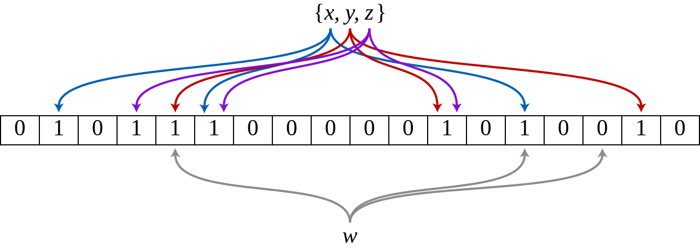
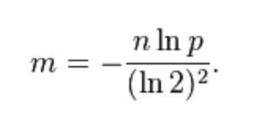
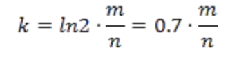
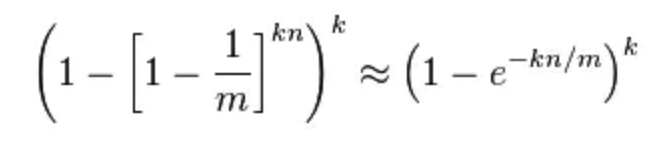

#### 前言
布隆过滤器（Bloom Filter），它实际上是由一个很长的二进制向量和一系列随意映射函数组成。

它是一种基于概率的数据结构，主要用来判断某个元素是否在集合内，它具有运行速度快（时间效率），占用内存小的优点（空间效率），但是有一定的误识别率和删除困难的问题。它能够告诉你某个元素一定不在集合内或可能在集合内。

在计算机科学中，我们常常会碰到时间换空间或者空间换时间的情况，通常两者不可兼得，我们要在两者之间取舍。但是布隆过滤器在空间与时间效率上都很高。那么他是怎么做到的？因为Bloom Filter在时间空间这两个因素之外又引入了另一个因素：错误率。在使用Bloom Filter判断一个元素是否属于某个集合时，会有一定的错误率。也就是说，有可能把不属于这个集合的元素误认为属于这个集合（False Positive），但不会把属于这个集合的元素误认为不属于这个集合（False Negative）。在增加了错误率这个因素之后，Bloom Filter通过允许少量的错误来节省大量的存储空间，同时在时间效率上也很好。

概述小结：
- 一个很长的二进制数组 （位数组，就是这个数组里只有0和1）
- 若干个哈希函数
- 空间效率和查询效率高
- 不存在漏报（False Negative），即某个元素在某个集合中，肯定能报出来。
- 可能存在误报（False Positive），即某个元素不在某个集合中，可能也被爆出来。
- 删除困难

#### 布隆过滤器工作原理
布隆过滤器的核心是一个超大的位数组和几个哈希函数。假设位数组的长度为m,哈希函数的个数为k。

下图表示有三个hash函数，比如一个集合中有x，y，z三个元素，分别用三个hash函数映射到二进制序列的某些位上，假设我们判断w是否在集合中，同样用三个hash函数来映射，结果发现取得的结果不全为1，则表示w不在集合里面。



工作流程:

- 第一步：开辟空间：

开辟一个长度为m的位数组（或者称二进制向量），这个不同的语言有不同的实现方式，甚至你可以用文件来实现。
- 第二步：寻找hash函数

获取几个hash函数，前辈们已经发明了很多运行良好的hash函数，比如BKDRHash，JSHash，RSHash等等。这些hash函数我们直接获取就可以了。
- 第三步：写入数据

将所需要判断的内容经过这些hash函数计算，得到几个值，比如用3个hash函数，得到值分别是1000，2000，3000。之后设置m位数组的第1000，2000，3000位的值位二进制1。
- 第四步：判断

接下来就可以判断一个新的内容是不是在我们的集合中。判断的流程和写入的流程是一致的。

#### 源码分析
```
  /**
   * Creates a {@link BloomFilter} with the expected number of insertions and expected false 
   */
  public static <T> BloomFilter<T> create(
      Funnel<? super T> funnel, long expectedInsertions, double fpp) {
    return create(funnel, expectedInsertions, fpp, BloomFilterStrategies.MURMUR128_MITZ_64);//默认策略为MURMUR128_MITZ_64
  }

  @VisibleForTesting//仅在包内使用
  static <T> BloomFilter<T> create(
      Funnel<? super T> funnel, long expectedInsertions, double fpp, Strategy strategy) {
    if (expectedInsertions == 0) {
      expectedInsertions = 1;
    }
   //根据预insert 的个数和fpp计算bit数
    long numBits = optimalNumOfBits(expectedInsertions, fpp);
//根据预insert 的个数和bit 数预hash function 数
    int numHashFunctions = optimalNumOfHashFunctions(expectedInsertions, numBits);
    try {
      return new BloomFilter<T>(new LockFreeBitArray(numBits), numHashFunctions, funnel, strategy);
    } catch (IllegalArgumentException e) {
      throw new IllegalArgumentException("Could not create BloomFilter of " + numBits + " bits", e);
    }
  }

  /**
   * Creates a {@link BloomFilter} with the expected number of insertions and a default expected
   * false positive probability of 3%. FPP
* 默认误预测率为3%
   */
  public static <T> BloomFilter<T> create(Funnel<? super T> funnel, long expectedInsertions) {
    return create(funnel, expectedInsertions, 0.03); // FPP, for 3%, we always get 5 hash functions
  }
```
bit数计算
```
/**
   * Computes m (total bits of Bloom filter) which is expected to achieve, for the specified
   * expected insertions, the required false positive probability.
   *
   * <p>See http://en.wikipedia.org/wiki/Bloom_filter#Probability_of_false_positives for the
   * formula.
   *
   * @param n expected insertions (must be positive)
   * @param p false positive rate (must be 0 < p < 1)
   */
  @VisibleForTesting
  static long optimalNumOfBits(long n, double p) {
    if (p == 0) {
      p = Double.MIN_VALUE;
    }
    return (long) (-n * Math.log(p) / (Math.log(2) * Math.log(2)));
  }
```
bit数计算公式：



HashFunctions 个数计算


```
static int optimalNumOfHashFunctions(long expectEntries, long bitSize) {
        return Math.max(1, (int) Math.round((double) bitSize / expectEntries * Math.log(2)));//k=(ln2)*(m/n)
    } 
```

多次hash计算细节

以MURMUR128_MITZ_64为例
```
MURMUR128_MITZ_64() {
    @Override
    public <T> boolean put(
        T object, Funnel<? super T> funnel, int numHashFunctions, LockFreeBitArray bits) {
      long bitSize = bits.bitSize();
      byte[] bytes = Hashing.murmur3_128().hashObject(object, funnel).getBytesInternal();//hash函数只计算一次
      long hash1 = lowerEight(bytes);//取低8位
      long hash2 = upperEight(bytes);//取高8位

      boolean bitsChanged = false;
      long combinedHash = hash1;
      for (int i = 0; i < numHashFunctions; i++) {
        // Make the combined hash positive and indexable
//确保combined（每次+高8位 hash2）为正数并且是可索引的
//combinedHash & Long.MAX_VALUE 会将负数的补码直接变成正数 以byte举例 127&-1 转成二进制补码为
0b01111111&0b11111111=0b01111111(即为正原码,正数原码，反码，补码相同)
        bitsChanged |= bits.set((combinedHash & Long.MAX_VALUE) % bitSize);//%bitSize即分桶操作
        combinedHash += hash2;
      }
      return bitsChanged;
    }
```

#### 错误率
错误率有两种：

FP = false positive
FN = false negative

对应Bloom Filter的情况下，FP就是「集合里没有某元素，查找结果是有该元素」，FN就是「集合里有某元素，查找结果是没有该元素」。FN显然总是0，FP会随着Bloom Filter中插入元素的数量而增加——极限情况就是所有bit都为1，这时任何元素都会被认为在集合里。

FP的推导并不复杂，wiki上有非常详细的过程，这里就简单地抄个结果，其中n是当前集合里元素的数量(并不是期望个数)：

错误率计算公式


从这个公式里可以看出 n = 0时，FP = 0；n趋于无穷大时，FP趋于1

#### golang的简单实现
```
package bloom

import (
	"bytes"
	"encoding/binary"
	"encoding/json"
	"fmt"
	"io"
	"math"

	"github.com/spaolacci/murmur3"
	"github.com/willf/bitset"
)

// A BloomFilter is a representation of a set of _n_ items, where the main
// requirement is to make membership queries; _i.e._, whether an item is a
// member of a set.
type BloomFilter struct {
	m uint
	k uint
	b *bitset.BitSet
}

func max(x, y uint) uint {
	if x > y {
		return x
	}
	return y
}

// New creates a new Bloom filter with _m_ bits and _k_ hashing functions
// We force _m_ and _k_ to be at least one to avoid panics.
func New(m uint, k uint) *BloomFilter {
	return &BloomFilter{max(1, m), max(1, k), bitset.New(m)}
}

// From creates a new Bloom filter with len(_data_) * 64 bits and _k_ hashing
// functions. The data slice is not going to be reset.
func From(data []uint64, k uint) *BloomFilter {
	m := uint(len(data) * 64)
	return &BloomFilter{m, k, bitset.From(data)}
}

// baseHashes returns the four hash values of data that are used to create k
// hashes
func baseHashes(data []byte) [4]uint64 {
	a1 := []byte{1} // to grab another bit of data
	hasher := murmur3.New128()
	hasher.Write(data) // #nosec
	v1, v2 := hasher.Sum128()
	hasher.Write(a1) // #nosec
	v3, v4 := hasher.Sum128()
	return [4]uint64{
		v1, v2, v3, v4,
	}
}

// location returns the ith hashed location using the four base hash values
func location(h [4]uint64, i uint) uint64 {
	ii := uint64(i)
	return h[ii%2] + ii*h[2+(((ii+(ii%2))%4)/2)]
}

// location returns the ith hashed location using the four base hash values
func (f *BloomFilter) location(h [4]uint64, i uint) uint {
	return uint(location(h, i) % uint64(f.m))
}

// EstimateParameters estimates requirements for m and k.
// Based on https://bitbucket.org/ww/bloom/src/829aa19d01d9/bloom.go
// used with permission.
func EstimateParameters(n uint, p float64) (m uint, k uint) {
	m = uint(math.Ceil(-1 * float64(n) * math.Log(p) / math.Pow(math.Log(2), 2)))
	k = uint(math.Ceil(math.Log(2) * float64(m) / float64(n)))
	return
}

// NewWithEstimates creates a new Bloom filter for about n items with fp
// false positive rate
func NewWithEstimates(n uint, fp float64) *BloomFilter {
	m, k := EstimateParameters(n, fp)
	return New(m, k)
}

// Cap returns the capacity, _m_, of a Bloom filter
func (f *BloomFilter) Cap() uint {
	return f.m
}

// K returns the number of hash functions used in the BloomFilter
func (f *BloomFilter) K() uint {
	return f.k
}

// Add data to the Bloom Filter. Returns the filter (allows chaining)
func (f *BloomFilter) Add(data []byte) *BloomFilter {
	h := baseHashes(data)
	for i := uint(0); i < f.k; i++ {
		f.b.Set(f.location(h, i))
	}
	return f
}

// Merge the data from two Bloom Filters.
func (f *BloomFilter) Merge(g *BloomFilter) error {
	// Make sure the m's and k's are the same, otherwise merging has no real use.
	if f.m != g.m {
		return fmt.Errorf("m's don't match: %d != %d", f.m, g.m)
	}

	if f.k != g.k {
		return fmt.Errorf("k's don't match: %d != %d", f.m, g.m)
	}

	f.b.InPlaceUnion(g.b)
	return nil
}

// Copy creates a copy of a Bloom filter.
func (f *BloomFilter) Copy() *BloomFilter {
	fc := New(f.m, f.k)
	fc.Merge(f) // #nosec
	return fc
}

// AddString to the Bloom Filter. Returns the filter (allows chaining)
func (f *BloomFilter) AddString(data string) *BloomFilter {
	return f.Add([]byte(data))
}

// Test returns true if the data is in the BloomFilter, false otherwise.
// If true, the result might be a false positive. If false, the data
// is definitely not in the set.
func (f *BloomFilter) Test(data []byte) bool {
	h := baseHashes(data)
	for i := uint(0); i < f.k; i++ {
		if !f.b.Test(f.location(h, i)) {
			return false
		}
	}
	return true
}

// TestString returns true if the string is in the BloomFilter, false otherwise.
// If true, the result might be a false positive. If false, the data
// is definitely not in the set.
func (f *BloomFilter) TestString(data string) bool {
	return f.Test([]byte(data))
}

// TestLocations returns true if all locations are set in the BloomFilter, false
// otherwise.
func (f *BloomFilter) TestLocations(locs []uint64) bool {
	for i := 0; i < len(locs); i++ {
		if !f.b.Test(uint(locs[i] % uint64(f.m))) {
			return false
		}
	}
	return true
}

// TestAndAdd is the equivalent to calling Test(data) then Add(data).
// Returns the result of Test.
func (f *BloomFilter) TestAndAdd(data []byte) bool {
	present := true
	h := baseHashes(data)
	for i := uint(0); i < f.k; i++ {
		l := f.location(h, i)
		if !f.b.Test(l) {
			present = false
		}
		f.b.Set(l)
	}
	return present
}

// TestAndAddString is the equivalent to calling Test(string) then Add(string).
// Returns the result of Test.
func (f *BloomFilter) TestAndAddString(data string) bool {
	return f.TestAndAdd([]byte(data))
}

// ClearAll clears all the data in a Bloom filter, removing all keys
func (f *BloomFilter) ClearAll() *BloomFilter {
	f.b.ClearAll()
	return f
}

// EstimateFalsePositiveRate returns, for a BloomFilter with a estimate of m bits
// and k hash functions, what the false positive rate will be
// while storing n entries; runs 100,000 tests. This is an empirical
// test using integers as keys. As a side-effect, it clears the BloomFilter.
func (f *BloomFilter) EstimateFalsePositiveRate(n uint) (fpRate float64) {
	rounds := uint32(100000)
	f.ClearAll()
	n1 := make([]byte, 4)
	for i := uint32(0); i < uint32(n); i++ {
		binary.BigEndian.PutUint32(n1, i)
		f.Add(n1)
	}
	fp := 0
	// test for number of rounds
	for i := uint32(0); i < rounds; i++ {
		binary.BigEndian.PutUint32(n1, i+uint32(n)+1)
		if f.Test(n1) {
			//fmt.Printf("%v failed.\n", i+uint32(n)+1)
			fp++
		}
	}
	fpRate = float64(fp) / (float64(rounds))
	f.ClearAll()
	return
}

// bloomFilterJSON is an unexported type for marshaling/unmarshaling BloomFilter struct.
type bloomFilterJSON struct {
	M uint           `json:"m"`
	K uint           `json:"k"`
	B *bitset.BitSet `json:"b"`
}

// MarshalJSON implements json.Marshaler interface.
func (f *BloomFilter) MarshalJSON() ([]byte, error) {
	return json.Marshal(bloomFilterJSON{f.m, f.k, f.b})
}

// UnmarshalJSON implements json.Unmarshaler interface.
func (f *BloomFilter) UnmarshalJSON(data []byte) error {
	var j bloomFilterJSON
	err := json.Unmarshal(data, &j)
	if err != nil {
		return err
	}
	f.m = j.M
	f.k = j.K
	f.b = j.B
	return nil
}

// WriteTo writes a binary representation of the BloomFilter to an i/o stream.
// It returns the number of bytes written.
func (f *BloomFilter) WriteTo(stream io.Writer) (int64, error) {
	err := binary.Write(stream, binary.BigEndian, uint64(f.m))
	if err != nil {
		return 0, err
	}
	err = binary.Write(stream, binary.BigEndian, uint64(f.k))
	if err != nil {
		return 0, err
	}
	numBytes, err := f.b.WriteTo(stream)
	return numBytes + int64(2*binary.Size(uint64(0))), err
}

// ReadFrom reads a binary representation of the BloomFilter (such as might
// have been written by WriteTo()) from an i/o stream. It returns the number
// of bytes read.
func (f *BloomFilter) ReadFrom(stream io.Reader) (int64, error) {
	var m, k uint64
	err := binary.Read(stream, binary.BigEndian, &m)
	if err != nil {
		return 0, err
	}
	err = binary.Read(stream, binary.BigEndian, &k)
	if err != nil {
		return 0, err
	}
	b := &bitset.BitSet{}
	numBytes, err := b.ReadFrom(stream)
	if err != nil {
		return 0, err
	}
	f.m = uint(m)
	f.k = uint(k)
	f.b = b
	return numBytes + int64(2*binary.Size(uint64(0))), nil
}

// GobEncode implements gob.GobEncoder interface.
func (f *BloomFilter) GobEncode() ([]byte, error) {
	var buf bytes.Buffer
	_, err := f.WriteTo(&buf)
	if err != nil {
		return nil, err
	}

	return buf.Bytes(), nil
}

// GobDecode implements gob.GobDecoder interface.
func (f *BloomFilter) GobDecode(data []byte) error {
	buf := bytes.NewBuffer(data)
	_, err := f.ReadFrom(buf)

	return err
}

// Equal tests for the equality of two Bloom filters
func (f *BloomFilter) Equal(g *BloomFilter) bool {
	return f.m == g.m && f.k == g.k && f.b.Equal(g.b)
}

// Locations returns a list of hash locations representing a data item.
func Locations(data []byte, k uint) []uint64 {
	locs := make([]uint64, k)

	// calculate locations
	h := baseHashes(data)
	for i := uint(0); i < k; i++ {
		locs[i] = location(h, i)
	}

	return locs
}
```