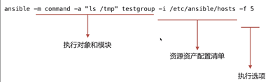
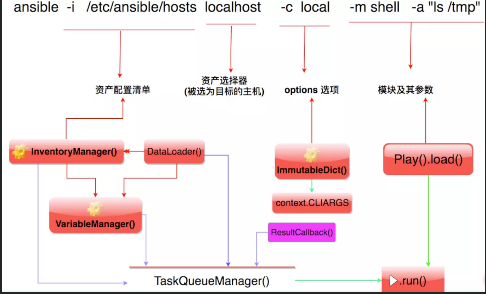
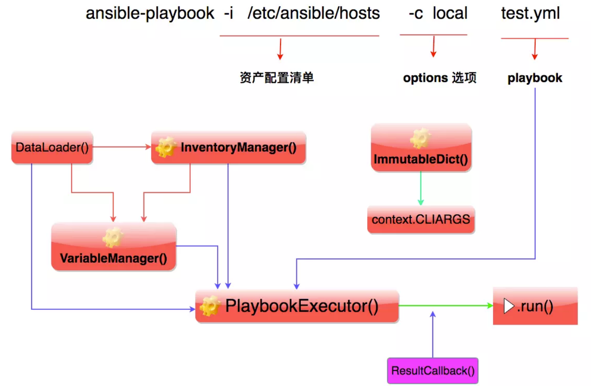

### 一 ansible核心类

核心类 | 用途 | 所在模块
---|---|---
DataLoader | 用于读取yaml,json类型的文件| ansible.parsing.dataloader
Play |存储执行hosts的角色信息|ansible.playbook.play
TaskQueueManager|ansible底层用到的任务队列(ad-hoc)|ansible.executor.task_queue_manager
PlaybookExecutor|执行playbook|ansible.executor.playbook_executor
CallbackBase|状态回调，各种成功失败的状态|ansible.plugins.callback
InventoryManager|用于导入invebtory文件|ansible.inventory.manager
VariableManager|用于存储各类的变量信息|ansible.vars.manager
Host, Group|主机或者主机组信息|ansible.inventory.host

### 二 InventoryManager
功能：用来管理主机和主机组相关的资源设备信息
```
from ansible.parsing.dataloader import DataLoader
from ansible.inventory.manager import InventoryManager

#  实例化一个DataLoader对象，用户json，yaml解析
loader = DataLoader()
inventory_manager = InventoryManager(loader=loader, sources='hosts')

# get_hosts()获取所有主机资源
print(inventory_manager.get_hosts())
# get_groups_dict()方法，查看主机组资源
print(inventory_manager.get_groups_dict())
# add_group()添加组
inventory_manager.add_group("node")
# add_host()方法，添加主机到指定的主机组
inventory_manager.add_host("192.168.1.110", "node", 22)
print(inventory_manager.get_groups_dict())
# get_host() 获取指定的主机对象
print(inventory_manager.get_host(hostname="192.168.1.110"))
```
### 三 VariableManager
功能：进行主机变量的读取
```
from ansible.parsing.dataloader import DataLoader
from ansible.inventory.manager import InventoryManager
from ansible.vars.manager import VariableManager

loader = DataLoader()
inventory = InventoryManager(loader=loader, sources='hosts')
variable_manager = VariableManager(loader=loader, inventory=inventory)
host = inventory.get_host('192.168.10.150')
# get_vars() # 查看变量
print(variable_manager.get_vars(host=host))
# set_host_variable() # 修改指定主机的变量信息
variable_manager.set_host_variable(host=host, varname="ansible_ssh_pass", value="1111111")
print(variable_manager.get_vars(host=host))
print(variable_manager.__dict__)
# _extra_vars={} # 添加指定对象的扩展变量，全局有效
variable_manager._extra_vars = {'mysite': "ys.blog.com"}
print(variable_manager.get_vars(host=host))
```
### 四 ad-hoc模式调用
ansible的ad-hoc模式的调用示例：



ad-hoc模式一般用于批量执行简单命令，文件替换等。此处的重点是执行对象和模块，资源资产配置清单，执行选项。所需类及其调用关系为：



context.CLIARGS执行参数：

-v, --verbose：输出更详细的执行过程信息，-vvv可得到所有执行过程信息。

-i PATH, --inventory=PATH：指定inventory信息，默认/etc/ansible/hosts。

-f NUM, --forks=NUM：并发线程数，默认5个线程。

--private-key=PRIVATE_KEY_FILE：指定密钥文件。

-m NAME, --module-name=NAME：指定执行使用的模块。

-M DIRECTORY, --module-path=DIRECTORY：指定模块存放路径，默认/usr/share/ansible，也可以通过ANSIBLE_LIBRARY设定默认路径。

-a 'ARGUMENTS', --args='ARGUMENTS'：模块参数。

-k, --ask-pass SSH：认证密码。

-K, --ask-sudo-pass sudo：用户的密码（—sudo时使用）。

-o, --one-line：标准输出至一行。

-s, --sudo：相当于Linux系统下的sudo命令。

-t DIRECTORY, --tree=DIRECTORY：输出信息至DIRECTORY目录下，结果文件以远程主机名命名。

-T SECONDS, --timeout=SECONDS：指定连接远程主机的最大超时，单位是：秒。

-B NUM, --background=NUM：后台执行命令，超NUM秒后kill正在执行的任务。

-P NUM, --poll=NUM：定期返回后台任务进度。

-u USERNAME, --user=USERNAME：指定远程主机以USERNAME运行命令。

-U SUDO_USERNAME, --sudo-user=SUDO_USERNAM：E使用sudo，相当于Linux下的sudo命令。

-c CONNECTION, --connection=CONNECTION：指定连接方式，可用选项paramiko (SSH), ssh, local。Local方式常用于crontab 和 kickstarts。

-l SUBSET, --limit=SUBSET：指定运行主机。

-l ~REGEX, --limit=~REGEX：指定运行主机（正则）。

--list-hosts：列出符合条件的主机列表，不执行任何其他命令

```
from ansible import context
from ansible.parsing.dataloader import DataLoader
from ansible.inventory.manager import InventoryManager
from ansible.vars.manager import VariableManager
from ansible.executor.task_queue_manager import TaskQueueManager
from ansible.playbook.play import Play
from ansible.module_utils.common.collections import ImmutableDict

load = DataLoader()
inventory = InventoryManager(loader=load, sources="hosts")
variable_manager = VariableManager(loader=load, inventory=inventory)
# 执行参数选项
context.CLIARGS = ImmutableDict(listtags=False, listtasks=False,
                                listhosts=False, syntax=False,
                                connection="ssh", module_path=None,
                                forks=5, private_key_file=None,
                                ssh_common_args=None, ssh_extra_args=None,
                                sftp_extra_args=None, scp_extra_args=None,
                                become=False, become_method=None,
                                become_user=None,
                                verbosity=0, check=False)
# Play 执行对象和模块
play_source = dict(
    name='Ansible Play ad-hoc test',  # 任务执行的名称
    hosts='192.168.*',  # 控制着任务执行的目标主机，可以通过逗号填入多台主机，或者正则匹配，或者主机组
    gather_facts="no",  # 执行任务之前去获取响应主机的相关信息，建议关闭，提高执行效率
    tasks=[
        # 以dict的方式实现，一个任务一个dict,可以写多个，module 为对应模块，args为传入的参数
        dict(action=dict(module='shell', args='ls'), register='shell_out')
        # dict(action=dict(module='debug', args=dict(msg='{{shell_out.stdout}}')))
    ]
)
play = Play().load(play_source, variable_manager=variable_manager, loader=load)
# passwords没有实际作用，实际中密码已经写在文件中了
tqm = TaskQueueManager(inventory=inventory, variable_manager=variable_manager,
                       loader=load, passwords={})
result = tqm.run(play)
print(result)

```
### 五 playbook模式调用
palybook模式一般用于批量执行复杂的自动化任务，如批量安装等。此处的重点是资源资产配置清单，执行选项等。所需类及其调用关系为：


```
from ansible import context
from ansible.parsing.dataloader import DataLoader
from ansible.inventory.manager import InventoryManager
from ansible.vars.manager import VariableManager
from ansible.module_utils.common.collections import ImmutableDict
from ansible.executor.playbook_executor import PlaybookExecutor

loader = DataLoader()
inventory = InventoryManager(loader=loader, sources="/etc/ansible/hosts")
variable_manager = VariableManager(loader=loader, inventory=inventory)
context.CLIARGS = ImmutableDict(listtags=False, listtasks=False,
                                listhosts=False, syntax=False,
                                connection="ssh", module_path=None,
                                forks=5, private_key_file=None,
                                ssh_common_args=None, ssh_extra_args=None,
                                sftp_extra_args=None, scp_extra_args=None,
                                become=False, become_method=None,
                                become_user=None,
                                verbosity=0, check=False)
# PlaybookExecutor执行playbook
playbook = PlaybookExecutor(loader=loader, inventory=inventory,
                            passwords={}, variable_manager=variable_manager,
                            playbooks=['/etc/ansible/playbooks/test_ping.yml'])
playbook.run()
```
### 六 重写Callback
通过子类继承父类（callbackbase）通过子类改写父类的部分方法

ad-hoc模式：
```

     v2_runner_on_unreachable

     v2_runner_on_ok

     v2_runner_on_failed
```
```
class MyCallBack(CallbackBase):
    """
    重写callbackBase类的部分方法
    """

    def __init__(self, *args, **kwargs):
        super(MyCallBack, self).__init__(*args, **kwargs)  # 初始化父类方法
        self.host_ok = {}
        self.host_unreachable = {}
        self.host_failed = {}

    def v2_runner_on_unreachable(self, result):  # result 为父类中获取所有执行结果信息的对象
        self.host_unreachable[result._host.get_name()] = result

    def v2_runner_on_ok(self, result):
        self.host_ok[result._host.get_name()] = result

    def v2_runner_on_failed(self, result, ignore_errors=False):
        self.host_failed[result._host.get_name()] = result
```
```
tqm = TaskQueueManager(inventory=inventory, variable_manager=variable_manager,
                       loader=load, passwords={}, stdout_callback=callback)
```
playbook模式：
```
class MyCallBack(CallbackBase):
    """
    重写callbackBase类的部分方法
    """

    def __init__(self, *args, **kwargs):
        super(MyCallBack, self).__init__(*args, **kwargs)  # 初始化父类方法
        self.task_ok = {}
        self.task_skipped = {}
        self.task_failed = {}
        self.task_status = {}
        self.task_unreachable = {}

    def v2_runner_on_unreachable(self, result):  # result 为父类中获取所有执行结果信息的对象
        self.task_unreachable[result._host.get_name()] = result

    def v2_runner_on_ok(self, result):
        self.task_ok[result._host.get_name()] = result

    def v2_runner_on_failed(self, result, ignore_errors=False):
        self.task_failed[result._host.get_name()] = result

    def v2_runner_on_skipped(self, result):
        self.task_ok[result._host.get_name()] = result

    def v2_playbook_on_stats(self, stats):
        hosts = sorted(stats.processed.keys())
        for h in hosts:
            t = stats.summarize(h)
            self.task_status[h] = {
                "ok": t['ok'],
                "changed": t['changed'],
                "unreachable": t['unreachable'],
                "skipped": t['skipped'],
                "failed": t['failures']
            }
```
PlaybookExecutor中没有stdout_callback属性，需要另外定义
```
playbook = PlaybookExecutor(loader=loader, inventory=inventory,
                            passwords={}, variable_manager=variable_manager,
                            playbooks=['/etc/ansible/playbooks/test_ping.yml'])
callback = MyCallBack()
playbook._tqm._stdout_callback = callback
```

#### 总结

本文主要讲述了如何在python中调用ansible模块

> - [**ansible代码仓库**](https://github.com/1179325921/boat)
