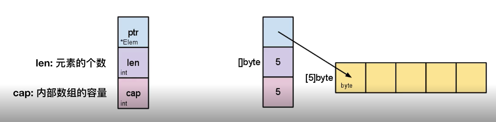
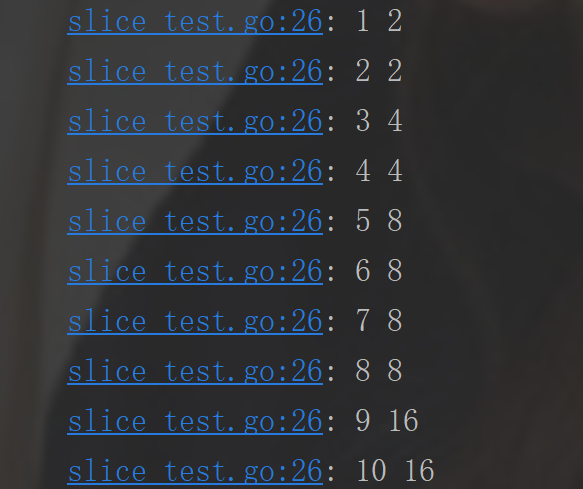
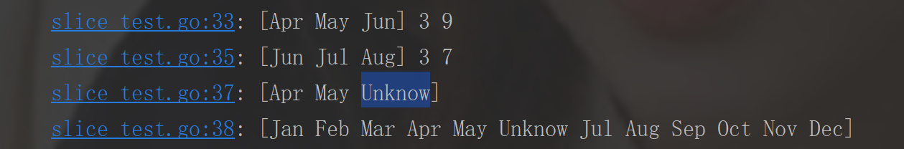
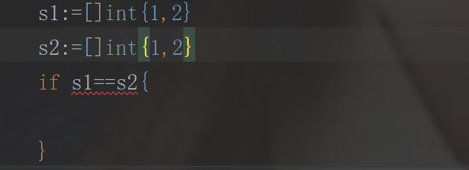
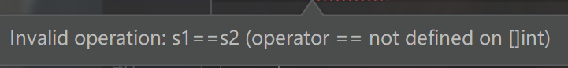

### 数组的初始化
//初始化一个长度为3的int数组

arr1 := [3]int{}

//初始化一个长度为2的string数组

arr2 := [2]string{"你","好"}

//初始化自适应长度数组

arr3 := [...]int{1,2,34,56,6}

```
	arr1 := [3]int{}
	arr2 := [2]string{"你","好"}
	t.Log(arr1)
	t.Log(arr2)
	arr3 := [...]int{2,4,6,8,10}
	t.Log(arr3,len(arr3))
```

### 数组遍历
```
	arr3 := [...]int{2,4,6,8,10}
	for i:=0;i<len(arr3);i++{
		t.Log(arr3[i])
	}
	//range 取值和索引
	for index,value := range arr3{
		t.Log(index,value)
	}
	//只取值
	for _,value := range arr3{
		t.Log(value)
	}
```

### 数组截取
a[开始索引(包含):结束索引(不包含)]

```
	arr3 := [...]int{1,3,5,7,9}
	t.Log(arr3[3:]) //7,9
	t.Log(arr3[:]) //1,3,5,7,9
	t.Log(arr3[:4]) //1,3,5,7
```

### 切片

可变连续的存储空间



len：元素的个数
cap: 内部数组的容量


### 切片定义

```
	var slice1 []int
	t.Log(len(slice1),cap(slice1))
	slice1=append(slice1,1)
	t.Log(len(slice1),cap(slice1))

	slice2 :=[]int{1,2,3,4}
	t.Log(len(slice2),cap(slice2))

	slice3 := make([]int , 3, 5)
	t.Log(len(slice3),cap(slice3))

```
切片声明：

var slice1 []int

slice2 :=[]int{1,2,3,4}

slice3 := make([]int , 3, 5)

### 切片扩容

```
	s:=[]int{}
	for i:=0;i<10;i++{
		s=append(s,i)
		t.Log(len(s),cap(s))
	}
```
控制台输出


（1）当切片容量不够时，append操作会对cap扩容，cap扩容长度遵循以下规则：如果当前cap小于1024，则扩容当前大小，即扩容后的cap是当前2倍，如果当前cap大于等于1024，则每次增长当前大小的1/4
（2）当切片容量不够时，append操作会引起切片内存地址的变化，即，当len=cap时，append操作会开辟一块内存区域，将现有切片内容复制过去;从现有数组初始化切片时，得到的切片地址与初始化切片数组索引startIndex元素的地址一致，且切片是该数组对因数据的引用，数组元素改变，切片元素也改变，当cap需要扩容时，切片地址发生改变后，切片与数组之间的引用关系解除，数组元素改变，切片元素不会改变

### 切片共享存储
```
	year := []string{"Jan","Feb","Mar","Apr","May","Jun","Jul","Aug","Sep","Oct","Nov","Dec"}
	Q2 := year[3:6]
	t.Log(Q2,len(Q2),cap(Q2))
	summer := year[5:8]
	t.Log(summer,len(summer),cap(summer))
	summer[0] ="Unknow"
	t.Log(Q2)
	t.Log(year)
```
控制台输出


### 数组vs切片
1.数组容量不可伸缩，切片可以

2.数组可比较：相同维度，相同长度，相同元素;切片只能和nil进行比较

