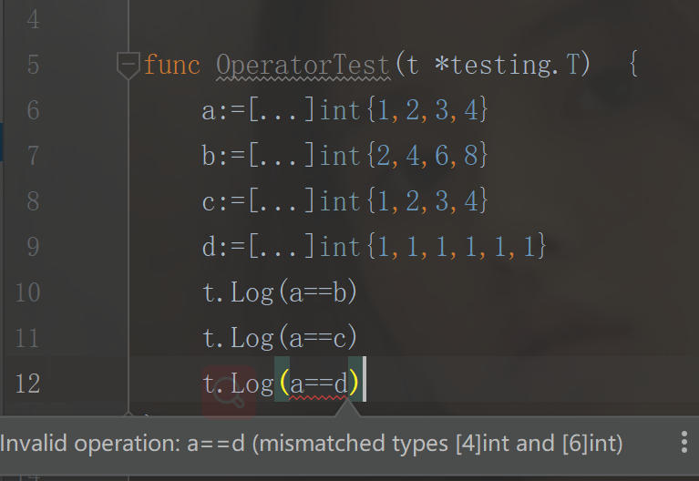

算数运算符:

go语言没有前置++,前置--

比较运算符：

用==比较数组：

（1）维度相同且元素个数相同的数组才能进行比较
（2）每个元素都相同才相等



```
package day04

import "testing"

func TestOperator(t *testing.T)  {
	a:=[...]int{1,2,3,4}
	b:=[...]int{2,4,6,8}
	c:=[...]int{1,2,3,4}
	//d:=[...]int{1,1,1,1,1,1}
	t.Log(a==b)
	t.Log(a==c)
}

```

逻辑运算符：

&&，||，！

位运算符：

&^按位置零

1 &^0 -- 1

1 &^1 -- 0

0 &^1 -- 0

0 &^0 -- 0


