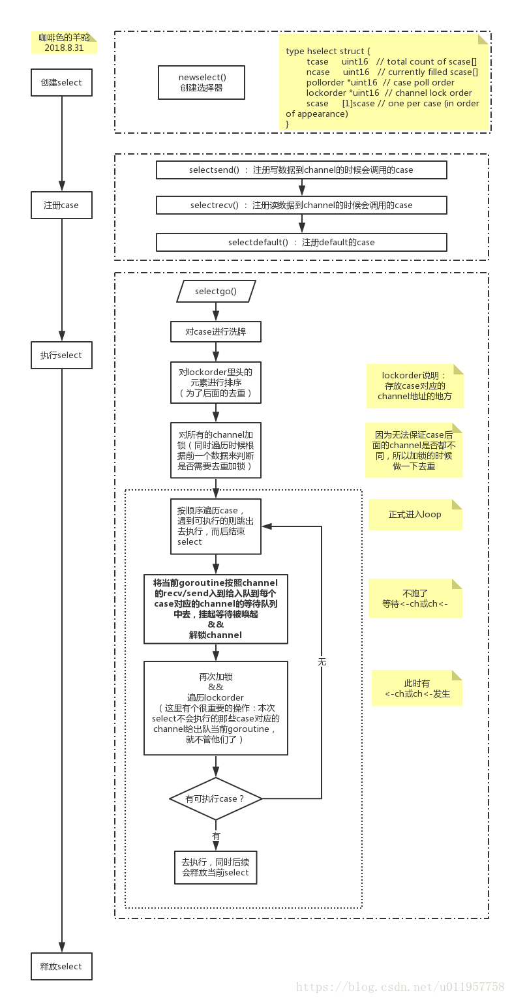

####前言
select select可以监听channel的数据流动，既可以用于channel的数据接收，也可以用于channel的数据发送。 select的用法与switch语法非常类似，由select开始的一个新的选择块，每个选择条件由case语句来描述，与switch语句可以选择任何使用相等比较的条件相比，select由比较多的限制，其中最大的一条限制就是每个case语句里必须是一个IO操作

特性：
- 如果select的多个分支都满足条件，则会随机的选取其中一个满足条件的分支，如果有default分支，default分支如果满足则会选择default分支
- 所有channel表达式都会被求值、所有被发送的表达式都会被求值。求值顺序：自上而下、从左到右

基本用法
```
//select基本用法
select {
case <- chan1:
// 如果chan1成功读到数据，则进行该case处理语句
case chan2 <- 1:
// 如果成功向chan2写入数据，则进行该case处理语句
default:
// 如果上面都没有成功，则进入default处理流程
```

####select源码片段
```
func selectgo(cas0 *scase, order0 *uint16, ncases int) (int, bool) {
	if debugSelect {
		print("select: cas0=", cas0, "\n")
	}
    
	cas1 := (*[1 << 16]scase)(unsafe.Pointer(cas0))
	order1 := (*[1 << 17]uint16)(unsafe.Pointer(order0))
    
	scases := cas1[:ncases:ncases]
	pollorder := order1[:ncases:ncases]
	lockorder := order1[ncases:][:ncases:ncases]

	// Replace send/receive cases involving nil channels with
	// caseNil so logic below can assume non-nil channel.
	for i := range scases {
		cas := &scases[i]
		if cas.c == nil && cas.kind != caseDefault {
			*cas = scase{}
		}
	}

	var t0 int64
	if blockprofilerate > 0 {
		t0 = cputicks()
		for i := 0; i < ncases; i++ {
			scases[i].releasetime = -1
		}
	}

	// The compiler rewrites selects that statically have
	// only 0 or 1 cases plus default into simpler constructs.
	// The only way we can end up with such small sel.ncase
	// values here is for a larger select in which most channels
	// have been nilled out. The general code handles those
	// cases correctly, and they are rare enough not to bother
	// optimizing (and needing to test).

	// generate permuted order
	for i := 1; i < ncases; i++ {
		j := fastrandn(uint32(i + 1))
		pollorder[i] = pollorder[j]
		pollorder[j] = uint16(i)
	}

	// sort the cases by Hchan address to get the locking order.
	// simple heap sort, to guarantee n log n time and constant stack footprint.
	for i := 0; i < ncases; i++ {
		j := i
		// Start with the pollorder to permute cases on the same channel.
		c := scases[pollorder[i]].c
		for j > 0 && scases[lockorder[(j-1)/2]].c.sortkey() < c.sortkey() {
			k := (j - 1) / 2
			lockorder[j] = lockorder[k]
			j = k
		}
		lockorder[j] = pollorder[i]
	}
	for i := ncases - 1; i >= 0; i-- {
		o := lockorder[i]
		c := scases[o].c
		lockorder[i] = lockorder[0]
		j := 0
		for {
			k := j*2 + 1
			if k >= i {
				break
			}
			if k+1 < i && scases[lockorder[k]].c.sortkey() < scases[lockorder[k+1]].c.sortkey() {
				k++
			}
			if c.sortkey() < scases[lockorder[k]].c.sortkey() {
				lockorder[j] = lockorder[k]
				j = k
				continue
			}
			break
		}
		lockorder[j] = o
	}

	if debugSelect {
		for i := 0; i+1 < ncases; i++ {
			if scases[lockorder[i]].c.sortkey() > scases[lockorder[i+1]].c.sortkey() {
				print("i=", i, " x=", lockorder[i], " y=", lockorder[i+1], "\n")
				throw("select: broken sort")
			}
		}
	}

	// lock all the channels involved in the select
	// 加锁该select中所有的channel
    sellock(scases, lockorder)

	var (
		gp     *g
		sg     *sudog
		c      *hchan
		k      *scase
		sglist *sudog
		sgnext *sudog
		qp     unsafe.Pointer
		nextp  **sudog
	)

loop:
	// pass 1 - look for something already waiting
	var dfli int
	var dfl *scase
	var casi int
	var cas *scase
	var recvOK bool
    // 按顺序遍历case来寻找可执行的case
	for i := 0; i < ncases; i++ {
		casi = int(pollorder[i])
		cas = &scases[casi]
		c = cas.c

		switch cas.kind {
		case caseNil:
			continue

		case caseRecv:
			sg = c.sendq.dequeue()
			if sg != nil {
				goto recv
			}
			if c.qcount > 0 {
				goto bufrecv
			}
			if c.closed != 0 {
				goto rclose
			}

		case caseSend:
			if raceenabled {
				racereadpc(c.raceaddr(), cas.pc, chansendpc)
			}
			if c.closed != 0 {
				goto sclose
			}
			sg = c.recvq.dequeue()
			if sg != nil {
				goto send
			}
			if c.qcount < c.dataqsiz {
				goto bufsend
			}

		case caseDefault:
			dfli = casi
			dfl = cas
		}
	}

	if dfl != nil {
		selunlock(scases, lockorder)
		casi = dfli
		cas = dfl
		goto retc
	}

	// pass 2 - enqueue on all chans
	gp = getg()
	if gp.waiting != nil {
		throw("gp.waiting != nil")
	}
	nextp = &gp.waiting
	for _, casei := range lockorder {
		casi = int(casei)
		cas = &scases[casi]
		if cas.kind == caseNil {
			continue
		}
		c = cas.c
		sg := acquireSudog()
		sg.g = gp
		sg.isSelect = true
		// No stack splits between assigning elem and enqueuing
		// sg on gp.waiting where copystack can find it.
		sg.elem = cas.elem
		sg.releasetime = 0
		if t0 != 0 {
			sg.releasetime = -1
		}
		sg.c = c
		// Construct waiting list in lock order.
		*nextp = sg
		nextp = &sg.waitlink

		switch cas.kind {
		case caseRecv:
			c.recvq.enqueue(sg)

		case caseSend:
			c.sendq.enqueue(sg)
		}
	}

	// wait for someone to wake us up
    // 等待被唤起,同时解锁channel(selparkcommit这里实现的)
	gp.param = nil
	gopark(selparkcommit, nil, waitReasonSelect, traceEvGoBlockSelect, 1)
	gp.activeStackChans = false
    // 突然有故事发生，被唤醒，再次该select下全部channel加锁
	sellock(scases, lockorder)

	gp.selectDone = 0
	sg = (*sudog)(gp.param)
	gp.param = nil

	// pass 3 - dequeue from unsuccessful chans
	// otherwise they stack up on quiet channels
	// record the successful case, if any.
	// We singly-linked up the SudoGs in lock order.
	// 本轮最后一次循环操作，获取可执行case，其余全部出队列丢弃
    casi = -1
	cas = nil
	sglist = gp.waiting
	// Clear all elem before unlinking from gp.waiting.
	for sg1 := gp.waiting; sg1 != nil; sg1 = sg1.waitlink {
		sg1.isSelect = false
		sg1.elem = nil
		sg1.c = nil
	}
	gp.waiting = nil

	for _, casei := range lockorder {
		k = &scases[casei]
		if k.kind == caseNil {
			continue
		}
		if sglist.releasetime > 0 {
			k.releasetime = sglist.releasetime
		}
		if sg == sglist {
			// sg has already been dequeued by the G that woke us up.
			casi = int(casei)
			cas = k
		} else {
			c = k.c
			if k.kind == caseSend {
				c.sendq.dequeueSudoG(sglist)
			} else {
				c.recvq.dequeueSudoG(sglist)
			}
		}
		sgnext = sglist.waitlink
		sglist.waitlink = nil
		releaseSudog(sglist)
		sglist = sgnext
	}
    // 没有的话，再走一次loop
	if cas == nil {
		// We can wake up with gp.param == nil (so cas == nil)
		// when a channel involved in the select has been closed.
		// It is easiest to loop and re-run the operation;
		// we'll see that it's now closed.
		// Maybe some day we can signal the close explicitly,
		// but we'd have to distinguish close-on-reader from close-on-writer.
		// It's easiest not to duplicate the code and just recheck above.
		// We know that something closed, and things never un-close,
		// so we won't block again.
		goto loop
	}

	c = cas.c

	if debugSelect {
		print("wait-return: cas0=", cas0, " c=", c, " cas=", cas, " kind=", cas.kind, "\n")
	}

	if cas.kind == caseRecv {
		recvOK = true
	}

	if raceenabled {
		if cas.kind == caseRecv && cas.elem != nil {
			raceWriteObjectPC(c.elemtype, cas.elem, cas.pc, chanrecvpc)
		} else if cas.kind == caseSend {
			raceReadObjectPC(c.elemtype, cas.elem, cas.pc, chansendpc)
		}
	}
	if msanenabled {
		if cas.kind == caseRecv && cas.elem != nil {
			msanwrite(cas.elem, c.elemtype.size)
		} else if cas.kind == caseSend {
			msanread(cas.elem, c.elemtype.size)
		}
	}

	selunlock(scases, lockorder)
	goto retc

bufrecv:
	// can receive from buffer
	if raceenabled {
		if cas.elem != nil {
			raceWriteObjectPC(c.elemtype, cas.elem, cas.pc, chanrecvpc)
		}
		raceacquire(chanbuf(c, c.recvx))
		racerelease(chanbuf(c, c.recvx))
	}
	if msanenabled && cas.elem != nil {
		msanwrite(cas.elem, c.elemtype.size)
	}
	recvOK = true
	qp = chanbuf(c, c.recvx)
	if cas.elem != nil {
		typedmemmove(c.elemtype, cas.elem, qp)
	}
	typedmemclr(c.elemtype, qp)
	c.recvx++
	if c.recvx == c.dataqsiz {
		c.recvx = 0
	}
	c.qcount--
	selunlock(scases, lockorder)
	goto retc

bufsend:
	// can send to buffer
	if raceenabled {
		raceacquire(chanbuf(c, c.sendx))
		racerelease(chanbuf(c, c.sendx))
		raceReadObjectPC(c.elemtype, cas.elem, cas.pc, chansendpc)
	}
	if msanenabled {
		msanread(cas.elem, c.elemtype.size)
	}
	typedmemmove(c.elemtype, chanbuf(c, c.sendx), cas.elem)
	c.sendx++
	if c.sendx == c.dataqsiz {
		c.sendx = 0
	}
	c.qcount++
	selunlock(scases, lockorder)
	goto retc

recv:
	// can receive from sleeping sender (sg)
	recv(c, sg, cas.elem, func() { selunlock(scases, lockorder) }, 2)
	if debugSelect {
		print("syncrecv: cas0=", cas0, " c=", c, "\n")
	}
	recvOK = true
	goto retc

rclose:
	// read at end of closed channel
	selunlock(scases, lockorder)
	recvOK = false
	if cas.elem != nil {
		typedmemclr(c.elemtype, cas.elem)
	}
	if raceenabled {
		raceacquire(c.raceaddr())
	}
	goto retc

send:
	// can send to a sleeping receiver (sg)
	if raceenabled {
		raceReadObjectPC(c.elemtype, cas.elem, cas.pc, chansendpc)
	}
	if msanenabled {
		msanread(cas.elem, c.elemtype.size)
	}
	send(c, sg, cas.elem, func() { selunlock(scases, lockorder) }, 2)
	if debugSelect {
		print("syncsend: cas0=", cas0, " c=", c, "\n")
	}
	goto retc

retc:
	if cas.releasetime > 0 {
		blockevent(cas.releasetime-t0, 1)
	}
	return casi, recvOK

sclose:
	// send on closed channel
	selunlock(scases, lockorder)
	panic(plainError("send on closed channel"))
}
```
大致流程图如下：


#### select几种经典用法
1. 超时判断
```
select {
case ret := <-asyncService():
	fmt.Println(ret)
case <-time.After(time.Microsecond * 50):
	fmt.Println("time out!!!")

}
```
2. 退出
```
//主线程（协程）中如下：
var shouldQuit=make(chan struct{})
fun main(){
   {
       //loop
   }
   //...out of the loop
   select {
	case <-c.shouldQuit:
		cleanUp()
		return
	default:
	}
   //...
}
//再另外一个协程中，如果运行遇到非法操作或不可处理的错误，就向shouldQuit发送数据通知程序停止运行close(shouldQuit)
```
3. 判断channel是否阻塞
```
ch := make (chan int, 1)
ch <- 1
select {
case ch <- 2: // channel满了写不进去
default:
    fmt.Println("channel is full !")
}
```