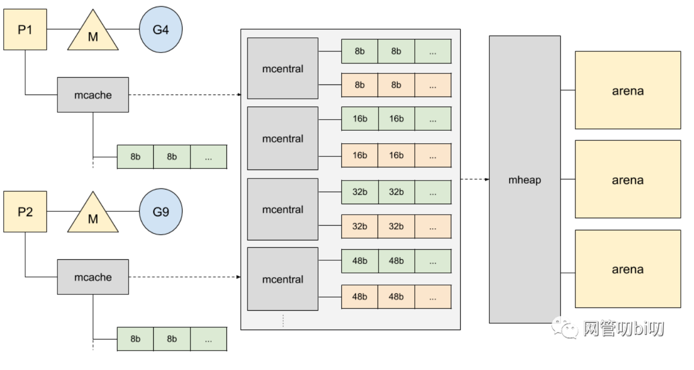

#### 前言
Go语言内置运行时（就是runtime），抛弃了传统的内存分配方式，改为自主管理。这样可以自主地实现更好的内存使用模式，比如内存池、预分配等等。这样，不会每次内存分配都需要进行系统调用。
Golang运行时的内存分配算法主要源自 Google 为 C 语言开发的TCMalloc算法，全称Thread-Caching Malloc。核心思想就是把内存分为多级管理，从而降低锁的粒度。它将可用的堆内存采用二级分配的方式进行管理：每个线程都会自行维护一个独立的内存池，进行内存分配时优先从该内存池中分配，当内存池不足时才会向全局内存池申请，以避免不同线程对全局内存池的频繁竞争。
#### 基础概念
Go在程序启动的时候，会先向操作系统申请一块内存（注意这时还只是一段虚拟的地址空间，并不会真正地分配内存），切成小块后自己进行管理。
申请到的内存块被分配了三个区域，在X64上分别是512MB，16GB，512GB大小。


arena区域就是我们所谓的堆区，Go动态分配的内存都是在这个区域，它把内存分割成8KB大小的页，一些页组合起来称为mspan。

bitmap区域标识arena区域哪些地址保存了对象。

spans区域存放mspan（也就是一些arena分割的页组合起来的内存管理基本单元）的指针，每个指针对应一页。
内存管理单元
mspan：Go中内存管理的基本单元，是由一片连续的8KB的页组成的大块内存。注意，这里的页和操作系统本身的页并不是一回事，它一般是操作系统页大小的几倍。一句话概括：mspan是一个包含起始地址、mspan规格、页的数量等内容的双端链表。

#### 内存管理单元

mspan是一个包含起始地址、mspan规格、页的数量等内容的双端链表。

mspan结构体定义：
```
// path: /usr/local/go/src/runtime/mheap.go

type mspan struct {
    //链表前向指针，用于将span链接起来
	next *mspan	
	
	//链表前向指针，用于将span链接起来
	prev *mspan	
	
	// 起始地址，也即所管理页的地址
	startAddr uintptr 
	
	// 管理的页数
	npages uintptr 
	
	// 块个数，表示有多少个块可供分配
	nelems uintptr 

    //分配位图，每一位代表一个块是否已分配
	allocBits *gcBits 

    // 已分配块的个数
	allocCount uint16 
	
	// class表中的class ID，和Size Classs相关
	spanclass spanClass  

    // class表中的对象大小，也即块大小
	elemsize uintptr 
}
```

#### 内存管理组件
内存分配由内存分配器完成。分配器由3种组件构成：mcache, mcentral, mheap。
##### mcache
mcache：每个工作线程都会绑定一个mcache，本地缓存可用的mspan资源，这样就可以直接给Goroutine分配，因为不存在多个Goroutine竞争的情况，所以不会消耗锁资源。
mcache的结构体定义：
```
//path: /usr/local/go/src/runtime/mcache.go

type mcache struct {
    alloc [numSpanClasses]*mspan
}
```

mcache用Span Classes作为索引管理多个用于分配的mspan，它包含所有规格的mspan。

mcache在初始化的时候是没有任何mspan资源的，在使用过程中会动态地从mcentral申请，之后会缓存下来。当对象小于等于32KB大小时，使用mcache的相应规格的mspan进行分配。
##### mcentral
mcentral：为所有mcache提供切分好的mspan资源。每个central保存一种特定大小的全局mspan列表，包括已分配出去的和未分配出去的。 每个mcentral对应一种mspan，而mspan的种类导致它分割的object大小不同。当工作goroutine的mcache中没有合适（也就是特定大小的）的mspan时就会从mcentral获取。
mcentral被所有的工作线程共同享有，存在多个Goroutine竞争的情况，因此会消耗锁资源。结构体定义：
```
//path: /usr/local/go/src/runtime/mcentral.go

type mcentral struct {
    // 互斥锁
    lock mutex 
    
    // 规格
    sizeclass int32 
    
    // 尚有空闲object的mspan链表
    nonempty mSpanList 
    
    // 没有空闲object的mspan链表，或者是已被mcache取走的msapn链表
    empty mSpanList 
    
    // 已累计分配的对象个数
    nmalloc uint64 
}
```

empty表示这条链表里的mspan都被分配了object，或者是已经被cache取走了的mspan，这个mspan就被那个工作线程独占了。而nonempty则表示有空闲对象的mspan列表。每个central结构体都在mheap中维护。

简单说下mcache从mcentral获取和归还mspan的流程：
1. 获取加锁；从nonempty链表找到一个可用的mspan；并将其从nonempty链表删除；将取出的mspan加入到empty链表；将mspan返回给工作线程；解锁。
2. 归还加锁；将mspan从empty链表删除；将mspan加入到nonempty链表；解锁。

##### mheap
mheap：代表Go程序持有的所有堆空间，Go程序使用一个mheap的全局对象_mheap来管理堆内存。

当mcentral没有空闲的mspan时，会向mheap申请。而mheap没有资源时，会向操作系统申请新内存。mheap主要用于大对象的内存分配，以及管理未切割的mspan，用于给mcentral切割成小对象。

同时我们也看到，mheap中含有所有规格的mcentral，所以，当一个mcache从mcentral申请mspan时，只需要在独立的mcentral中使用锁，并不会影响申请其他规格的mspan。

mheap结构体定义：
```
//path: /usr/local/go/src/runtime/mheap.go

type mheap struct {
	lock mutex
	
	// spans: 指向mspans区域，用于映射mspan和page的关系
	spans []*mspan 
	
	// 指向bitmap首地址，bitmap是从高地址向低地址增长的
	bitmap uintptr 

    // 指示arena区首地址
	arena_start uintptr 
	
	// 指示arena区已使用地址位置
	arena_used  uintptr 
	
	// 指示arena区末地址
	arena_end   uintptr 

	central [67*2]struct {
		mcentral mcentral
		pad [sys.CacheLineSize - unsafe.Sizeof(mcentral{})%sys.CacheLineSize]byte
	}
}
```

#### Go内存管理全局示意图


#### 分配流程
变量是在栈上分配还是在堆上分配，是由逃逸分析的结果决定的。通常情况下，编译器是倾向于将变量分配到栈上的，因为它的开销小。

Go的内存分配器在分配对象时，根据对象的大小，分成三类：小对象（小于等于16B）、一般对象（大于16B，小于等于32KB）、大对象（大于32KB）。
大体上的分配流程：
- 大于32KB 的对象，直接从mheap上分配；
- <=16B 的对象使用mcache的tiny分配器分配；
- (16B,32KB] 的对象，首先计算对象的规格大小，然后使用mcache中相应规格大小的mspan分配；
- 如果mcache没有相应规格大小的mspan，则向mcentral申请
- 如果mcentral没有相应规格大小的mspan，则向mheap申请
- 如果mheap中也没有合适大小的mspan，则向操作系统申请

#### 总结

- Go在程序启动时，会向操作系统申请一大块内存，由mheap结构全局管理。
- Go内存管理的基本单元是mspan，它由若干个页组成，每种mspan可以分配特定大小的object。
- mcache, mcentral, mheap是Go内存管理的三大组件，层层递进。mcache管理goroutine在本地缓存的mspan；mcentral管理全局的mspan供所有线程使用；mheap管理Go的所有动态分配内存。
- 极小对象会分配在一个object中，以节省资源，使用tiny分配器分配内存；一般小对象通过mspan分配内存；大对象则直接由mheap分配内存。
