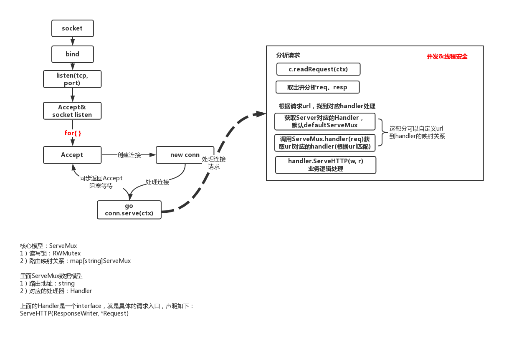

#### golang web server原理
我们先来看一个非常简单的实例：
```
func (srv *Server) ListenAndServe() error {
	if srv.shuttingDown() {
		return ErrServerClosed
	}
	addr := srv.Addr
	if addr == "" {
		addr = ":http"
	}
	ln, err := net.Listen("tcp", addr)
	if err != nil {
		return err
	}
	return srv.Serve(ln)
}


func (srv *Server) Serve(l net.Listener) error {
	if fn := testHookServerServe; fn != nil {
		fn(srv, l) // call hook with unwrapped listener
	}

	origListener := l
	l = &onceCloseListener{Listener: l}
	defer l.Close()

	if err := srv.setupHTTP2_Serve(); err != nil {
		return err
	}

	if !srv.trackListener(&l, true) {
		return ErrServerClosed
	}
	defer srv.trackListener(&l, false)

	baseCtx := context.Background()
	if srv.BaseContext != nil {
		baseCtx = srv.BaseContext(origListener)
		if baseCtx == nil {
			panic("BaseContext returned a nil context")
		}
	}

	var tempDelay time.Duration // how long to sleep on accept failure

	ctx := context.WithValue(baseCtx, ServerContextKey, srv)
	for {
		rw, err := l.Accept()
		if err != nil {
			select {
			case <-srv.getDoneChan():
				return ErrServerClosed
			default:
			}
			if ne, ok := err.(net.Error); ok && ne.Temporary() {
				if tempDelay == 0 {
					tempDelay = 5 * time.Millisecond
				} else {
					tempDelay *= 2
				}
				if max := 1 * time.Second; tempDelay > max {
					tempDelay = max
				}
				srv.logf("http: Accept error: %v; retrying in %v", err, tempDelay)
				time.Sleep(tempDelay)
				continue
			}
			return err
		}
		connCtx := ctx
		if cc := srv.ConnContext; cc != nil {
			connCtx = cc(connCtx, rw)
			if connCtx == nil {
				panic("ConnContext returned nil")
			}
		}
		tempDelay = 0
		c := srv.newConn(rw)
		c.setState(c.rwc, StateNew) // before Serve can return
		go c.serve(connCtx)
	}
}

```
主要流程如下：

- 首先 server 基于 TCP 协议监听指定的端口
- 在 server 的主线程中循环(在 go 中也是主的 goroutine ) 调用 rw, e := l.Accept() ，从网络端口中取出 TCP 连接;
- 针对每一个 connection 都创建一个goroutine 来处理



这里对于 TCP 连接的处理可以说是比较暴力的，来一个连接就起一个goroutine, 我们都知道go 的runtime 肩负起调度 goroutine 运行的职责，虽然goroutine调度整体的性能损失比原生线程要低，但是在高并发下不可避免存在性能损耗。

#### 粗糙版本的goroutine pool
golang中的协程 goroutine 是通过 go 的 runtime 来调度的，所以goroutine资源没法像临时资源一样放回去再取出来。
     
所以goroutine 应该是一直运行的，需要的时候就运行，不需要的时候就阻塞，这样对其他的goroutine的调度影响也不是很大。而goroutine的任务传递可以通过 channel 来传递。
```
func go_pool() {
	//start := time.Now()
	wg := new(sync.WaitGroup)
	data := make(chan int, 100)
	
	for i := 0; i < 10; i++ {
		wg.Add(1)
		
		go func(n int) {
			defer wg.Done()
			for _ = range data {
				//for i:=0; i<100000; i++ {
				//
				//}
			}
		}(i)
	}
	
	for i := 0; i < 10000; i++ {
		data <- i
	}
	
	close(data)
	wg.Wait()
	//end := time.Now()
	//fmt.Println(end.Sub(start))
}
```     
这个版本的实现逻辑还比较简单，总的来说：我们起了 N 个协程，每个协程循环从 channel 获取任务消息，如果获取到消息就处理，否则协程就被阻塞。
