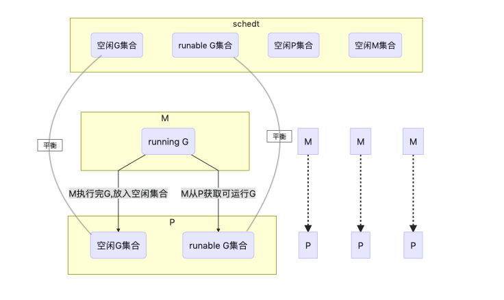
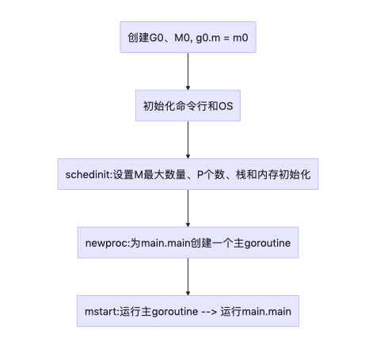
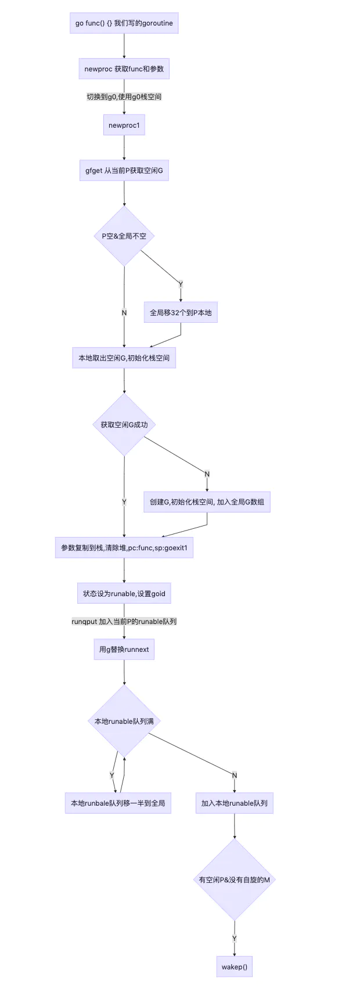
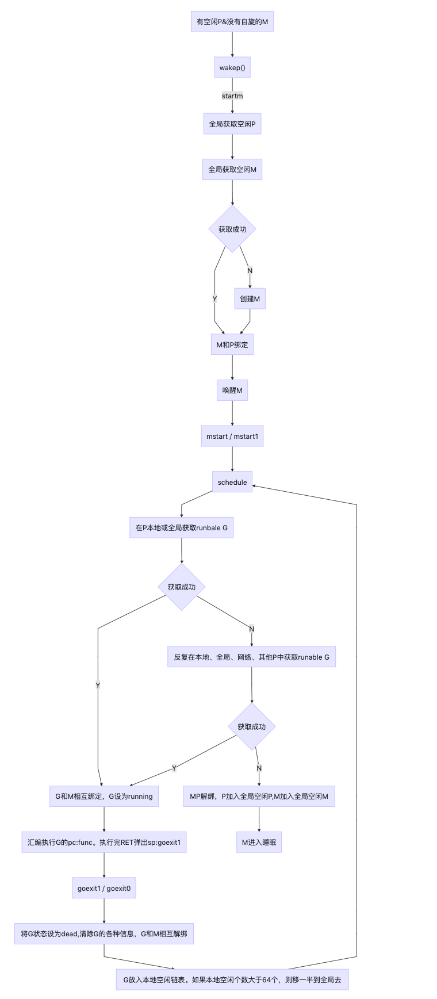
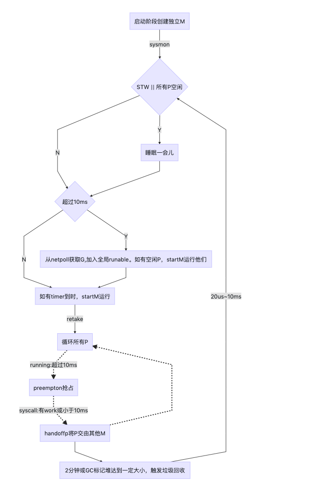

### 准备
- 版本 1.15
- 相关目录
```
runtime/asm_amd64.s
runtime/proc.go
runtime/runtime2.go
```

### 关键概念
- G goroutine 我们代码写的go func(){ }
- M 内核线程
- P M调度G的上下文, P中存储了很多G,M通过调用P来获取并执行G。
- schedt - 全局调度器，主要存储了一些空闲的G、M、P

### G、M、P、schedt之间的关系



### G

runtime/runtime2.go包
```
type g struct {
	// Stack parameters.
	// stack describes the actual stack memory: [stack.lo, stack.hi).
	// stackguard0 is the stack pointer compared in the Go stack growth prologue.
	// It is stack.lo+StackGuard normally, but can be StackPreempt to trigger a preemption.
	// stackguard1 is the stack pointer compared in the C stack growth prologue.
	// It is stack.lo+StackGuard on g0 and gsignal stacks.
	// It is ~0 on other goroutine stacks, to trigger a call to morestackc (and crash).
	stack       stack   // offset known to runtime/cgo
	stackguard0 uintptr // offset known to liblink
	stackguard1 uintptr // offset known to liblink

	_panic       *_panic // innermost panic - offset known to liblink
	_defer       *_defer // innermost defer
	m            *m      // current m; offset known to arm liblink
	sched        gobuf
	syscallsp    uintptr        // if status==Gsyscall, syscallsp = sched.sp to use during gc
	syscallpc    uintptr        // if status==Gsyscall, syscallpc = sched.pc to use during gc
	stktopsp     uintptr        // expected sp at top of stack, to check in traceback
	param        unsafe.Pointer // passed parameter on wakeup
	atomicstatus uint32
	stackLock    uint32 // sigprof/scang lock; TODO: fold in to atomicstatus
	goid         int64
	schedlink    guintptr
	waitsince    int64      // approx time when the g become blocked
	waitreason   waitReason // if status==Gwaiting

	preempt       bool // preemption signal, duplicates stackguard0 = stackpreempt
	preemptStop   bool // transition to _Gpreempted on preemption; otherwise, just deschedule
	preemptShrink bool // shrink stack at synchronous safe point

	// asyncSafePoint is set if g is stopped at an asynchronous
	// safe point. This means there are frames on the stack
	// without precise pointer information.
	asyncSafePoint bool

	paniconfault bool // panic (instead of crash) on unexpected fault address
	gcscandone   bool // g has scanned stack; protected by _Gscan bit in status
	throwsplit   bool // must not split stack
	// activeStackChans indicates that there are unlocked channels
	// pointing into this goroutine's stack. If true, stack
	// copying needs to acquire channel locks to protect these
	// areas of the stack.
	activeStackChans bool

	raceignore     int8     // ignore race detection events
	sysblocktraced bool     // StartTrace has emitted EvGoInSyscall about this goroutine
	sysexitticks   int64    // cputicks when syscall has returned (for tracing)
	traceseq       uint64   // trace event sequencer
	tracelastp     puintptr // last P emitted an event for this goroutine
	lockedm        muintptr
	sig            uint32
	writebuf       []byte
	sigcode0       uintptr
	sigcode1       uintptr
	sigpc          uintptr
	gopc           uintptr         // pc of go statement that created this goroutine
	ancestors      *[]ancestorInfo // ancestor information goroutine(s) that created this goroutine (only used if debug.tracebackancestors)
	startpc        uintptr         // pc of goroutine function
	racectx        uintptr
	waiting        *sudog         // sudog structures this g is waiting on (that have a valid elem ptr); in lock order
	cgoCtxt        []uintptr      // cgo traceback context
	labels         unsafe.Pointer // profiler labels
	timer          *timer         // cached timer for time.Sleep
	selectDone     uint32         // are we participating in a select and did someone win the race?

	// Per-G GC state

	// gcAssistBytes is this G's GC assist credit in terms of
	// bytes allocated. If this is positive, then the G has credit
	// to allocate gcAssistBytes bytes without assisting. If this
	// is negative, then the G must correct this by performing
	// scan work. We track this in bytes to make it fast to update
	// and check for debt in the malloc hot path. The assist ratio
	// determines how this corresponds to scan work debt.
	gcAssistBytes int64
}
```
几个关键字段：
- stack g自己的栈
- m 执行当前g的m
- sched 保存了g的现场，goroutine切换时通过它来恢复
- atomicstatus g的状态Gidle,Grunnable,Grunning,Gsyscall,Gwaiting,Gdead
- schedlink 下一个g，g链表
- preempt 抢占标记
- lockedm 锁定的M,g中断恢复指定M执行
- gopc 创建该goroutine的指令地址
- startpc goroutine 函数的指令地址

g的几种状态(不全),详见runtime/runtime2.go包常量g status:
- _Gidle 被创建但没初始换
- _Grunnable 可运行
- _Grunning 正在运行
- _Gsyscall 正在系统调用
- _Gwaiting 正在等待
- _Gdead 运行完成

### M

runtime/runtime2.go包
```
type m struct {
	g0      *g     // goroutine with scheduling stack
	morebuf gobuf  // gobuf arg to morestack
	divmod  uint32 // div/mod denominator for arm - known to liblink

	// Fields not known to debuggers.
	procid        uint64       // for debuggers, but offset not hard-coded
	gsignal       *g           // signal-handling g
	goSigStack    gsignalStack // Go-allocated signal handling stack
	sigmask       sigset       // storage for saved signal mask
	tls           [6]uintptr   // thread-local storage (for x86 extern register)
	mstartfn      func()
	curg          *g       // current running goroutine
	caughtsig     guintptr // goroutine running during fatal signal
	p             puintptr // attached p for executing go code (nil if not executing go code)
	nextp         puintptr
	oldp          puintptr // the p that was attached before executing a syscall
	id            int64
	mallocing     int32
	throwing      int32
	preemptoff    string // if != "", keep curg running on this m
	locks         int32
	dying         int32
	profilehz     int32
	spinning      bool // m is out of work and is actively looking for work
	blocked       bool // m is blocked on a note
	newSigstack   bool // minit on C thread called sigaltstack
	printlock     int8
	incgo         bool   // m is executing a cgo call
	freeWait      uint32 // if == 0, safe to free g0 and delete m (atomic)
	fastrand      [2]uint32
	needextram    bool
	traceback     uint8
	ncgocall      uint64      // number of cgo calls in total
	ncgo          int32       // number of cgo calls currently in progress
	cgoCallersUse uint32      // if non-zero, cgoCallers in use temporarily
	cgoCallers    *cgoCallers // cgo traceback if crashing in cgo call
	park          note
	alllink       *m // on allm
	schedlink     muintptr
	lockedg       guintptr
	createstack   [32]uintptr // stack that created this thread.
	lockedExt     uint32      // tracking for external LockOSThread
	lockedInt     uint32      // tracking for internal lockOSThread
	nextwaitm     muintptr    // next m waiting for lock
	waitunlockf   func(*g, unsafe.Pointer) bool
	waitlock      unsafe.Pointer
	waittraceev   byte
	waittraceskip int
	startingtrace bool
	syscalltick   uint32
	freelink      *m // on sched.freem

	// these are here because they are too large to be on the stack
	// of low-level NOSPLIT functions.
	libcall   libcall
	libcallpc uintptr // for cpu profiler
	libcallsp uintptr
	libcallg  guintptr
	syscall   libcall // stores syscall parameters on windows

	vdsoSP uintptr // SP for traceback while in VDSO call (0 if not in call)
	vdsoPC uintptr // PC for traceback while in VDSO call

	// preemptGen counts the number of completed preemption
	// signals. This is used to detect when a preemption is
	// requested, but fails. Accessed atomically.
	preemptGen uint32

	// Whether this is a pending preemption signal on this M.
	// Accessed atomically.
	signalPending uint32

	dlogPerM

	mOS

	// Up to 10 locks held by this m, maintained by the lock ranking code.
	locksHeldLen int
	locksHeld    [10]heldLockInfo
}
```

几个关键字段：
- g0 每个M都有自己独有的g0
- curg 当前正在运行的g
- p 当前用于的p
- nextp 当m被唤醒时，首先拥有这个p
- spinning 是否处于自旋
- schedlink 下一个m, m链表
- mcache 内存分配
- lockedg 和g的lockedm对应

### P

runtime/runtime2.go
```
type p struct {
	id          int32
	status      uint32 // one of pidle/prunning/...
	link        puintptr
	schedtick   uint32     // incremented on every scheduler call
	syscalltick uint32     // incremented on every system call
	sysmontick  sysmontick // last tick observed by sysmon
	m           muintptr   // back-link to associated m (nil if idle)
	mcache      *mcache
	pcache      pageCache
	raceprocctx uintptr

	deferpool    [5][]*_defer // pool of available defer structs of different sizes (see panic.go)
	deferpoolbuf [5][32]*_defer

	// Cache of goroutine ids, amortizes accesses to runtime·sched.goidgen.
	goidcache    uint64
	goidcacheend uint64

	// Queue of runnable goroutines. Accessed without lock.
	runqhead uint32
	runqtail uint32
	runq     [256]guintptr
	// runnext, if non-nil, is a runnable G that was ready'd by
	// the current G and should be run next instead of what's in
	// runq if there's time remaining in the running G's time
	// slice. It will inherit the time left in the current time
	// slice. If a set of goroutines is locked in a
	// communicate-and-wait pattern, this schedules that set as a
	// unit and eliminates the (potentially large) scheduling
	// latency that otherwise arises from adding the ready'd
	// goroutines to the end of the run queue.
	runnext guintptr

	// Available G's (status == Gdead)
	gFree struct {
		gList
		n int32
	}

	sudogcache []*sudog
	sudogbuf   [128]*sudog

	// Cache of mspan objects from the heap.
	mspancache struct {
		// We need an explicit length here because this field is used
		// in allocation codepaths where write barriers are not allowed,
		// and eliminating the write barrier/keeping it eliminated from
		// slice updates is tricky, moreso than just managing the length
		// ourselves.
		len int
		buf [128]*mspan
	}

	tracebuf traceBufPtr

	// traceSweep indicates the sweep events should be traced.
	// This is used to defer the sweep start event until a span
	// has actually been swept.
	traceSweep bool
	// traceSwept and traceReclaimed track the number of bytes
	// swept and reclaimed by sweeping in the current sweep loop.
	traceSwept, traceReclaimed uintptr

	palloc persistentAlloc // per-P to avoid mutex

	_ uint32 // Alignment for atomic fields below

	// The when field of the first entry on the timer heap.
	// This is updated using atomic functions.
	// This is 0 if the timer heap is empty.
	timer0When uint64

	// Per-P GC state
	gcAssistTime         int64    // Nanoseconds in assistAlloc
	gcFractionalMarkTime int64    // Nanoseconds in fractional mark worker (atomic)
	gcBgMarkWorker       guintptr // (atomic)
	gcMarkWorkerMode     gcMarkWorkerMode

	// gcMarkWorkerStartTime is the nanotime() at which this mark
	// worker started.
	gcMarkWorkerStartTime int64

	// gcw is this P's GC work buffer cache. The work buffer is
	// filled by write barriers, drained by mutator assists, and
	// disposed on certain GC state transitions.
	gcw gcWork

	// wbBuf is this P's GC write barrier buffer.
	//
	// TODO: Consider caching this in the running G.
	wbBuf wbBuf

	runSafePointFn uint32 // if 1, run sched.safePointFn at next safe point

	// Lock for timers. We normally access the timers while running
	// on this P, but the scheduler can also do it from a different P.
	timersLock mutex

	// Actions to take at some time. This is used to implement the
	// standard library's time package.
	// Must hold timersLock to access.
	timers []*timer

	// Number of timers in P's heap.
	// Modified using atomic instructions.
	numTimers uint32

	// Number of timerModifiedEarlier timers on P's heap.
	// This should only be modified while holding timersLock,
	// or while the timer status is in a transient state
	// such as timerModifying.
	adjustTimers uint32

	// Number of timerDeleted timers in P's heap.
	// Modified using atomic instructions.
	deletedTimers uint32

	// Race context used while executing timer functions.
	timerRaceCtx uintptr

	// preempt is set to indicate that this P should be enter the
	// scheduler ASAP (regardless of what G is running on it).
	preempt bool

	pad cpu.CacheLinePad
}
```
- status P的状态
- link 下一个P, P链表
- m 拥有这个P的M
- P本地runnable状态的G队列
```      
runqhead uint32
runqtail uint32
runq     [256]guintptr
```
- runnext 一个比runq优先级更高的runnable G
- 可用的的G链表，status==dead,在获取G时会从这里面获取
```
gFree struct {
        gList
        n int32
    }
```

列举P的各个状态：
- _Pidle：没有关联的M
- _Prunning：已和某个M关联
- _Psyscall: 当前P中的被运行的那个G正在进行系统调用
- _Pgcstop: 系统正在GC
- _Pdead: 当前P不再使用

### schedt

runtime/runtime2.go包
```
type schedt struct {
	// accessed atomically. keep at top to ensure alignment on 32-bit systems.
	goidgen   uint64
	lastpoll  uint64 // time of last network poll, 0 if currently polling
	pollUntil uint64 // time to which current poll is sleeping

	lock mutex

	// When increasing nmidle, nmidlelocked, nmsys, or nmfreed, be
	// sure to call checkdead().

	midle        muintptr // idle m's waiting for work
	nmidle       int32    // number of idle m's waiting for work
	nmidlelocked int32    // number of locked m's waiting for work
	mnext        int64    // number of m's that have been created and next M ID
	maxmcount    int32    // maximum number of m's allowed (or die)
	nmsys        int32    // number of system m's not counted for deadlock
	nmfreed      int64    // cumulative number of freed m's

	ngsys uint32 // number of system goroutines; updated atomically

	pidle      puintptr // idle p's
	npidle     uint32
	nmspinning uint32 // See "Worker thread parking/unparking" comment in proc.go.

	// Global runnable queue.
	runq     gQueue
	runqsize int32

	// disable controls selective disabling of the scheduler.
	//
	// Use schedEnableUser to control this.
	//
	// disable is protected by sched.lock.
	disable struct {
		// user disables scheduling of user goroutines.
		user     bool
		runnable gQueue // pending runnable Gs
		n        int32  // length of runnable
	}

	// Global cache of dead G's.
	gFree struct {
		lock    mutex
		stack   gList // Gs with stacks
		noStack gList // Gs without stacks
		n       int32
	}

	// Central cache of sudog structs.
	sudoglock  mutex
	sudogcache *sudog

	// Central pool of available defer structs of different sizes.
	deferlock mutex
	deferpool [5]*_defer

	// freem is the list of m's waiting to be freed when their
	// m.exited is set. Linked through m.freelink.
	freem *m

	gcwaiting  uint32 // gc is waiting to run
	stopwait   int32
	stopnote   note
	sysmonwait uint32
	sysmonnote note

	// safepointFn should be called on each P at the next GC
	// safepoint if p.runSafePointFn is set.
	safePointFn   func(*p)
	safePointWait int32
	safePointNote note

	profilehz int32 // cpu profiling rate

	procresizetime int64 // nanotime() of last change to gomaxprocs
	totaltime      int64 // ∫gomaxprocs dt up to procresizetime

	// sysmonlock protects sysmon's actions on the runtime.
	//
	// Acquire and hold this mutex to block sysmon from interacting
	// with the rest of the runtime.
	sysmonlock mutex
}
```

重要字段：

- midle         muintptr // 空闲M链表
- nmidle        int32    // 空闲M数量
- nmidlelocked  int32    // 被锁住的M的数量
- mnext         int64    // 已创建M的数量，以及下一个M ID
- maxmcount     int32    // 允许创建最大的M数量
- nmsys         int32    // 不计入死锁的M数量
- nmfreed       int64    // 累计释放M的数量
- pidle         puintptr // 空闲的P链表
- npidle        uint32   // 空闲的P数量
- runq          gQueue   // 全局runnable的G队列
- runqsize      int32    // 全局runnable的G数量
- // 全局缓存的可用g
```
gFree struct {
          lock    mutex
          stack   gList // Gs with stacks
          noStack gList // Gs without stacks
          n       int32
      }
```

### 启动

汇编语言 runtime/asm_amd64.s包 193行

大致的启动流程：
1. 创建g0
2. 创建m0
3. m.g0 = g0
4. g0.m = m0   
5. 命令行初始化，OS初始化
6. schedinit 调度器初始化
7. newproc 将runtime.main作为参数创建goroutine
8. mstart

schedinit 调度器初始化,runtime/proc.go包
```
func schedinit() {

    // 获取g0
    _g_ := getg() 

    ...

    // 设置最大 M 数量
    sched.maxmcount = 10000
    
    ...
    
    // 栈和内存初始化
    stackinit()
    mallocinit()

    ...

    // 初始化当前 M
    mcommoninit(_g_.m)
    
    ...
    
    //参数和环境初始化
    goargs()
    goenvs()
    
    ...

    // 设置 P 的数量
    procs := ncpu
    // 通过环境变量设置P的数量
    if n, ok := atoi32(gogetenv("GOMAXPROCS")); ok && n > 0 {
        procs = n
    }
    
    ...
}
```
由此可知，调度器初始化的主要工作:空间申请、M的最大数量设置、P的数量设置、初始化参数和环境

newproc 创建goroutine，runtime/proc.go包
```
func newproc(siz int32, fn *funcval) {

    // sys.PtrSize = 8, 表示跳过函数指针， 获取第一个参数的地址
    argp := add(unsafe.Pointer(&fn), sys.PtrSize)
    gp := getg() // 获取当前g
    pc := getcallerpc() // 获取下一条要执行的指令地址

    // 用 g0 的栈创建 G
    // systemstack 会切换当前的 g 到 g0, 并且使用g0的栈空间
    systemstack(func() {
        newproc1(fn, argp, siz, gp, pc)
    })
}

func newproc1(fn *funcval, argp unsafe.Pointer, narg int32, callergp *g, callerpc uintptr) {

    ...

    _p_ := _g_.m.p.ptr() // 获取P
    newg := gfget(_p_)  // 在P或者sched中获取空闲的G, 在这里也就是主goroutine
    if newg == nil {  // 获取失败就创建一个新的
        newg = malg(_StackMin)  
        casgstatus(newg, _Gidle, _Gdead)
        allgadd(newg) // publishes with a g->status of Gdead so GC scanner doesn't look at uninitialized stack.
    }            
    ...
    
     // 将runtime.main地址存储在主goroutine的sched中
     gostartcallfn(&newg.sched, fn)    
    ...
    
    runqput(_p_, newg, true) // 将runnable的newg放入P中
    
    ...

}
```
在启动阶段将runtime.main作为入参创建G,也就是创建一个G来运行runtime.main。

runtime.main,runtime/proc.go包
```
func main() {

    ...

    //  64位系统 栈的最大空间为 1G, 32为系统 为 250M
    if sys.PtrSize == 8 {
        maxstacksize = 1000000000
    } else {
        maxstacksize = 250000000
    }

    ...
    
    fn := main_main // 这就是我们代码main包的main函数
    fn() // 运行我们的main函数
    
    ...
    
}
```
这里就可以调用我们main_main了，所以上面的newproc是为了给我们的main_main创建一个主goroutine。
现在有了主goroutine，那怎么启动这个goroutine呢？-- mstar

mstart
```
func mstart() {

    ...
    
    mstart1()

    ...
}

func mstart1() {
    ...
    schedule()
}

func schedule() {
    _g_ := getg()

    ...

top:
    pp := _g_.m.p.ptr()
    
    ...

    var gp *g
    
    ...
    
    // 从sched或者P或获取G,启动阶段至此一个产生了两个G:g0和main的G。g0不会存在sched和P中，所以这里获取的是main的G
    if gp == nil {
        if _g_.m.p.ptr().schedtick%61 == 0 && sched.runqsize > 0 {
            lock(&sched.lock)
            gp = globrunqget(_g_.m.p.ptr(), 1)
            unlock(&sched.lock)
        }
    }
    if gp == nil {
        gp, inheritTime = runqget(_g_.m.p.ptr())
    }
    if gp == nil {
        gp, inheritTime = findrunnable() // blocks until work is available
    }


    execute(gp, inheritTime)
}


func execute(gp *g, inheritTime bool) {
    ...
    
    // 在上面我们已经将runtime.main的地址存在gp.sched中。这里就调用runtime.main。
    gogo(&gp.sched)
}

```
mstart经过一系列的调用，最终通过gogo(&gp.sched)调用了runtime.main。在runtime.main中又调用了mian.main，至此启动结束。

### 启动小结


---
### 下面开始分析G、M、P

G 创建

```
func newproc(siz int32, fn *funcval) {

    // sys.PtrSize = 8, 表示跳过函数指针， 获取第一个参数的地址
    argp := add(unsafe.Pointer(&fn), sys.PtrSize)
    gp := getg() // 获取当前g
    pc := getcallerpc() // 获取下一条要执行的指令地址

    // 用 g0 的栈创建 G
    // systemstack 会切换当前的 g 到 g0, 并且使用g0的栈空间
    systemstack(func() {
        newproc1(fn, argp, siz, gp, pc)
    })
}
```
```
func newproc1(fn *funcval, argp unsafe.Pointer, narg int32, callergp *g, callerpc uintptr) {
    _g_ := getg() //获取当前g,也就是g0。因为上面的systemstack会切换到g0

    if fn == nil { // fn空报错
        _g_.m.throwing = -1 // do not dump full stacks
        throw("go of nil func value")
    }
    acquirem() // disable preemption because it can be holding p in a local var
    siz := narg
    siz = (siz + 7) &^ 7

    // 参数大小不能大于  2048 - 4 * 8 - 8   = 2000
    if siz >= _StackMin-4*sys.RegSize-sys.RegSize {
        throw("newproc: function arguments too large for new goroutine")
    }

    _p_ := _g_.m.p.ptr()
    newg := gfget(_p_) // 在P中获取G
    
    // 如果没获取到则创建一个新的G,并设置成dead状态，加入全局的allgs
    if newg == nil {
        newg = malg(_StackMin) 
        casgstatus(newg, _Gidle, _Gdead)
        allgadd(newg) // publishes with a g->status of Gdead so GC scanner doesn't look at uninitialized stack.
    }
    if newg.stack.hi == 0 {
        throw("newproc1: newg missing stack")
    }

    if readgstatus(newg) != _Gdead {
        throw("newproc1: new g is not Gdead")
    }

    totalSize := 4*sys.RegSize + uintptr(siz) + sys.MinFrameSize // extra space in case of reads slightly beyond frame
    totalSize += -totalSize & (sys.SpAlign - 1)                  // align to spAlign
    sp := newg.stack.hi - totalSize  // 栈顶地址
    spArg := sp
    if usesLR {
        // caller's LR
        *(*uintptr)(unsafe.Pointer(sp)) = 0
        prepGoExitFrame(sp)
        spArg += sys.MinFrameSize
    }
    if narg > 0 {
        // 将参数压入G的栈
        memmove(unsafe.Pointer(spArg), argp, uintptr(narg))

        if writeBarrier.needed && !_g_.m.curg.gcscandone {
            f := findfunc(fn.fn)
            stkmap := (*stackmap)(funcdata(f, _FUNCDATA_ArgsPointerMaps))
            if stkmap.nbit > 0 {
                // We're in the prologue, so it's always stack map index 0.
                bv := stackmapdata(stkmap, 0)
                bulkBarrierBitmap(spArg, spArg, uintptr(bv.n)*sys.PtrSize, 0, bv.bytedata)
            }
        }
    }

    // 清除G的运行现场，因为G有可能是从P中获取的，清除原有的数据
    memclrNoHeapPointers(unsafe.Pointer(&newg.sched), unsafe.Sizeof(newg.sched))
    // 重新对现场复制
    newg.sched.sp = sp
    newg.stktopsp = sp
    // 将pc指向goexit。这个很重要，G运行完时会执行它，实际将调用goexit1
    newg.sched.pc = funcPC(goexit) + sys.PCQuantum 
    newg.sched.g = guintptr(unsafe.Pointer(newg))
    // 其实在这里面真正pc指向的是fn, 而上面的goexit被用于sp,当RET的时候pop出goexit
    gostartcallfn(&newg.sched, fn)
    newg.gopc = callerpc
    newg.ancestors = saveAncestors(callergp)
    newg.startpc = fn.fn
    if _g_.m.curg != nil {
        newg.labels = _g_.m.curg.labels
    }
    if isSystemGoroutine(newg, false) {
        atomic.Xadd(&sched.ngsys, +1)
    }
    
    // 状态设为runnable
    casgstatus(newg, _Gdead, _Grunnable)

    if _p_.goidcache == _p_.goidcacheend {
        // Sched.goidgen is the last allocated id,
        // this batch must be [sched.goidgen+1, sched.goidgen+GoidCacheBatch].
        // At startup sched.goidgen=0, so main goroutine receives goid=1.
        _p_.goidcache = atomic.Xadd64(&sched.goidgen, _GoidCacheBatch)
        _p_.goidcache -= _GoidCacheBatch - 1
        _p_.goidcacheend = _p_.goidcache + _GoidCacheBatch
    }
    // 设置id,
    newg.goid = int64(_p_.goidcache) 
    _p_.goidcache++
    if raceenabled {
        newg.racectx = racegostart(callerpc)
    }
    if trace.enabled {
        traceGoCreate(newg, newg.startpc)
    }
    
    // 加入P的runable数组
    runqput(_p_, newg, true)

    if atomic.Load(&sched.npidle) != 0 && atomic.Load(&sched.nmspinning) == 0 && mainStarted {
        wakep()
    }
    releasem(_g_.m)
}
```
从P获取空闲的G,如果没有则生成新的G。把参数复制到G的栈，pc: fn, sp:goexit,把G设为runable,并加入P的runable数组

如何从P获取G: gfget(p)
```
func gfget(_p_ *p) *g {
retry:
    // 如果P的本地空闲链表为空&全局空闲链表不为空
    if _p_.gFree.empty() && (!sched.gFree.stack.empty() || !sched.gFree.noStack.empty()) {
        lock(&sched.gFree.lock)
        // 从全局移一批到本地空闲链表
        for _p_.gFree.n < 32 {
            // Prefer Gs with stacks.
            gp := sched.gFree.stack.pop()
            if gp == nil {
                gp = sched.gFree.noStack.pop()
                if gp == nil {
                    break
                }
            }
            sched.gFree.n--
            _p_.gFree.push(gp)
            _p_.gFree.n++
        }
        unlock(&sched.gFree.lock)
        goto retry
    }
    
    // 从本地空闲链表pop一个G
    gp := _p_.gFree.pop()
    if gp == nil {
        return nil
    }
    _p_.gFree.n--
    if gp.stack.lo == 0 {
        // Stack was deallocated in gfput. Allocate a new one.
        systemstack(func() {
            gp.stack = stackalloc(_FixedStack)
        })
        gp.stackguard0 = gp.stack.lo + _StackGuard
    } else {
        if raceenabled {
            racemalloc(unsafe.Pointer(gp.stack.lo), gp.stack.hi-gp.stack.lo)
        }
        if msanenabled {
            msanmalloc(unsafe.Pointer(gp.stack.lo), gp.stack.hi-gp.stack.lo)
        }
    }
    return gp
}
```
从P的本地空闲链表获取G。如果本地空闲链表为空，则从全局空闲链表移一批到本地

加入本地runabled列表，runqput(p, newg, true)
```
func runqput(_p_ *p, gp *g, next bool) {
    if randomizeScheduler && next && fastrand()%2 == 0 {
        next = false
    }

    if next {
    retryNext:
        // 把g设为runnext, 之前的runnext加入runable队列
        oldnext := _p_.runnext
        if !_p_.runnext.cas(oldnext, guintptr(unsafe.Pointer(gp))) {
            goto retryNext
        }
        if oldnext == 0 {
            return
        }
        // Kick the old runnext out to the regular run queue.
        gp = oldnext.ptr()
    }

retry:
    h := atomic.LoadAcq(&_p_.runqhead) // load-acquire, synchronize with consumers
    t := _p_.runqtail
    // 本地runable队列未满，加入本地
    if t-h < uint32(len(_p_.runq)) {
        _p_.runq[t%uint32(len(_p_.runq))].set(gp)
        atomic.StoreRel(&_p_.runqtail, t+1) // store-release, makes the item available for consumption
        return
    }
    // 本地runable队列已满，移一半到全局runable队列
    if runqputslow(_p_, gp, h, t) {
        return
    }
    // 移了一部分到全局，所以本地队列未满，再次尝试加入本地队列
    goto retry
}
```
把本地runable队列一半到全局 runqputslow
```
func runqputslow(_p_ *p, gp *g, h, t uint32) bool {
    var batch [len(_p_.runq)/2 + 1]*g

    // First, grab a batch from local queue.
    n := t - h
    n = n / 2
    // 如果head - tail 不等于 1/2，说明出问题了
    if n != uint32(len(_p_.runq)/2) {
        throw("runqputslow: queue is not full")
    }
    
    // 从head开始遍历 1/2 加入batch中
    for i := uint32(0); i < n; i++ {
        batch[i] = _p_.runq[(h+i)%uint32(len(_p_.runq))].ptr()
    }
    
    // 并没有从队列中删除，只是修改了head
    if !atomic.CasRel(&_p_.runqhead, h, h+n) { // cas-release, commits consume
        return false
    }
    batch[n] = gp

    if randomizeScheduler {
        // 重新排序
        for i := uint32(1); i <= n; i++ {
            j := fastrandn(i + 1)
            batch[i], batch[j] = batch[j], batch[i]
        }
    }

    // Link the goroutines.
    for i := uint32(0); i < n; i++ {
        // 各个G连在一起
        batch[i].schedlink.set(batch[i+1])
    }
    var q gQueue
    q.head.set(batch[0])
    q.tail.set(batch[n])

    // 全局队列可能其他P也会操作，所以加锁
    lock(&sched.lock)
    // 加入全局runable队列
    globrunqputbatch(&q, int32(n+1))
    unlock(&sched.lock)
    return true
}
```
runable入队列:
1. 替换runnext
2. 本地队列未满,加入本地队列;本地队列已满,则本地队列移一半到全局队列,再次尝试加入本地队列

g小结



现在有了G,那存放G的P又是怎么来的呢？procresize

在启动的时候有一个环节是schedinit
```
func schedinit() {

    ...
    // 修改P的个数
    if procresize(procs) != nil {
        throw("unknown runnable goroutine during bootstrap")
    }
    
    ...
}
```
```
func procresize(nprocs int32) *p {
    old := gomaxprocs
    
    // P个数必须大于0
    if old < 0 || nprocs <= 0 {
        throw("procresize: invalid arg")
    }
    if trace.enabled {
        traceGomaxprocs(nprocs)
    }

    // update statistics
    now := nanotime()
    if sched.procresizetime != 0 {
        sched.totaltime += int64(old) * (now - sched.procresizetime)
    }
    sched.procresizetime = now

    // 截断或扩容allp, allp全局存了所有的P
    if nprocs > int32(len(allp)) {
        lock(&allpLock)
        if nprocs <= int32(cap(allp)) {
            allp = allp[:nprocs]
        } else {
            nallp := make([]*p, nprocs)
            copy(nallp, allp[:cap(allp)])
            allp = nallp
        }
        unlock(&allpLock)
    }

    // 创建新增的P
    for i := old; i < nprocs; i++ {
        pp := allp[i]
        if pp == nil {
            pp = new(p)
        }
        // 初始化，状态设为Pgcstop
        pp.init(i)
        // 存入allp
        atomicstorep(unsafe.Pointer(&allp[i]), unsafe.Pointer(pp))
    }

    _g_ := getg()
    // 如果当前的P.id < nprocs,说明还在allp里面，继续运行
    if _g_.m.p != 0 && _g_.m.p.ptr().id < nprocs {
        _g_.m.p.ptr().status = _Prunning
        _g_.m.p.ptr().mcache.prepareForSweep()
    } else {
        if _g_.m.p != 0 {
            if trace.enabled {
                traceGoSched()
                traceProcStop(_g_.m.p.ptr())
            }
            _g_.m.p.ptr().m = 0
        }
        
        //将当前P和M取消关联
        _g_.m.p = 0
        _g_.m.mcache = nil
        p := allp[0]
        p.m = 0
        p.status = _Pidle
        // 再将当前M和allp的第一个P关联,并设置为Prunning
        acquirep(p)
        if trace.enabled {
            traceGoStart()
        }
    }

    // 释放多余的P
    for i := nprocs; i < old; i++ {
        p := allp[i]
        // 这里的释放工作不是直接删除回收p,而是主要把p中的可运行和空闲的G移到全局去
        p.destroy()
    }

    // 如果长度不相等，裁剪allp
    if int32(len(allp)) != nprocs {
        lock(&allpLock)
        allp = allp[:nprocs]
        unlock(&allpLock)
    }

    var runnablePs *p
    for i := nprocs - 1; i >= 0; i-- {
        p := allp[i]
        // 当前P继续
        if _g_.m.p.ptr() == p {
            continue
        }
        
        // 将P设为Pidle,也就是不和M关联
        p.status = _Pidle
        
        // 如果P没有可运行的G, 那么将P加入全局空闲P链表
        if runqempty(p) {
            pidleput(p)
        } else {
            // 重新设置M
            p.m.set(mget())
            // 将allp的各个P连起来
            p.link.set(runnablePs)
            runnablePs = p
        }
    }
    stealOrder.reset(uint32(nprocs))
    var int32p *int32 = &gomaxprocs 
    // 更新gomaxprocs, P个数
    atomic.Store((*uint32)(unsafe.Pointer(int32p)), uint32(nprocs))
    return runnablePs
}


func (pp *p) destroy() {
    // 将p的runable移到全局去
    for pp.runqhead != pp.runqtail {
        // Pop from tail of local queue
        pp.runqtail--
        gp := pp.runq[pp.runqtail%uint32(len(pp.runq))].ptr()
        // Push onto head of global queue
        globrunqputhead(gp)
    }
    
    // runnext移到全局
    if pp.runnext != 0 {
        globrunqputhead(pp.runnext.ptr())
        pp.runnext = 0
    }
    
    ...
    
    // If there's a background worker, make it runnable and put
    // it on the global queue so it can clean itself up.
    if gp := pp.gcBgMarkWorker.ptr(); gp != nil {
        casgstatus(gp, _Gwaiting, _Grunnable)
        if trace.enabled {
            traceGoUnpark(gp, 0)
        }
        globrunqput(gp)
        // This assignment doesn't race because the
        // world is stopped.
        pp.gcBgMarkWorker.set(nil)
    }
    
    ...
    
    // 释放p的内存
    freemcache(pp.mcache)
    pp.mcache = nil
    
    // P的gFree链表移到全局
    gfpurge(pp)
    
    ...
    
    pp.status = _Pdead
}
```

P小结：

```
通过启动时候的schedinit调用procresize生成对应个数的P。因为可以通过runtime.GOMAXPROCS来动态修改P的个数，所以在procresize中会对P数组进行调整，或新增P或减少P。被减少的P会将自身的runable、runnext、gfee移到全局去。

如果当前P不在多余的P中，则状态为running

如果当前P在多余的P中，则将当前M和P解绑，再将M和P数组的第一P绑定，并设为running

除了当前P外；所有P都设为Pidle,也就是不和M关联，如果P中没有runable,则将P加入全局空闲P,否则获取全局空闲M和P绑定

```

M从何而来？

在创建G的时候会根据情况是否创新M
```
func newproc1(fn *funcval, argp unsafe.Pointer, narg int32, callergp *g, callerpc uintptr) {

...
    // 全局存在空闲P且没有自旋的M
    if atomic.Load(&sched.npidle) != 0 && atomic.Load(&sched.nmspinning) == 0 && mainStarted {
        wakep()
    }

...

}

func wakep() {
    // be conservative about spinning threads
    if !atomic.Cas(&sched.nmspinning, 0, 1) {
        return
    }
    startm(nil, true)
}


func startm(_p_ *p, spinning bool) {
    lock(&sched.lock)
    if _p_ == nil {
        _p_ = pidleget()
        
        // M与P绑定，没有了P 当然也就不需要生成M了
        if _p_ == nil {
            unlock(&sched.lock)
            if spinning {
                if int32(atomic.Xadd(&sched.nmspinning, -1)) < 0 {
                    throw("startm: negative nmspinning")
                }
            }
            return
        }
    }
    
    // 全局获取空闲M
    mp := mget()
    unlock(&sched.lock)
    if mp == nil {
        var fn func()
        if spinning {
            // The caller incremented nmspinning, so set m.spinning in the new M.
            fn = mspinning
        }
        // 没有空闲M 就重新生成一个
        newm(fn, _p_)
        return
    }
    
    ...
    
    // The caller incremented nmspinning, so set m.spinning in the new M.
    mp.spinning = spinning
    mp.nextp.set(_p_) // nextP指向P
    notewakeup(&mp.park)  // 唤醒M
}
```
创建G时，如果全局存在空闲P且没有自旋的M,则获取M和空闲P绑定。

如果全局存在空闲M：获取空闲M，绑定P,唤醒M

如果全局不存在空闲M： 新生成M
```
func newm(fn func(), _p_ *p) {
    mp := allocm(_p_, fn) // 新生成M, 并创建M的g0
    mp.nextp.set(_p_) // nextp指向p
    mp.sigmask = initSigmask
    
    ...
    
    newm1(mp)
}


func newm1(mp *m) {

    ...
    
    execLock.rlock() // Prevent process clone.
    newosproc(mp)
    execLock.runlock()
}


func newosproc(mp *m) {

    ...
    
    var oset sigset
    sigprocmask(_SIG_SETMASK, &sigset_all, &oset)
    
    // 创建线程和M绑定，最终会调用mstart
    err = pthread_create(&attr, funcPC(mstart_stub), unsafe.Pointer(mp))
    sigprocmask(_SIG_SETMASK, &oset, nil)
    
    ...
}
```
创建M和P绑定，创建线程和M绑定，最终将调用mstart
```
func mstart() {
    ...
    
    mstart1()

    ...
    
}


func mstart1() {
    ...
    schedule()
    ...
}


func schedule() {

    ...
    
top:
    pp := _g_.m.p.ptr()
    pp.preempt = false
    
    ...
    
    // 下面就是在各个地方获取runable的G
    
    if gp == nil && gcBlackenEnabled != 0 {
        gp = gcController.findRunnableGCWorker(_g_.m.p.ptr())
        tryWakeP = tryWakeP || gp != nil
    }
    if gp == nil {
    
        // 以一定频率从全局获取runable G。 平衡本地和全局
        if _g_.m.p.ptr().schedtick%61 == 0 && sched.runqsize > 0 {
            lock(&sched.lock)
            gp = globrunqget(_g_.m.p.ptr(), 1)
            unlock(&sched.lock)
        }
    }
    if gp == nil {
        // 从本地获取runable G
        gp, inheritTime = runqget(_g_.m.p.ptr())
    }
    if gp == nil {
        // 阻塞直到获取runable。从本地、全局、网络、其他P中获取。
        // 如果没有可取的runable,则M进入休眠,
        gp, inheritTime = findrunnable() 
    }

    if _g_.m.spinning {
        resetspinning()
    }

    ...

    execute(gp, inheritTime)
}


func execute(gp *g, inheritTime bool) {
    _g_ := getg()

    // g和m相互绑定，并设为running
    _g_.m.curg = gp
    gp.m = _g_.m
    casgstatus(gp, _Grunnable, _Grunning)
    ...
    
    // 运作g,gp.sched的pc是我们写的func, sp是goexit1。
    // 执行完func,RET的时候弹出的是goexit1。
    gogo(&gp.sched)
}


func goexit1() {
    ...
    // goexit1 调用的是goexit0
    mcall(goexit0)
}


func goexit0(gp *g) {
    _g_ := getg()

    // g执行完了状态改为dead
    casgstatus(gp, _Grunning, _Gdead)
    
    ...
    
    // 清除g的各种信息
    gp.m = nil
    locked := gp.lockedm != 0
    gp.lockedm = 0
    _g_.m.lockedg = 0
    gp.preemptStop = false
    gp.paniconfault = false
    gp._defer = nil // should be true already but just in case.
    gp._panic = nil // non-nil for Goexit during panic. points at stack-allocated data.
    gp.writebuf = nil
    gp.waitreason = 0
    gp.param = nil
    gp.labels = nil
    gp.timer = nil

    ...
    
    // g 和 m相互解绑
    dropg()

    ...
    
    // 将g放入本地空闲链表。 如果本地空闲个数大于64个，则移一半到全局去
    gfput(_g_.m.p.ptr(), gp)
    
    ...
    
    // 这里又开始调用上面的schedule了。所以M是在不断获取G，执行G
    schedule()
}
```

M小结



就这么完了？ 不，还有一个独立的M

在启动阶段创建了一个M执行sysmon
```
func main() {

    ...

    if GOARCH != "wasm" { 
        systemstack(func() {
            newm(sysmon, nil)
        })
    }
    
    ...
    
}
func sysmon() {
    lock(&sched.lock)
    sched.nmsys++
    checkdead()
    unlock(&sched.lock)

    lasttrace := int64(0)
    idle := 0 // how many cycles in succession we had not wokeup somebody
    delay := uint32(0)  // 间隔时间 20us ~ 10ms
    for {
        if idle == 0 { // start with 20us sleep...
            delay = 20
        } else if idle > 50 { // start doubling the sleep after 1ms...
            delay *= 2
        }
        if delay > 10*1000 { // up to 10ms
            delay = 10 * 1000
        }
        usleep(delay)
        now := nanotime()
        next, _ := timeSleepUntil() //所有P中timer最先到时的时间
        
        // 正在STW或者所有P都处于空闲时，sysmon休眠一会
        if debug.schedtrace <= 0 && (sched.gcwaiting != 0 || atomic.Load(&sched.npidle) == uint32(gomaxprocs)) {
            lock(&sched.lock)
            if atomic.Load(&sched.gcwaiting) != 0 || atomic.Load(&sched.npidle) == uint32(gomaxprocs) {
                if next > now {
                
                    atomic.Store(&sched.sysmonwait, 1)
                    
                    ...
                    
                    // sysmon休眠一会
                    notetsleep(&sched.sysmonnote, sleep)
                    
                    ...
                    
                    atomic.Store(&sched.sysmonwait, 0)
                    noteclear(&sched.sysmonnote)
                }
                idle = 0
                delay = 20
            }
            unlock(&sched.lock)
        }
        // trigger libc interceptors if needed
        if *cgo_yield != nil {
            asmcgocall(*cgo_yield, nil)
        }
        // poll network if not polled for more than 10ms
        lastpoll := int64(atomic.Load64(&sched.lastpoll))
        
        // 如果超过10ms
        if netpollinited() && lastpoll != 0 && lastpoll+10*1000*1000 < now {
            atomic.Cas64(&sched.lastpoll, uint64(lastpoll), uint64(now))
            list := netpoll(0) // 获取网络事件的Gs
            if !list.empty() {
                incidlelocked(-1)
                // 将这些G设为runable,加入全局runable
                // 如果存在空闲P,则调用startm运行他们
                injectglist(&list)
                incidlelocked(1)
            }
        }
        
        // 有timer到时了，启动M去执行
        if next < now {
            startm(nil, false)
        }
        // retake P's blocked in syscalls
        // and preempt long running G's
        if retake(now) != 0 {
            idle = 0
        } else {
            idle++
        }
        // 2分钟或GC标记堆达到一定大小，触发垃圾回收
        if t := (gcTrigger{kind: gcTriggerTime, now: now}); t.test() && atomic.Load(&forcegc.idle) != 0 {
            lock(&forcegc.lock)
            forcegc.idle = 0
            var list gList
            list.push(forcegc.g)
            injectglist(&list)
            unlock(&forcegc.lock)
        }
        if debug.schedtrace > 0 && lasttrace+int64(debug.schedtrace)*1000000 <= now {
            lasttrace = now
            schedtrace(debug.scheddetail > 0)
        }
    }
}
func retake(now int64) uint32 {
    n := 0
    lock(&allpLock)
    for i := 0; i < len(allp); i++ {
        _p_ := allp[i]
        if _p_ == nil {
            continue
        }
        pd := &_p_.sysmontick
        s := _p_.status
        sysretake := false
        if s == _Prunning || s == _Psyscall {
            // G运行时间超过10ms,进行抢占。
            // 其实这只针对于running,因为syscall的P没有M
            t := int64(_p_.schedtick)
            if int64(pd.schedtick) != t {
                pd.schedtick = uint32(t)
                pd.schedwhen = now
            } else if pd.schedwhen+forcePreemptNS <= now {
                preemptone(_p_)
                sysretake = true
            }
        }
        if s == _Psyscall {
            ...
            if runqempty(_p_) && atomic.Load(&sched.nmspinning)+atomic.Load(&sched.npidle) > 0 && pd.syscallwhen+10*1000*1000 > now {
                continue
            }
            ...
            
            incidlelocked(-1)
            if atomic.Cas(&_p_.status, s, _Pidle) {
            
                ...
                
                n++
                _p_.syscalltick++
                // 将P交由其他M
                handoffp(_p_)
            }
            incidlelocked(1)
            lock(&allpLock)
        }
    }
    unlock(&allpLock)
    return uint32(n)
}
```

sysmon小结:


