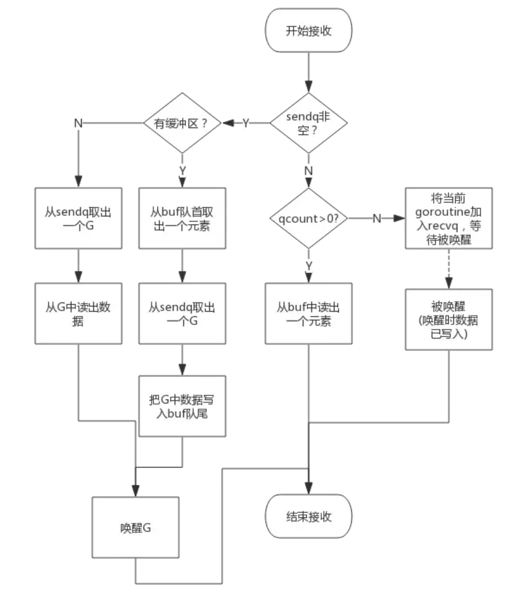
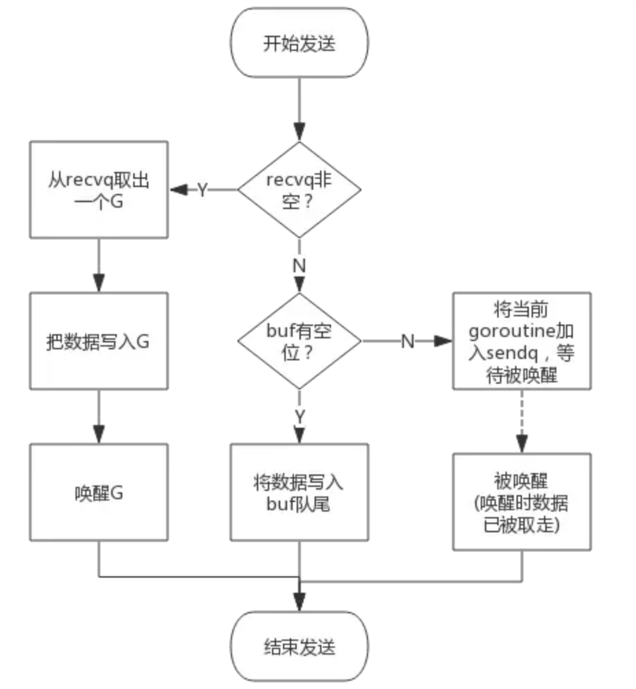

### 数据结构
```
type hchan struct {
    qcount   uint           //  队列中的元素总量
    dataqsiz uint           //  缓存大小
    buf      unsafe.Pointer //  缓存指针 （环线数组）
    elemsize uint16         //  数据项大小
    closed   uint32         //  close 关闭标记
    elemtype *_type         //  数据类型
    sendx    uint           //  待发送元素在缓存中的索引
    recvx    uint           //  待接收元素在缓存中的索引
    recvq    waitq          //  接收等待队列，用于阻塞接收协程
    sendq    waitq          //  发送等待队列，用于阻塞发送协程
    lock mutex // 互斥锁
}
```
从数据结构可以看出channel由队列、类型信息、goroutine等待队列组成，下面分别说明其原理。

#### 环形队列
chan内部实现了一个环形队列作为其缓冲区，队列的长度是创建chan时指定的。


- dataqsiz指示了队列长度为6，即可缓存6个元素；
- buf指向队列的内存，队列中还剩余两个元素；
- qcount表示队列中还有两个元素；
- sendx指示后续写入的数据存储的位置，取值[0, 6)；
- recvx指示从该位置读取数据, 取值[0, 6)；

#### 等待队列
- 从channel读数据，如果channel缓冲区为空或者没有缓冲区，当前goroutine会被阻塞。
- 向channel写数据，如果channel缓冲区已满或者没有缓冲区，当前goroutine会被阻塞。
     
被阻塞的goroutine将会挂在channel的等待队列中：
- 因读阻塞的goroutine会被向channel写入数据的goroutine唤醒；
- 因写阻塞的goroutine会被从channel读数据的goroutine唤醒；

#### 类型信息
一个channel只能传递一种类型的值，类型信息存储在hchan数据结构中。

- elemtype代表类型，用于数据传递过程中的赋值；
- elemsize代表类型大小，用于在buf中定位元素位置。

### chan 创建
创建channel的过程实际上是初始化hchan结构。其中类型信息和缓冲区长度由make语句传入，buf的大小则与元素大小和缓冲区长度共同决定。

```
func makechan(t *chantype, size int) *hchan {
    elem := t.elem

    // compiler checks this but be safe.
    // 数据项不能超过64kb
    if elem.size >= 1<<16 {
        throw("makechan: invalid channel element type")
    }
    if hchanSize%maxAlign != 0 || elem.align > maxAlign {
        throw("makechan: bad alignment")
    }

    // 缓冲槽大小检查
    if size < 0 || uintptr(size) > maxSliceCap(elem.size) || uintptr(size)*elem.size > maxAlloc-hchanSize {
        panic(plainError("makechan: size out of range"))
    }

    // Hchan does not contain pointers interesting for GC when elements stored in buf do not contain pointers.
    // buf points into the same allocation, elemtype is persistent.
    // SudoG's are referenced from their owning thread so they can't be collected.
    // TODO(dvyukov,rlh): Rethink when collector can move allocated objects.
    var c *hchan
    switch {
    case size == 0 || elem.size == 0: 
        // Queue or element size is zero.
        c = (*hchan)(mallocgc(hchanSize, nil, true))
        // Race detector uses this location for synchronization.
        // 缓存地址就指向自己
        c.buf = c.raceaddr()
    case elem.kind&kindNoPointers != 0: //指针
        // Elements do not contain pointers.
        // Allocate hchan and buf in one call.
        c = (*hchan)(mallocgc(hchanSize+uintptr(size)*elem.size, nil, true))
        // 跳过chan对象的大小就是缓冲首地址
        c.buf = add(unsafe.Pointer(c), hchanSize)
    default:
        // Elements contain pointers.
        // chan对象和缓存是两个内存
        c = new(hchan)
        c.buf = mallocgc(uintptr(size)*elem.size, elem, true)
    }

    c.elemsize = uint16(elem.size)
    c.elemtype = elem
    c.dataqsiz = uint(size)

    if debugChan {
        print("makechan: chan=", c, "; elemsize=", elem.size, "; elemalg=", elem.alg, "; dataqsiz=", size, "\n")
    }
    return c
}
```
### 从channel读数据,消息发送
```
func chansend1(c *hchan, elem unsafe.Pointer) {
    chansend(c, elem, true, getcallerpc())
}


func chansend(c *hchan, ep unsafe.Pointer, block bool, callerpc uintptr) bool {
    // 上面block传的true,所以下面只考虑true
    if c == nil {
        if !block {
            return false
        }

        // 当 chan 为 nil时, 阻塞
        gopark(nil, nil, waitReasonChanSendNilChan, traceEvGoStop, 2)
        throw("unreachable")
    }

    if debugChan {
        print("chansend: chan=", c, "\n")
    }

    if raceenabled {
        racereadpc(c.raceaddr(), callerpc, funcPC(chansend))
    }

    if !block && c.closed == 0 && ((c.dataqsiz == 0 && c.recvq.first == nil) ||
        (c.dataqsiz > 0 && c.qcount == c.dataqsiz)) {
        return false
    }

    var t0 int64
    if blockprofilerate > 0 {
        t0 = cputicks()
    }

    // 获取同步锁
    lock(&c.lock)

    // 当向已关闭的channel发送消息时会产生panic
    if c.closed != 0 {
        unlock(&c.lock)
        panic(plainError("send on closed channel"))
    }

    // CASE 1: 如果当有 G 在接受队列上等待时，直接将消息发送给 G
    if sg := c.recvq.dequeue(); sg != nil {
        // send中有个goready(gp, skip+1)可以唤醒 G
        send(c, sg, ep, func() { unlock(&c.lock) }, 3)
        return true
    }

    // CASE 2: 缓存队列未满，则将消息复制到缓存队列上
    if c.qcount < c.dataqsiz {
        // Space is available in the channel buffer. Enqueue the element to send.
        // 计算加入的地址
        qp := chanbuf(c, c.sendx)
        if raceenabled {
            raceacquire(qp)
            racerelease(qp)
        }
        // 复制到缓存中
        typedmemmove(c.elemtype, qp, ep)

        // 发送的index 加1
        c.sendx++
        // 注意这里被重置为0，所以是环线数组
        if c.sendx == c.dataqsiz {
            c.sendx = 0
        }

        // 缓存个数 + 1
        c.qcount++
        unlock(&c.lock)
        return true
    }

    if !block {
        unlock(&c.lock)
        return false
    }

    // CASE 3: 缓存队列已满， 将 G 加入到 send队列中
    // Block on the channel. Some receiver will complete our operation for us.
    // getg()获取的是当前的 g, 那么意味着将当前 goroutine 加入 send 队列并阻塞。
    gp := getg()
    mysg := acquireSudog()
    mysg.releasetime = 0
    if t0 != 0 {
        mysg.releasetime = -1
    }
    // No stack splits between assigning elem and enqueuing mysg
    // on gp.waiting where copystack can find it.
    mysg.elem = ep
    mysg.waitlink = nil
    mysg.g = gp
    mysg.isSelect = false
    mysg.c = c
    gp.waiting = mysg
    gp.param = nil

    // 加入send队列
    c.sendq.enqueue(mysg)
    // 阻塞
    goparkunlock(&c.lock, waitReasonChanSend, traceEvGoBlockSend, 3)

    // someone woke us up.
    // 被唤醒
    if mysg != gp.waiting {
        throw("G waiting list is corrupted")
    }
    gp.waiting = nil
    if gp.param == nil {
        if c.closed == 0 {
            throw("chansend: spurious wakeup")
        }
        // 当 G 被唤醒时， 已关闭的chan也是会报错的
        panic(plainError("send on closed channel"))
    }
    gp.param = nil
    if mysg.releasetime > 0 {
        blockevent(mysg.releasetime-t0, 2)
    }
    mysg.c = nil
    // 释放 G
    releaseSudog(mysg)
    return true
}

func send(c *hchan, sg *sudog, ep unsafe.Pointer, unlockf func(), skip int) {
    ....
    gp.param = unsafe.Pointer(sg) //注意这里的param不为空
    .....
    // 唤醒 G
    goready(gp, skip+1)
}
```
从一个channel读数据简单过程如下：

- 如果等待发送队列sendq不为空，且没有缓冲区，直接从sendq中取出G，把G中数据读出，最后把G唤醒，结束读取过程；
- 如果等待发送队列sendq不为空，此时说明缓冲区已满，从缓冲区中首部读出数据，把G中数据写入缓冲区尾部，把G唤醒，结束读取过程；
- 如果缓冲区中有数据，则从缓冲区取出数据，结束读取过程；
- 将当前goroutine加入recvq，进入睡眠，等待被写goroutine唤醒；



### 向channel中写数据，接收消息
```
func chanrecv1(c *hchan, elem unsafe.Pointer) {
    chanrecv(c, elem, true)
}


func chanrecv(c *hchan, ep unsafe.Pointer, block bool) (selected, received bool) {

    if debugChan {
        print("chanrecv: chan=", c, "\n")
    }

    // 因为上面 block传到true， 所以下面只考虑true的情况
    // 当初 为 nil 的chan中接收消息时，永久阻塞
    if c == nil {
        if !block {
            return
        }
        gopark(nil, nil, waitReasonChanReceiveNilChan, traceEvGoStop, 2)
        throw("unreachable")
    }

    if !block && (c.dataqsiz == 0 && c.sendq.first == nil ||
        c.dataqsiz > 0 && atomic.Loaduint(&c.qcount) == 0) &&
        atomic.Load(&c.closed) == 0 {
        return
    }

    var t0 int64
    if blockprofilerate > 0 {
        t0 = cputicks()
    }

    // 获取同步锁
    lock(&c.lock)

    // CASE 1: 向已经close且为空的chan中获取消息时，返回空值。这里的false可以判断是否close
    if c.closed != 0 && c.qcount == 0 {
        if raceenabled {
            raceacquire(c.raceaddr())
        }
        // 释放同步锁
        unlock(&c.lock)
        if ep != nil {
            typedmemclr(c.elemtype, ep)
        }
        return true, false
    }

    // CASE 2: send 队列不为空,什么时候send队列不为空呢？ 只有两种可能 1. 无缓存chan  2. 缓存队列已满
    if sg := c.sendq.dequeue(); sg != nil {
        // CASE 2.1: 无缓存chan, 直接从send中获取消息
        // CASE 2.2: 缓存队列已满, 从队列获取头元素,唤醒send 将其消息加入队列尾部（由于是环线队列，所以尾部和头部是同一位置）移动recvx
        // 同样在recv中有goready(gp, skip+1)可以唤醒G
        recv(c, sg, ep, func() { unlock(&c.lock) }, 3)
        return true, true
    }

    // CASE 3: 缓存队列不会空，直接从队列获取元素，移动头索引
    if c.qcount > 0 {
        // Receive directly from queue
        qp := chanbuf(c, c.recvx)
        if raceenabled {
            raceacquire(qp)
            racerelease(qp)
        }
        if ep != nil {
            typedmemmove(c.elemtype, ep, qp)
        }
        typedmemclr(c.elemtype, qp)
        c.recvx++
        if c.recvx == c.dataqsiz {
            c.recvx = 0
        }
        c.qcount--
        unlock(&c.lock)
        return true, true
    }

    if !block {
        unlock(&c.lock)
        return false, false
    }

    // CASE 4: 缓存队列为空， 将当前 G 加入接收队列中， 休眠
    // no sender available: block on this channel.
    gp := getg()
    mysg := acquireSudog()
    mysg.releasetime = 0
    if t0 != 0 {
        mysg.releasetime = -1
    }
    // No stack splits between assigning elem and enqueuing mysg
    // on gp.waiting where copystack can find it.
    mysg.elem = ep
    mysg.waitlink = nil
    gp.waiting = mysg
    mysg.g = gp
    mysg.isSelect = false
    mysg.c = c
    gp.param = nil

    // 将当前 G 加入 接收队列中
    c.recvq.enqueue(mysg)
    // 休眠
    goparkunlock(&c.lock, waitReasonChanReceive, traceEvGoBlockRecv, 3)

    // someone woke us up
    if mysg != gp.waiting {
        throw("G waiting list is corrupted")
    }
    gp.waiting = nil
    if mysg.releasetime > 0 {
        blockevent(mysg.releasetime-t0, 2)
    }
    // close唤醒时param为空，在send中唤醒时param不为空
    closed := gp.param == nil
    gp.param = nil
    mysg.c = nil
    releaseSudog(mysg)
    return true, !closed
}
```
向一个channel中写数据简单过程如下：

- 如果等待接收队列recvq不为空，说明缓冲区中没有数据或者没有缓冲区，此时直接从recvq取出G,并把数据写入，最后把该G唤醒，结束发送过程；
- 如果缓冲区中有空余位置，将数据写入缓冲区，结束发送过程；
- 如果缓冲区中没有空余位置，将待发送数据写入G，将当前G加入sendq，进入睡眠，等待被读goroutine唤醒；


### 关闭通道
```
func closechan(c *hchan) {

    // 关闭为nil的chan报错
    if c == nil {
        panic(plainError("close of nil channel"))
    }

    // 获取锁
    lock(&c.lock)
    // 重复关闭，报错
    if c.closed != 0 {
        unlock(&c.lock)
        panic(plainError("close of closed channel"))
    }

    if raceenabled {
        callerpc := getcallerpc()
        racewritepc(c.raceaddr(), callerpc, funcPC(closechan))
        racerelease(c.raceaddr())
    }

    c.closed = 1

    var glist *g

    // release all readers
    // 遍历接收队列
    for {
        sg := c.recvq.dequeue()
        if sg == nil {
            break
        }
        if sg.elem != nil {
            typedmemclr(c.elemtype, sg.elem)
            sg.elem = nil
        }
        if sg.releasetime != 0 {
            sg.releasetime = cputicks()
        }
        gp := sg.g
        //对比send()，这里的param是nil。在接收方法中根据param是否为空判断是否为close
        gp.param = nil  
        if raceenabled {
            raceacquireg(gp, c.raceaddr())
        }
        gp.schedlink.set(glist)
        glist = gp
    }

    // release all writers (they will panic)
    // 遍历发送队列
    for {
        sg := c.sendq.dequeue()
        if sg == nil {
            break
        }
        sg.elem = nil
        if sg.releasetime != 0 {
            sg.releasetime = cputicks()
        }
        gp := sg.g
        gp.param = nil
        if raceenabled {
            raceacquireg(gp, c.raceaddr())
        }
        gp.schedlink.set(glist)
        glist = gp
    }
    unlock(&c.lock)

    // Ready all Gs now that we've dropped the channel lock.
    for glist != nil {
        gp := glist
        glist = glist.schedlink.ptr()
        gp.schedlink = 0
        goready(gp, 3)  // 这里会将接收队列和发送队列全部唤醒
    }
}
```
关闭channel时会把recvq中的G全部唤醒，本该写入G的数据位置为nil。把sendq中的G全部唤醒，但这些G会panic。

通过上面的chansend、chanrecv、closechan发现里面都加了锁，所以chan是线程安全的