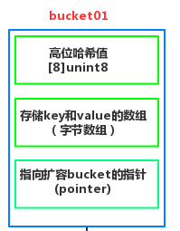
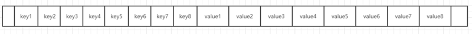
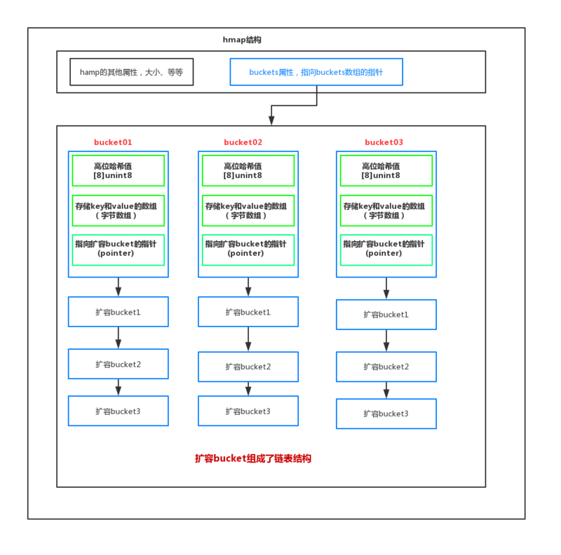

### golang map的底层实现
粗略的讲，Go语言中map采用的是哈希查找表，由一个key通过哈希函数得到哈希值，64位系统中就生成一个64bit的哈希值，由这个哈希值将key对应到不同的桶（bucket）中，当有多个哈希映射到相同的的桶中时，使用链表解决哈希冲突。

### hash函数
首先要知道的就是map中哈希函数的作用，go中map使用hash作查找，就是将key作哈希运算，得到一个哈希值，根据哈希值确定key-value落在哪个bucket的哪个cell。golang使用的hash算法和CPU有关，如果cpu支持aes，那么使用aes hash，否则使用memhash。

### 数据结构
hmap
```
// go map的一个header结构
type hmap struct {
    // map 中的元素个数，必须放在 struct 的第一个位置，因为 内置的 len 函数会从这里读取
    count     int 
    // map状态标识，比如是否在被写或者迁移等，因为map不是线程安全的所以操作时需要判断flags
    flags     uint8
    // log_2 of buckets (最多可以放 loadFactor * 2^B 个元素即6.5*2^B，再多就要 hashGrow 了)
    B         uint8  
    // overflow 的 bucket 的近似数
    noverflow uint16 
    // hash seed，随机哈希种子可以防止哈希碰撞攻击
    hash0     uint32
   
    // 存储数据的buckets数组的指针， 大小2^B，如果 count == 0 的话，可能是 nil
    buckets    unsafe.Pointer
    // 一半大小的之前的 bucket 数组，只有在 growing 过程中是非 nil
    oldbuckets unsafe.Pointer
    // 扩容进度标志，小于此地址的buckets已迁移完成。
    nevacuate  uintptr

    // 可以减少GC扫描，当 key 和 value 都可以 inline 的时候，就会用这个字段
    extra *mapextra // optional fields
}
```
bmap可以理解为buckets of map的缩写，它就是map中bucket的本体，即存key和value数据的“桶”。
```
type bmap struct {
    // tophash 是 hash 值的高 8 位
    tophash [bucketCnt]uint8
    // 以下字段没有显示定义在bmap，但是编译时编译器会自动添加
    // 为了优化对齐，go采用了key放在一起，value放在一起的存储方式，
    // keys              // 每个桶最多可以装8个key
    // values            // 8个key分别有8个value一一对应
    // overflow pointer  // 发生哈希碰撞之后创建的overflow bucket
}
```
bucket（桶），每一个bucket最多放8个key和value，最后由一个overflow字段指向下一个bmap，注意key、value、overflow字段都不显示定义，而是通过maptype计算偏移获取的。



**bucket这三部分内容决定了它是怎么工作的**：
- 它的tophash 存储的是哈希函数算出的哈希值的高八位。是用来加快索引的。因为把高八位存储起来，这样不用完整比较key就能过滤掉不符合的key，加快查询速度当一个哈希值的高8位和存储的高8位相符合，再去比较完整的key值，进而取出value。
- 第二部分，存储的是key 和value，就是我们传入的key和value，注意，它的底层排列方式是，key全部放在一起，value全部放在一起。当key大于128字节时，bucket的key字段存储的会是指针，指向key的实际内容；value也是一样。这样排列好处是在key和value的长度不同的时候，可以消除padding带来的空间浪费。并且每个bucket最多存放8个键值对。
- 第三部分，存储的是当bucket溢出时，指向的下一个bucket的指针



### bucket的设计细节：
在golang map中出现冲突时，不是每一个key都申请一个结构通过链表串起来，而是以bmap为最小粒度挂载，一个bmap可以放8个key和value。这样减少对象数量，减轻管理内存的负担，利于gc。

如果插入时，bmap中key超过8，那么就会申请一个新的bmap（overflow bucket）挂在这个bmap的后面形成链表，优先用预分配的overflow bucket，如果预分配的用完了，那么就malloc一个挂上去。注意golang的map不会shrink，内存只会越用越多，overflow bucket中的key全删了也不会释放

### hmap和bmap的结构图


如图所示：
- hmap存储了一个指向底层bucket数组的指针。
- 我们存入的key和value是存储在bucket里面中，如果key和value大于128字节，那么bucket里面存储的是指向我们key和value的指针，如果不是则存储的是值。
- 每个bucket 存储8个key和value，如果超过就重新创建一个bucket挂在在元bucket上，持续挂接形成链表。
- 高位哈希值：是用来确定当前的bucket（桶）有没有所存储的数据的。
- 低位哈希值：是用来确定，当前的数据存在了哪个bucket（桶）

工作流程：

查找或者操作map时，首先key经过hash函数生成hash值，通过哈希值的低8位来判断当前数据属于哪个桶(bucket)，找到bucket以后，通过哈希值的高八位与bucket存储的高位哈希值循环比对，如果相同就比较刚才找到的底层数组的key值，如果key相同，取出value。如果高八位hash值在此bucket没有，或者有，但是key不相同，就去链表中下一个溢出bucket中查找，直到查找到链表的末尾。

碰撞冲突：如果不同的key定位到了统一bucket或者生成了同一hash,就产生冲突。 go是通过链表法来解决冲突的。比如一个高八位的hash值和已经存入的hash值相同，并且此bucket存的8个键值对已经满了，或者后面已经挂了好几个bucket了。那么这时候要存这个值就先比对key,key肯定不相同啊，那就从此位置一直沿着链表往后找，找到一个空位置，存入它。所以这种情况，两个相同的hash值高8位是存在不同bucket中的。

go语言的map通过数组+链表的方式实现了hash表，同时分散各个桶，使用链表法+bucket内部的寻址法解决了碰撞冲突，也提高了效率。因为即使链表很长了，go会根据装载因子，去扩容整个bucket数组，所以下面就要看下扩容。

### map扩容
- 当链表越来越长，其实是bmap扩容的加载因子达到6.5，bmap就会进行扩容，将原来bucket数组数量扩充一倍，产生一个新的bucket数组，也就是bmap的buckets属性指向的数组。这样bmap中的oldbuckets属性指向的就是旧bucket数组。
- 这里的加载因子LoadFactor是一个阈值，计算方式为（元素个数/桶个数 ）如果超过6.5，将会进行扩容，这个是经过测试才得出的合理的一个阈值。因为，加载因子越小，空间利用率就小，加载因子越大，产生冲突的几率就大。所以6.5是一个平衡的值。
- map的扩容不会立马全部复制，而是渐进式扩容，即首先开辟2倍的内存空间，创建一个新的bucket数组。只有当访问old bucket数组时，才会调用growWork()方法将old bucket中的元素拷贝到新的bucket数组，进行渐进式的扩容。当然旧的数据不会删除，而是去掉引用，等待gc回收

**问题:如果需要进行扩容的时候，上一次扩容后的迁移还没结束，怎么办？**

在代码中我们可以看到很多”again”标记，会不断进行迁移，直到迁移完成后才会进行下一次扩容。

### map查找
- 根据key计算出哈希值
- 根据哈希值低位确定所在bucket
- 根据哈希值高8位确定在bucket中的存储位置
- 当前bucket未找到则查找对应的overflow bucket。
- 对应位置有数据则对比完整的哈希值，确定是否是要查找的数据
- 如果当前处于map进行了扩容，处于数据搬移状态，则优先从oldbuckets查找。

### map插入
- 根据key计算出哈希值
- 根据哈希值低位确定所在bucket
- 根据哈希值高8位确定在bucket中的存储位置
- 查找该key是否存在，已存在则更新，不存在则插入

### map删除
```
// 简单摘了几行
func mapdelete(t *maptype, h *hmap, key unsafe.Pointer) {
	for ; b != nil; b = b.overflow(t) {
		for i := uintptr(0); i < bucketCnt; i++ {
			b.tophash[i] = empty
			h.count--
		}
	}
}
```
外层的循环就是在遍历整个bucket，删除的核心就把对应的tophash设置为empty，而不是直接删除了内存里面的数据。

### 使用中常见的问题
Q：删除掉map中的元素是否会释放内存？

A：不会，删除操作仅仅将对应的tophash[i]设置为empty，并非释放内存。若要释放内存只能等待指针无引用后被系统gc

Q:如何并发地使用map？

A：map不是goroutine安全的，所以在有多个gorountine对map进行写操作是会panic。多gorountine读写map是应加锁（RWMutex），或使用sync.Map。