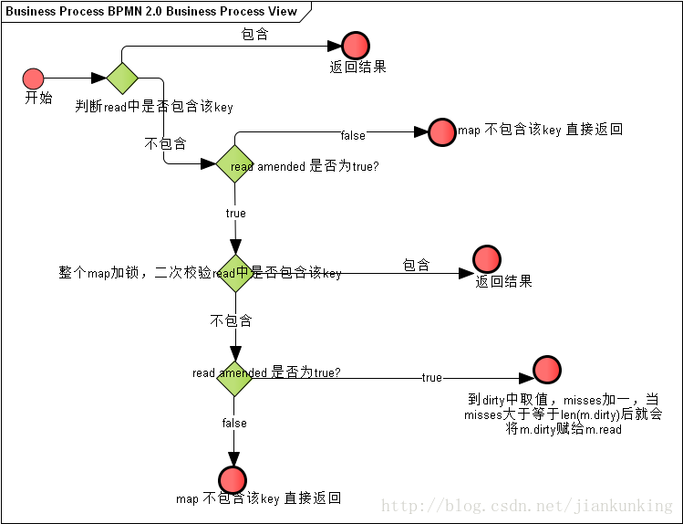
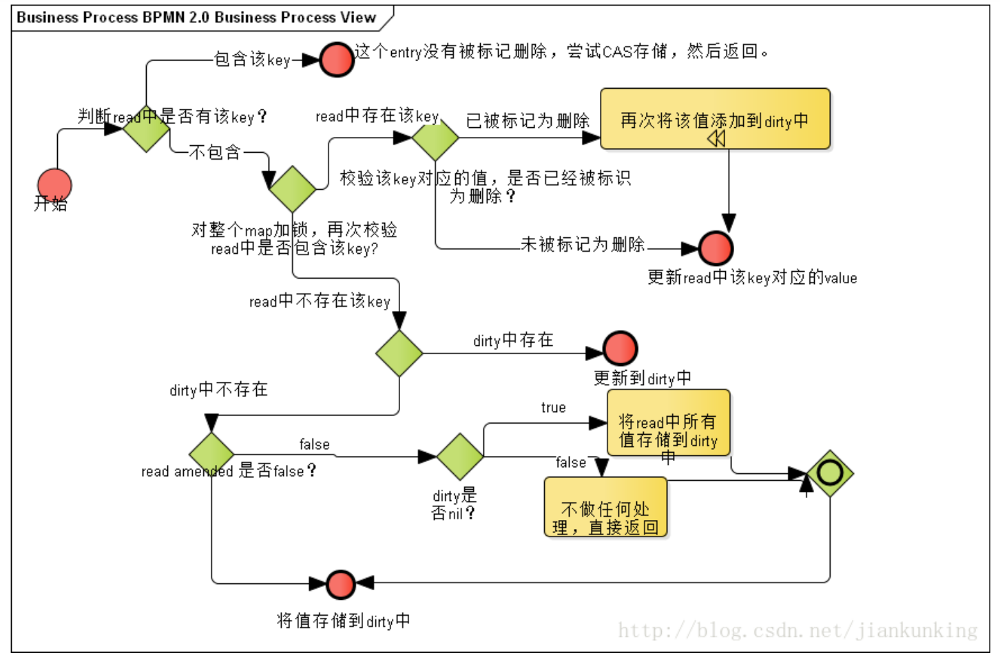
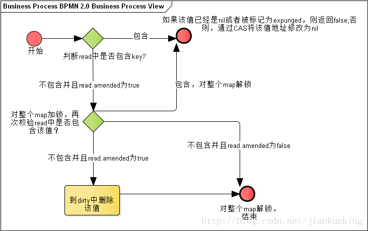

### struct
```
type Map struct {
    mu Mutex    //互斥锁，用于锁定dirty map

    read atomic.Value //优先读map,支持原子操作，注释中有readOnly不是说read是只读，而是它的结构体。read实际上有写的操作

    dirty map[interface{}]*entry // dirty是一个当前最新的map，允许读写

    misses int // 主要记录read读取不到数据加锁读取read map以及dirty map的次数，当misses等于dirty的长度时，会将dirty复制到read
}
```
### readOnly
readOnly 主要用于存储，通过原子操作存储在Map.read中元素。
```
type readOnly struct {
    m       map[interface{}]*entry
    amended bool // 如果数据在dirty中但没有在read中，该值为true,作为修改标识
}
```

### entry
```
type entry struct {
    // nil: 表示为被删除，调用Delete()可以将read map中的元素置为nil
    // expunged: 也是表示被删除，但是该键只在read而没有在dirty中，这种情况出现在将read复制到dirty中，即复制的过程会先将nil标记为expunged，然后不将其复制到dirty
    //  其他: 表示存着真正的数据
    p unsafe.Pointer // *interface{}
}
```

### 原理
如果你接触过大Java，那你一定对ConcurrentHashMap利用锁分段技术(ConcurrentHashMap是由Segment(可重入锁ReentrantLock)数组结构和HashEntry数组)增加了锁的数目，从而使争夺同一把锁的线程的数目得到控制的原理记忆深刻。

那么Golang的sync.Map是否也是使用了相同的原理呢？sync.Map的原理很简单，使用了空间换时间策略，通过冗余的两个数据结构(read、dirty),实现加锁对性能的影响。

通过引入两个map将读写分离到不同的map，其中read map提供并发读和已存元素原子写，而dirty map则负责读写。 这样read map就可以在不加锁的情况下进行并发读取,当read map中没有读取到值时,再加锁进行后续读取,并累加未命中数,当未命中数大于等于dirty map长度,将dirty map上升为read map。从之前的结构体的定义可以发现，虽然引入了两个map，但是底层数据存储的是指针，指向的是同一份值。

### sync.Map设计点
1. 空间换时间。通过冗余的两个数据结构(read、dirty),实现加锁对性能的影响。
2. 使用只读数据(read)，避免读写冲突。
3. 动态调整，miss次数多了之后，将dirty数据提升为read。
4. double-checking（双重检测）。
5. 延迟删除。 删除一个键值只是打标记，只有在提升dirty的时候才清理删除的数据。
6. 优先从read读取、更新、删除，因为对read的读取不需要锁。
7. 虽然read和dirty有冗余数据，但这些数据是通过指针指向同一个数据，所以尽管Map的value会很大，但是冗余的空间占用还是有限的。
### 重点方法
#### 查找

Load返回存储在映射中的键值，如果没有值，则返回nil。ok结果指示是否在映射中找到值。
```
func (m *Map) Load(key interface{}) (value interface{}, ok bool) {
    // 第一次检测元素是否存在
    read, _ := m.read.Load().(readOnly)
    e, ok := read.m[key]
    if !ok && read.amended {
        // 为dirty map 加锁
        m.mu.Lock()
        // 第二次检测元素是否存在，主要防止在加锁的过程中,dirty map转换成read map,从而导致读取不到数据
        read, _ = m.read.Load().(readOnly)
        e, ok = read.m[key]
        if !ok && read.amended {
            // 从dirty map中获取是为了应对read map中不存在的新元素
            e, ok = m.dirty[key]
            // 不论元素是否存在，均需要记录miss数，以便dirty map升级为read map
            m.missLocked()
        }
        // 解锁
        m.mu.Unlock()
    }
    // 元素不存在直接返回
    if !ok {
        return nil, false
    }
    return e.load()
}
```
dirty map升级为read map
```
func (m *Map) missLocked() {
    // misses自增1
    m.misses++
    // 判断dirty map是否可以升级为read map
    if m.misses < len(m.dirty) {
        return
    }
    // dirty map升级为read map
    m.read.Store(readOnly{m: m.dirty})
    // dirty map 清空
    m.dirty = nil
    // misses重置为0
    m.misses = 0
}
```
元素取值
```
func (e *entry) load() (value interface{}, ok bool) {
    p := atomic.LoadPointer(&e.p)
    // 元素不存在或者被删除，则直接返回
    if p == nil || p == expunged {
        return nil, false
    }
    return *(*interface{})(p), true
}
```
read map主要用于读取，每次Load都先从read读取，当read中不存在且amended为true，就从dirty读取数据 。无论dirty map中是否存在该元素，都会执行missLocked函数，该函数将misses+1，当m.misses >= len(m.dirty)时，便会将dirty复制到read，此时再将dirty置为nil,misses=0。



#### 插入or更新
```
func (m *Map) Store(key, value interface{}) {
    // 如果read存在这个键，并且这个entry没有被标记删除，尝试直接写入,写入成功，则结束
    // 第一次检测
    read, _ := m.read.Load().(readOnly)
    if e, ok := read.m[key]; ok && e.tryStore(&value) {
        return
    }
    // dirty map锁
    m.mu.Lock()
    // 第二次检测
    read, _ = m.read.Load().(readOnly)
    if e, ok := read.m[key]; ok {
        // unexpungelocc确保元素没有被标记为删除
        // 判断元素被标识为删除
        if e.unexpungeLocked() {
            // 这个元素之前被删除了，这意味着有一个非nil的dirty，这个元素不在里面.
            m.dirty[key] = e
        }
        // 更新read map 元素值
        e.storeLocked(&value)
    } else if e, ok := m.dirty[key]; ok {
        // 此时read map没有该元素，但是dirty map有该元素，并需修改dirty map元素值为最新值
        e.storeLocked(&value)
    } else {
        // read.amended==false,说明dirty map为空，需要将read map 复制一份到dirty map
        if !read.amended {
            m.dirtyLocked()
            // 设置read.amended==true，说明dirty map有数据
            m.read.Store(readOnly{m: read.m, amended: true})
        }
        // 设置元素进入dirty map，此时dirty map拥有read map和最新设置的元素
        m.dirty[key] = newEntry(value)
    }
    // 解锁，有人认为锁的范围有点大，假设read map数据很大，那么执行m.dirtyLocked()会耗费花时间较多，完全可以在操作dirty map时才加锁，这样的想法是不对的，因为m.dirtyLocked()中有写入操作
    m.mu.Unlock()
}
func (e *entry) tryStore(i *interface{}) bool {
    // 获取对应Key的元素，判断是否标识为删除
    p := atomic.LoadPointer(&e.p)
    if p == expunged {
        return false
    }
    for {
        // cas尝试写入新元素值
        if atomic.CompareAndSwapPointer(&e.p, p, unsafe.Pointer(i)) {
            return true
        }
        // 判断是否标识为删除
        p = atomic.LoadPointer(&e.p)
        if p == expunged {
            return false
        }
    }
}
```
unexpungelocked确保元素没有被标记为删除。如果这个元素之前被删除了，它必须在未解锁前被添加到dirty map上。
```
func (e *entry) unexpungeLocked() (wasExpunged bool) {
    return atomic.CompareAndSwapPointer(&e.p, expunged, nil)
}
```

从read map复制到dirty map。
```
func (m *Map) dirtyLocked() {
    if m.dirty != nil {
        return
    }

    read, _ := m.read.Load().(readOnly)
    m.dirty = make(map[interface{}]*entry, len(read.m))
    for k, e := range read.m {
        // 如果标记为nil或者expunged，则不复制到dirty map
        if !e.tryExpungeLocked() {
            m.dirty[k] = e
        }
    }
}
```


#### Delete

删除元素,采用延迟删除，当read map存在元素时，将元素置为nil，只有在提升dirty的时候才清理删除的数,延迟删除可以避免后续获取删除的元素时候需要加锁。当read map不存在元素时，直接删除dirty map中的元素
```
func (m *Map) Delete(key interface{}) {
    // 第一次检测
    read, _ := m.read.Load().(readOnly)
    e, ok := read.m[key]
    if !ok && read.amended {
        m.mu.Lock()
        // 第二次检测
        read, _ = m.read.Load().(readOnly)
        e, ok = read.m[key]
        if !ok && read.amended {
            // 不论dirty map是否存在该元素，都会执行删除
            delete(m.dirty, key)
        }
        m.mu.Unlock()
    }
    if ok {
        // 如果在read中，则将其标记为删除（nil）
        e.delete()
    }
}
```


Range

遍历获取sync.Map中所有的元素，使用的为快照方式，所以不一定是准确的
```
func (m *Map) Range(f func(key, value interface{}) bool) {
    // 第一检测
    read, _ := m.read.Load().(readOnly)
    // read.amended=true,说明dirty map包含所有有效的元素（含新加，不含被删除的），使用dirty map
    if read.amended {
        // 第二检测
        m.mu.Lock()
        read, _ = m.read.Load().(readOnly)
        if read.amended {
            // 使用dirty map并且升级为read map
            read = readOnly{m: m.dirty}
            m.read.Store(read)
            m.dirty = nil
            m.misses = 0
        }
        m.mu.Unlock()
    }
    // 一贯原则，使用read map作为读
    for k, e := range read.m {
        v, ok := e.load()
        // 被删除的不计入
        if !ok {
            continue
        }
        // 函数返回false，终止
        if !f(k, v) {
            break
        }
    }
}
```

### 总结
经过了上面的分析可以得到,sync.Map并不适合同时存在大量读写的场景,大量的写会导致read map读取不到数据从而加锁进行进一步读取,同时dirty map不断升级为read map。 从而导致整体性能较低,特别是针对cache场景.针对append-only以及大量读,少量写场景使用sync.Map则相对比较合适。

sync.Map没有提供获取元素个数的Len()方法，不过可以通过Range()实现。