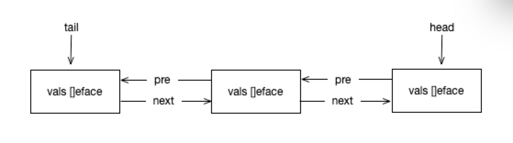

### 前言
sync.pool对象池是个好东西，避免对象的反复创建和回收。对于一些需要频繁创建的对象我们可以使用它来避免内存的频繁申请、回收。但应避免用于连接池，因为sync.pool存储的对象仅存活在三次STW之间

### 数据结构
```
//sync.pool.go
type Pool struct {
    noCopy noCopy  // 不可复制标准

    local     unsafe.Pointer // 指向poolLocal数组
    localSize uintptr        // poolLocal数组长度

    victim     unsafe.Pointer // 指向poolLocal数组
    victimSize uintptr        // poolLocal数组长度

    New func() interface{}  // 自定义的对象创建方法
}
```
local和victim都指向poolLocal数组，它们的区别是什么呢? pool里面有两个poolLocal数组，当经历一次STW后victim置零，将local赋值给victim，local置零。获取对象(Get方法)的顺序 local --> victim --> New。那poolLocal数组有多少个呢？一个P对应一个poolLocal，pid作为下标。

```
//sync.pool.go

type poolLocal struct {
    poolLocalInternal

    // Prevents false sharing on widespread platforms with
    // 128 mod (cache line size) = 0 .
    pad [128 - unsafe.Sizeof(poolLocalInternal{})%128]byte // 没发现用在什么地方
}

type poolLocalInternal struct {
    private interface{} // 当前P私有的
    shared  poolChain   // 公共的，当前P可以在头部压入和弹出，其他P可以再尾部弹出
}
```
poolLocal 就可以当成poolLocalInternal。有一个私有变量存储单个对象，和一个所有P都可以访问的公共对象数组
```
//sync.poolqueue.go
type poolChain struct {

    // 生产者(当前P)所有。压入和弹出。只有一个P对他操作，不存在竞争，不需要同步
    head *poolChainElt

    // 消费者（所有P）所有。弹出。多个P存在竞争，需要原子操作
    tail *poolChainElt
}

type poolChainElt struct {
    poolDequeue

    next, prev *poolChainElt // 双向链表
}

// 循环队列
type poolDequeue struct {
    
    headTail uint64 // 通过它计算数组的头和尾,head高32位，tal低32位

    vals []eface  // 对象数组
}
```


### 全局变量
```
//sync.pool.go
var (
    allPoolsMu Mutex // 全局锁

    allPools []*Pool // 存储所有的pool

    oldPools []*Pool 
)
```

这里的allPools和oldPools都存储的Pool集合，那他们有什么区别呢？allPools存储的是未经历STW的Pool,使用的是pool的local字段；allPools经历STW之后将local变成victim,allPools变成oldPools。这两个变量不参与存取过程，仅在STW的时候使用。

Put 存
```
//sync.pool.go
func (p *Pool) Put(x interface{}) {
    if x == nil {  // 空对象不让存
        return
    }
    
    ....

    l, _ := p.pin()  // 返回poolLocal
    
    // 先往private中放
    if l.private == nil {
        l.private = x
        x = nil
    }
    
    // x != nil 说明往private中放失败
    if x != nil {
        l.shared.pushHead(x)
    }
    runtime_procUnpin()
    ....
}
```

通过pin()获取poolLocal。如果private为空则放置在private中，否则放置在公共的区域。在后面会分析pushHead()。

pin
```

func (p *Pool) pin() (*poolLocal, int) {
    pid := runtime_procPin()  // 该方法的作用是该P禁止抢占，意味着当前P一直执行当前G
    s := atomic.LoadUintptr(&p.localSize) // poolLocal长度
    l := p.local                          // poolLocal首地址
    if uintptr(pid) < s {   // pid作为poolLocal数组下标，所以必须小于数组长度
        return indexLocal(l, pid), pid
    }
    return p.pinSlow() //获取其它P的poolLocal或生成poolLocal
}

// 根据首地址 和 下标计算对应的poolLocal的地址
func indexLocal(l unsafe.Pointer, i int) *poolLocal {
    lp := unsafe.Pointer(uintptr(l) + uintptr(i)*unsafe.Sizeof(poolLocal{}))
    return (*poolLocal)(lp)
}
```
获取当前P的poolLocal, 当然这里的P可能是两个不同的P,因为中间过程存在调度，执行该G的P可能变化。

pinSlow
```
func (p *Pool) pinSlow() (*poolLocal, int) {

    // 在上面pin中执行了runtime_procPin,所以需要Unpin
    runtime_procUnpin()
    // 可能需要创建poolLocal,添加到allPools,所以需要加锁
    allPoolsMu.Lock()
    defer allPoolsMu.Unlock()
    pid := runtime_procPin() // 再次禁止抢占
    // poolCleanup won't be called while we are pinned.
    s := p.localSize
    l := p.local
    // 在上面的pin中已经判断了uintptr(pid) < s，为什么还需要再次判断呢?
    // 因为上面执行了Unpin以及lock,所以此时的P可能已经不是之前的P了
    if uintptr(pid) < s { 
        return indexLocal(l, pid), pid
    }
    if p.local == nil {
        allPools = append(allPools, p) //加入到allPools中
    }
    // If GOMAXPROCS changes between GCs, we re-allocate the array and lose the old one.
    size := runtime.GOMAXPROCS(0)
    local := make([]poolLocal, size) // 从这里可以看出poolLocal的个数就是P的个数
    // 使用了新的poolLocal数组，指明首地址和长度
    atomic.StorePointer(&p.local, unsafe.Pointer(&local[0])) // store-release
    atomic.StoreUintptr(&p.localSize, uintptr(size))         // store-release
    return &local[pid], pid
}
```
- 一个P对应一个poolLocal，pid作为poolLocal下标;
- 获取poolLocal的时候，会根据下标pid获取对应的poolLocal。但这不是总是成功的，当修改了GOMAXPROCS导致P的个数大于poolLocal的个数时候会重建poolLocal数组。


Get 获取
```

func (p *Pool) Get() interface{} {

  ...
  
  l, pid := p.pin() // 通过pin获取当前G的P的poolLocal
  x := l.private  // 首先寻找的是private
  l.private = nil
  if x == nil {  // private 不存在
      x, _ = l.shared.popHead()  // 在当前P的公共部分获取
      if x == nil {  // 如果在当前P获取失败，则从其他P中偷一个
          x = p.getSlow(pid)
      }
  }
  runtime_procUnpin()
  ...
  if x == nil && p.New != nil {  // 如果在所有pooLocal和victim都没有获取到，就只有执行自定义的New()了
      x = p.New()
  }
  return x
}
```
流程： 当前P的private --> 当前P的shared --> 其他P的shared --> New

getSlow
```

func (p *Pool) getSlow(pid int) interface{} {
   // See the comment in pin regarding ordering of the loads.
   size := atomic.LoadUintptr(&p.localSize) // load-acquire
   locals := p.local                        // load-consume
   // 遍历所有P的公共区
   for i := 0; i < int(size); i++ {
       l := indexLocal(locals, (pid+i+1)%int(size))
       if x, _ := l.shared.popTail(); x != nil {
           return x
       }
   }


// 如果遍历了全部poolLocal还是没获取到，那就从victim中获取。victim又是什么呢？
// victim就是上一轮STW的poolLocal。查找流程和poolLocal一样，先找pid对应的，再找全部的。
   size = atomic.LoadUintptr(&p.victimSize)
   if uintptr(pid) >= size {
       return nil
   }
   locals = p.victim
   l := indexLocal(locals, pid)
   if x := l.private; x != nil {
       l.private = nil
       return x
   }
   for i := 0; i < int(size); i++ {
       l := indexLocal(locals, (pid+i)%int(size))
       if x, _ := l.shared.popTail(); x != nil {
           return x
       }
   }

   // 如果在victim中没获取到，则将其长度设为0，免得下次在其中查找
   atomic.StoreUintptr(&p.victimSize, 0)

   return nil
}
```
getSlow就是"偷"，当然只能在公共区偷。先遍历poolLocal,再遍历victim。

### 接下看看如何在poolChain中存取

pushHead
```

   func (c *poolChain) pushHead(val interface{}) {
       d := c.head
       
       // 如果head不存在就初始化一个
       if d == nil {
           // Initialize the chain.
           const initSize = 8 // Must be a power of 2
           d = new(poolChainElt)
           d.vals = make([]eface, initSize)
           c.head = d
           storePoolChainElt(&c.tail, d) // head不存在也就意味着tail也不存在
       }
   
       // 压入dequeue中
       if d.pushHead(val) {
           return
       }
       
   
       // 到了这一步说明上面pushHead失败了，说head对应的dequeue满了，需要添加一个dequeue
       newSize := len(d.vals) * 2  // 当前head的2倍
       if newSize >= dequeueLimit {
           // Can't make it any bigger.
           newSize = dequeueLimit
       }
   
       d2 := &poolChainElt{prev: d}
       d2.vals = make([]eface, newSize)
       c.head = d2
       storePoolChainElt(&d.next, d2)
       d2.pushHead(val)
   }
```
```
func (d *poolDequeue) pushHead(val interface{}) bool {
       ptrs := atomic.LoadUint64(&d.headTail)
       head, tail := d.unpack(ptrs)
       
       // 如果首尾刚好相差一个queue长度，说明一个queue满了
       if (tail+uint32(len(d.vals)))&(1<<dequeueBits-1) == head {
           // Queue is full.
           return false
       }
       slot := &d.vals[head&uint32(len(d.vals)-1)]
   
       // Check if the head slot has been released by popTail.
       typ := atomic.LoadPointer(&slot.typ)
       if typ != nil { // 为什么要判断nil,因为在popTail中是先设置headTail，再将typ置零
           // Another goroutine is still cleaning up the tail, so
           // the queue is actually still full.
           return false
       }
   
       // The head slot is free, so we own it.
       if val == nil {
           val = dequeueNil(nil)
       }
       *(*interface{})(unsafe.Pointer(slot)) = val
   
       // Increment head. This passes ownership of slot to popTail
       // and acts as a store barrier for writing the slot.
       atomic.AddUint64(&d.headTail, 1<<dequeueBits)
       return true
   }
```
存的流程：

- private 可用就存在private中
- 往shared的queue的head中存，如果queue为空，则新建一个queue
- 如果queue满了，就添加一个2倍的queue节点

popHead
```

func (d *poolDequeue) popHead() (interface{}, bool) {
       var slot *eface
       for {
           ptrs := atomic.LoadUint64(&d.headTail)
           head, tail := d.unpack(ptrs)
           if tail == head {
               // Queue is empty.
               return nil, false
           }
   
           // Confirm tail and decrement head. We do this before
           // reading the value to take back ownership of this
           // slot.
           head--
           ptrs2 := d.pack(head, tail)
           if atomic.CompareAndSwapUint64(&d.headTail, ptrs, ptrs2) {
               // We successfully took back slot.
               slot = &d.vals[head&uint32(len(d.vals)-1)]
               break
           }
       }
   
       val := *(*interface{})(unsafe.Pointer(slot))
       if val == dequeueNil(nil) {
           val = nil
       }
       // Zero the slot. Unlike popTail, this isn't racing with
       // pushHead, so we don't need to be careful here.
       *slot = eface{}
       return val, true
}
```
这个逻辑比较简单，就是head 减 1

popTail
```
func (d *poolDequeue) popTail() (interface{}, bool) {
    var slot *eface
    for {
        ptrs := atomic.LoadUint64(&d.headTail)
        head, tail := d.unpack(ptrs)
        if tail == head {
            // Queue is empty.
            return nil, false
        }

        // Confirm head and tail (for our speculative check
        // above) and increment tail. If this succeeds, then
        // we own the slot at tail.
        ptrs2 := d.pack(head, tail+1)
        if atomic.CompareAndSwapUint64(&d.headTail, ptrs, ptrs2) {
            // Success.
            slot = &d.vals[tail&uint32(len(d.vals)-1)]
            break
        }
    }

    // We now own slot.
    val := *(*interface{})(unsafe.Pointer(slot))
    if val == dequeueNil(nil) {
        val = nil
    }

    // Tell pushHead that we're done with this slot. Zeroing the
    // slot is also important so we don't leave behind references
    // that could keep this object live longer than necessary.
    //
    // We write to val first and then publish that we're done with
    // this slot by atomically writing to typ.
    // 这里为什么不 *slot = eface{}呢？
    slot.val = nil
    atomic.StorePointer(&slot.typ, nil)
    // At this point pushHead owns the slot.

    return val, true
}
```
tail先加1，取值，置零

poolCleanup STW清除
```

func poolCleanup() {

    
    // victim清空
    for _, p := range oldPools {
        p.victim = nil
        p.victimSize = 0
    }

    // poolLocal移到victim，并清空
    for _, p := range allPools {
        p.victim = p.local
        p.victimSize = p.localSize
        p.local = nil
        p.localSize = 0
    }

    // allPools 变成 oldPools
    oldPools, allPools = allPools, nil
}
```
