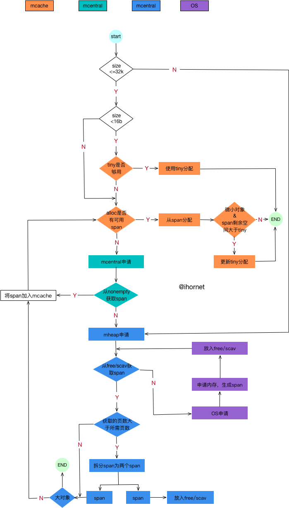

### 前言

golang按内存大小采用不同的策略:
- 微小对象（size< 16byte）
- 小对象 （16byte <= size <=32k ）
- 大对象 （size > 32k）

### 数据结构

- mspan

一段连续内存页， 对象（object）内存分配直接使用它的空间
```
// runtime/mheap.go
type mspan struct {
    // 双向链表
    next *mspan     // next span in list, or nil if none
    prev *mspan     // previous span in list, or nil if none

    startAddr uintptr // 起始地址
    npages    uintptr // 这个span包含了多少个页

    manualFreeList gclinkptr // list of free objects in mSpanManual spans

    freeindex uintptr // 对象索引，用查找空闲对象
    nelems uintptr  // 这个span可以分配多少个对象（object）


    allocBits  *gcBits // 一串二进制，和object对应。0：已使用，1：空闲
    
    // 因为如果mspan包含的object很多时（也就是nelems很大时），allocBits会变得很长，在查找空闲object会变慢。
    // 所以用allocCache作为allocBits的二级缓存
    allocCache uint64 
}
```
- mcache

每个M（GMP模型）都会有一个私有的cache。在分配微小对象和小对象时，会先从cache中查找是否有可用空间
```
// runtime/mcache.go
type mcache struct {

    tiny             uintptr  // 微小对象分配器
    tinyoffset       uintptr  // tiny已使用空间的偏移量
    local_tinyallocs uintptr  // tiny分配了对少个微小对象

    alloc [numSpanClasses]*mspan // mspan集合， numSpanClasses = 67 *2

    // Local allocator stats, flushed during GC.
    local_largefree  uintptr                  // bytes freed for large objects (>maxsmallsize)
    local_nlargefree uintptr                  // number of frees for large objects (>maxsmallsize)
    local_nsmallfree [_NumSizeClasses]uintptr // number of frees for small objects (<=maxsmallsize)

}
```
- mcentral

mcentral是全局的。当mcache没有可用的mspan时会向mcentral申请。
注意：每一种span都会有独立的mcentral，所以有一个全局的mcentral集合。

```
// runtime/mcentral.go
type mcentral struct {
    lock      mutex  
    spanclass spanClass // span种类
    nonempty  mSpanList // 空闲mspan链表
    empty     mSpanList // 已被使用或者被分配到mcache的mspan链表

    nmalloc uint64 // 累计被分配的个数
}

type mSpanList struct {
    first *mspan 
    last  *mspan 
}
```

注意到mcentral中有把锁，而mcache中没有锁呢？这是为什么？
虽然M会拥有多个goroutine，但这些goroutine并不是并行的，M通过遍历goroutine集合执行各个任务，所以不存在同时向mcache申请mspan。但mcentral是全局的，会存在多个M的mcache同时向它申请span。故mcentral需要锁，mcache不需要锁。

- mheap

mheap是全局的，且只会有一个。当mcentral没有可用的mspan时，会向mheap的free或scav申请。如果free或scav也没有可用mspan时，mheap向系统申请内存。
```
// runtime/mheap.go
type mheap struct {
    lock      mutex
    
    free      mTreap // 空闲span集合(树形结构)
    scav      mTreap // span集合(树形结构)，和free区别不清楚
    
    allspans []*mspan // 所有的span


    // Malloc stats.
    largealloc  uint64                  // bytes allocated for large objects
    nlargealloc uint64                  // number of large object allocations
    largefree   uint64                  // bytes freed for large objects (>maxsmallsize)
    nlargefree  uint64                  // number of frees for large objects (>maxsmallsize)
    nsmallfree  [_NumSizeClasses]uint64 // number of frees for small objects (<=maxsmallsize)


    arenas [1 << arenaL1Bits]*[1 << arenaL2Bits]*heapArena // 所有arena的元数据集合

    heapArenaAlloc linearAlloc

    arenaHints *arenaHint // 链表，分配arena的保留地址空间

    arena linearAlloc // 分配arena的预留空间。不过注释提示"This is only used on 32-bit."，难道64位的无效？
    
    allArenas []arenaIdx // arena的索引集合，通过遍历它可以找到所有area

    // central集合。注意这个numSpanClasses=67*2下面会提到
    central [numSpanClasses]struct {
        mcentral mcentral
        pad      [cpu.CacheLinePadSize - unsafe.Sizeof(mcentral{})%cpu.CacheLinePadSize]byte
    }

}
```

- size class

这是一个对照表，按照对象大小（0 ~ 32KB）划分为67种类型。
```
// runtime/sizeclasses.go

// class  bytes/obj  bytes/span  objects  tail waste  max waste
//     1          8        8192     1024           0     87.50%
//     2         16        8192      512           0     43.75%
//     3         32        8192      256           0     46.88%
//     4         48        8192      170          32     31.52%
//     5         64        8192      128           0     23.44%
//     6         80        8192      102          32     19.07%
//     7         96        8192       85          32     15.95%
//     8        112        8192       73          16     13.56%
//     9        128        8192       64           0     11.72%
//    10        144        8192       56         128     11.82%
//    11        160        8192       51          32      9.73%
//    12        176        8192       46          96      9.59%
//    13        192        8192       42         128      9.25%
//    14        208        8192       39          80      8.12%
//    15        224        8192       36         128      8.15%
//    16        240        8192       34          32      6.62%
//    17        256        8192       32           0      5.86%
//    18        288        8192       28         128     12.16%
//    19        320        8192       25         192     11.80%
//    20        352        8192       23          96      9.88%
//    21        384        8192       21         128      9.51%
//    22        416        8192       19         288     10.71%
//    23        448        8192       18         128      8.37%
//    24        480        8192       17          32      6.82%
//    25        512        8192       16           0      6.05%
//    26        576        8192       14         128     12.33%
//    27        640        8192       12         512     15.48%
//    28        704        8192       11         448     13.93%
//    29        768        8192       10         512     13.94%
//    30        896        8192        9         128     15.52%
//    31       1024        8192        8           0     12.40%
//    32       1152        8192        7         128     12.41%
//    33       1280        8192        6         512     15.55%
//    34       1408       16384       11         896     14.00%
//    35       1536        8192        5         512     14.00%
//    36       1792       16384        9         256     15.57%
//    37       2048        8192        4           0     12.45%
//    38       2304       16384        7         256     12.46%
//    39       2688        8192        3         128     15.59%
//    40       3072       24576        8           0     12.47%
//    41       3200       16384        5         384      6.22%
//    42       3456       24576        7         384      8.83%
//    43       4096        8192        2           0     15.60%
//    44       4864       24576        5         256     16.65%
//    45       5376       16384        3         256     10.92%
//    46       6144       24576        4           0     12.48%
//    47       6528       32768        5         128      6.23%
//    48       6784       40960        6         256      4.36%
//    49       6912       49152        7         768      3.37%
//    50       8192        8192        1           0     15.61%
//    51       9472       57344        6         512     14.28%
//    52       9728       49152        5         512      3.64%
//    53      10240       40960        4           0      4.99%
//    54      10880       32768        3         128      6.24%
//    55      12288       24576        2           0     11.45%
//    56      13568       40960        3         256      9.99%
//    57      14336       57344        4           0      5.35%
//    58      16384       16384        1           0     12.49%
//    59      18432       73728        4           0     11.11%
//    60      19072       57344        3         128      3.57%
//    61      20480       40960        2           0      6.87%
//    62      21760       65536        3         256      6.25%
//    63      24576       24576        1           0     11.45%
//    64      27264       81920        3         128     10.00%
//    65      28672       57344        2           0      4.91%
//    66      32768       32768        1           0     12.50%
```
class: 索引。上面只有66种,那为什么说有67种呢？其实还有个0空间的，对于0空间的做了特殊处理。

bytes/obj: 一个对象占多少byte

bytes/span: 该类span的大小

objects: 该类span可以分配多少个对象

tail waste: 浪费多少个字节。（bytes/span）- （bytes/obj）* objects

max waste： 最大浪费率。比如class=1: (8192-1024) / 8192 = 0.875; class=2: (8192 - 512*9)/8192=0.4375

```
// 每种class对应的大小, 这里的_NumSizeClasses=67
var class_to_size = [_NumSizeClasses]uint16{0, 8, 16, 32, 48, 64, 80, 96, 112, 128, 144, 160, 176, 192, 208, 224, 240, 256, 288, 320, 352, 384, 416, 448, 480, 512, 576, 640, 704, 768, 896, 1024, 1152, 1280, 1408, 1536, 1792, 2048, 2304, 2688, 3072, 3200, 3456, 4096, 4864, 5376, 6144, 6528, 6784, 6912, 8192, 9472, 9728, 10240, 10880, 12288, 13568, 14336, 16384, 18432, 19072, 20480, 21760, 24576, 27264, 28672, 32768}
// 每种class对应的页数
var class_to_allocnpages = [_NumSizeClasses]uint8{0, 1, 1, 1, 1, 1, 1, 1, 1, 1, 1, 1, 1, 1, 1, 1, 1, 1, 1, 1, 1, 1, 1, 1, 1, 1, 1, 1, 1, 1, 1, 1, 1, 1, 2, 1, 2, 1, 2, 1, 3, 2, 3, 1, 3, 2, 3, 4, 5, 6, 1, 7, 6, 5, 4, 3, 5, 7, 2, 9, 7, 5, 8, 3, 10, 7, 4}
```
注意了，按对象大小可分为67种，为什么上面mcentral集合大小（numSpanClasses）为67的两倍呢？
原因是对象又分为包含指针和不包含指针两种。至于为什么要这样做，这涉及到GC。

### 初始化
```
// runtime/malloc.go

func mallocinit() {

    mheap_.init() //初始化heap
    _g_ := getg() // 获取当前 G
    _g_.m.mcache = allocmcache() // 初始化当前G的M的mcache
    
    // 初始化arenaHints
    if sys.PtrSize == 8 && GOARCH != "wasm" {
            for i := 0x7f; i >= 0; i-- {
                var p uintptr
                switch {
                    case GOARCH == "arm64" && GOOS == "darwin":
                        p = uintptr(i)<<40 | uintptrMask&(0x0013<<28)
                    case GOARCH == "arm64":
                        p = uintptr(i)<<40 | uintptrMask&(0x0040<<32)
                    case GOOS == "aix":
                        if i == 0 {
                            continue
                        }
                        p = uintptr(i)<<40 | uintptrMask&(0xa0<<52)
                    case raceenabled:
                        p = uintptr(i)<<32 | uintptrMask&(0x00c0<<32)
                        if p >= uintptrMask&0x00e000000000 {
                            continue
                        }
                    default:
                        p = uintptr(i)<<40 | uintptrMask&(0x00c0<<32)
                }
                hint := (*arenaHint)(mheap_.arenaHintAlloc.alloc())
                hint.addr = p
                hint.next, mheap_.arenaHints = mheap_.arenaHints, hint
            }
    }
}

// runtime/mheap.go
func (h *mheap) init() {

    ...
     // 初始化各个分配器
    ...
    
    //初始化mcentral
    for i := range h.central {
        h.central[i].mcentral.init(spanClass(i))
    }
}

// runtime/mcentral.go
func (c *mcentral) init(spc spanClass) {
    // 设置mcentral属于哪一类spanClass,spanClass是上面class对照表的两倍，因为分为含指针和不含指针
    c.spanclass = spc 
    c.nonempty.init() // 初始化链表， 其实是空链表
    c.empty.init()
}

// runtime/mheap.go
func (list *mSpanList) init() {
    list.first = nil
    list.last = nil
}

// runtime/mcache.go
// 初始化 mcache
func allocmcache() *mcache {
    ...
    // cachealloc 缓存分配器， 我们已经在上面初始化过了
    c := (*mcache)(mheap_.cachealloc.alloc())
    ...
    for i := range c.alloc {
        // 这里的emptymspan是个常量，对mcache的每种spanClass赋零值
        c.alloc[i] = &emptymspan
    }
    return c
}
```
初始化主要工作:
1. 初始化arenaHints
2. 初始化各个分配器
3. 初始化mcentral
4. 初始化mcache

### 分配
```
// runtime/malloc.go
// 入口
func newobject(typ *_type) unsafe.Pointer {
    return mallocgc(typ.size, typ, true)
}

// runtime/malloc.go
func mallocgc(size uintptr, typ *_type, needzero bool) unsafe.Pointer {
    // 对于size=0直接返回, 地址每次都是同一个
    if size == 0 {
        return unsafe.Pointer(&zerobase)
    }

    // 获取当前 G 对于的 M
    mp := acquirem()
    shouldhelpgc := false
    dataSize := size
    // 获取 M 的 mcache
    c := gomcache()
    var x unsafe.Pointer
    // 非指针
    noscan := typ == nil || typ.kind&kindNoPointers != 0

    // maxSmallSize = 32kb, 属于小对象或微小对象
    if size <= maxSmallSize {  
        // size 小于 16byte（微小对象）
        if noscan && size < maxTinySize {
            // 微小对象分配
        }else {
            // 小对象分配
        }
    }else{
        // 大对象分配
    }
}
```
- 微小对象分配
```
 off := c.tinyoffset 
    // 内存地址对齐
    if size&7 == 0 {
        off = round(off, 8)
    } else if size&3 == 0 {
        off = round(off, 4)
    } else if size&1 == 0 {
        off = round(off, 2)
    }
    // 如果tiny地址还足够，就使用它
    if off+size <= maxTinySize && c.tiny != 0 {
        // 计算可用空间地址
        x = unsafe.Pointer(c.tiny + off)
        // 更新tinyoffset
        c.tinyoffset = off + size
        c.local_tinyallocs++
        releasem(mp)
        // 返回地址
        return x
    }

    // tinySpanClass = 5,对应spanClass = 2
    span := c.alloc[tinySpanClass]
    v := nextFreeFast(span)
    // 在nextFreeFast中没找到可以的object
    if v == 0 {
        v, _, shouldhelpgc = c.nextFree(tinySpanClass)
    }
    x = unsafe.Pointer(v)
    (*[2]uint64)(x)[0] = 0
    (*[2]uint64)(x)[1] = 0

    // 如果size < c.tinyoffset,那么说明span的剩余空间比tiny大
    // 则将span赋值给tiny
    if size < c.tinyoffset || c.tiny == 0 {
        c.tiny = uintptr(x)
        c.tinyoffset = size
    }
    size = maxTinySize
```
这里涉及到nextFreeFast和nextFree两个函数，因为在下面的小对象分配也会用到这两个，所以放到下面一起分析。

流程：
```
graph LR
 A[mcache.tiny]-->B[从mcache中获取对应span]
 B-->C[nextFreeFast]
 C-->D[c.nextFree]
 D-->E[更新tiny]
 E-->F[返回地址]
```

- 小对象分配
```
var sizeclass uint8
    //计算sizeclass
    if size <= smallSizeMax-8 {
        sizeclass = size_to_class8[(size+smallSizeDiv-1)/smallSizeDiv]
    } else {
        sizeclass = size_to_class128[(size-smallSizeMax+largeSizeDiv-1)/largeSizeDiv]
    }
    // 获取要分配的大小
    size = uintptr(class_to_size[sizeclass])
    // 获取spanClass
    spc := makeSpanClass(sizeclass, noscan)
    // 获取span
    span := c.alloc[spc]
    v := nextFreeFast(span)
    // 在nextFreeFast中没找到可以的object,则在next
    if v == 0 {
        v, span, shouldhelpgc = c.nextFree(spc)
    }
    x = unsafe.Pointer(v)
    if needzero && span.needzero != 0 {
        memclrNoHeapPointers(unsafe.Pointer(v), size)
    }
```
从上面可以看出微小对象和小对象的分配其实差不多，微小对象只是多了个tiny。

流程
```
graph LR
 B[从mcache中获取对应span]-->C[nextFreeFast]
 C-->D[c.nextFree]
 D-->E[返回地址]
```

接下里就开始分析中间的nextFreeFast、nextFree到底发生了什么。不过这里要先介绍两个对象allocBits和allocCache。
根据上面对照表可知:span里面会包含多个object。那么试想一下从mcache获取的span,我们怎么知道span的哪些object已被使用，哪些object没有被呢？
其实在mspan里面有个allocBits，allocBits的每一位二进制对应一个object,0表示该object已被使用，1表示该object未被使用。allocCache作为allocBits的缓存，提交检索效率。

看看nextFreeFast做了写什么
```
// runtime/malloc.go

func nextFreeFast(s *mspan) gclinkptr {
    // sys.Ctz64 计算从低位起有多少个0
    theBit := sys.Ctz64(s.allocCache) // Is there a free object in the allocCache?
    // s.allocCache 大小为64，所以和64比较
    if theBit < 64 {
        // allocCache 的一位对应mspan的一个object, 0代表已使用，1代表未使用。且allocCache和object的顺序是反向的
        // 根据freeindex 和 theBit 可以计算出可以的object索引
        result := s.freeindex + uintptr(theBit)
        if result < s.nelems {
            freeidx := result + 1
            // 如果是最后一位，那么直接返回0。后面的代码会做判断
            if freeidx%64 == 0 && freeidx != s.nelems {
                return 0
            }
            // 向右位移allocCache， 清除低位的0。 并且 +1,因为本次会使用1位
            s.allocCache >>= uint(theBit + 1)
            // 更新 freeindex
            s.freeindex = freeidx
            s.allocCount++
            // 计算地址并返回
            return gclinkptr(result*s.elemsize + s.base())
        }
    }
    return 0
}
```
通过计算allocCache低位有多少个0，以及freeindex查找出mspan中可用的object的地址。更新freeindex和右移allocCache清除低位0。
如果没找到可用object(也就是整个mspan已被用完或者只剩最后一个object),那又该怎么办呢？下面就要引出nextFree了。

nextFree
```
// runtime/malloc.go

func (c *mcache) nextFree(spc spanClass) (v gclinkptr, s *mspan, shouldhelpgc bool) {

    s = c.alloc[spc]
    shouldhelpgc = false
    // 通过nextFreeIndex获取freeIndex
    freeIndex := s.nextFreeIndex()
    // 没有可用的object,也就是整个mspan已被用完
    if freeIndex == s.nelems {
        // The span is full.
        if uintptr(s.allocCount) != s.nelems {
            println("runtime: s.allocCount=", s.allocCount, "s.nelems=", s.nelems)
            throw("s.allocCount != s.nelems && freeIndex == s.nelems")
        }
        // 重新向mcache补充新的mspan
        c.refill(spc)
        shouldhelpgc = true
        // 再次获取mspan
        s = c.alloc[spc]

        // 再次通过nextFreeIndex获取freeIndex
        freeIndex = s.nextFreeIndex()
    }

    // 异常
    if freeIndex >= s.nelems {
        throw("freeIndex is not valid")
    }

    // 计算可用object的地址
    v = gclinkptr(freeIndex*s.elemsize + s.base())
    s.allocCount++
    if uintptr(s.allocCount) > s.nelems {
        println("s.allocCount=", s.allocCount, "s.nelems=", s.nelems)
        throw("s.allocCount > s.nelems")
    }
    return
}
```
通过nextFreeIndex获取freeIndex，当发现freeIndex == s.nelems时，说明整个mspan已被用完了，需要重新通过refill获取新的mspan。
那nextFreeIndex又做了些什么呢？

```
// runtime/malloc.go

func (s *mspan) nextFreeIndex() uintptr {
    sfreeindex := s.freeindex
    snelems := s.nelems

    // 直接返回,其实这里意味着object已被用完
    if sfreeindex == snelems {
        return sfreeindex
    }
    if sfreeindex > snelems {
        throw("s.freeindex > s.nelems")
    }

    aCache := s.allocCache

    bitIndex := sys.Ctz64(aCache)
    
    // 获取新的allocCache，使64位二进制不全都是0
    for bitIndex == 64 {
        // Move index to start of next cached bits.
        // 以 64倍计算
        sfreeindex = (sfreeindex + 64) &^ (64 - 1)
        // object已被用完
        if sfreeindex >= snelems {
            s.freeindex = snelems
            return snelems
        }
        //freeindex是和allocBit对应起来的,allocBit是按bit计算的， 所以除8
        whichByte := sfreeindex / 8
        // Refill s.allocCache with the next 64 alloc bits.
        // 生成 allocCache
        s.refillAllocCache(whichByte)
        aCache = s.allocCache
        // 循环判断 bitIndex == 64，是要使allocCache有可用的object
        bitIndex = sys.Ctz64(aCache)
        // nothing available in cached bits
        // grab the next 8 bytes and try again.
    }
    result := sfreeindex + uintptr(bitIndex)
    // object已被用完
    if result >= snelems {
        s.freeindex = snelems
        return snelems
    }

    // 加上本次使用的1位，位移清零
    s.allocCache >>= uint(bitIndex + 1)
    sfreeindex = result + 1

    // 本次使用之后allocCache全为0了，需要重新生成allocCache
    if sfreeindex%64 == 0 && sfreeindex != snelems {
        whichByte := sfreeindex / 8
        s.refillAllocCache(whichByte)
    }
    // 更新freeindex
    s.freeindex = sfreeindex
    return result
}


// runtime/mbitmap.go
// 通过allocBits生成allocCache
func (s *mspan) refillAllocCache(whichByte uintptr) {
    // 从这里可以看出 allocCache 占 8byte  64位
    bytes := (*[8]uint8)(unsafe.Pointer(s.allocBits.bytep(whichByte)))
    aCache := uint64(0)
    aCache |= uint64(bytes[0])
    aCache |= uint64(bytes[1]) << (1 * 8)
    aCache |= uint64(bytes[2]) << (2 * 8)
    aCache |= uint64(bytes[3]) << (3 * 8)
    aCache |= uint64(bytes[4]) << (4 * 8)
    aCache |= uint64(bytes[5]) << (5 * 8)
    aCache |= uint64(bytes[6]) << (6 * 8)
    aCache |= uint64(bytes[7]) << (7 * 8)

    // 按位取反
    s.allocCache = ^aCache
}
```
两个功能：1.获取freeindex； 2：判断allocCache是否全为0，重新生成allocCache。

上面都是只涉及到mcache, 但如果mcache的mspan被用完了，那又该怎么办呢？
在上面的nextFree中有个c.refill(spc)，其实是通过它想mcentral申请新的mspan。接下来就看看refill吧。

```
// runtime/mcache.go

func (c *mcache) refill(spc spanClass) {

    ...
    
    // 向mcentral申请span
    s = mheap_.central[spc].mcentral.cacheSpan()
    
    ...

    // 将新申请的span加入到mcache中
    c.alloc[spc] = s
}
```
```
// runtime/mcentral.go

func (c *mcentral) cacheSpan() *mspan {
    
    ...
    
    retry:
        var s *mspan
        for s = c.nonempty.first; s != nil; s = s.next {
        
            ...
            
            // 将span从nonempty中取出 ，加入到empty中
            c.nonempty.remove(s)
            c.empty.insertBack(s)
            unlock(&c.lock)
            goto havespan
        }
    
        
        unlock(&c.lock)
    
        // 向mheap申请span
        s = c.grow()
        if s == nil {
            return nil
        }
        lock(&c.lock)
        // 加入到empty。因为需要将这个span分配给mcache，所以不加人到nonempty
        c.empty.insertBack(s)
        unlock(&c.lock)
    
    havespan:
        
        ...
        
        freeByteBase := s.freeindex &^ (64 - 1)
        whichByte := freeByteBase / 8
        // 生成allocCache
        s.refillAllocCache(whichByte)
    
        // 调整allocCache
        s.allocCache >>= s.freeindex % 64
    
        return s
}
```
cacheSpan() 涉及到GC 我们先略过有些代码。大致流程为：先向mcentral的nonempty获取span,如果mcentral为空，则通过c.grow()向mheap申请。

```
// runtime/mcentral.go

func (c *mcentral) grow() *mspan {
    // 所需页数
    npages := uintptr(class_to_allocnpages[c.spanclass.sizeclass()])
    // object大小
    size := uintptr(class_to_size[c.spanclass.sizeclass()])
    // 一共多少个object
    n := (npages << _PageShift) / size

    // 获取span
    s := mheap_.alloc(npages, c.spanclass, false, true)
    if s == nil {
        return nil
    }

    // 初始化span
    p := s.base()
    s.limit = p + size*n

    heapBitsForAddr(s.base()).initSpan(s)
    return s
}
```
向mheap获取span, 并初始化span。下面看看mheap如果获取span。
```
// runtime/mheap.go
func (h *mheap) alloc(npage uintptr, spanclass spanClass, large bool, needzero bool) *mspan {

    ...
    
    s = h.alloc_m(npage, spanclass, large)
    
    ...
    
    return s
}

func (h *mheap) alloc_m(npage uintptr, spanclass spanClass, large bool) *mspan {

    ...
    
    s := h.allocSpanLocked(npage, &memstats.heap_inuse)
    
    ...
    
    return s
}


func (h *mheap) allocSpanLocked(npage uintptr, stat *uint64) *mspan {
    var s *mspan

    // 从free 或者 scav 获取span
    s = h.pickFreeSpan(npage)
    if s != nil {
        goto HaveSpan
    }
    // 如果获取失败，则mheap需要向系统申请新内存
    if !h.grow(npage) {
        return nil
    }
    // 重新从free 或者 scav 获取span
    s = h.pickFreeSpan(npage)
    if s != nil {
        goto HaveSpan
    }
  HaveSpan:
  
    ... 
    
    // 如果要获取的页数比返回的span的页数小,将span一分为二
    if s.npages > npage {
        // 通过span分配器获取span, 
        t := (*mspan)(h.spanalloc.alloc())
        t.init(s.base()+npage<<_PageShift, s.npages-npage)
        s.npages = npage
        h.setSpan(t.base()-1, s)
        h.setSpan(t.base(), t)
        h.setSpan(t.base()+t.npages*pageSize-1, t)
        t.needzero = s.needzero
        // If s was scavenged, then t may be scavenged.
        start, end := t.physPageBounds()
        if s.scavenged && start < end {
            memstats.heap_released += uint64(end - start)
            t.scavenged = true
        }
        s.state = mSpanManual // prevent coalescing with s
        t.state = mSpanManual
        // 将分离出来的span也放入free中
        h.freeSpanLocked(t, false, false, s.unusedsince)
        s.state = mSpanFree
    }
    
}


func (h *mheap) grow(npage uintptr) bool {

    // 计算大小
    ask := npage << _PageShift 
    // 向系统申请内存
    v, size := h.sysAlloc(ask)
    if v == nil {
        print("runtime: out of memory: cannot allocate ", ask, "-byte block (", memstats.heap_sys, " in use)\n")
        return false
    }

    h.scavengeLargest(size)

    // 通过spanalloc获取span对象。spanalloc后面会专门介绍
    s := (*mspan)(h.spanalloc.alloc())
    // 初始化span
    s.init(uintptr(v), size/pageSize)
    // 将span保存到mheap.arenas中
    h.setSpans(s.base(), s.npages, s)
    atomic.Store(&s.sweepgen, h.sweepgen)
    s.state = mSpanInUse
    h.pagesInUse += uint64(s.npages)
    // 加入到free或者scav中
    h.freeSpanLocked(s, false, true, 0)
    return true
}


// runtime/malloc.go
func (h *mheap) sysAlloc(n uintptr) (v unsafe.Pointer, size uintptr) {
    
    ...
       // 
       sysMap(v, size, &memstats.heap_sys)
    
    mapped:
     // 通过地址换算将新申请的arena索引到allArenas中
}


// runtime/mem_aix.go
func sysMap(v unsafe.Pointer, n uintptr, sysStat *uint64) {
    
    ...
    
    // 将虚拟地址和物理地址映射
    p, err := mmap(v, n, _PROT_READ|_PROT_WRITE, _MAP_ANONYMOUS|_MAP_FIXED|_MAP_PRIVATE, -1, 0)

    ...
}
```
至此对于小对象和微小对象分配的大致流程已走完了。接下来我们看看大对象吧。
```
func largeAlloc(size uintptr, needzero bool, noscan bool) *mspan {

    ...
    
    // 调用mheap的alloc
    s := mheap_.alloc(npages, makeSpanClass(0, noscan), true, needzero)
    if s == nil {
        throw("out of memory")
    }
    s.limit = s.base() + size
    heapBitsForAddr(s.base()).initSpan(s)
    return s
}
```
这里直接调用了mheap的alloc。我们在分配小对象和微小对象时也调用了这个函数，什么时候调用的呢？在mcache和mcentral没找到可用的span时用通过mheap.alloc向mheap申请。可见对于大对象是直接向mheap申请的

至此分配的大致流程已走完了。我们总结下流程图吧。



### 顺便看看分配器吧
大致思想：一个链表 + 一大块内存(chunk)。如果链表不为空，就从链表中获取头结点。否则就从chunk中获取，如果chunk空间不够， 则申请一块内存替换chunk。

数据结构
```
type fixalloc struct {
    size   uintptr  // 数据大小
    first  func(arg, p unsafe.Pointer) // called first time p is returned
    arg    unsafe.Pointer
    list   *mlink  // 链表
    chunk  uintptr // 一大块内存
    nchunk uint32 // 未使用大小
    inuse  uintptr // 正在使用的大小
    stat   *uint64
    zero   bool // zero allocations
}
```

初始化
```
func (f *fixalloc) init(size uintptr, first func(arg, p unsafe.Pointer), arg unsafe.Pointer, stat *uint64) {
    f.size = size
    f.first = first
    f.arg = arg
    f.list = nil
    f.chunk = 0
    f.nchunk = 0
    f.inuse = 0
    f.stat = stat
    f.zero = true
}
```
分配
```
func (f *fixalloc) alloc() unsafe.Pointer {

    // 错误检查
    if f.size == 0 {
        print("runtime: use of FixAlloc_Alloc before FixAlloc_Init\n")
        throw("runtime: internal error")
    }

    // 如果链表不为空
    if f.list != nil {
        // 头结点
        v := unsafe.Pointer(f.list)
        // 更新头结点
        f.list = f.list.next 
        // 更新正在使用的大小
        f.inuse += f.size
        if f.zero {
            memclrNoHeapPointers(v, f.size)
        }
        // 返回头结点
        return v
    }
    
    // chunk的剩余空间不足， 重新申请内存，替换chunk
    if uintptr(f.nchunk) < f.size {
        // _FixAllocChunk 为 16kb
        f.chunk = uintptr(persistentalloc(_FixAllocChunk, 0, f.stat))
        f.nchunk = _FixAllocChunk
    }

    v := unsafe.Pointer(f.chunk)
    if f.first != nil {
        f.first(f.arg, v)
    }
    // 移动chunk指针
    f.chunk = f.chunk + f.size
    f.nchunk -= uint32(f.size)
    f.inuse += f.size
    return v
}
```
先从list中获取，不成功再从chunk中获取。chunk空间不够就重新申请个(16kb)。

释放
```
func (f *fixalloc) free(p unsafe.Pointer) {
    f.inuse -= f.size
    v := (*mlink)(p)
    v.next = f.list
    f.list = v
}
```
释放是直接放入list。所以即使在分配的过程中把list用完了，在释放阶段也会补充list的。