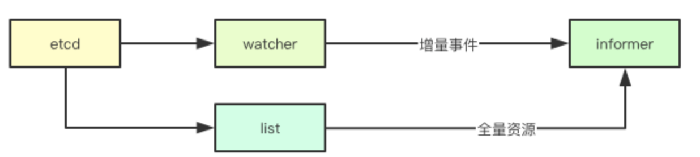
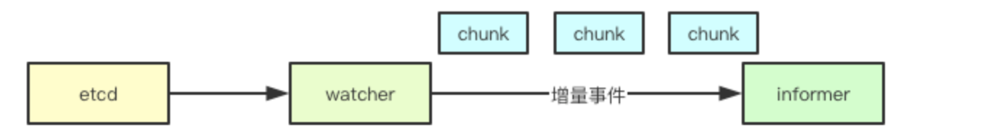
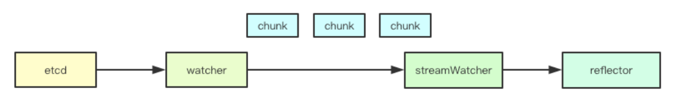
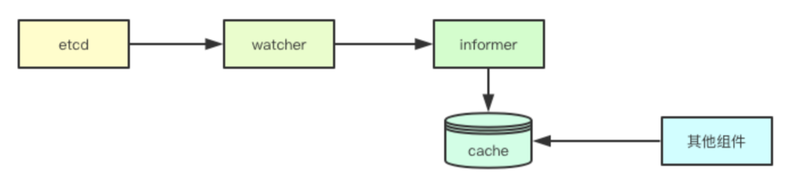
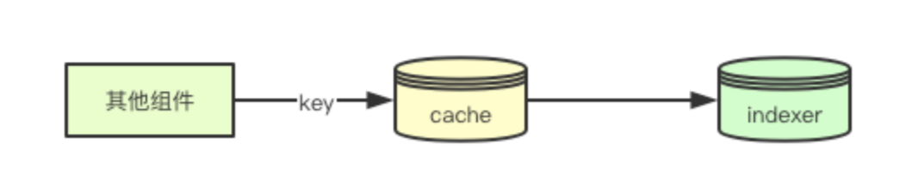
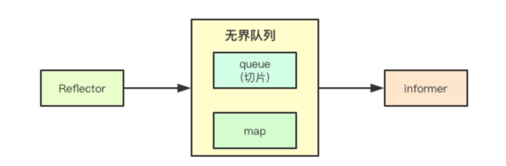
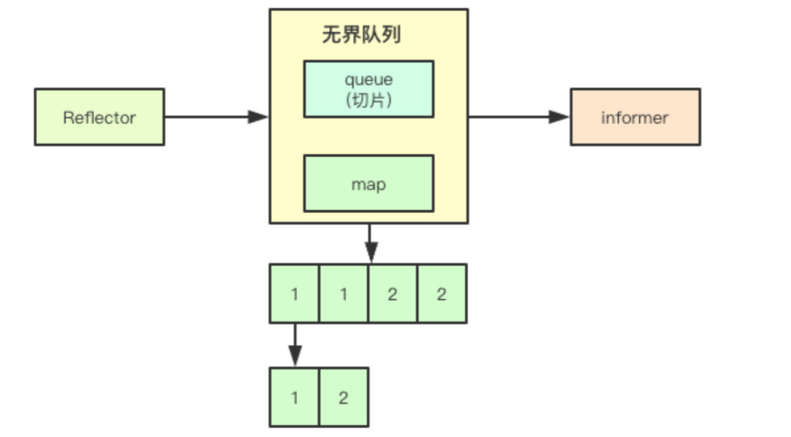
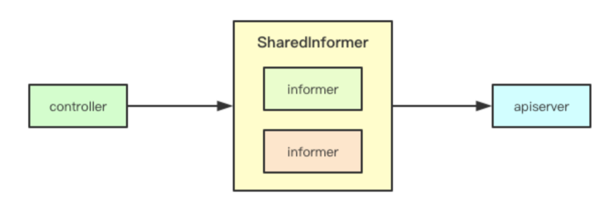
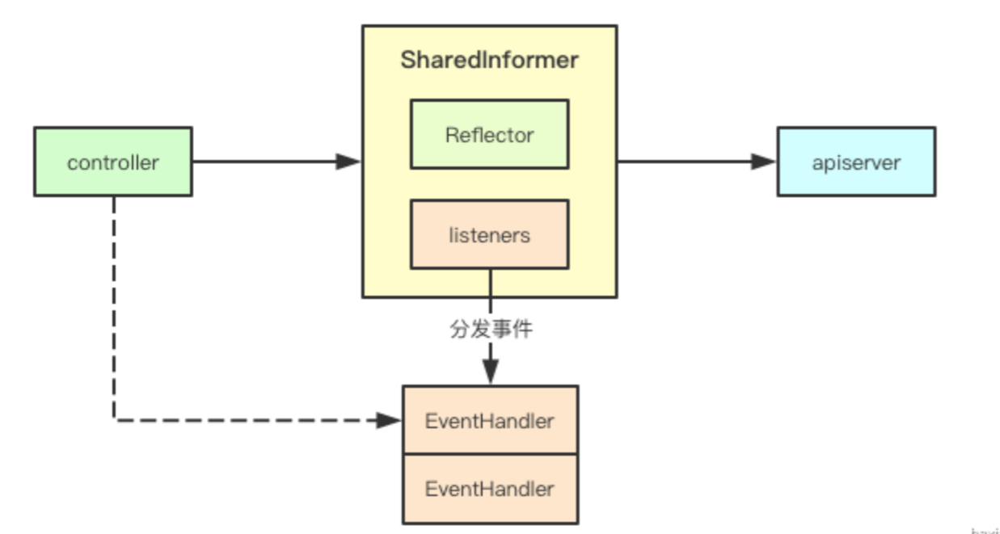
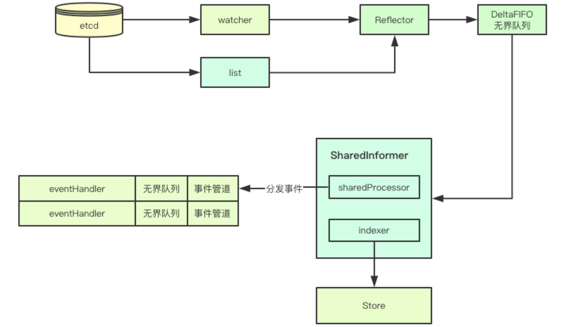

# informer

kubernetes中的informer机制可能是实现集群控制模块的最核心的设计之一了，本文从informer如何获取数据开始,然后介绍了为了减少apiserver而设计的缓存、索引、无界队列、共享informer等机制

# 1. informer的本质

## 1.1 设计目标

 之前说到kubernetes里面的apiserver的只负责数据的CRUD接口实现，并不负责业务逻辑的处理，所以k8s中就通过外挂controller通过对应资源的控制器来负责事件的处理，controller如何感知事件呢？答案就是informer

## 1.2 基于chunk的消息通知

 watcher的设计在之前的文章中已经介绍，服务端是如何将watcher感知到的事件发送给informer呢？我们提到过apiserver本质上就是一个http的rest接口实现，watch机制则也是基于http协议，不过不同于一般的get其通过chunk机制，来实现消息的通知

## 1.3 reflector

 服务端通过chunk进行数据的发送，在客户端同样的需要根据对应的chunk来进行数据的解包，同时还要维护这个长链接

# 2. 设计优化
为了缓解apiserver的压力,informer自身做了很多相关的优化工作，其本质上为两个大的方面：优先使用本地缓存和复用连接，每个人看到的可能都不太一样，本文是基于源码的个人理解，欢迎交流
## 2.1 本地缓存

 通过listwatch接口主要分为两部分，list接口我们可以获取到对应资源当前版本的全量资源，watch接口可以获取到后续变更的资源，通过全量加增量的数据，就构成了在client端一份完整的数据(基于当前版本的)，那后续如果要获取对应的数据，就直接可以通过本地的缓存来进行获取，为此informer抽象了cache这个组件，并且实现了store接口，如果后续要获取资源，则就可以通过本地的缓存来进行获取

## 2.2 本地索引

 上面将资源缓存在本地的内存中，那如果我们要进行数据查询，快速检索数据，这个时候就需要用到informer里面的indexer, 我们可以注册不同的索引函数，在添加对象的时候，会通过indexer为其建立对应的索引，这样后续我们就可以通过key来检索获取元数据

## 2.3 无界队列

 为了协调数据生产与消费的不一致状态，在cleint-go中通过实现了一个无界队列来进行数据的缓冲，当reflector获取到数据之后，只需要将数据写入到无界队列中，则就可以继续watch后续事件，从而减少阻塞时间， 下面的事件去重也是在该队列中实现的

## 2.4 事件去重

 事件去重是指的，在上面的无界队列中，如果针对某个资源的事件重复被触发，则就只会保留相同事件最后一个事件作为后续处理

到此对于事件接收和数据缓存相关优化就结束了，接下就是处理层的优化

## 2.5 复用连接

 在k8s中一些控制器可能会关注多种资源，比如Deployment可能会关注Pod和replicaset，replicaSet可能还会关注Pod，为了避免每个控制器都独立的去与apiserver建立链接，k8s中抽象了sharedInformer的概念，即共享的informer, 针对同一资源只建立一个链接

## 2.6 基于观察者模式的注册

 因为彼此共用informer,但是每个组件的处理逻辑可能各部相同，在informer中通过观察者模式，各个组件可以注册一个EventHandler来实现业务逻辑的注入

## 2.7 无界队列

前面提到过一个无界队列，而此处是针对单个eventHandler的无界队列，其实主要是为了协调各个组件的处理速度的不一致

# 3. 设计总结

 本文从informer如何获取数据开始,然后介绍了为了减少apiserver而设计的缓存、索引、无界队列、共享informer等机制, 抛个小问题, 基于listwatch和informer机制会不会丢事件,如果丢事件会不会影响最终的结果,欢迎加群讨论

