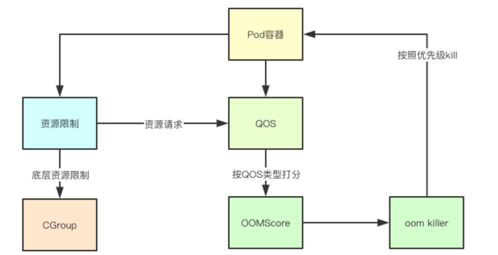

# kubernetes QOS类型打分机制

QOS是k8s中一种资源保护机制，其主要是针对不可压缩资源比如的内存的一种控制技术，比如在内存中其通过为不同的Pod和容器构造OOM评分，并且通过内核的策略的辅助，从而实现当节点内存资源不足的时候，内核可以按照策略的优先级，优先kill掉哪些优先级比较低(分值越高优先级越低)的Pod，今天来分析下背后的实现

# 1.关键基础特性

## 1.1 一切皆文件
在Linux中一切皆文件，控制CGroup本身也是通过配置文件进行的,这是我创建的一个内存Lmits为200M的Pod的容器的配置
```shell script
# pwd
/sys/fs/cgroup
# cat ./memory/kubepods/pod8e172a5c-57f5-493d-a93d-b0b64bca26df/f2fe67dc90cbfd57d873cd8a81a972213822f3f146ec4458adbe54d868cf410c/memory.limit_in_bytes
209715200
```
## 1.2 内核内存配置
这里我们重点关注内存相关的两个配置：<br />VMOvercommitMemory其值为1，表示运行分配所有的物理内存资源，注意不包括SWAP资源<br />VMPanicOnOOM其值为0：表示当内存不足的时候触发oom_killer进行选择部分进程进行kill，QOS也是通过影响其kill流程来实现的

代码路径`pkg/kubelet/cm/container_manager_linux.go:361`
```go
func setupKernelTunables(option KernelTunableBehavior) error {
	desiredState := map[string]int{
		utilsysctl.VMOvercommitMemory: utilsysctl.VMOvercommitMemoryAlways,
		utilsysctl.VMPanicOnOOM:       utilsysctl.VMPanicOnOOMInvokeOOMKiller,
		utilsysctl.KernelPanic:        utilsysctl.KernelPanicRebootTimeout,
		utilsysctl.KernelPanicOnOops:  utilsysctl.KernelPanicOnOopsAlways,
		utilsysctl.RootMaxKeys:        utilsysctl.RootMaxKeysSetting,
		utilsysctl.RootMaxBytes:       utilsysctl.RootMaxBytesSetting,
	}
    ...
```

# 2.QOS打分机制与判定实现
QOS打分机制主要是根据Requests和limits里面的资源限制来进行类型判定与打分的，我们就来快速看下这部分的实现
## 2.1 根据容器判定QOS类型
### 2.1.1 处理Requests和limits
这里遍历所有的Requests和Limits限制的资源，分别加入到不同的资源集合汇总，其中判定是不是Guaranteed主要是根据limits里面的资源是否包含CPU和内存两种资源，都包含才可能是Guaranteed

代码路径`pkg/kubectl/util/qos/qos.go`
```go
	for _, container := range pod.Spec.Containers {
    		// process requests
    		for name, quantity := range container.Resources.Requests {
    			if !isSupportedQoSComputeResource(name) {
    				continue
    			}
    			if quantity.Cmp(zeroQuantity) == 1 {
    				delta := quantity.Copy()
    				if _, exists := requests[name]; !exists {
    					requests[name] = *delta
    				} else {
    					delta.Add(requests[name])
    					requests[name] = *delta
    				}
    			}
    		}
    		// process limits
    		qosLimitsFound := sets.NewString()
    		for name, quantity := range container.Resources.Limits {
    			if !isSupportedQoSComputeResource(name) {
    				continue
    			}
    			if quantity.Cmp(zeroQuantity) == 1 {
    				qosLimitsFound.Insert(string(name))
    				delta := quantity.Copy()
    				if _, exists := limits[name]; !exists {
    					limits[name] = *delta
    				} else {
    					delta.Add(limits[name])
    					limits[name] = *delta
    				}
    			}
    		}
    
    		if !qosLimitsFound.HasAll(string(corev1.ResourceMemory), string(corev1.ResourceCPU)) {
    			// 必须是全部包含cpu和内存限制
                isGuaranteed = false
    		}
    	}
```
### 2.1.2 BestEffort
如果Pod里面的容器没有任何requests和limits的限制则就是BestEffort
```go
	if len(requests) == 0 && len(limits) == 0 {
		return corev1.PodQOSBestEffort
	}
```
### 2.1.3 Guaranteed
要是Guaranteed必须是资源相等，并且限定的数量相同
```go
	// Check is requests match limits for all resources.
	if isGuaranteed {
		for name, req := range requests {
			if lim, exists := limits[name]; !exists || lim.Cmp(req) != 0 {
				isGuaranteed = false
				break
			}
		}
	}
	if isGuaranteed &&
		len(requests) == len(limits) {
		return corev1.PodQOSGuaranteed
	}
```
### 2.1.5 Burstable
如果不是上面两种就是最后一种burstable了
```go
	return corev1.PodQOSBurstable
```
## 2.2 QOS OOM打分机制

### 2.2.1 OOM打分机制
其中guaranteedOOMScoreAdj是-998其实这跟OOM实现有关系，一台node节点上主要是三部分组成：kubelet主进程、docker进程、业务容器进程，而OOM的打分里面-1000表示该进程不会被oom所kill, 那一个业务进程最少也就只能是-999因为你不能保证自己的业务永远不会出现问题，所以在QOS里面-999其实就是kubelet和docker进程所保留的，剩下的才能作为业务容器分配(分值越高越容易被kill)

代码路径`pkg/kubelet/qos/policy.go`
```go
	const (
    	PodInfraOOMAdj        int = -998
    	KubeletOOMScoreAdj    int = -999
    	DockerOOMScoreAdj     int = -999
    	KubeProxyOOMScoreAdj  int = -999
    	guaranteedOOMScoreAdj int = -998
    	besteffortOOMScoreAdj int = 1000
    )
```

### 2.2.2 关键Pod
关键Pod是一种特殊的存在，它可以是Burstable或者BestEffort类型的Pod，但是OOM打分却可以跟Guaranteed一样，这种类型的Pod主要包含三种：静态Pod、镜像Pod和高优先级Pod

代码路径`pkg/kubelet/qos/policy.go`
```go
	if types.IsCriticalPod(pod) {
		return guaranteedOOMScoreAdj
	}

```
判定实现

代码路径`pkg/kubelet/types/pod_update.go`
```go
func IsCriticalPod(pod *v1.Pod) bool {
	if IsStaticPod(pod) {
		return true
	}
	if IsMirrorPod(pod) {
		return true
	}
	if pod.Spec.Priority != nil && IsCriticalPodBasedOnPriority(*pod.Spec.Priority) {
		return true
	}
	return false
}
```
### 2.2.3 Guaranteed与BestEffort
这两种类型都有各自默认的值分别为Guaranteed(-998)和BestEffort(1000)
```go
	switch v1qos.GetPodQOS(pod) {
	case v1.PodQOSGuaranteed:
		// Guaranteed containers should be the last to get killed.
		return guaranteedOOMScoreAdj
	case v1.PodQOSBestEffort:
		return besteffortOOMScoreAdj
	}

```
### 2.2.4 Burstable
其中关键的一行就是：oomScoreAdjust := 1000 - (1000*memoryRequest)/memoryCapacity，从这个计算里面可以看出，如果我们申请的资源越多，那么 (1000*memoryRequest)/memoryCapacity这个里面计算出来的时机值就会越小，即最终结果就越大，其实也就表明如果我们占用的内存越少，则打分就越高，这类容器就相对比较容易被kill
```go
	
	memoryRequest := container.Resources.Requests.Memory().Value()
	oomScoreAdjust := 1000 - (1000*memoryRequest)/memoryCapacity
	// A guaranteed pod using 100% of memory can have an OOM score of 10. 
Ensure that burstable pods have a higher OOM score adjustment.
	if int(oomScoreAdjust) < (1000 + guaranteedOOMScoreAdj) {
		return (1000 + guaranteedOOMScoreAdj)
	}
	// Give burstable pods a higher chance of survival over besteffort pods.
	if int(oomScoreAdjust) == besteffortOOMScoreAdj {
		return int(oomScoreAdjust - 1)
	}
	return int(oomScoreAdjust)
```


