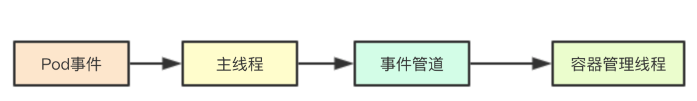
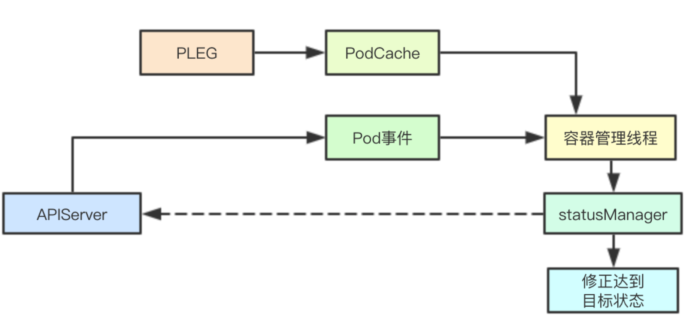
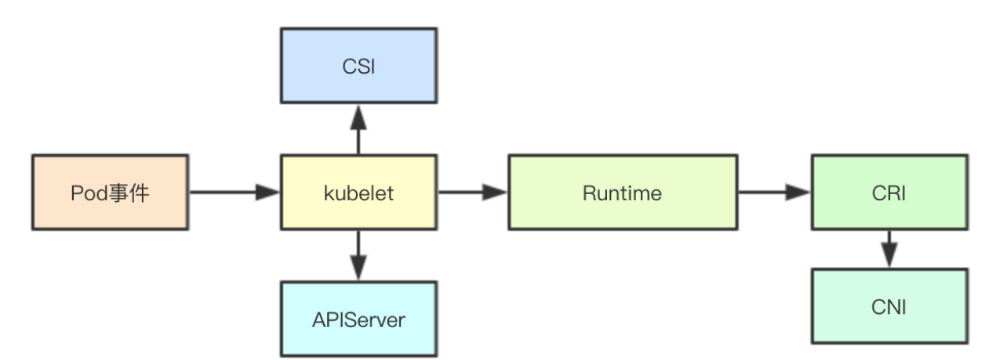
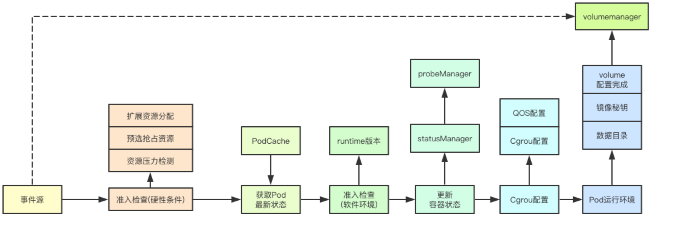
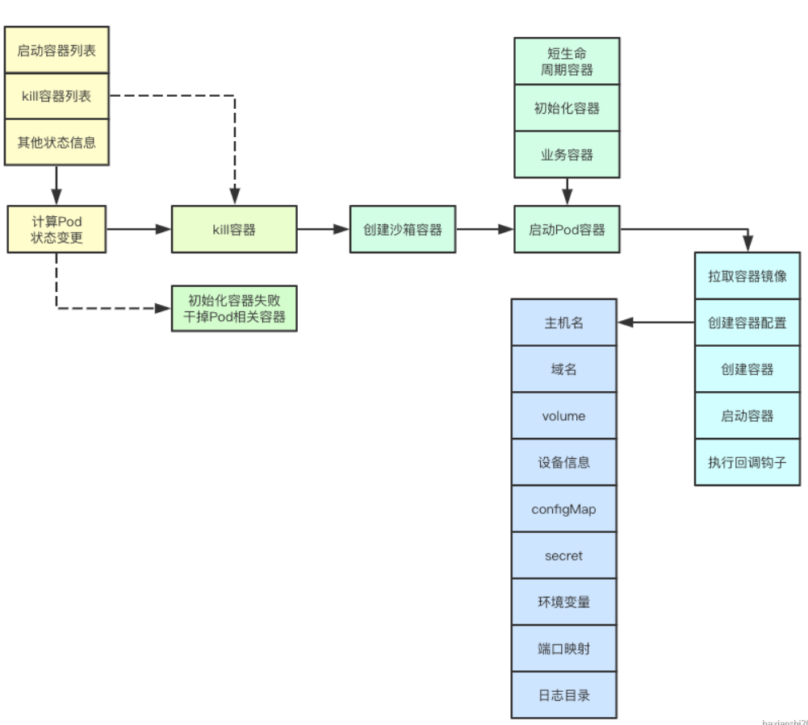
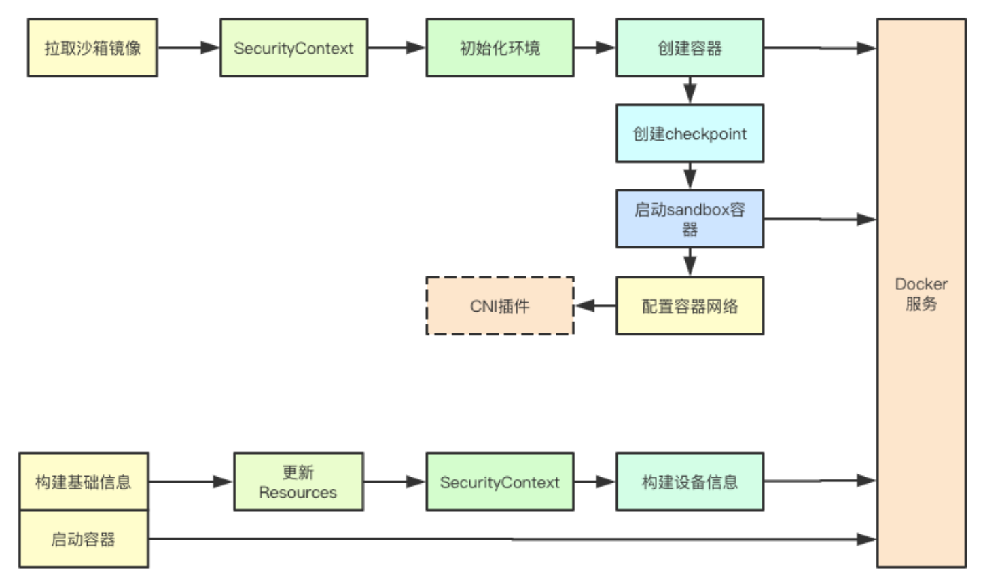
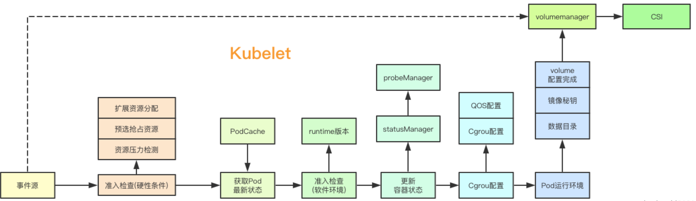
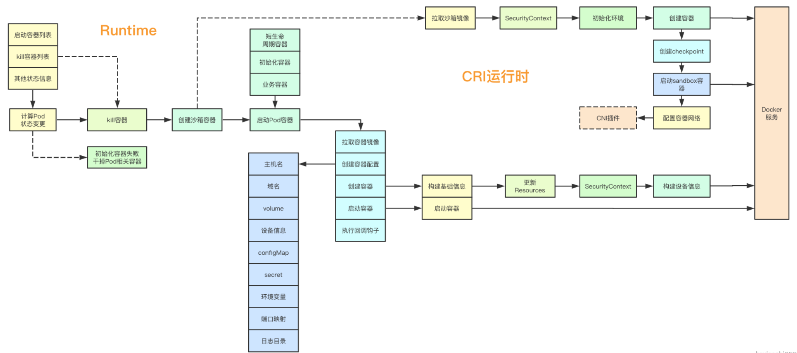

# 008.Pod创建流程

kubernetes中的容器创建无疑是个复杂的过程，涉及内部各种组件的统一协作，还有对接外部的CRI运行时，本文尝试初探一下容器创建流程中的各种细节，了解其各种组件协作流程，从而在后续出现问题的时候，也好能大概有点排查方向

# 1. 基础筑基
## 1.1 容器管理线程模型

 kubelet中的线程模型属于master/worker模型，通过单master来监听各种事件源，并为每个Pod创建一个goroutine来进行Pod业务逻辑的处理，master和worker之间通过一个状态管道来进行通信

## 1.2 基于事件驱动的状态最终一致性

在通过yaml创建Pod之后，kubernetes会根据当前的事件和当前的Pod状态，来不断进行调整，从而达到最终目标状态的一致性
## 1.3 组件协作流程

 kubelet的结构体声明就高达300多行代码，可见其复杂程度，但是我们按照容器创建这个流程，我们去观察其核心流程，其实主要可以概括为三部分：kubelet、containerRuntime、CRI容器运行时

# 2.Kubelet创建容器流程

## 2.1 获取Pod进行准入检查
kubelet的事件源主要包含两个部分：静态Pod和Apiserver，我们这里只考虑普通的Pod，则会直接将Pod加入到PodManager来进行管理，并且进行准入检查

准入检查主要包含两个关键的控制器：驱逐管理与预选检查 驱逐管理主要是根据当前的资源压力，检测对应的Pod是否容忍当前的资源压力； 预选检查则是根据当前活跃的容器和当前节点的信息来检查是否满足当前Pod的基础运行环境，例如亲和性检查，同时如果当前的Pod的优先级特别高或者是静态Pod，则会尝试为其进行资源抢占，会按照QOS等级逐级来进行抢占从而满足其运行环境

## 2.2 创建事件管道与容器管理主线程
kubelet接收到一个新创建的Pod首先会为其创建一个事件管道，并且启动一个容器管理的主线程消费管道里面的事件，并且会基于最后同步时间来等待当前kubelet中最新发生的事件(从本地的podCache中获取)，如果是一个新建的Pod，则主要是通过PLEG中更新时间操作，广播的默认空状态来作为最新的状态

## 2.3 同步最新状态
当从本地的podCache中获取到最新的状态信息和从事件源获取的Pod信息后，会结合当前当前statusManager和probeManager里面的Pod里面的容器状态来更新，从而获取当前感知到的最新的Pod状态

## 2.4 准入控制检查
之前的准入检查是Pod运行的资源硬性限制的检查，而这里的准入检查则是软状态即容器运行时和版本的一些软件运行环境检查，如果这里检查失败，则会讲对应的容器状态设置为Blocked

## 2.5 更新容器状态
在通过准入检查之后，会调用statusManager来进行POd最新状态的同步，此处可能会同步给apiserver

## 2.6 Cgroup配置
在更新完成状态之后会启动一个PodCOntainerManager主要作用则是为对应的Pod根据其QOS等级来进行Cgroup配置的更新

## 2.7Pod基础运行环境准备
接下来kubelet会为Pod的创建准备基础的环境，包括Pod数据目录的创建、镜像秘钥的获取、等待volume挂载完成等操作 创建Pod的数据目录主要是创建 Pod运行所需要的Pod、插件、Volume目录，并且会通过Pod配置的镜像拉取秘钥生成秘钥信息，到此kubelet创建容器的工作就已经基本完成

# 3.ContainerRuntime

 前面我们提到过针对Pod的操作，最终都是基于事件和状态的同步而完成，在containerRUntime并不会区分对应的事件是创建还是更新操作，只是根据当前的Pod的信息与目标状态来进行对比，从而构建出对应的操作，达到目标状态
## 3.1 计算Pod容器变更

计算容器变更主要包括：Pod的sandbox是否变更、短声明周期容器、初始化容器是否完成、业务容器是否已经完成，相应的我们会得到一个几个对应的容器列表：需要被kill掉的容器列表、需要启动的容器列表，注意如果我们的初始化容器未完成，则不会进行将要运行的业务容器加入到需要启动的容器列表，可以看到这个地方是两个阶段

## 3.2 初始化失败尝试终止

如果之前检测到之前的初始化容器失败，则会检查当前Pod的所有容器和sandbox关联的容器如果有在运行的容器，会全部进行Kill操作，并且等待操作完成

## 3.3 未知状态容器补偿

当一些Pod的容器已经运行，但是其状态仍然是Unknow的时候，在这个地方会进行统一的处理，全部kill掉，从而为接下来的重新启动做清理操作，此处和3.2只会进行一个分支，但核心的目标都是清理那些运行失败或者无法获取状态的容器

## 3.4 创建容器沙箱

在启动Pod的容器之前，首先会为其创建一个sandbox容器，当前Pod的所有容器都和Pod对应的sandbox共享同一个namespace从而共享一个namespace里面的资源，创建Sandbox比较复杂，后续会继续介绍

## 3.5 启动Pod相关容器

Pod的容器目前分为三大类：短生命周期容器、初始化容器、业务容器，启动顺序也是从左到右依次进行,如果对于的容器创建失败，则会通过backoff机制来延缓容器的创建，这里我们顺便介绍下containerRuntime启动容器的流程

### 3.5.1 检查容器镜像是否拉取

镜像的拉取首先会进行对应容器镜像的拼接，然后将之前获取的拉取的秘钥信息和镜像信息，一起交给CRI运行时来进行底层容器镜像的拉取，当然这里也会各种backoff机制，从而避免频繁拉取失败影响kubelet的性能

### 3.5.2 创建容器配置

创建容器配置主要是为了容器的运行创建对应的配置数据，主要包括：Pod的主机名、域名、挂载的volume、configMap、secret、环境变量、挂载的设备信息、要挂载的目录信息、端口映射信息、根据环境生成执行的命令、日志目录等信息

### 3.5.3 调用runtimeService完成容器的创建

调用runtimeService传递容器的配置信息，调用CRI，并且最终调用容器的创建接口完成容器的状态

### 3.5.4 调用runtimeService启动容器

通过之前创建容器返回的容器ID，来进行对应的容器的启动，并且会为容器创建对应的日志目录

### 3.5.5 执行容器的回调钩子

如果容器配置了PostStart钩子，则会在此处进行对应钩子的执行，如果钩子的类型是Exec类则会调用CNI的EXec接口完成在容器内的执行

# 4. 运行沙箱容器

## 4.1 拉取sandbox镜像

首先会拉取sandbox镜像

## 4.2 创建沙箱容器
### 4.2.1 应用SecurityContext
在创建容器之前会先根据SecurityContext里面的配资信息，来进行容器SecurityContext的配置，主要包括特权等级、只读目录、运行账户组等信息
### 4.2 其余基础信息
除了应用SecurityContext还会进行断开、OOMScoreAdj、Cgroup驱动等信息的映射

### 4.3 创建容器
根据上面的各种配置信息来进行容器的创建
## 4.3 创建checkpoint
checkpoint主要是将当前sandbox的配置信息进行序列化，并且存储其当前的快照信息
## 4.4 启动sandbox容器
启动sandbox容器则会直接调用StartContainer同时传入之前创建容器返回的ID完成容器的启动，并且此时会重写覆盖容器的dns配置文件
## 4.5 容器网络设置
容器的网络配置主要是调用CNI插件来完成容器网络的配置，这里就先不展开了

# 5. Pod容器启动总结

 kubelet是容器管理的核心大管家，其负责各种准入控制、状态管理、探测管理、volume管理、QOS管理、CSI对接的统一调度，并且为Runtime运行时准备基础的数据和并反馈Pod当前的最新状态 

本文是一个基础版本，后续会在该版本上，继续叠加各种细节，
