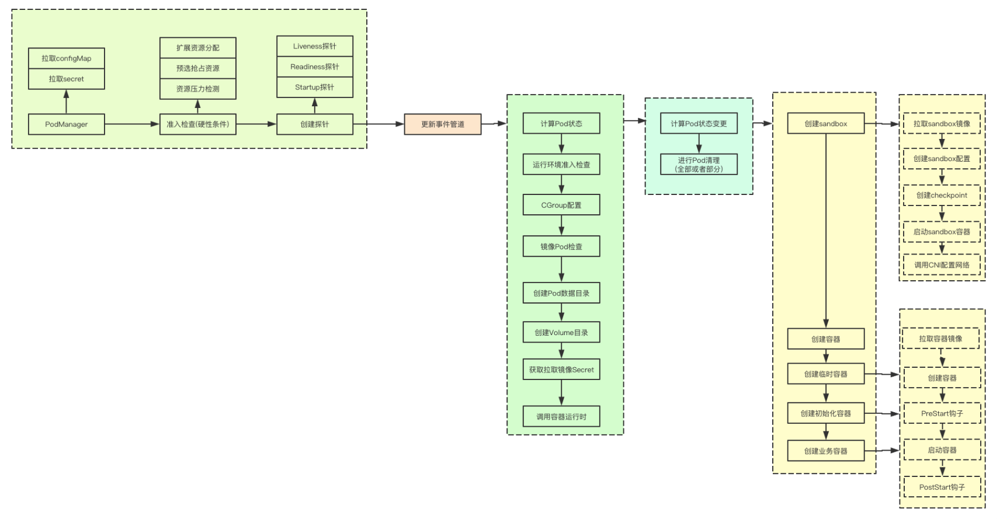

# 1. 前言
在k8s的面试中Pod的创建流程是一个常问的问题，而kubelet则无疑重中之重，之前也写过一篇Pod的运行，不过没有涉及到具体的代码，本文尝试用代码的方式，来复数整个核心的流程，同时为了方便记忆，又将整个过程分为：准备、配置、清理、构建运行四个阶段，让我们一起来看下吧<br />

# 2. 准备阶段
当获取到Pod添加的事件的时候，首先会进行一些基础的工作，我吧这个过程称为准备阶段，准备阶段主要做的事情有如下：1）加入PodManager 2）准入控制检查 3）分发事件 4）根据Pod添加对应的探针， 让我们一起来看下关键实现
## 2.1 加入PodManager
PodManager中的功能除了存储Pod的信息，还会进行对应Pod的configMap和secret的管理，当心加入Pod的时候，会检查对应的Pod是否有对应的configMap和secret配置，如果有则就会创建对应的监听器，监听资源的变化，进行本地缓存<br />
<br />除此之外，如果对应的Pod的BootstrapCheckpointAnnotationKey有设定，则还会创建对应的checkpoint,即将pod的配置数据写入到本地磁盘
```go
		kl.podManager.AddPod(pod)
```
## 2.2 准入控制检查
准入控制检查主要是在运行Pod之前在kubelet上进行Pod运行条件的检查，检查当前节点在scheduler决策完成后到感知到Pod运行这段时间资源是否依旧满足，并且检查Pod的一些特殊资源比如比如sysctl、security等检查，这里我感觉比较重要的两个分别是eviction和predicate, 如果不满足准入检查，则会直接拒绝
<a name="erg6G"></a>
### 2.2.1 eviction准入检查
如果当前节点只存在内存压力，则会根据对应的Pod的QOS等级来判断，如果说不是BestEffort或者容忍内存压力的污点，则会允许，否则则会拒绝运行
```go
	nodeOnlyHasMemoryPressureCondition := hasNodeCondition(m.nodeConditions, v1.NodeMemoryPressure) && len(m.nodeConditions) == 1
	if nodeOnlyHasMemoryPressureCondition {
		// 如果不是PodQOSBestEffort, 则都会尝试运行
		notBestEffort := v1.PodQOSBestEffort != v1qos.GetPodQOS(attrs.Pod)
		if notBestEffort {
			return lifecycle.PodAdmitResult{Admit: true}
		}
		// 如果对应的Pod容忍内存压力的污点，则就可以继续进行其他准入控制器的检查
		if v1helper.TolerationsTolerateTaint(attrs.Pod.Spec.Tolerations, &v1.Taint{
			Key:    v1.TaintNodeMemoryPressure,
			Effect: v1.TaintEffectNoSchedule,
		}) {
			return lifecycle.PodAdmitResult{Admit: true}
		}
	}
```
### 2.2.2 predicate准入检查
predicate准入控制器中的逻辑主要是分为两个部分：<br />1）检查对应的资源是否满足分配请求，同时会记录缺少的资源<br />2）如果是Critical类型的Pod则会按照QOS等级来进行资源的抢占，满足这些高优先的Pod<br />这里的Critical类型的Pod主要包含如下三类：静态Pod、镜像Pod、高优先Pod(优先级高于2000000000)
```go
func (w *predicateAdmitHandler) Admit(attrs *PodAdmitAttributes) PodAdmitResult {
	node, err := w.getNodeAnyWayFunc()
	// 踢出扩展资源，只进行内存和CPU资源的检查
	podWithoutMissingExtendedResources := removeMissingExtendedResources(admitPod, nodeInfo)

	// 进行预选算法筛选， 筛选出那些资源不足的资源
	fit, reasons, err := predicates.GeneralPredicates(podWithoutMissingExtendedResources, nil, nodeInfo)

	if !fit {
		// 如果预选失败，则尝试进行抢占
		fit, reasons, err = w.admissionFailureHandler.HandleAdmissionFailure(admitPod, reasons)
    }

}
```
## 2.3 探针管理
k8s里面的探针主要分为三类：startup、readiness、liveness，在Pod通过准入控制检查后，会根据Pod的探针配置创建对应的探针，但是这里的探针并不会真正的进行探测，因为当前还无法感知到对应的pod的状态
```go
kl.probeManager.AddPod(pod)
```


## 2.4 分发事件
在kubelet中会为每个Pod都创建一个对应的goroutine和事件管道，后续新的事件也都通过管道发送给对应的goroutine
```go
func (p *podWorkers) UpdatePod(options *UpdatePodOptions) {
	// 获取pod信息
	pod := options.Pod
	uid := pod.UID
	var podUpdates chan UpdatePodOptions
	var exists bool

	p.podLock.Lock()
	defer p.podLock.Unlock()
	// kubelet会为每个pod创建一个goroutine, 并且通过管道来进行通信
	if podUpdates, exists = p.podUpdates[uid]; !exists {
		podUpdates = make(chan UpdatePodOptions, 1)
		p.podUpdates[uid] = podUpdates

		// 为当前pod启动一个goroutine
		go func() {
			defer runtime.HandleCrash()
			p.managePodLoop(podUpdates)
		}()
	}
	if !p.isWorking[pod.UID] {
		p.isWorking[pod.UID] = true
		// 更新Pod的事件发送到管道
		podUpdates <- *options
	} 
}
```


> 至此一个Pod的启动的准备阶段就基本完成了，检查运行环境、拉取对应的cofnigMap和secret资源、创建探针、启动负责Pod状态维护的线程，至此准备阶段完成


# 3.配置阶段
在kubelet最终的状态同步都是由syncPod来完成，该函数会根据传递进来的目标状态和Pod的当前状态来进行决策，从而满足目标状态，因为内部逻辑的复杂，会分为：配置阶段、清理阶段、构建运行阶段，这里先看下配置阶段<br />
<br />配置阶段主要是获取当前的Pod状态、应用CGOUP配置、Pod数据目录构建、等待VOlume挂载、获取镜像拉取的secret等
<a name="pAQkl"></a>
## 3.1 计算Pod的状态
Pod的状态数据主要包含当前阶段、Conditions(容器Condition、初始化容器Condition、PodReadyCondition),而这些状态则需要根据当前的PodStatus里面的状态计算，还有probeManager里面探测的数据两部分共同完成
```go
func (kl *Kubelet) generateAPIPodStatus(pod *v1.Pod, podStatus *kubecontainer.PodStatus) v1.PodStatus {
	allStatus := append(append([]v1.ContainerStatus{}, s.ContainerStatuses...), s.InitContainerStatuses...)
	// 根据Pod的容器状态，设定当前的的阶段
	s.Phase = getPhase(spec, allStatus)
	kl.probeManager.UpdatePodStatus(pod.UID, s)
	s.Conditions = append(s.Conditions, status.GeneratePodInitializedCondition(spec, s.InitContainerStatuses, s.Phase))
	s.Conditions = append(s.Conditions, status.GeneratePodReadyCondition(spec, s.Conditions, s.ContainerStatuses, s.Phase))
	s.Conditions = append(s.Conditions, status.GenerateContainersReadyCondition(spec, s.ContainerStatuses, s.Phase))
	return *s
}
```
## 3.2 运行环境准入检查
该运行环境是指的一些软件状态的，这里主要涉及到Appmor、特权模式、proc挂载，实现机制就是检测对应的Pod是否需要对应的操作，并且SecurityContext中是否允许对应的操作，从而确定Pod是否能够进行运行
```go
func (kl *Kubelet) canRunPod(pod *v1.Pod) lifecycle.PodAdmitResult {
	// 准入控制插件
	for _, handler := range kl.softAdmitHandlers {
		if result := handler.Admit(attrs); !result.Admit {
			return result
		}
	}

	return lifecycle.PodAdmitResult{Admit: true}
}
```
## 3.3 更新状态
更新状态主要是为了probeManager来进行状态检查的，如果probeManager无法获取到对应的状态，就不会执行对应的健康探针的检查，这里的状态就是根据之前的各种计算在kubelet上对应Pod的当前状态
```go
	kl.statusManager.SetPodStatus(pod, apiPodStatus)
```
## 3.4 网络运行时检查
```go
	if err := kl.runtimeState.networkErrors(); err != nil && !kubecontainer.IsHostNetworkPod(pod) {
		kl.recorder.Eventf(pod, v1.EventTypeWarning, events.NetworkNotReady, "%s: %v", NetworkNotReadyErrorMsg, err)
		return fmt.Errorf("%s: %v", NetworkNotReadyErrorMsg, err)
	}
```
## 3.5 CGroup配置
Cgroup的配置主要是按照QOS等级来进行cgroup目录的构建，并且更新当前Pod的配置
```go
	pcm := kl.containerManager.NewPodContainerManager()
	// cgroup应用cgroup
	if !kl.podIsTerminated(pod) {
		podKilled := false
		if !pcm.Exists(pod) && !firstSync {
			// 如果对于的cgroup不存在，并且也不是第一次运行，就先将之前的pod沙雕
			if err := kl.killPod(pod, nil, podStatus, nil); err == nil {
				podKilled = true
			}
		}
		if !(podKilled && pod.Spec.RestartPolicy == v1.RestartPolicyNever) {
			if !pcm.Exists(pod) {
				// 更新qoscgroup设置
				if err := kl.containerManager.UpdateQOSCgroups(); err != nil {
				}
				// 更新podde的cgroup配置
				if err := pcm.EnsureExists(pod); err != nil {
				}
			}
		}
	}
```
## 3.6 镜像Pod的检查
因为要通过镜像Pod来向apiserver传递静态Pod的状态，所以该阶段主要是为静态Pod创建对应的镜像Pod
```go
	if kubetypes.IsStaticPod(pod) {
		// 静态pod
		podFullName := kubecontainer.GetPodFullName(pod)
		deleted := false
		if mirrorPod != nil {
			if mirrorPod.DeletionTimestamp != nil || !kl.podManager.IsMirrorPodOf(mirrorPod, pod) {
				deleted, err = kl.podManager.DeleteMirrorPod(podFullName, &mirrorPod.ObjectMeta.UID)
			}
		}
		if mirrorPod == nil || deleted {
				if err := kl.podManager.CreateMirrorPod(pod); err != nil {
				}
			}
		}
	}
```
## 3.7 创建Pod的数据目录
Pod的数据目录主要是包含三个部分：Pod目录、Volume目录、Plugin目录三个目录
```go
	if err := kl.makePodDataDirs(pod); err != nil {
		return err
	}
```
## 3.8 等待volume的挂载
```go
	if !kl.podIsTerminated(pod) {
		if err := kl.volumeManager.WaitForAttachAndMount(pod); err != nil {
		}
	}
```
<a name="Oytzc"></a>
## 3.9 获取镜像拉取的secrets
```go
	pullSecrets := kl.getPullSecretsForPod(pod)
```
## 3.10 调用容器的运行时进行同步
着可能是最复杂的一部分了，接下来就进入到下一个阶段：清理阶段
```go
	result := kl.containerRuntime.SyncPod(pod, podStatus, pullSecrets, kl.backOff)
	kl.reasonCache.Update(pod.UID, result)

```
# 4. 清理阶段
在Pod运行前可能已经有部分容器已经在运行，则此时就需要根据当前的状态，来进行一些容器的清理工作，为接下来的构建运行阶段提供一个相对干净的环境
## 4.1 计算Pod状态变更
在k8s中Pod的状态主要包含sandbox容器状态、初始化容器状态、临时容器状态、业务容器状态等几部分，我们依次来看下关键的实现
```go
	podContainerChanges := m.computePodActions(pod, podStatus)
```
> 沙箱状态计算：当且仅有一个Ready的沙箱并且沙箱的IP不为空的情况，沙箱的状态才不需要更改，其他情况下，都需要重新进行沙箱的构建，并且需要kill掉Pod关联的所有容器

```go
func (m *kubeGenericRuntimeManager) podSandboxChanged(pod *v1.Pod, podStatus *kubecontainer.PodStatus) (bool, uint32, string) {
	if len(podStatus.SandboxStatuses) == 0 {
		return true, 0, ""
	}
	readySandboxCount := 0
	for _, s := range podStatus.SandboxStatuses {
		if s.State == runtimeapi.PodSandboxState_SANDBOX_READY {
			readySandboxCount++
		}
	}

	sandboxStatus := podStatus.SandboxStatuses[0]
	if readySandboxCount > 1 {
		return true, sandboxStatus.Metadata.Attempt + 1, sandboxStatus.Id
	}
	if sandboxStatus.State != runtimeapi.PodSandboxState_SANDBOX_READY {
		return true, sandboxStatus.Metadata.Attempt + 1, sandboxStatus.Id
	}

	if sandboxStatus.GetLinux().GetNamespaces().GetOptions().GetNetwork() != networkNamespaceForPod(pod) {
		return true, sandboxStatus.Metadata.Attempt + 1, ""
	}

	if !kubecontainer.IsHostNetworkPod(pod) && sandboxStatus.Network.Ip == "" {
		return true, sandboxStatus.Metadata.Attempt + 1, sandboxStatus.Id
	}

	return false, sandboxStatus.Metadata.Attempt, sandboxStatus.Id
}
```
计算Pod的容器状态计算逻辑相对长一些，这里我就不贴代码了，其如要流程分为两个部分：<br />

> 1.需要创建sandbox:

在该状态下，如果存在初始化容器，则会先进行初始化容器的初始化，即当前步骤只创建第一个初始化容器，如果没有初始化容器，则就将所有的业务容器加入到启动的列表里面<br />

> 2.不需要创建sandbox:

该状态下会检查遍历所有的临时容器，初始化容器(**如果存在失败的初始化容器，则就先启动初始化容器，不会进行业务容器的启动**)，业务容器，最终会构建一个需要kill掉的容器列表，还有两个启动的容器列表<br />

## 4.2 killPod全部清理
需要进行KillPod的状态有两种：
> sanbbox状态变更

即当sandbox状态不满足要求，则此时需要将Pod的所有容器都杀掉，然后进行重建
> 无需进行保留的容器

如果Pod对应的容器的hash值变更、状态为失败，则就需要重建
```go
	if podContainerChanges.KillPod {
		// 杀死当前所有的pod
		killResult := m.killPodWithSyncResult(pod, kubecontainer.ConvertPodStatusToRunningPod(m.runtimeName, podStatus), nil)
		if podContainerChanges.CreateSandbox {
			// 终止初始化运行
			m.purgeInitContainers(pod, podStatus)
		}
	} 
```
## 4.3 部分清理
如果容器当前的状态是正常的，并且hash没有发生变化，则就不需要进行变更，此时就只需要将当前状态不正常的容器进行清理重建即可
```go
		for containerID, containerInfo := range podContainerChanges.ContainersToKill {

			if err := m.killContainer(pod, containerID, containerInfo.name, containerInfo.message, nil); err != nil {
				return
			}
		}
```
> 清理初始化容器

在正式启动容器之前，除了上面两部分，还会进行初始化容器的清理工作
```go
	m.pruneInitContainersBeforeStart(pod, podStatus)
```


# 5.构建运行阶段
构建运行阶段，主要分为两个大的部分：创建并运行sandbox容器、运行用户容器
## 5.1 运行sandbox
检查需要创建sandbox,则会首先创建sandbox容器，并获取状态，然后填充当前的Pod的IP信息
```go
	// Step 4: Create a sandbox for the pod if necessary.
	// 创建沙箱环境
	podSandboxID := podContainerChanges.SandboxID
	if podContainerChanges.CreateSandbox {

		podSandboxID, msg, err = m.createPodSandbox(pod, podContainerChanges.Attempt)
		
		podSandboxStatus, err := m.runtimeService.PodSandboxStatus(podSandboxID)
		
		if !kubecontainer.IsHostNetworkPod(pod) {
			podIPs = m.determinePodSandboxIPs(pod.Namespace, pod.Name, podSandboxStatus)
		}
	}
```
## 5.2 创建sandbox主流程
创建sandbox的主流程主要就三个步骤：创建配置信息、创建日志目录、调用cri运行sandbox<br />生成配置阶段主要包含端口映射、主机名、DNS、Linux中的SecurityContext灯的配置
```go
func (m *kubeGenericRuntimeManager) createPodSandbox(pod *v1.Pod, attempt uint32) (string, string, error) {
	// 获取沙箱配置
	podSandboxConfig, err := m.generatePodSandboxConfig(pod, attempt)

	// 创建目录
	err = m.osInterface.MkdirAll(podSandboxConfig.LogDirectory, 0755)

	runtimeHandler := ""
	if utilfeature.DefaultFeatureGate.Enabled(features.RuntimeClass) && m.runtimeClassManager != nil {
		// 获取当前的runtimeHandler
		runtimeHandler, err = m.runtimeClassManager.LookupRuntimeHandler(pod.Spec.RuntimeClassName)
	}
	// 运行Sandbox
	podSandBoxID, err := m.runtimeService.RunPodSandbox(podSandboxConfig, runtimeHandler)
	return podSandBoxID, "", nil
}
```
## 5.3 cri中的RunSandbox
sandbox的启动主要包含下面几部分：1) 拉取sanbox容器镜像 2)创建sandbox容器 3)创建sandbox的checkpoint 4)启动sandbox容器 5)为sandbox启动网络(如果不是主机网络)
```go
func (ds *dockerService) RunPodSandbox(ctx context.Context, r *runtimeapi.RunPodSandboxRequest) (*runtimeapi.RunPodSandboxResponse, error) {
    config := r.GetConfig()

    // Step 1: Pull the image for the sandbox.
    // 拉取sandbox沙箱
    //  defaultPodSandboxImageName    = "k8s.gcr.io/pause"
    //  defaultPodSandboxImageVersion = "3.1"
    image := defaultSandboxImage
    podSandboxImage := ds.podSandboxImage
    if len(podSandboxImage) != 0 {
        image = podSandboxImage
    }

	// 拉取镜像
    if err := ensureSandboxImageExists(ds.client, image); err != nil {
        return nil, err
    }
    // 2.创建sandbox容器
    if r.GetRuntimeHandler() != "" && r.GetRuntimeHandler() != runtimeName {
        return nil, fmt.Errorf("RuntimeHandler %q not supported", r.GetRuntimeHandler())
    }
    // 创建沙箱配置 
    createConfig, err := ds.makeSandboxDockerConfig(config, image)
    
    // 创建容器
    createResp, err := ds.client.CreateContainer(*createConfig)

    resp := &runtimeapi.RunPodSandboxResponse{PodSandboxId: createResp.ID}

    ds.setNetworkReady(createResp.ID, false)
    defer func(e *error) {
        // Set networking ready depending on the error return of
        // the parent function
        if *e == nil {
            ds.setNetworkReady(createResp.ID, true)
        }
    }(&err)

    // Step 3: 创建sandbox checkpoint
    if err = ds.checkpointManager.CreateCheckpoint(createResp.ID, constructPodSandboxCheckpoint(config)); err != nil {
        return nil, err
    }

    // Step 4: Start the sandbox container.
    // // 4.启动sandbox容器
    err = ds.client.StartContainer(createResp.ID)
    if err != nil {
        return nil, fmt.Errorf("failed to start sandbox container for pod %q: %v", config.Metadata.Name, err)
    }
    //重写docker生成的resolv.conf文件。
    if dnsConfig := config.GetDnsConfig(); dnsConfig != nil {
        containerInfo, err := ds.client.InspectContainer(createResp.ID)
        if err != nil {
            return nil, fmt.Errorf("failed to inspect sandbox container for pod %q: %v", config.Metadata.Name, err)
        }

        // DNS写配置文件
        if err := rewriteResolvFile(containerInfo.ResolvConfPath, dnsConfig.Servers, dnsConfig.Searches, dnsConfig.Options); err != nil {
            return nil, fmt.Errorf("rewrite resolv.conf failed for pod %q: %v", config.Metadata.Name, err)
        }
    }

    // 如果处于主机网络模式，请不要调用网络插件。
    if config.GetLinux().GetSecurityContext().GetNamespaceOptions().GetNetwork() == runtimeapi.NamespaceMode_NODE {
        return resp, nil
    }

    // Step 5: 设置sandbox容器的网络
    //所有的pod网络都是由启动时发现的CNI插件设置的。
    //这个插件分配pod ip，在沙盒内设置路由，创建接口等。理论上，它的管辖权以pod沙盒网络结束，
    // 但它也可能在主机上插入iptables规则或打开端口，以满足CNI标准尚未识别的pod规范的部分要求。
    cID := kubecontainer.BuildContainerID(runtimeName, createResp.ID)
    networkOptions := make(map[string]string)
    if dnsConfig := config.GetDnsConfig(); dnsConfig != nil {
        // Build DNS options.
        dnsOption, err := json.Marshal(dnsConfig)
        if err != nil {
            return nil, fmt.Errorf("failed to marshal dns config for pod %q: %v", config.Metadata.Name, err)
        }
        // 设置网络dns
        networkOptions["dns"] = string(dnsOption)
    }
    // 网络信息
    err = ds.network.SetUpPod(config.GetMetadata().Namespace, config.GetMetadata().Name, cID, config.Annotations, networkOptions)

    return resp, nil
}
```
## 5.4 容器启动函数
容器启动函数中会通过闭包来保存上面创建的sandbox的信息，同时根据当前容器的配置，创建新的业务容器
```go
    start := func(typeName string, container *v1.Container) error {

        klog.V(4).Infof("Creating %v %+v in pod %v", typeName, container, format.Pod(pod))
        if msg, err := m.startContainer(podSandboxID, podSandboxConfig, container, pod, podStatus, pullSecrets, podIP, podIPs); err != nil {
            startContainerResult.Fail(err, msg)
        }

        return nil
    }
```
<a name="CqqBT"></a>
## 5.5 启动容器
容器的启动，主要包含四个流程：1.拉取镜像 2.创建容器&PreStart钩子回调 3) 启动容器 4）postStart启动容器
```go
func (m *kubeGenericRuntimeManager) startContainer(podSandboxID string, podSandboxConfig *runtimeapi.PodSandboxConfig, container *v1.Container, pod *v1.Pod, podStatus *kubecontainer.PodStatus, pullSecrets []v1.Secret, podIP string, podIPs []string) (string, error) {
    // 启动容器
    // Step 1: pull the image.
    imageRef, msg, err := m.imagePuller.EnsureImageExists(pod, container, pullSecrets, podSandboxConfig)
    
    // Step 2: create the container.
    ref, err := kubecontainer.GenerateContainerRef(pod, container)

    // 获取容器配置， 里面会进行各种文件目录的挂载
    containerConfig, cleanupAction, err := m.generateContainerConfig(container, pod, restartCount, podIP, imageRef, podIPs)
    if cleanupAction != nil {
        defer cleanupAction()
    }
    if err != nil {
        s, _ := grpcstatus.FromError(err)
        m.recordContainerEvent(pod, container, "", v1.EventTypeWarning, events.FailedToCreateContainer, "Error: %v", s.Message())
        return s.Message(), ErrCreateContainerConfig
    }

    // 创建容器
    containerID, err := m.runtimeService.CreateContainer(podSandboxID, containerConfig, podSandboxConfig)
	// 启动容器钩子
    err = m.internalLifecycle.PreStartContainer(pod, container, containerID)
    m.recordContainerEvent(pod, container, containerID, v1.EventTypeNormal, events.CreatedContainer, fmt.Sprintf("Created container %s", container.Name))

    if ref != nil {
        m.containerRefManager.SetRef(kubecontainer.ContainerID{
            Type: m.runtimeName,
            ID:   containerID,
        }, ref)
    }

    // Step 3: 启动容器
    err = m.runtimeService.StartContainer(containerID)
    if err != nil {
        s, _ := grpcstatus.FromError(err)
        m.recordContainerEvent(pod, container, containerID, v1.EventTypeWarning, events.FailedToStartContainer, "Error: %v", s.Message())
        return s.Message(), kubecontainer.ErrRunContainer
    }
    containerMeta := containerConfig.GetMetadata()
    sandboxMeta := podSandboxConfig.GetMetadata()
    legacySymlink := legacyLogSymlink(containerID, containerMeta.Name, sandboxMeta.Name,
        sandboxMeta.Namespace)
    // 容器日志
    containerLog := filepath.Join(podSandboxConfig.LogDirectory, containerConfig.LogPath)
    if _, err := m.osInterface.Stat(containerLog); !os.IsNotExist(err) {
        if err := m.osInterface.Symlink(containerLog, legacySymlink); err != nil {
        }
    }

    // Step 4: 执行postStart钩子
    if container.Lifecycle != nil && container.Lifecycle.PostStart != nil {
        msg, handlerErr := m.runner.Run(kubeContainerID, pod, container, container.Lifecycle.PostStart)
        if handlerErr != nil {
            if err := m.killContainer(pod, kubeContainerID, container.Name, "FailedPostStartHook", nil); err != nil {
            }
        }
    }

    return "", nil
}
```
## 5.6 cri.CreateContainer
CreateContainer中会首先根据k8s里面传递的配置信息，根据当前平台和对应的参数来进行docker容器运行的配置，然后调用docker接口进行容器的配置
```go
func (ds *dockerService) CreateContainer(_ context.Context, r *runtimeapi.CreateContainerRequest) (*runtimeapi.CreateContainerResponse, error) {
	podSandboxID := r.PodSandboxId
	config := r.GetConfig()
	sandboxConfig := r.GetSandboxConfig()
	containerName := makeContainerName(sandboxConfig, config)
	// 创建容器配置
	createConfig := dockertypes.ContainerCreateConfig{
		Name: containerName,
		Config: &dockercontainer.Config{
			// TODO: set User.
			Entrypoint: dockerstrslice.StrSlice(config.Command),
			Cmd:        dockerstrslice.StrSlice(config.Args),
			Env:        generateEnvList(config.GetEnvs()),
			Image:      image,
			WorkingDir: config.WorkingDir,
			Labels:     labels,
			// Interactive containers:
			OpenStdin: config.Stdin,
			StdinOnce: config.StdinOnce,
			Tty:       config.Tty,
			// Disable Docker's health check until we officially support it
			// (https://github.com/kubernetes/kubernetes/issues/25829).
			Healthcheck: &dockercontainer.HealthConfig{
				Test: []string{"NONE"},
			},
		},
		HostConfig: &dockercontainer.HostConfig{
			Binds: generateMountBindings(config.GetMounts()),
			RestartPolicy: dockercontainer.RestartPolicy{
				Name: "no",
			},
		},
	}

	hc := createConfig.HostConfig
	err = ds.updateCreateConfig(&createConfig, config, sandboxConfig, podSandboxID, securityOptSeparator, apiVersion)
	if err != nil {
		return nil, fmt.Errorf("failed to update container create config: %v", err)
	}
	// 设置容器devices
	devices := make([]dockercontainer.DeviceMapping, len(config.Devices))
	for i, device := range config.Devices {
		devices[i] = dockercontainer.DeviceMapping{
			PathOnHost:        device.HostPath,
			PathInContainer:   device.ContainerPath,
			CgroupPermissions: device.Permissions,
		}
	}
	hc.Resources.Devices = devices

	securityOpts, err := ds.getSecurityOpts(config.GetLinux().GetSecurityContext().GetSeccompProfilePath(), securityOptSeparator)
	if err != nil {
		return nil, fmt.Errorf("failed to generate security options for container %q: %v", config.Metadata.Name, err)
	}

	hc.SecurityOpt = append(hc.SecurityOpt, securityOpts...)

	cleanupInfo, err := ds.applyPlatformSpecificDockerConfig(r, &createConfig)
	if err != nil {
		return nil, err
	}

	createResp, createErr := ds.client.CreateContainer(createConfig)
	if createErr != nil {
		createResp, createErr = recoverFromCreationConflictIfNeeded(ds.client, createConfig, createErr)
	}

	if createResp != nil {
		containerID := createResp.ID

		if cleanupInfo != nil {
			// we don't perform the clean up just yet at that could destroy information
			// needed for the container to start (e.g. Windows credentials stored in
			// registry keys); instead, we'll clean up when the container gets removed
			ds.containerCleanupInfos[containerID] = cleanupInfo
		}
		return &runtimeapi.CreateContainerResponse{ContainerId: containerID}, nil
	}

	return nil, createErr
}
```
> 更新容器配置

```go
func (ds *dockerService) updateCreateConfig(
	createConfig *dockertypes.ContainerCreateConfig,
	config *runtimeapi.ContainerConfig,
	sandboxConfig *runtimeapi.PodSandboxConfig,
	podSandboxID string, securityOptSep rune, apiVersion *semver.Version) error {
	if lc := config.GetLinux(); lc != nil {
		rOpts := lc.GetResources()
		if rOpts != nil {
            // 更新资源配置信息
			createConfig.HostConfig.Resources = dockercontainer.Resources{
				Memory:     rOpts.MemoryLimitInBytes,
				MemorySwap: rOpts.MemoryLimitInBytes,
				CPUShares:  rOpts.CpuShares,
				CPUQuota:   rOpts.CpuQuota,
				CPUPeriod:  rOpts.CpuPeriod,
			}
			createConfig.HostConfig.OomScoreAdj = int(rOpts.OomScoreAdj)
		}
		// 应用SecurityContext
		if err := applyContainerSecurityContext(lc, podSandboxID, createConfig.Config, createConfig.HostConfig, securityOptSep); err != nil {
			return fmt.Errorf("failed to apply container security context for container %q: %v", config.Metadata.Name, err)
		}
	}

	// 应用cgroup配置
	if lc := sandboxConfig.GetLinux(); lc != nil {
		// Apply Cgroup options.
		cgroupParent, err := ds.GenerateExpectedCgroupParent(lc.CgroupParent)
		createConfig.HostConfig.CgroupParent = cgroupParent
	}

	return nil
}

```
## 5.7 cri.StartContainer
其实就直接掉Docker的接口启动容器即可
```go
func (ds *dockerService) StartContainer(_ context.Context, r *runtimeapi.StartContainerRequest) (*runtimeapi.StartContainerResponse, error) {
	err := ds.client.StartContainer(r.ContainerId)
	return &runtimeapi.StartContainerResponse{}, nil
}
```
# 6. 总结

