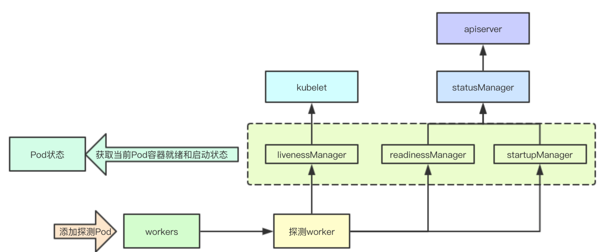

# kubelet容器探活机制

k8s为实现容器探活worker的管理构建了一个Manager组件，该组件负责底层探活worker的管理,并且缓存当前的容器的状态，并对外同步容器的当前状态，今天我们就来分析下其部分核心组件

# 1. 核心原理实现

# 2. 探活结果管理
即prober/results/results_manager组件，其主要作用是：存储探测结果和通知探测结果

代码路径`pkg/kubelet/prober/results/results_manager.go`


## 2.1 核心数据结构
cache负责容器的探测结果的保存，updates则负责对外更新状态的订阅，其通过新的结果和cache中的状态进行对比，从而决定是否对外通知

```go
// Manager implementation.
type manager struct {
	// 保护cache
	sync.RWMutex
	// 容器ID->探测结果
	cache map[kubecontainer.ContainerID]Result
	// 更新管道
	updates chan Update
}

```
## 2.2 更新缓存通知事件
更新缓存的时候回通过对比前后状态来进行是否发布变更事件，从而通知到外部订阅容器变更的kubelet核心流程
```go
func (m *manager) Set(id kubecontainer.ContainerID, result Result, pod *v1.Pod) {
	// 修改内部状态
    if m.setInternal(id, result) {
        // 同步更新事件
		m.updates <- Update{id, result, pod.UID}
	}
}
```
内部状态修改与判断是否进行同步实现

```go
// 如果之前的缓存不存在，或者前后状态不一致则会返回true触发更新
func (m *manager) setInternal(id kubecontainer.ContainerID, result Result) bool {
	m.Lock()
	defer m.Unlock()
	prev, exists := m.cache[id]
	if !exists || prev != result {
		m.cache[id] = result
		return true
	}
	return false
}
```
<a name="3ikkk"></a>
## 2.3 对外更新管道

```go

func (m *manager) Updates() <-chan Update {
	return m.updates
}
```
# 3.探测管理器
探测管理器是指的prober/prober)manager的Manager组件，其负责当前kubelet上面探活组件的管理，并且进行探测状态结果的缓存与同步，并且内部还通过statusManager来进行apiserver状态的同步

代码路径`pkg/kubelet/prober/prober_manager.go`
## 3.1 容器探测Key
每个探测Key包含要探测的目标信息：pod的ID、容器名、探测类型
```go
type probeKey struct {
	podUID        types.UID
	containerName string
	probeType     probeType
}
```

## 3.2 核心数据结构
statusManager组件在后续章节里面会进行详细分析,说下livenessManager该组件即探活的结果，所以当一个容器探测失败，则会由kubelet本地先进行处理，而readlinessManager和startupManager则需要通过statusManager同步给apiserver进行同步
```go
type manager struct {
	//探测Key与worker映射
	workers map[probeKey]*worker
	// 读写锁
	workerLock sync.RWMutex

	//statusManager缓存为探测提供pod IP和容器id。
	statusManager status.Manager

	// 存储readiness探测结果
	readinessManager results.Manager

	// 存储liveness探测结果
	livenessManager results.Manager

	// 存储startup探测结果
	startupManager results.Manager

	// 执行探测操作
	prober *prober
}
```
## 3.3 同步startup探测结果
```go
func (m *manager) updateStartup() {
    // 从管道获取数据进行同步
	update := <-m.startupManager.Updates()

	started := update.Result == results.Success
	m.statusManager.SetContainerStartup(update.PodUID, update.ContainerID, started)
}
```
## 3.4 同步readiness探测结果
```go
func (m *manager) updateReadiness() {
	update := <-m.readinessManager.Updates()

	ready := update.Result == results.Success
	m.statusManager.SetContainerReadiness(update.PodUID, update.ContainerID, ready)
}
```
## 3.5 启动同步探测结果后台任务
```go
func (m *manager) Start() {
	// Start syncing readiness.
	go wait.Forever(m.updateReadiness, 0)
	// Start syncing startup.
	go wait.Forever(m.updateStartup, 0)
}

```
## 3.6 添加Pod探测
添加 Pod的时候会遍历Pod的所有容器，并根据探测类型来进行对应探测worker的构建
```go
func (m *manager) AddPod(pod *v1.Pod) {
	m.workerLock.Lock()
	defer m.workerLock.Unlock()

	key := probeKey{podUID: pod.UID}
	for _, c := range pod.Spec.Containers {
		key.containerName = c.Name

        // 针对startupProbe的探测任务的构建
		if c.StartupProbe != nil && utilfeature.DefaultFeatureGate.Enabled(features.StartupProbe) {
			key.probeType = startup
			if _, ok := m.workers[key]; ok {
				klog.Errorf("Startup probe already exists! %v - %v",
					format.Pod(pod), c.Name)
				return
			}
            // 构建新的worker
			w := newWorker(m, startup, pod, c)
			m.workers[key] = w
			go w.run()
		}

        // 针对ReadinessProbe的探测任务的构建
		if c.ReadinessProbe != nil {
			key.probeType = readiness
			if _, ok := m.workers[key]; ok {
				klog.Errorf("Readiness probe already exists! %v - %v",
					format.Pod(pod), c.Name)
				return
			}
			w := newWorker(m, readiness, pod, c)
			m.workers[key] = w
			go w.run()
		}

        // 针对LivenessProbe的探测任务的构建
		if c.LivenessProbe != nil {
			key.probeType = liveness
			if _, ok := m.workers[key]; ok {
				klog.Errorf("Liveness probe already exists! %v - %v",
					format.Pod(pod), c.Name)
				return
			}
			w := newWorker(m, liveness, pod, c)
			m.workers[key] = w
			go w.run()
		}
	}
}
```
## 3.7 更新Pod状态
更新Pod状态主要是根据当前Manager里面缓存的之前的状态信息来更新Pod里面对应容器的状态，这些状态是Pod里面容器最新的探测状态，获取这些状态则是检测当前的容器是否已经就绪和启动，为后续更新流程做基础数据
### 3.7.1 容器状态更新
```go
	for i, c := range podStatus.ContainerStatuses {
		var ready bool
		// 检测容器状态
		if c.State.Running == nil {
			ready = false
		} else if result, ok := m.readinessManager.Get(kubecontainer.ParseContainerID(c.ContainerID)); ok {
			// 检测readinessMnager里面的状态，如果是成功则就是已经就绪
			ready = result == results.Success
		} else {
			// 检查是否有尚未运行的探测器。只要存在则认为就绪
			_, exists := m.getWorker(podUID, c.Name, readiness)
			ready = !exists
		}
		podStatus.ContainerStatuses[i].Ready = ready

		var started bool
		if c.State.Running == nil {
			started = false
		} else if !utilfeature.DefaultFeatureGate.Enabled(features.StartupProbe) {
			// 容器正在运行，如果StartupProbe功能被禁用，则假定它已启动
            started = true
		} else if result, ok := m.startupManager.Get(kubecontainer.ParseContainerID(c.ContainerID)); ok {
			// 如果startupManager里面的状态是成功的则认为是已经启动的
            started = result == results.Success
		} else {
			// 检查是否有尚未运行的探测器。
			_, exists := m.getWorker(podUID, c.Name, startup)
			started = !exists
		}
		podStatus.ContainerStatuses[i].Started = &started
	}
```
### 3.7.2 初始化容器状态更新
针对初始化容器主要容器已经终止并且退出的状态码为0,则认为初始化容器已经就绪
```go
	for i, c := range podStatus.InitContainerStatuses {
		var ready bool
		if c.State.Terminated != nil && c.State.Terminated.ExitCode == 0 {
			// 容器状态
			ready = true
		}
		podStatus.InitContainerStatuses[i].Ready = ready
	}
```
## 3.8 存活状态通知
存活状态通知主要是在kubelet的核心流程循环中进行的，如果检测到容器的状态失败，会立刻进行对应pod的容器状态的同步，从而决定下一步的操作是做什么
```go
	case update := <-kl.livenessManager.Updates():
		// 如果探测状态失败
		if update.Result == proberesults.Failure {
			// 省略代码
			handler.HandlePodSyncs([]*v1.Pod{pod})
		}
```