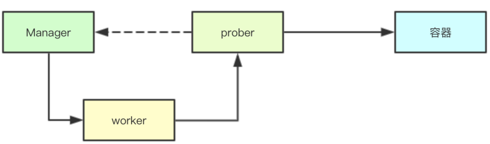
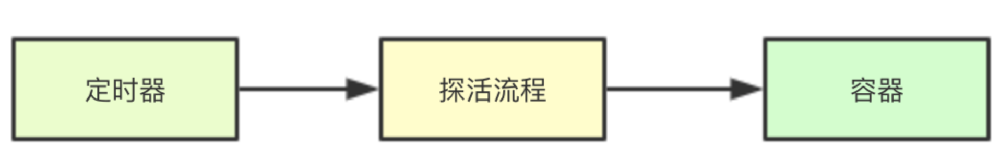
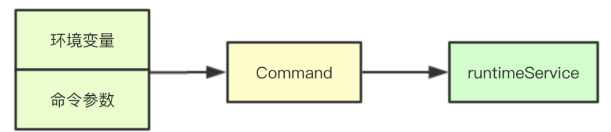
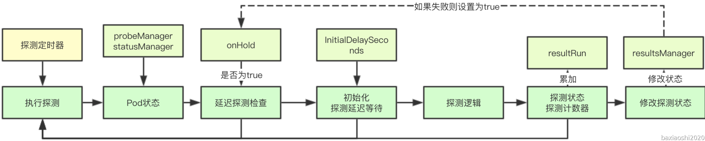

# kubelet容器探活机制实现

在k8s中通过kubelet拉起一个容器之后，用户可以指定探活的方式用于实现容器的健康性检查，目前支持TCP、Http和命令三种方式，今天介绍其整个探活模块的实现

代码路径`pkg/kubelet/prober/prober.go`

# 1. 探活的整体设计
## 1.1 线程模型


## 1.2 周期性探活


## 1.3 探活机制的实现


相对复杂的则是exec, 其首先要根据当前container的环境变量生成command,然后通过容器、命令、超时时间等构建一个Command最后才是调用runtimeService调用csi执行命令 

# 2.探活接口实现
## 2.1 核心成员结构
```go
type prober struct {
	exec execprobe.Prober
    // 我们可以看到针对readiness/liveness会分别启动一个http Transport来进行链接
	readinessHTTP httpprobe.Prober
	livenessHTTP  httpprobe.Prober
	startupHTTP   httpprobe.Prober
	tcp           tcpprobe.Prober
	runner        kubecontainer.ContainerCommandRunner

    // refManager主要是用于获取成员的引用对象
	refManager *kubecontainer.RefManager
    // recorder会负责探测结果事件的构建，并最终传递回 apiserver
	recorder   record.EventRecorder
}
```
<a name="A4MGu"></a>
## 2.2 探活主流程
探活的主流程主要是位于prober的probe方法中，其核心流程分为三段
<a name="EQFnz"></a>
### 2.2.1 获取探活的目标配置

```go
func (pb *prober) probe(probeType probeType, pod *v1.Pod, status v1.PodStatus, container v1.Container, containerID kubecontainer.ContainerID) (results.Result, error) {
var probeSpec *v1.Probe
// 根据探活的类型来获取对应位置的探活配置
	switch probeType {
	case readiness:
		probeSpec = container.ReadinessProbe
	case liveness:
		probeSpec = container.LivenessProbe
	case startup:
		probeSpec = container.StartupProbe
	default:
		return results.Failure, fmt.Errorf("unknown probe type: %q", probeType)
	}
```
<a name="FxueX"></a>
### 2.2.2 执行探活记录错误信息
如果返回的错误，或者不是成功或者警告的状态，则会获取对应的引用对象，然后通过 recorder进行事件的构造，发送结果返回apiserver
```go
// 执行探活流程	
result, output, err := pb.runProbeWithRetries(probeType, probeSpec, pod, status, container, containerID, maxProbeRetries)
	
	if err != nil || (result != probe.Success && result != probe.Warning) {
		// // 如果返回的错误，或者不是成功或者警告的状态
        // 则会获取对应的引用对象，然后通过 
		ref, hasRef := pb.refManager.GetRef(containerID)
		if !hasRef {
			klog.Warningf("No ref for container %q (%s)", containerID.String(), ctrName)
		}
		if err != nil {
			klog.V(1).Infof("%s probe for %q errored: %v", probeType, ctrName, err)
			recorder进行事件的构造，发送结果返回apiserver
            if hasRef {
				pb.recorder.Eventf(ref, v1.EventTypeWarning, events.ContainerUnhealthy, "%s probe errored: %v", probeType, err)
			}
		} else { // result != probe.Success
			klog.V(1).Infof("%s probe for %q failed (%v): %s", probeType, ctrName, result, output)
			// recorder进行事件的构造，发送结果返回apiserver
            if hasRef {
				pb.recorder.Eventf(ref, v1.EventTypeWarning, events.ContainerUnhealthy, "%s probe failed: %s", probeType, output)
			}
		}
		return results.Failure, err
	}
```
<a name="frDGs"></a>
### 2.2.3 探活重试实现
```go
func (pb *prober) runProbeWithRetries(probeType probeType, p *v1.Probe, pod *v1.Pod, status v1.PodStatus, container v1.Container, containerID kubecontainer.ContainerID, retries int) (probe.Result, string, error) {
	var err error
	var result probe.Result
	var output string
	for i := 0; i < retries; i++ {
		result, output, err = pb.runProbe(probeType, p, pod, status, container, containerID)
		if err == nil {
			return result, output, nil
		}
	}
	return result, output, err
}
```
<a name="l4VAF"></a>
### 2.2.4 根据探活类型执行探活

```go
func (pb *prober) runProbe(probeType probeType, p *v1.Probe, pod *v1.Pod, status v1.PodStatus, container v1.Container, containerID kubecontainer.ContainerID) (probe.Result, string, error) {
	timeout := time.Duration(p.TimeoutSeconds) * time.Second
	if p.Exec != nil {
		klog.V(4).Infof("Exec-Probe Pod: %v, Container: %v, Command: %v", pod, container, p.Exec.Command)
		command := kubecontainer.ExpandContainerCommandOnlyStatic(p.Exec.Command, container.Env)
		return pb.exec.Probe(pb.newExecInContainer(container, containerID, command, timeout))
	}
	if p.HTTPGet != nil {
        // 获取协议类型与 http参数信息
		scheme := strings.ToLower(string(p.HTTPGet.Scheme))
		host := p.HTTPGet.Host
		if host == "" {
			host = status.PodIP
		}
		port, err := extractPort(p.HTTPGet.Port, container)
		if err != nil {
			return probe.Unknown, "", err
		}
		path := p.HTTPGet.Path
		klog.V(4).Infof("HTTP-Probe Host: %v://%v, Port: %v, Path: %v", scheme, host, port, path)
		url := formatURL(scheme, host, port, path)
		headers := buildHeader(p.HTTPGet.HTTPHeaders)
		klog.V(4).Infof("HTTP-Probe Headers: %v", headers)
		switch probeType {
		case liveness:
			return pb.livenessHTTP.Probe(url, headers, timeout)
		case startup:
			return pb.startupHTTP.Probe(url, headers, timeout)
		default:
			return pb.readinessHTTP.Probe(url, headers, timeout)
		}
	}
	if p.TCPSocket != nil {
		port, err := extractPort(p.TCPSocket.Port, container)
		if err != nil {
			return probe.Unknown, "", err
		}
		host := p.TCPSocket.Host
		if host == "" {
			host = status.PodIP
		}
		klog.V(4).Infof("TCP-Probe Host: %v, Port: %v, Timeout: %v", host, port, timeout)
		return pb.tcp.Probe(host, port, timeout)
	}
	klog.Warningf("Failed to find probe builder for container: %v", container)
	return probe.Unknown, "", fmt.Errorf("missing probe handler for %s:%s", format.Pod(pod), container.Name)
}
```

<a name="l3hWg"></a>
# 3. worker工作线程
Worker工作线程执行探测，要考虑几个问题：<br />1.容器刚启动的时候可能需要等待一段时间，比如应用程序可能要做一些初始化的工作，还没有准备好<br />2.如果发现容器探测失败后重新启动，则在启动之前重复的探测也是没有意义的<br />3.无论是成功或者失败，可能需要一些阈值来进行辅助，避免单次小概率失败，重启容器
<a name="EefXo"></a>
## 3.1 核心成员 
其中关键参数除了探测配置相关，则主要是onHold参数，该参数用于决定是否延缓对容器的探测，即当容器重启的时候，需要延缓探测，resultRun则是一个计数器，不论是连续成功或者连续失败，都通过该计数器累加，后续会判断是否超过给定阈值
```go
type worker struct {
	// 停止channel
	stopCh chan struct{}

	// 包含探针的pod
	pod *v1.Pod

	// 容器探针
	container v1.Container

	// 探针配置
	spec *v1.Probe

	// 探针类型
	probeType probeType

	// The probe value during the initial delay.
	initialValue results.Result

	// 存储探测结果
	resultsManager results.Manager
	probeManager   *manager

	// 此工作进程的最后一个已知容器ID。
	containerID kubecontainer.ContainerID
	// 最后一次探测结果
	lastResult results.Result
	// 探测连续返回相同结果的此时
	resultRun int

	// 探测失败会设置为true不会进行探测 
	onHold bool

	// proberResultsMetricLabels holds the labels attached to this worker
	// for the ProberResults metric by result.
	proberResultsSuccessfulMetricLabels metrics.Labels
	proberResultsFailedMetricLabels     metrics.Labels
	proberResultsUnknownMetricLabels    metrics.Labels
}
```
<a name="M9ZvB"></a>
## 3.2 探测实现核心流程

### 3.2.1 失败容器探测中断
如果当前容器的状态已经被终止了，则就不需要对其进行探测了，直接返回即可
```go
	// 获取当前worker对应pod的状态
	status, ok := w.probeManager.statusManager.GetPodStatus(w.pod.UID)
	if !ok {
		// Either the pod has not been created yet, or it was already deleted.
		klog.V(3).Infof("No status for pod: %v", format.Pod(w.pod))
		return true
	}
	// 如果pod终止worker应该终止
	if status.Phase == v1.PodFailed || status.Phase == v1.PodSucceeded {
		klog.V(3).Infof("Pod %v %v, exiting probe worker",
			format.Pod(w.pod), status.Phase)
		return false
	}
```
### 3.2.2 延缓探测恢复
延缓探测恢复主要是指的在发生探测失败的情况下，会进行重启操作，在此期间不会进行探测，恢复的逻辑则是通过判断对应容器的id是否改变，通过修改onHold实现
```go
// 通过容器名字获取最新的容器信息	
c, ok := podutil.GetContainerStatus(status.ContainerStatuses, w.container.Name)
	if !ok || len(c.ContainerID) == 0 {
		// Either the container has not been created yet, or it was deleted.
		klog.V(3).Infof("Probe target container not found: %v - %v",
			format.Pod(w.pod), w.container.Name)
		return true // Wait for more information.
	}

	if w.containerID.String() != c.ContainerID {
        // 如果容器改变，则表明重新启动了一个容器
		if !w.containerID.IsEmpty() {
			w.resultsManager.Remove(w.containerID)
		}
		w.containerID = kubecontainer.ParseContainerID(c.ContainerID)
		w.resultsManager.Set(w.containerID, w.initialValue, w.pod)
		// 获取到一个新的容器，则就需要重新开启探测 
		w.onHold = false
	}

	if w.onHold {
		//如果当前设置延缓状态为true,则不进行探测
		return true
	}
```
### 3.2.3 初始化延迟探测
初始化延迟探测主要是指的容器的Running的运行时间小于配置的InitialDelaySeconds则直接返回
```go
	
if int32(time.Since(c.State.Running.StartedAt.Time).Seconds()) < w.spec.InitialDelaySeconds {
		return true
	}
```
<a name="k8sT3"></a>
### 3.2.4 执行探测逻辑
```go
	result, err := w.probeManager.prober.probe(w.probeType, w.pod, status, w.container, w.containerID)
	if err != nil {
		// Prober error, throw away the result.
		return true
	}

	switch result {
	case results.Success:
		ProberResults.With(w.proberResultsSuccessfulMetricLabels).Inc()
	case results.Failure:
		ProberResults.With(w.proberResultsFailedMetricLabels).Inc()
	default:
		ProberResults.With(w.proberResultsUnknownMetricLabels).Inc()
	}
```
### 3.2.5 累加探测计数
在累加探测计数之后，会判断累加后的计数是否超过设定的阈值，如果未超过则不进行状态变更
```go
	if w.lastResult == result {
		w.resultRun++
	} else {
		w.lastResult = result
		w.resultRun = 1
	}

	if (result == results.Failure && w.resultRun < int(w.spec.FailureThreshold)) ||
		(result == results.Success && w.resultRun < int(w.spec.SuccessThreshold)) {
		// Success or failure is below threshold - leave the probe state unchanged.
		// 成功或失败低于阈值-保持探测器状态不变。
		return true
	}
```
### 3.2.6 修改探测状态
如果探测状态发送改变，则需要先进行状态的保存，同时如果是探测失败，则需要修改onHOld状态为true即延缓探测，同时将计数器归0
```go
// 这里会修改对应的状态信息	
w.resultsManager.Set(w.containerID, result, w.pod)

	if (w.probeType == liveness || w.probeType == startup) && result == results.Failure {
		// 容器运行liveness/starup检测失败，他们需要重启, 停止探测，直到有新的containerID
		// 这是为了减少命中#21751的机会，其中在容器停止时运行 docker exec可能会导致容器状态损坏
		w.onHold = true
		w.resultRun = 0
	}
```
## 3.3 探测主循环流程
主流程就很简答了执行上面的探测流程
```go
func (w *worker) run() {
	// 根据探活周期来构建定时器
	probeTickerPeriod := time.Duration(w.spec.PeriodSeconds) * time.Second

	// If kubelet restarted the probes could be started in rapid succession.
	// Let the worker wait for a random portion of tickerPeriod before probing.
	time.Sleep(time.Duration(rand.Float64() * float64(probeTickerPeriod)))

	probeTicker := time.NewTicker(probeTickerPeriod)

	defer func() {
		// Clean up.
		probeTicker.Stop()
		if !w.containerID.IsEmpty() {
			w.resultsManager.Remove(w.containerID)
		}

		w.probeManager.removeWorker(w.pod.UID, w.container.Name, w.probeType)
		ProberResults.Delete(w.proberResultsSuccessfulMetricLabels)
		ProberResults.Delete(w.proberResultsFailedMetricLabels)
		ProberResults.Delete(w.proberResultsUnknownMetricLabels)
	}()

probeLoop:
	for w.doProbe() {
		// Wait for next probe tick.
		select {
		case <-w.stopCh:
			break probeLoop
		case <-probeTicker.C:
			// continue
		}
	}
}

```

