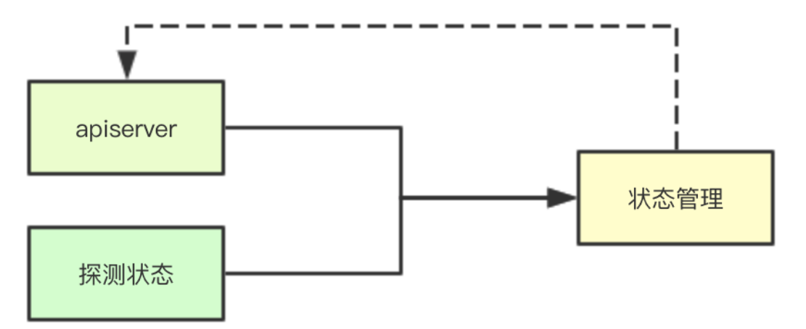
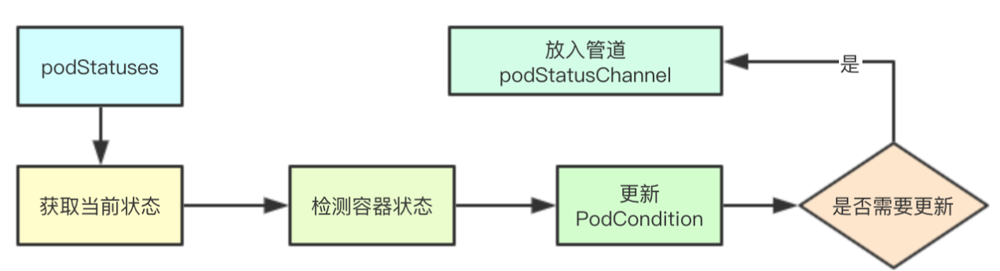
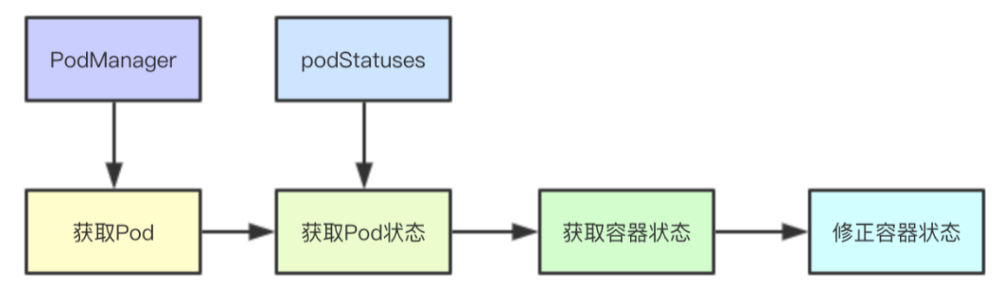
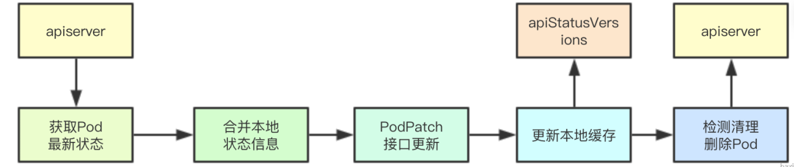

# kubelet容器状态同步管理

在K8s中将 Pod调度到某一台Node节点之后，后续的状态维护信息则是由对应机器上的kubelet进行维护，如何实时反馈本地运行状态，并通知apiserver则是设计的难点， 本节主要是通过感知Pod状态变化和探测状态改变两个流程来实际分析其核心数据结构，来了解内部设计

# 1. 状态管理

代码路径`pkg/kubelet/status/status_manager.go`

## 1.1 静态Pod

## 1.2 状态数据源

# 2. 版本一致性
```go
type versionedPodStatus struct {
	status v1.PodStatus
	// 单调递增的版本号（每个pod）
	version uint64
	// Pod name & namespace, for sending updates to API server.
	podName      string
	podNamespace string
}
```
在Kubelet中为保证与apiserver端信息的同步，在本地保存了一个Pod状态版本信息，其里面除了保存当前Pod的状态数据还有一个版本版本号，通过单调递增的版本号的对比来确定是否进行状态的同步
# 3. 核心源码实现
statusManager的流程其实还是蛮复杂的，今天我们就只讲一个场景，即kubelet通过apiserver感知到一个Pod更新，然后顺着该功能的数据流来进行梳理statusMangaer里面的数据流转
## 3.1 核心数据结构
manager中的核心状态相关的数据结构可以主要分为两大类：映射数据维护(podManager、podStatuses、apiStatusVersions)数据通信管道(podStatusChannel)， 剩余的则是对与apiserver通信的kublet和进行pod删除检查的 podDeletionSafety
```go
type manager struct {
	kubeClient clientset.Interface
        // 管理缓存Pod，包含镜像pod和静态pod的映射
	podManager kubepod.Manager
	// 从pod UID映射到相应pod的版本状态信息 。
	podStatuses      map[types.UID]versionedPodStatus
	podStatusesLock  sync.RWMutex
	podStatusChannel chan podStatusSyncRequest
	// 存储镜像pod的版本
	apiStatusVersions map[kubetypes.MirrorPodUID]uint64
	podDeletionSafety PodDeletionSafetyProvider
}
```
## 3.2 设置Pod状态
设置Pod状态主要是位于kubelet中的syncPod中，在接收到pod事件变更之后，会与apiserver进行 Pod最新数据的同步从而获取当前pod在apiserver端的最新状态
```go
func (m *manager) SetPodStatus(pod *v1.Pod, status v1.PodStatus) {
	m.podStatusesLock.Lock()
	defer m.podStatusesLock.Unlock()

	for _, c := range pod.Status.Conditions {
		if !kubetypes.PodConditionByKubelet(c.Type) {
			klog.Errorf("Kubelet is trying to update pod condition %q for pod %q. "+
				"But it is not owned by kubelet.", string(c.Type), format.Pod(pod))
		}
	}
	// Make sure we're caching a deep copy.
	status = *status.DeepCopy()

	// 如果Pod被删除了则需要强制与apiserver进行信息的同步
	m.updateStatusInternal(pod, status, pod.DeletionTimestamp != nil)
}
```
<a name="lcwUi"></a>
## 3.3 更新内部缓存状态产生同步事件

### 3.3.1 获取缓存状态

```go
	var oldStatus v1.PodStatus
	// 检测之前的本地缓存数据
	cachedStatus, isCached := m.podStatuses[pod.UID]
	if isCached {
		oldStatus = cachedStatus.status
	} else if mirrorPod, ok := m.podManager.GetMirrorPodByPod(pod); ok {
		oldStatus = mirrorPod.Status
	} else {
		oldStatus = pod.Status
	}
```
### 3.3.2 检测容器状态
检测容器状态主要是针对容器终止状态转发的合法性进行检测，其实就是根据设定的Pod的RestartPolicy来检测针对一个终止的容器是否可以进行重启
```go
	if err := checkContainerStateTransition(oldStatus.ContainerStatuses, status.ContainerStatuses, pod.Spec.RestartPolicy); err != nil {
		klog.Errorf("Status update on pod %v/%v aborted: %v", pod.Namespace, pod.Name, err)
		return false
	}
	if err := checkContainerStateTransition(oldStatus.InitContainerStatuses, status.InitContainerStatuses, pod.Spec.RestartPolicy); err != nil {
		klog.Errorf("Status update on pod %v/%v aborted: %v", pod.Namespace, pod.Name, err)
		return false
	}
```
### 3.3.3 更新PodCondition最后转换时间
通过最新的status里面的condition设定对应PodCondition的LastTransitionTime更新时间未当前时间
```go
	// Set ContainersReadyCondition.LastTransitionTime.
	updateLastTransitionTime(&status, &oldStatus, v1.ContainersReady)

	// Set ReadyCondition.LastTransitionTime.
	updateLastTransitionTime(&status, &oldStatus, v1.PodReady)

	// Set InitializedCondition.LastTransitionTime.
	updateLastTransitionTime(&status, &oldStatus, v1.PodInitialized)

	// Set PodScheduledCondition.LastTransitionTime.
	updateLastTransitionTime(&status, &oldStatus, v1.PodScheduled)
```
### 3.3.4 校对时间截断过长信息
首先会根据当前容器的个数，从而决定每个容器最大的字节数大小，然后对容器里面的终止状态里面的Message信息，进行截断，同时进行时间的校对
```go
	normalizeStatus(pod, &status)
```
### 3.3.5 状态更新条件检测
如果之前已经缓存了对应的数据，并且缓存的数据与当前的状态未发生改变，也不需要强制更新，就直接返回
```go
	if isCached && isPodStatusByKubeletEqual(&cachedStatus.status, &status) && !forceUpdate {
		// 如果不强制更新 ，默认是true此处不会成立
		klog.V(3).Infof("Ignoring same status for pod %q, status: %+v", format.Pod(pod), status)
		return false // No new status.
	}
```
### 3.3.6 生成同步事件更新缓存
生成最新的状态缓存数据，并且递增本地的版本信息
```go
	// 构建新的状态
	newStatus := versionedPodStatus{
		status:       status,
		version:      cachedStatus.version + 1, // 更新器缓存
		podName:      pod.Name,
		podNamespace: pod.Namespace,
	}
	// 更新新的缓存状态
	m.podStatuses[pod.UID] = newStatus

	select {
	case m.podStatusChannel <- podStatusSyncRequest{pod.UID, newStatus}: // 构建一个新的同步请求
		klog.V(5).Infof("Status Manager: adding pod: %q, with status: (%d, %v) to podStatusChannel",
			pod.UID, newStatus.version, newStatus.status)
		
		return true
	default:
		// Let the periodic syncBatch handle the update if the channel is full.
		// We can't block, since we hold the mutex lock.
		klog.V(4).Infof("Skipping the status update for pod %q for now because the channel is full; status: %+v",
			format.Pod(pod), status)
		return false
	}
```
## 3.4 探测状态更新

### 3.4.1 获取当前状态
```go
func (m *manager) SetContainerReadiness(podUID types.UID, containerID kubecontainer.ContainerID, ready bool) {
	m.podStatusesLock.Lock()
	defer m.podStatusesLock.Unlock()

	// 获取本地的容器
	pod, ok := m.podManager.GetPodByUID(podUID)
	if !ok {
		klog.V(4).Infof("Pod %q has been deleted, no need to update readiness", string(podUID))
		return
	}

	// 获取当前的状态
	oldStatus, found := m.podStatuses[pod.UID]
	if !found {
		klog.Warningf("Container readiness changed before pod has synced: %q - %q",
			format.Pod(pod), containerID.String())
		return
	}

	// 获取当前的容器状态
	containerStatus, _, ok := findContainerStatus(&oldStatus.status, containerID.String())
	if !ok {
		klog.Warningf("Container readiness changed for unknown container: %q - %q",
			format.Pod(pod), containerID.String())
		return
	}
```
### 3.4.2 检测状态是否发生改变

```go
	// 检测前后的就绪状态是否发生改变
	if containerStatus.Ready == ready {
		klog.V(4).Infof("Container readiness unchanged (%v): %q - %q", ready,
			format.Pod(pod), containerID.String())
		return
	}
```
### 3.4.3 修改容器的就绪状态
获取容器的状态，修改就绪为当前的状态
```go
	status := *oldStatus.status.DeepCopy()
	containerStatus, _, _ = findContainerStatus(&status, containerID.String())
	containerStatus.Ready = ready
```
### 3.4.4 根据最新的容器状态修改
会根据当前运行时的容器探测的状态，来修改对应PodCondition里面的状态，最后调用内部的更新逻辑
```go
	updateConditionFunc := func(conditionType v1.PodConditionType, condition v1.PodCondition) {
		conditionIndex := -1
		// 获取Pod对应的PodCondition状态
		for i, condition := range status.Conditions {
			if condition.Type == conditionType {
				conditionIndex = i
				break
			}
		}
        // 修改或追加Pod对应的PodCondition状态
		if conditionIndex != -1 {
			status.Conditions[conditionIndex] = condition
		} else {
			klog.Warningf("PodStatus missing %s type condition: %+v", conditionType, status)
			status.Conditions = append(status.Conditions, condition)
		}
	}
	// 计算Ready状态
	updateConditionFunc(v1.PodReady, GeneratePodReadyCondition(&pod.Spec, status.Conditions, status.ContainerStatuses, status.Phase))
	// 计算容器Ready状态
	updateConditionFunc(v1.ContainersReady, GenerateContainersReadyCondition(&pod.Spec, status.ContainerStatuses, status.Phase))
	m.updateStatusInternal(pod, status, false)
```
## 3.5 启动后台同步任务
statusManager会启动一个后台的线程来进行更新管道里面同步请求的消费
```go
func (m *manager) Start() {
	// 省略非核心代码
	go wait.Forever(func() {
		select {
		case syncRequest := <-m.podStatusChannel:
			// 获取最新的状态信息，更新apiserver
			klog.V(5).Infof("Status Manager: syncing pod: %q, with status: (%d, %v) from podStatusChannel",
				syncRequest.podUID, syncRequest.status.version, syncRequest.status.status)
			m.syncPod(syncRequest.podUID, syncRequest.status)
		case <-syncTicker:
			m.syncBatch()
		}
	}, 0)
}
```
## 3.6 同步Pod状态

### 3.6.1 同步条件检测
同步条件检测主要是检测镜像Pod的版本是否发送变化、Pod当前是否被删除，如果pod没有被删除则返回false,即对一个没有删除的Pod我们还是需要继续更新其状态的
```go
	if !m.needsUpdate(uid, status) {
		klog.V(1).Infof("Status for pod %q is up-to-date; skipping", uid)
		return
	}
```
### 3.6.2 通过apiserver获取最新Pod数据
如果没有获取到Pod信息，则直接进行退出即可
```go
	pod, err := m.kubeClient.CoreV1().Pods(status.podNamespace).Get(status.podName, metav1.GetOptions{})
	if errors.IsNotFound(err) {
		klog.V(3).Infof("Pod %q does not exist on the server", format.PodDesc(status.podName, status.podNamespace, uid))
		// 如果Pod已经被删除了，就直接退出就行
		return
	}
	if err != nil {
		klog.Warningf("Failed to get status for pod %q: %v", format.PodDesc(status.podName, status.podNamespace, uid), err)
		return
	}

```
### 3.6.3 调用Patch接口进行更新
这里面会通过将最小的状态与之前的状态来进行merge合并，然后调用kubeClient进行apiserver端状态的修改
```go
	oldStatus := pod.Status.DeepCopy()
	// 更新服务端的状态
	newPod, patchBytes, err := statusutil.PatchPodStatus(m.kubeClient, pod.Namespace, pod.Name, pod.UID, *oldStatus, mergePodStatus(*oldStatus, status.status))
	klog.V(3).Infof("Patch status for pod %q with %q", format.Pod(pod), patchBytes)
	if err != nil {
		klog.Warningf("Failed to update status for pod %q: %v", format.Pod(pod), err)
		return
	}
```
### 3.6.4 更新本地的Apiserver端的版本信息

```go
	// 当前是最新的状态
	pod = newPod

	klog.V(3).Infof("Status for pod %q updated successfully: (%d, %+v)", format.Pod(pod), status.version, status.status)
	m.apiStatusVersions[kubetypes.MirrorPodUID(pod.UID)] = status.version
```
### 3.6.5 检测删除Pod
这里主要是最后阶段，即Pod对应的资源都已经释放了，则才最终删除apiserver端的Pod
```go
// 如果pod的DeletionTimestamp被设置，则对应的Pod需要被删除
if m.canBeDeleted(pod, status.status) {
		deleteOptions := metav1.NewDeleteOptions(0)
		
		deleteOptions.Preconditions = metav1.NewUIDPreconditions(string(pod.UID))
		//  调用apiserver对Pod进行删除
		err = m.kubeClient.CoreV1().Pods(pod.Namespace).Delete(pod.Name, deleteOptions)
		if err != nil {
			klog.Warningf("Failed to delete status for pod %q: %v", format.Pod(pod), err)
			return
		}
		klog.V(3).Infof("Pod %q fully terminated and removed from etcd", format.Pod(pod))
		m.deletePodStatus(uid)
	}
```

