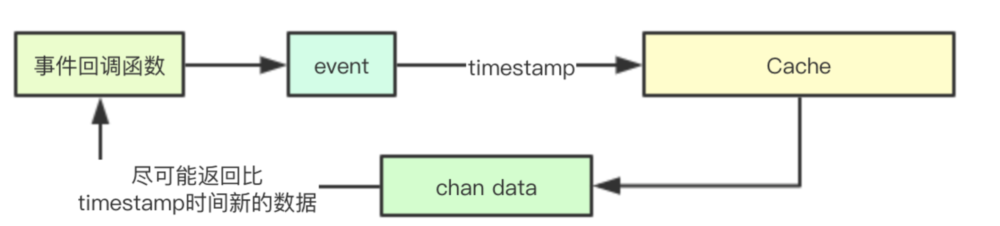
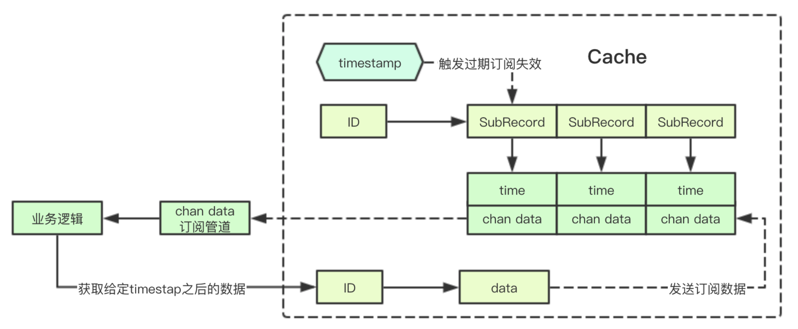

# kubelet容器运行时状态缓存

缓存和发布订阅都是后端开发中常用的手段，其中缓存主要是用于可丢失数据的暂存，发布订阅主要是用于消息传递，今天给大家介绍一个k8s中带有发布订阅的缓存实现，其目标是给定一个时间，只关注该时间后续的事件，主要是用于近实时状态数据的获取

代码路径`pkg/kubelet/container/cache.go`
# 1. 业务背景

在k8s中的kubelet中支持不同的容器运行时，为了缓存容器运行时当前所有可见的Pod/Container就构造了一个Cache结构，当一个事件发生后，kubelet接收到事件后，此时需要获取当前Pod的状态，此时要获取的状态，就必须要求是在事件产生后的最新的状态，而不能是之前的状态

# 2. 核心实现

## 2.1 数据与订阅记录
### 2.1.1 状态数据
状态数据主要是存储一个pod的状态数据
```go
type data struct {
	// 存储Pod的状态
	status *PodStatus
	// 试图检测Pod状态出错信息
	err error
	// 上次数据的修改时间
	modified time.Time
}

```
### 2.1.2 订阅记录
订阅记录其实指的是一个订阅需求，其通过一个chan来进行数据通知，其中time字段是过滤条件，即只有时间大于time的记录才允许被加入到chan中
```go
type subRecord struct {
	time time.Time
	ch   chan *data
}
```
## 2.2 Cache实现
### 2.2.1 核心成员结构
cache里面的数据在kubelet每次进行PLEG更新的时候，都会更新timestamp,并且会重新获取最新的Pod状态进行填充cache,所以这里会更新timestamp,寓意着让之前旧的状态都过期，并且会针对旧的订阅的进行数据的返回
```go
// cache implements Cache.
type cache struct {
	// 读写锁
	lock sync.RWMutex
	// 存储Pod的状态数据,用于满足不带时间戳的状态获取
	pods map[types.UID]*data
    // 全局时间戳，即当前缓存中的数据，至少都要比该时间戳新
	timestamp *time.Time
	//存储对应Pod的定语记录列表
	subscribers map[types.UID][]*subRecord
}
```
### 2.2.3 普通状态数据获取
普通状态获取即直接通过Map来进行数据的返回
```go
func (c *cache) Get(id types.UID) (*PodStatus, error) {
	c.lock.RLock()
	defer c.lock.RUnlock()
	d := c.get(id)
	return d.status, d.err
}


```
### 2.2.4 默认状态构造器
当发现当前的cahce中并不存在对应的数据，则是直接根据ID来生成一个默认的状态数据
```go
func (c *cache) get(id types.UID) *data {
	d, ok := c.pods[id]
	if !ok {
		return makeDefaultData(id)
	}
	return d
}
// 默认状态构造器
func makeDefaultData(id types.UID) *data {
	return &data{status: &PodStatus{ID: id}, err: nil}
}
```
### 2.2.5 最新状态数据获取
会给定一个时间戳，只有当当前缓存的数据的时间在该时间戳之后，才有效，否则返回nil,这里有个关键点就是timestamp的相关设计，因为在每个PLEG周期中，都会更新timestamp

如果minTime<globalTimestamp, 则意味着在已经有新一轮的更新，而你这个事件还是上一轮的事件，则可能就是事件的处理太慢，此时就会将之前缓存的状态，直接返回，因为下一轮很有可能会有新的事件到来
```go
func (c *cache) getIfNewerThan(id types.UID, minTime time.Time) *data {
	// 获取当前的状态
	d, ok := c.pods[id]

    // 如果全局时间戳大于给定的时间，则会直接返回
	globalTimestampIsNewer := (c.timestamp != nil && c.timestamp.After(minTime))
	if !ok && globalTimestampIsNewer {
		// 状态没有缓存，但是全局时间比最小时间新，就直接返回
		return makeDefaultData(id)
	}
    // 如果之前数据的时间在获取时间之后，或者全局时间已经更新
	if ok && (d.modified.After(minTime) || globalTimestampIsNewer) {
		return d
	}
	// The pod status is not ready.
	return nil
}
```

### 2.2.6 订阅状态管道构造
订阅管道最终会返回一个状态的管道，同时会进行检查，如果发现当前有可用数据，则会直接丢进管道中，否则则创建一个subRecords订阅记录，并保存
```go
func (c *cache) subscribe(id types.UID, timestamp time.Time) chan *data {
	ch := make(chan *data, 1)
	c.lock.Lock()
	defer c.lock.Unlock()
    // 获取状态数据
	d := c.getIfNewerThan(id, timestamp)
	if d != nil {
		// 如果已经有状态数据，则立即返回
		ch <- d
		return ch
	}
	// 否则添加一个订阅记录到subscribers中对应的列表中
	c.subscribers[id] = append(c.subscribers[id], &subRecord{time: timestamp, ch: ch})
	return ch
}
```
### 2.2.7 通知清理过期管道
通知的时候回根据subRecord的订阅时间进行检测，如果订阅时间已经超过当前的 timestamp则直接获取数据进行返回，最后只会保留那些还未过期的订阅记录
```go
func (c *cache) notify(id types.UID, timestamp time.Time) {
	// 获取事件的ID列表
	list, ok := c.subscribers[id]
	if !ok {
		// No one to notify.
		return
	}
	newList := []*subRecord{}
    // 遍历所有的订阅记录subRecords
	for i, r := range list {
		// 如果这些订阅记录的时间在timestamp之前,就不进行操作, 即当前管道时间>timestamp
		if timestamp.Before(r.time) {
			newList = append(newList, list[i])
			continue
		}
		// 获取一个数据返回, 同时关闭管道
		r.ch <- c.get(id)
		close(r.ch)
	}
	if len(newList) == 0 {
		// 如果不存在订阅记录，则就删除对应的key
		delete(c.subscribers, id)
	} else {
		// 剩余的订阅列表
		c.subscribers[id] = newList
	}
}
```
### 2.2.8 全局时间戳更新
全局时间戳更新，则会遍历所有的订阅，以最新的全局时间戳作为时间，进行通知
```go
func (c *cache) UpdateTime(timestamp time.Time) {
	c.lock.Lock()
	defer c.lock.Unlock()
	c.timestamp = &timestamp
	// Notify all the subscribers if the condition is met.
	for id := range c.subscribers {
		c.notify(id, *c.timestamp)
	}
}

```
### 2.2.9 Pod事件更新通知函数
更新的时候，则会调用notify来进行通知
```go
func (c *cache) Set(id types.UID, status *PodStatus, err error, timestamp time.Time) {
	c.lock.Lock()
	defer c.lock.Unlock()
    // 进行事件的通知
	defer c.notify(id, timestamp)
    // 保存最新的状态数据 
	c.pods[id] = &data{status: status, err: err, modified: timestamp}
}
```
