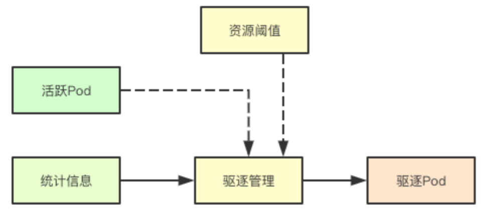
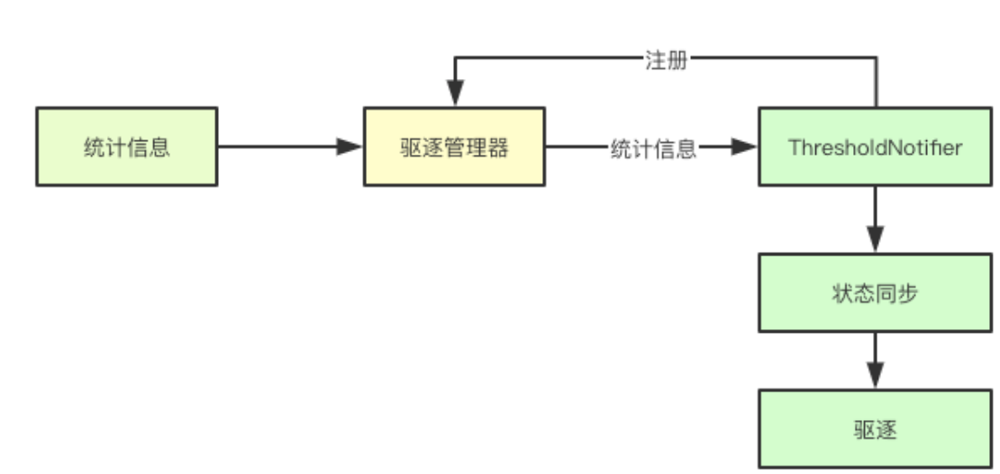
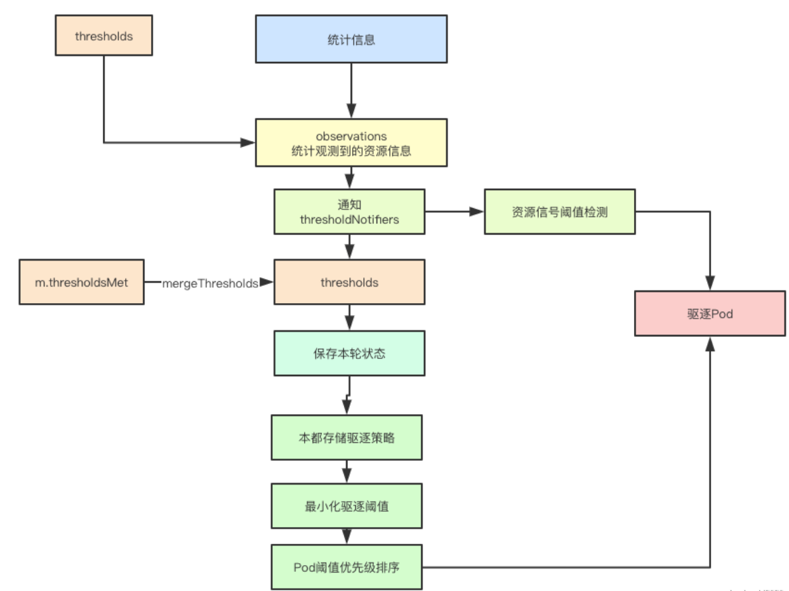

# 007.kubelet驱逐管理实现

驱逐管理是kubelet自我保护的一种机制，当资源缺乏的时候，通过阈值和策略主动驱逐部分的Pod从而保持系统的资源水位在一个合理的范围内，本身的策略官方文档上已经写的很详细，今天只是看下其在代码上的一些设计

# 1. 设计臆测

## 1.1 驱逐总体流程

## 1.2 基于观察者模式的观测

在驱逐管理器中基于观察者模式实现对特殊资源驱逐管理的支持，比如内存资源，在某些情况下即时当前的资源水位没有达到阈值，也可能会触发oom killer这个时候，对应的ThresholdNotifier也会尝试进行状态同步，从而确定是否要主动的驱逐一些节点， 目前这个特性应该还没开， 同理如果这个资源有专属的阈值监测，则在后续驱逐Pod的时候，如果是由该资源触发的驱逐，则优先级会被降低
# 2. 核心数据结构
驱逐管理器内部有很多的数据结构，这里我们只关注其整体实现的关键数据结构
## 2.1 阈值与信号
### 2.1.1 Signal
kubelet主要是根据当前系统中的资源来进行驱逐决策的，而信号就表示某种具体可以触发驱逐的资源，比如可用内存，在驱逐决策的时候，会根据统计信息来进行对应资源的计算

代码路径`pkg/kubelet/eviction/api/types.go`
```go

type Signal string

const (
	// 省略其他资源
	SignalMemoryAvailable Signal = "memory.available"
	
	SignalNodeFsAvailable Signal = "nodefs.available"

)
```

### 2.1.2 Threshold
信号表示某种资源，而Threshold则表示某类资源的阈值
```go

type Threshold struct {
	Signal Signal
	Operator ThresholdOperator
	Value ThresholdValue
	GracePeriod time.Duration
	MinReclaim *ThresholdValue
}

```

# 3. 驱逐核心流程

## 3.1 资源准备阶段
资源准备阶段，主要是为后面的决策做准备，首先要获取当前所有活跃的pod信息(后面从中挑选可以驱逐的Pod), 然后还要获取当前的统计信息、阈值

代码路径`pkg/kubelet/eviction/eviction_manager.go`
```go
	thresholds := m.config.Thresholds
    ...
	// 获取Pod活跃信息
	activePods := podFunc()
	updateStats := true
	// 获取统计信息
	summary, err := m.summaryProvider.Get(updateStats)
    ...
```
## 3.2 周期性阈值监测
针对之前注册的专有资源的阈值则会尝试通知进行检测

代码路径`pkg/kubelet/eviction/eviction_manager.go`
```go

	if m.clock.Since(m.thresholdsLastUpdated) > notifierRefreshInterval {
		m.thresholdsLastUpdated = m.clock.Now()
		for _, notifier := range m.thresholdNotifiers {
			// 更新summary通知
			if err := notifier.UpdateThreshold(summary); err != nil {
				klog.Warningf("eviction manager: failed to update %s: %v", notifier.Description(), err)
			}
		}
	}
```
## 3.3 获取观测状态
首先第一步会通过统计信息来获取当前已经观测的信号的真实使用资源

代码路径`pkg/kubelet/eviction/eviction_manager.go`
```go
observations, statsFunc := makeSignalObservations(summary)
```
代码路径`pkg/kubelet/eviction/helpers.go`
```go

func makeSignalObservations(summary *statsapi.Summary) (signalObservations, statsFunc) {
	statsFunc := cachedStatsFunc(summary.Pods)
	result := signalObservations{}

	if memory := summary.Node.Memory; memory != nil && memory.AvailableBytes != nil && memory.WorkingSetBytes != nil {
		result[evictionapi.SignalMemoryAvailable] = signalObservation{
			available: resource.NewQuantity(int64(*memory.AvailableBytes), resource.BinarySI),
			capacity:  resource.NewQuantity(int64(*memory.AvailableBytes+*memory.WorkingSetBytes), resource.BinarySI),
			time:      memory.Time,
		}
	}
 	// 省略大部分信息
	return result, statsFunc
}
```
## 3.4 获取被处罚的阈值
通过当前的观测状态和之前的所有配置的阈值配置，来进行获取那些被处罚的阈值, 这里最后一个false表示当前这是第一次检测，先不要使用强制最小回收
```go
thresholds = thresholdsMet(thresholds, observations, false)
```
## 3.5 阈值检测实现
阈值检测主要是通过观测的状态里面对应资源的容量和阈值，确定对应的容量信息，然后与实际的资源统计信息进行对比，如果超过则表明当前阈值达到，其中enforceMinReclaim则是否强制最小回收，只需要在实际容量里面加上强制最小回收那部分资源，就实现了

代码路径`pkg/kubelet/eviction/helpers.go`
```go
func thresholdsMet(thresholds []evictionapi.Threshold, observations signalObservations, enforceMinReclaim bool) []evictionapi.Threshold {
	results := []evictionapi.Threshold{}
	for i := range thresholds {
		threshold := thresholds[i]
		// 获取当前阈值信号的观测状态
		observed, found := observations[threshold.Signal]
		if !found {
			klog.Warningf("eviction manager: no observation found for eviction signal %v", threshold.Signal)
			continue
		}
		// 确定是否达到阈值
		thresholdMet := false
		// 计算
		quantity := evictionapi.GetThresholdQuantity(threshold.Value, observed.capacity)
		// 如果指定了enforceMinReclaim，则比较相对于值-minreclaim
		if enforceMinReclaim && threshold.MinReclaim != nil {
            // 强制最小回收，其实就是在之前阈值的基础上，在加上最小回收的资源
			quantity.Add(*evictionapi.GetThresholdQuantity(*threshold.MinReclaim, observed.capacity))
		}
		thresholdResult := quantity.Cmp(*observed.available)
		switch threshold.Operator {
		case evictionapi.OpLessThan:
			thresholdMet = thresholdResult > 0
		}
		if thresholdMet {
			results = append(results, threshold)
		}
	}
	return results
}
```
## 3.6 前后阈值合并
每次检测完毕后，evictionManager都会讲本轮所有触发的阈值保存在自身的thresholdsMet字段中，在下一轮会检测该资源是否得到满足，即通过之前的阈值和当前的观测状态来进行对比，从而发现那些依旧未被满足的阈值，合并到本轮的阈值中
```go
	if len(m.thresholdsMet) > 0 {
		// 没有被解决的thresholdMet, 进行合并
		thresholdsNotYetResolved := thresholdsMet(m.thresholdsMet, observations, true)
		thresholds = mergeThresholds(thresholds, thresholdsNotYetResolved)
	}
```
## 3.7 NodeConditions
在检测到有阈值被触发的时候，会根据阈值的信号类型来进行筛选，如果是对应的资源的类型有压力，则会在kubelet的准入控制在pod创建的时候，可能会不允许Pod的创建
```go
	nodeConditions := nodeConditions(thresholds)
	if len(nodeConditions) > 0 {
		klog.V(3).Infof("eviction manager: node conditions - observed: %v", nodeConditions)
	}

	nodeConditionsLastObservedAt := nodeConditionsLastObservedAt(nodeConditions, m.nodeConditionsLastObservedAt, now)

	nodeConditions = nodeConditionsObservedSince(nodeConditionsLastObservedAt, m.config.PressureTransitionPeriod, now)
	if len(nodeConditions) > 0 {
		klog.V(3).Infof("eviction manager: node conditions - transition period not met: %v", nodeConditions)
	}

```
## 3.8 保存内部状态

```go
	// update internal state
	m.Lock()
	m.nodeConditions = nodeConditions
	m.thresholdsFirstObservedAt = thresholdsFirstObservedAt
	m.nodeConditionsLastObservedAt = nodeConditionsLastObservedAt
	m.thresholdsMet = thresholds

	// determine the set of thresholds whose stats have been updated since the last sync
	thresholds = thresholdsUpdatedStats(thresholds, observations, m.lastObservations)
	debugLogThresholdsWithObservation("thresholds - updated stats", thresholds, observations)

	m.lastObservations = observations
	m.Unlock()
```
## 3.9 本地临时存储驱逐策略
针对本地临时存储资源的计算，主要是计算emptyDIr、临时Pod存储、容器日志几个本地临时存储资源的统计，进行pod的驱逐
```go
	if utilfeature.DefaultFeatureGate.Enabled(features.LocalStorageCapacityIsolation) {
		if evictedPods := m.localStorageEviction(summary, activePods); len(evictedPods) > 0 {
			return evictedPods
		}
	}
```
## 3.10 最小化驱逐阈值驱逐策略
首先会尝试找到那些配置了最小化资源的进行抢占
```go
	thresholdToReclaim, resourceToReclaim, foundAny := getReclaimableThreshold(thresholds)
	if !foundAny {
		return nil
	}
```
## 3.11 优先级排序
根据对应的资源类型和当前的活跃的pod来进行优先级的排序
```go
	// rank the thresholds by eviction priority
	sort.Sort(byEvictionPriority(thresholds))

	rank, ok := m.signalToRankFunc[thresholdToReclaim.Signal]
	if !ok {
		klog.Errorf("eviction manager: no ranking function for signal %s", thresholdToReclaim.Signal)
		return nil
	}

	// the only candidates viable for eviction are those pods that had anything running.
	if len(activePods) == 0 {
		klog.Errorf("eviction manager: eviction thresholds have been met, but no pods are active to evict")
		return nil
	}

	// 对指定资源的要逐出的正在运行的pod进行排序
	rank(activePods, statsFunc)
```
## 3.12 尝试驱逐Pod
每次至少会尝试驱逐一个Pod节点
```go
	for i := range activePods {
		pod := activePods[i]
		gracePeriodOverride := int64(0)
		if !isHardEvictionThreshold(thresholdToReclaim) {
			gracePeriodOverride = m.config.MaxPodGracePeriodSeconds
		}
		message, annotations := evictionMessage(resourceToReclaim, pod, statsFunc)
		// 驱逐pod
		if m.evictPod(pod, gracePeriodOverride, message, annotations) {
			metrics.Evictions.WithLabelValues(string(thresholdToReclaim.Signal)).Inc()
			return []*v1.Pod{pod}
		}
	}
```
## 3.13 内存资源优先级排序算法
优先级排序主要从三个方面进行排序：是否超量、Pod优先级、超出容量的大小
<a name="m6eha"></a>
### 3.13.1 内存超量对比
根据容器的时机使用量和对应Resource里面Request请求的资源，来对返回true或，
```go
func exceedMemoryRequests(stats statsFunc) cmpFunc {
	return func(p1, p2 *v1.Pod) int {
		p1Stats, p1Found := stats(p1)
		p2Stats, p2Found := stats(p2)
		if !p1Found || !p2Found {
			return cmpBool(!p1Found, !p2Found)
		}

		p1Memory := memoryUsage(p1Stats.Memory)
		p2Memory := memoryUsage(p2Stats.Memory)
		p1ExceedsRequests := p1Memory.Cmp(v1resource.GetResourceRequestQuantity(p1, v1.ResourceMemory)) == 1
		p2ExceedsRequests := p2Memory.Cmp(v1resource.GetResourceRequestQuantity(p2, v1.ResourceMemory)) == 1
		// prioritize evicting the pod which exceeds its requests
		return cmpBool(p1ExceedsRequests, p2ExceedsRequests)
	}
}
```
### 3.13.2 资源时机超量计算
计算时机使用内存使用超量对比
```go
func memory(stats statsFunc) cmpFunc {
	return func(p1, p2 *v1.Pod) int {
		p1Stats, p1Found := stats(p1)
		p2Stats, p2Found := stats(p2)
		if !p1Found || !p2Found {
			// prioritize evicting the pod for which no stats were found
			return cmpBool(!p1Found, !p2Found)
		}

		// adjust p1, p2 usage relative to the request (if any)
		p1Memory := memoryUsage(p1Stats.Memory)
		p1Request := v1resource.GetResourceRequestQuantity(p1, v1.ResourceMemory)
		p1Memory.Sub(p1Request)

		p2Memory := memoryUsage(p2Stats.Memory)
		p2Request := v1resource.GetResourceRequestQuantity(p2, v1.ResourceMemory)
		p2Memory.Sub(p2Request)

		// prioritize evicting the pod which has the larger consumption of memory
		return p2Memory.Cmp(*p1Memory)
	}
}
```
### 3.13.3 优先级策略对比
```go
func priority(p1, p2 *v1.Pod) int {
	priority1 := pod.GetPodPriority(p1)
	priority2 := pod.GetPodPriority(p2)
	if priority1 == priority2 {
		return 0
	}
	if priority1 > priority2 {
		return 1
	}
	return -1
}
```

没有写内存的memoryThresholdNotifier的实现，留着下篇，里面会有一些unix本地通讯的实现，感觉还蛮好玩的，下篇再见

