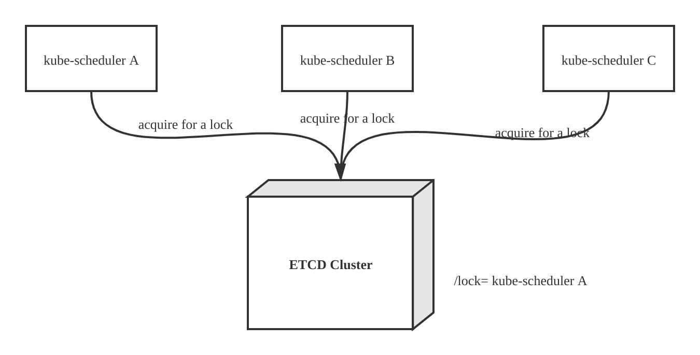
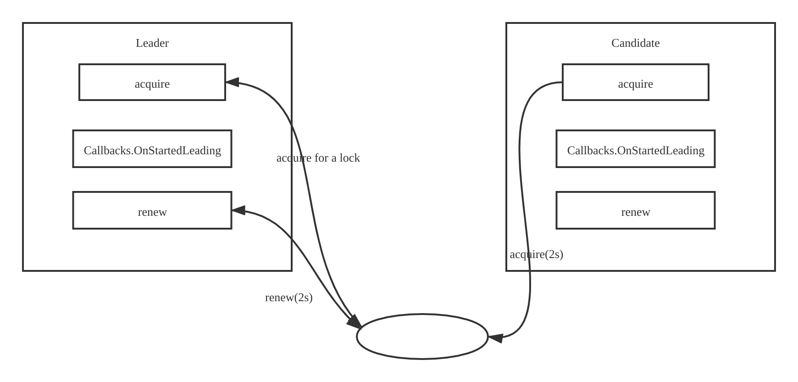

## 前言
在k8s集群中，允许同时运行多个kube-scheduler节点，其中正常工作的只有一个kube-scheduler节点(即领导节点)，其他的节点为候选(Candidate)节点并处于阻塞状态。
在领导接待你因为某些原因退出时，其他候选节点则通过领导选举机制竞选，由一个候选节点成为领导节点并接替继续工作


## 领导选举机制


领导选举机制是分布式锁机制的一种，实现分布式锁有多种方式，例如可以听过zookeeper,redis,etcd等。k8s系统依赖ETCD做存储服务，系统中其他组件也是通过Etcd实现分布式锁的。

kube-scheduler组件实现分布式锁原理如下:
- 分布式锁以来Etcd上的一个key,key的操作都是原子操作。将key作为分布式锁，它有两种状态-存在和不存在
- key不存在时:多节点中的一个节点成功创建该key(获得锁)并写入自身节点信息，获得锁的节点被成为领导节点。领导节点会定时更新(续约)该key的信息
- key存在时:其他节点处于阻塞状态并定时获取锁，这些节点被成为候选节点。候选节点定时获取锁的过程如下：定时获取key的数据，验证数据中领导者租约是否到期，如未到期则不能抢占它，如已到期则更新key并写入自身节点信息，更新成功则成为领导节点

## 资源锁
k8s支持3种类型资源锁，资源锁的意思就是基于Etcd集群的key在依赖于kubernetes的某种资源下创建的分布式锁。3中资源锁介绍如下：
- EndpointsResourceLock: 依赖于Endpoints资源，默认资源锁为该类型
- ConfigMapsResourceLock: 依赖于ConfigMap类型
- LeasesResourceLock: 依赖于Leases资源

可以通过--leader-elect-lock参数指定使用那种资源锁。默认EndpointsResourceLock，它的key存在etcd集群的/registry/services/endpoints/kube-system/kube-scheduler中。该key中存储的是竞选为领导的节点信息，它通过LeaderElectionRecord结构提进行描述。

代码路径`vendor/k8s.io/client-go/tools/leaderelection/resourcelock/interface.go`
```go
type LeaderElectionRecord struct {
	// HolderIdentity is the ID that owns the lease. If empty, no one owns this lease and
	// all callers may acquire. Versions of this library prior to Kubernetes 1.14 will not
	// attempt to acquire leases with empty identities and will wait for the full lease
	// interval to expire before attempting to reacquire. This value is set to empty when
	// a client voluntarily steps down.
	HolderIdentity       string      `json:"holderIdentity"`
	LeaseDurationSeconds int         `json:"leaseDurationSeconds"`
	AcquireTime          metav1.Time `json:"acquireTime"`
	RenewTime            metav1.Time `json:"renewTime"`
	LeaderTransitions    int         `json:"leaderTransitions"`
}
```
- HolderIdentity： 领导者身份标识，通常为Hostname_<hash值>
- LeaseDurationSeconds： 领导者租约时长
- AcquireTime： 领导者获取锁的时间
- RenewTime： 领导者续租的时间
- LeaderTransitions： 领导者选举切换的次数

每种资源锁都实现了对key的操作方法，他的接口定义如下

代码路径`vendor/k8s.io/client-go/tools/leaderelection/resourcelock/interface.go`
```go
type Interface interface {
	// Get returns the LeaderElectionRecord
	Get() (*LeaderElectionRecord, error)

	// Create attempts to create a LeaderElectionRecord
	Create(ler LeaderElectionRecord) error

	// Update will update and existing LeaderElectionRecord
	Update(ler LeaderElectionRecord) error

	// RecordEvent is used to record events
	RecordEvent(string)

	// Identity will return the locks Identity
	Identity() string

	// Describe is used to convert details on current resource lock
	// into a string
	Describe() string
}

```
## 领导者的选举过程



le.acquire函数尝试从Etcd中获取资源锁，领导者节点获取到资源锁后会执行kube-scheduler的主要逻辑(即le.config.Callbacks.OnStartedLeading回调函数)，并通过
le.renew函数定时(默认2s)对资源锁续约。候选节点获取不到资源锁，它不会退出并定时(默认2s)尝试获取资源锁，知道成功为止。

代码路径`vendor/k8s.io/client-go/tools/leaderelection/leaderelection.go：172`
```go
func (le *LeaderElector) Run(ctx context.Context) {
	defer func() {
		runtime.HandleCrash()
		le.config.Callbacks.OnStoppedLeading()
	}()
	if !le.acquire(ctx) {
		return // ctx signalled done
	}
	ctx, cancel := context.WithCancel(ctx)
	defer cancel()
	go le.config.Callbacks.OnStartedLeading(ctx)
	le.renew(ctx)
}
```
#### 1. 资源锁获取过程
```
func (le *LeaderElector) acquire(ctx context.Context) bool {
	ctx, cancel := context.WithCancel(ctx)
	defer cancel()
	succeeded := false
	desc := le.config.Lock.Describe()
	klog.Infof("attempting to acquire leader lease  %v...", desc)
	wait.JitterUntil(func() {
		succeeded = le.tryAcquireOrRenew()
		le.maybeReportTransition()
		if !succeeded {
			klog.V(4).Infof("failed to acquire lease %v", desc)
			return
		}
		le.config.Lock.RecordEvent("became leader")
		le.metrics.leaderOn(le.config.Name)
		klog.Infof("successfully acquired lease %v", desc)
		cancel()
	}, le.config.RetryPeriod, JitterFactor, true, ctx.Done())
	return succeeded
}
```
获取资源锁的过程是通过wait.JitterUntil定时器定时执行，它接收一个func匿名函数和一个stopChan,内部会定时调用匿名函数，只有当stopCh关闭时，该定时器才会停止并退出

le.tryAcquireOrRenew函数来获取资源锁。如果获取失败，会通过return等待下一次定时获取资源。如果获取成功，则说明当前节点可以成为领导节点，推出acquire函数并返回true。le.tryAcquireOrRenew代码示例如下。

(1) 首先，通过le.config.Lock.Get函数获取资源锁，当资源锁不存在时，当前节点创建该key(获取锁)并写入自身节点信息，创建成功则当前节点成为领导者并返回true
```go
    oldLeaderElectionRecord, err := le.config.Lock.Get()
	if err != nil {
		if !errors.IsNotFound(err) {
			klog.Errorf("error retrieving resource lock %v: %v", le.config.Lock.Describe(), err)
			return false
		}
		if err = le.config.Lock.Create(leaderElectionRecord); err != nil {
			klog.Errorf("error initially creating leader election record: %v", err)
			return false
		}
		le.observedRecord = leaderElectionRecord
		le.observedTime = le.clock.Now()
		return true
	}
```
(2) 当资源锁存在时，更新本地缓存的租约信息
```go
if !reflect.DeepEqual(le.observedRecord, *oldLeaderElectionRecord) {
		le.observedRecord = *oldLeaderElectionRecord
		le.observedTime = le.clock.Now()
	}
```
(3) 候选节点会验证领导节点的租约是否到期
```go
if len(oldLeaderElectionRecord.HolderIdentity) > 0 &&
		le.observedTime.Add(le.config.LeaseDuration).After(now.Time) &&
		!le.IsLeader() {
		klog.V(4).Infof("lock is held by %v and has not yet expired", oldLeaderElectionRecord.HolderIdentity)
		return false
	}
```
(4) 如果是领导者节点，那么AcquireTime(资源锁的获得时间)和LeaderTransitions(领导者进行切换的次数)字段保持不变。如果是候选节点，则说明领导者租约到期，给LeaderTransitions字段+1并抢占资源
```
if le.IsLeader() {
		leaderElectionRecord.AcquireTime = oldLeaderElectionRecord.AcquireTime
		leaderElectionRecord.LeaderTransitions = oldLeaderElectionRecord.LeaderTransitions
	} else {
		leaderElectionRecord.LeaderTransitions = oldLeaderElectionRecord.LeaderTransitions + 1
	}
```
(5)通过le.config.Lock.Update函数尝试更新租约，若更新成功，函数返回true
```
if err = le.config.Lock.Update(leaderElectionRecord); err != nil {
		klog.Errorf("Failed to update lock: %v", err)
		return false
	}
	le.observedRecord = leaderElectionRecord
	le.observedTime = le.clock.Now()
	return true
```
#### 2. 领导者节点定时更新租约过程

在领导节点获取资源锁以后，会定时循环更新租约信息，以保持长久领导者身份。若因网络超时而导致租约信息更新失败，则说明被候选者节点抢占了领导者身份，当前节点会推出进程。代码如下

代码路径`vendor/k8s.io/client-go/tools/leaderelection/leaderelection.go：234`
```go
// renew loops calling tryAcquireOrRenew and returns immediately when tryAcquireOrRenew fails or ctx signals done.
func (le *LeaderElector) renew(ctx context.Context) {
	ctx, cancel := context.WithCancel(ctx)
	defer cancel()
	wait.Until(func() {
		timeoutCtx, timeoutCancel := context.WithTimeout(ctx, le.config.RenewDeadline)
		defer timeoutCancel()
		err := wait.PollImmediateUntil(le.config.RetryPeriod, func() (bool, error) {
			done := make(chan bool, 1)
			go func() {
				defer close(done)
				done <- le.tryAcquireOrRenew()
			}()

			select {
			case <-timeoutCtx.Done():
				return false, fmt.Errorf("failed to tryAcquireOrRenew %s", timeoutCtx.Err())
			case result := <-done:
				return result, nil
			}
		}, timeoutCtx.Done())

		le.maybeReportTransition()
		desc := le.config.Lock.Describe()
		if err == nil {
			klog.V(5).Infof("successfully renewed lease %v", desc)
			return
		}
		le.config.Lock.RecordEvent("stopped leading")
		le.metrics.leaderOff(le.config.Name)
		klog.Infof("failed to renew lease %v: %v", desc, err)
		cancel()
	}, le.config.RetryPeriod, ctx.Done())

	// if we hold the lease, give it up
	if le.config.ReleaseOnCancel {
		le.release()
	}
}
```
领导着节点续约的过程通过wait.PollImmediateUnti定时器定时执行，它接收一个func匿名函数(条件函数)和一个stopCh,内部会定时调用条件函数，当条件函数返回true或是stopCh关闭时，该定时器才会停止并退出

执行tryAcquireOrRenew函数来实现领导者节点的续约，其原理和获取资源锁过程相同。