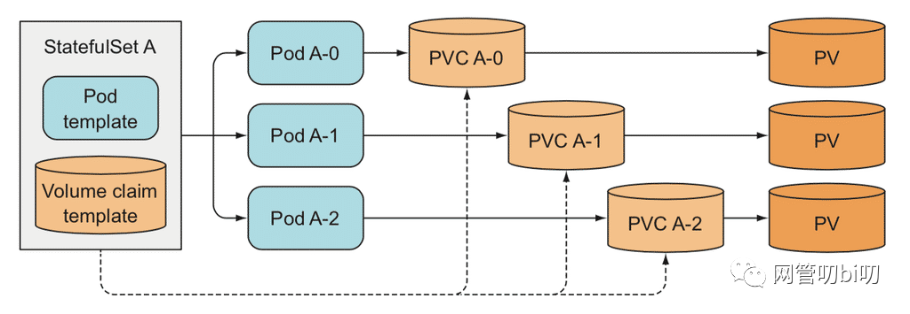

## 前言
作为一个后端工程师，因为负责的大部分项目都是Web服务这类的“无状态应用”，在平时工作中接触到的最常用的Kubernetes控制器是Deployment，但是Deployment只适合于编排“无状态应用”，它会假设一个应用的所有 Pod是完全一样的，互相之间也没有顺序依赖，也无所谓运行在哪台宿主机上。正因为每个Pod都一样，在需要的时候可以水平扩/缩，增加和删除Pod。

但是并不是所有应用都是无状态的，尤其是每个实例之间有主从关系的应用和数据存储类应用，针对这类应用使用Deployment控制器无法实现正确调度，所以Kubernetes里采用了另外一个控制器StatefulSet负责调度有状态应用的Pod，保持应用的当前状态始终等于应用定义的所需状态。

## 什么是StatefulSet
和Deployment一样StatefulSet也是一种可以帮助你部署和扩展Kubernetes Pod的控制器，使用Deployment时多数时候你不会在意Pod的调度方式。但当你需要关心Pod的部署顺序、对应的持久化存储或者要求Pod拥有固定的网络标识（即使重启或者重新调度后也不会变）时，StatefulSet控制器会帮助你，完成调度目标。

每个由StatefulSet创建出来的Pod都拥有一个序号（从0开始）和一个固定的网络标识。你还可以在YAML定义中添加VolumeClaimTemplate来声明Pod存储使用的PVC。当StatefulSet部署Pod时，会从编号0到最终编号逐一部署每个Pod，只有前一个Pod部署完成并处于运行状态后，下一个Pod才会开始部署。


StatefulSet，是在Deployment的基础上扩展出来的控制器，在1.9版本之后才加入Kubernetes控制器家族，它把有状态应用需要保持的状态抽象分为了两种情况：

- 拓扑状态。这种情况意味着，应用的多个实例之间不是完全对等的关系。这些应用实例，必须按照某些顺序启动，比如应用的主节点 A 要先于从节点 B 启动。而如果你把 A 和 B 两个 Pod 删除掉，它们再次被创建出来时也必须严格按照这个顺序才行。并且，新创建出来的 Pod，必须和原来 Pod 的网络标识一样，这样原先的访问者才能使用同样的方法，访问到这个新 Pod。

- 存储状态。这种情况意味着，应用的多个实例分别绑定了不同的存储数据。对于这些应用实例来说，Pod A 第一次读取到的数据，和Pod A 被重新创建后再次读取到的数据，应该是同一份 。这种情况最典型的例子，就是一个数据库应用的多个存储实例。

所以，StatefulSet 的核心功能，就是通过某种方式记录这些状态，然后在 Pod 被重新创建时，能够为新 Pod 恢复这些状态。

## 保持应用的拓扑状态
想要维护应用的拓扑状态，必须保证能用固定的网络标识访问到固定的Pod实例，Kubernetes是通过Headless Service给每个Endpoint（Pod）添加固定网络标识的，所以接下来我们花些时间了解下Headless Service。

### HeadlessService
在文章学练结合，快速掌握Kubernetes Service

```text
Service是在逻辑抽象层上定义了一组Pod，为他们提供一个统一的固定IP和访问这组Pod的负载均衡策略。

对于 ClusterIP 模式的 Service 来说，它的 A 记录的格式是:

serviceName.namespace.svc.cluster.local，当你访问这条 A 记录的时候，它解析到的就是该 Service 的 VIP 地址。

对于指定了 clusterIP=None 的 Headless Service来说，它的A记录的格式跟上面一样，但是访问记录后返回的是Pod的IP地址集合。Pod 也会被分配对应的 DNS A 记录，格式为：podName.serviceName.namesapce.svc.cluster.local 
```
普通的Service都有ClusterIP，它其实就是一个虚拟IP，会把请求转发到该Service所代理的某一个Pod上。

使用的Service和Deployment的定义如下：
```yaml
apiVersion: v1
kind: Service
metadata:
  name: app-service
spec:
  type: NodePort #创建NodePort类型Service时会先创建一个ClusterIp类型的Service
  selector:
    app: go-app
  ports:
    - name: http
      protocol: TCP
      nodePort: 30080
      port: 80
      targetPort: 3000

---

apiVersion: apps/v1
kind: Deployment
metadata:
  name: my-go-app
spec:
  replicas: 2
  selector:
    matchLabels:
      app: go-app
  template:
    metadata:
      labels:
        app: go-app
    spec:
      containers:
        - name: go-app-container
          image: kevinyan001/kube-go-app
          ports:
            - containerPort: 3000
```
在Kubernetes里创建好上述资源后，可以进入其中一个Pod查看Service的A记录
```
➜  kubectl exec -it my-go-app-69d6844c5c-gkb6z  -- /bin/sh
/app # nslookup app-service.default.svc.cluster.local
Server:  10.96.0.10
Address: 10.96.0.10:53

Name: app-service.default.svc.cluster.local
Address: 10.108.26.155
```
如果想让DNS通过刚才的Service名直接解析出Pod名对应的IP是不可以的：
```
/app # nslookup my-go-app-69d6844c5c-gkb6z.app-service.default.svc.cluster.local
Server:  10.96.0.10
Address: 10.96.0.10:53

** server can't find my-go-app-69d6844c5c-gkb6z.app-service.default.svc.cluster.local: NXDOMAIN
```

因为Service有ClusterIp，直接被DNS解析了，那怎么才能让DNS通过Service解析Pod的IP呢？所以就有了Headless Service。

创建Headless Service跟创建普通Service时唯一的不同就是在YAML定义里指定spec.clusterIP: None，也就是不需要ClusterIP的Service。

下面我创建一个Headless Service代理上面例子中的那两个应用Pod实例，它的YAML定义如下
```yaml
# headless-service.yaml
apiVersion: v1
kind: Service
metadata:
  name: app-headless-svc
spec:
  clusterIP: None # <-- Don't forget!!
  selector:
    app: go-app
  ports:
    - protocol: TCP
      port: 80
      targetPort: 3000
```
```
➜ kubectl apply -f headless-service.yaml service/app-headless-svc created
```
Headless Service创建完后，我们再来看一下这个Service在DNS里对应的A记录

还是在刚才进入的那个Pod里，记住Service的DNS记录的格式是 serviceName.namespace.svc.cluster.local
```
/app # nslookup app-headless-svc.default.svc.cluster.local
Server:  10.96.0.10
Address: 10.96.0.10:53

Name: app-headless-svc.default.svc.cluster.local
Address: 10.1.0.38
Name: app-headless-svc.default.svc.cluster.local
Address: 10.1.0.39
```

DNS查询会返回HeadlessService代理的两个Endpoint (Pod)对应的IP，这样客户端就能通过Headless Service拿到每个EndPoint的IP，如果有需要可以自己在客户端做些负载均衡策略。Headless Service还有一个重要用处（也是使用StatefulSet时需要Headless Service的真正原因），它会为代理的每一个StatefulSet创建出来的Endpoint也就是Pod添加DNS域名解析，这样Pod之间就可以相互访问。

#### 划重点:

1. 这个分配给Pod的DNS域名就是Pod的固定唯一网络标识，即使发生重建和调度DNS域名也不会改变。
2. Deployment创建的Pod的名字是随机的，所以HeadlessService不会为Deployment创建出来的Pod单独添加域名解析。

我们把上面的例子稍作修改，新增一个StatefulSet对象用它创建Pod来验证一下。
```yaml
apiVersion: v1
kind: Service
metadata:
  name: app-headless-svc
spec:
  clusterIP: None # <-- Don't forget!!
  selector:
    app: stat-app
  ports:
    - protocol: TCP
      port: 80
      targetPort: 3000

---
apiVersion: apps/v1
kind: StatefulSet # <-- claim stateful set
metadata:
  name: stat-go-app
spec:
  serviceName: app-headless-svc # <-- Set headless service name
  replicas: 2
  selector:
    matchLabels:
      app: stat-app
  template:
    metadata:
      labels:
        app: stat-app
    spec:
      containers:
        - name: go-app-container
          image: kevinyan001/kube-go-app
          resources:
            limits:
              memory: "64Mi"
              cpu: "50m"
          ports:
            - containerPort: 3000
```

这个YAML文件，和我们在前面用到的Deployment的唯一区别，就是多了一个spec.serviceName 字段。

StatefulSet给它所管理的所有 Pod 名字，进行了编号，编号规则是：StatefulSet名-序号。这些编号都是从 0 开始累加，与 StatefulSet 的每个 Pod 实例一一对应，绝不重复。
```
➜ kubectl get pod                                        
NAME            READY   STATUS              RESTARTS   AGE
stat-go-app-0   1/1     Running             0          9s
stat-go-app-1   0/1     ContainerCreating   0          1s
```

我们可以进入stat-go-app-0这个Pod查看一下这两个Pod的DNS记录

***提示：Headless Service给Pod添加的DNS的格式为podName.serviceName.namesapce.svc.cluster.local***

```
/app # nslookup stat-go-app-0.app-headless-svc.default.svc.cluster.local
Server:  10.96.0.10
Address: 10.96.0.10:53

Name: stat-go-app-0.app-headless-svc.default.svc.cluster.local
Address: 10.1.0.46

/app # nslookup stat-go-app-1.app-headless-svc.default.svc.cluster.local
Server:  10.96.0.10
Address: 10.96.0.10:53

Name: stat-go-app-1.app-headless-svc.default.svc.cluster.local
Address: 10.1.0.47
```
于是乎这样就保证了Pod之间能够相互通信，如果要用StatefulSet编排一个有主从关系的应用，就可以通过DNS域名访问的方式保证相互之间的通信，即使出现Pod重新调度它在内部的DNS域名也不会改变。

### 保持Pod的编排顺序
通过上面名字叫stat-go-app的StatefulSet控制器创建Pod的过程我们能发现，StatefulSet它所管理的所有 Pod ，名称的命名规则是：StatefulSet名-序号。序号都是从 0 开始累加，与 StatefulSet 的每个 Pod 实例一一对应，绝不重复。

所以上面我们通过kubectl get pod 命令看到了两个名字分别为stat-go-app-0和stat-go-app-1的Pod实例。

更重要的是，这些Pod的创建，也是严格按照名称的编号顺序进行的。比如，在stat-go-app-0进入到 Running 状态、并且细分状态（Conditions）成为 Ready 之前，stat-go-app-1会一直处于 Pending 等待状态。

StatefulSet会一直记录着这个拓扑状态，即使发生调谐，重新调度Pod也是严格遵守这个顺序，编号在前面的Pod创建完成并且进入Ready运行状态后，下一个编号的Pod才会开始创建。

### 保持Pod固定唯一网络标识
理解了Headless Service真正的用途后，关于Kubernetes内部如何让Pod固定唯一网络标识这个问题的答案就是：Headless Service为代理的每一个StatefulSet创建出来的Pod添加DNS域名解析。所以在用StatefulSet编排实例之间有主从关系这样的有状态应用时，Pod相互之间就能以podName.serviceName.namesapce.svc.cluster.local 这个域名格式进行通信，这样就不用在担心Pod被重新调度到其他的节点上后IP的变化。

## 保持实例的存储状态
前面的文章Kubernetes Pod入门指南在介绍Pod使用的数据卷的时候，我曾提到过，要在一个Pod里声明 Volume，只需要在Pod定义里加上spec.volumes 字段即可。然后，你就可以在这个字段里定义一个具体类型的Volume了，比如：hostPath类型。
```
......
spec:
  volumes:
  - name: app-volume  
    hostPath:
      # 在宿主机上的目录位置
      path: /data
  containers:
  - image: mysql:5.7
    name: mysql
    ports:
      - containerPort: 3306
    volumeMounts:
    - mountPath: /usr/local/mysql/data
      name: app-volume
......
```

但是这种声明使用数据卷的方式，对于每个Pod实例都绑定了存储数据的数据存储类应用是不适用的。由于hostPath类型的Volume是基于宿主机目录的，如果一旦Pod发生重新调度，去了其他节点，就没有办法在新节点上把Pod的存储数据恢复回来了。

既然在Pod宿主机上的数据卷不适用，那么只能让Pod去使用Kubernetes的集群存储资源了。集群持久数据卷资源的配置和使用是通过PV和PVC完成的，我们先来了解一下这两个概念。

### PV和PVC
持久卷（PersistentVolume，PV）是集群中的一块存储，可以由管理员事先供应，或者 使用存储类（Storage Class）来动态供应。持久卷是集群资源，就像节点也是集群资源一样，它们拥有独立于任何使用PV的Pod的生命周期。

作为一个应用开发者，我可能对分布式存储项目（比如 Ceph、GFS、HDFS 等）一窍不通，自然不会编写它们对应的 Volume 定义文件，这不仅超越了开发者的知识储备，还会有暴露公司基础设施敏感信息（秘钥、管理员密码等信息）的风险。所以Kubernetes后来又引入了持久卷申领（PersistentVolumeClaim，PVC）。

PVC表达的是Pod对存储的请求。概念上与Pod类似。Pod会耗用节点资源，而PVC申领会耗用PV资源。有了PVC后，在需要使用持久卷的Pod的定义里只需要声明使用这个PVC即可，这为使用者隐去了很多关于存储的信息，举个例子来说就是，我可以在完全不知道远程存储的空间名、服务器地址、AccessKey之类的信息时直接把远程存储挂载到Pod的容器里。比如像下面这样：

```
kind: PersistentVolumeClaim
apiVersion: v1
metadata:
  name: pv-claim
spec:
  accessModes:
  - ReadWriteOnce
  resources:
    requests:
      storage: 1Gi
---
apiVersion: v1
kind: Pod
metadata:
  name: pv-pod
spec:
  containers:
    - name: pv-container
      image: nginx
      ports:
        - containerPort: 80
          name: "http-server"
      volumeMounts:
        - mountPath: "/usr/share/nginx/html"
          name: pv-storage
  volumes:
    - name: pv-storage
      persistentVolumeClaim:
        claimName: pv-claim
```

可以看到，在这个Pod 的Volumes 定义中，我们只需要声明它的类型是 persistentVolumeClaim，然后指定 PVC 的名字，完全不用关心持久卷本身的定义。

PVC创建出来后需要和PV完成绑定才能使用，不过对于使用者来说我们可以先不用关心这个细节。可以用编程领域的接口和实现的关系来理解PVC和PV的关系。

### StatefulSet的PVC模板
关于StatefulSet、Pod、PVC和PV之间的关系可以用下面这张图表示



StatefulSet、Pod、PVC和PV间的关系
在StatefulSet的定义里我们可以额外添加了一个spec.volumeClaimTemplates字段。它跟 Pod模板（spec.template字段）的作用类似。

```yaml
apiVersion: apps/v1
kind: StatefulSet
metadata:
  name: web
spec:
  serviceName: "nginx"
  replicas: 2
  selector:
    matchLabels:
      app: nginx
  template:
    metadata:
      labels:
        app: nginx
    spec:
      containers:
      - name: nginx
        image: nginx:1.9.1
        ports:
        - containerPort: 80
          name: web
        volumeMounts:
        - name: www
          mountPath: /usr/share/nginx/html
  volumeClaimTemplates:
  - metadata:
      name: www
    spec:
      accessModes:
      - ReadWriteOnce
      resources:
        requests:
          storage: 1Gi
```

***Note: StatefulSet和Deployment里都有Pod模板，他是控制器创建Pod实例的依据，关于这部分知识可以查看以前关于Deployment的文章详细了解。***

也就是说，凡是被这个StatefulSet管理的Pod，都会声明一个对应的PVC；而这个PVC的定义，就来自于volumeClaimTemplates这个模板字段。更重要的是，这个 PVC 的名字，会被分配一个与这个Pod完全一致的编号。

StatefulSet创建的这些PVC，都以PVC名-StatefulSet名-序号这个格式命名的。

对于上面这个StatefulSet来说，它创建出来的Pod和PVC的名称如下：

```
Pod：web-0, web-1
PVC：www-web-0, www-web-1
```
假如发生重新调度web-0这个Pod被重新创建调度到了其他节点，在这个新的Pod对象的定义里，由于volumeClaimTemplates的存在，它声明使用的PVC的名字，还是叫作：www-web-0。所以，在这个新的web-0被创建出来之后，Kubernetes会为它查找绑定名叫www-web-0的PVC。由于PVC的生命周期是独立于使用它的Pod的，这样新Pod就接管了以前旧Pod留下的数据。

## 总结
StatefulSet就像是一种特殊的Deployment，它使用Kubernetes里的两个标准功能：Headless Service 和 PVC，实现了对的拓扑状态和存储状态的维护。

StatefulSet通过Headless Service ， 为它管控的每个Pod创建了一个固定保持不变的DNS域名，来作为Pod在集群内的网络标识。加上为Pod进行编号并严格按照编号顺序进行Pod调度，这些机制保证了StatefulSet对维护应用拓扑状态的支持。

而借由StatefulSet定义文件中的volumeClaimTemplates声明Pod使用的PVC，它创建出来的PVC会以名称编号这些约定与它创建出来的Pod进行绑定，借由PVC独立于Pod的生命周期和两者之间的绑定机制的帮助，StatefulSet完成了应用存储状态的维护。

## 参考
- https://mp.weixin.qq.com/s/y60q0-RMh8isd4u4PuLfUg