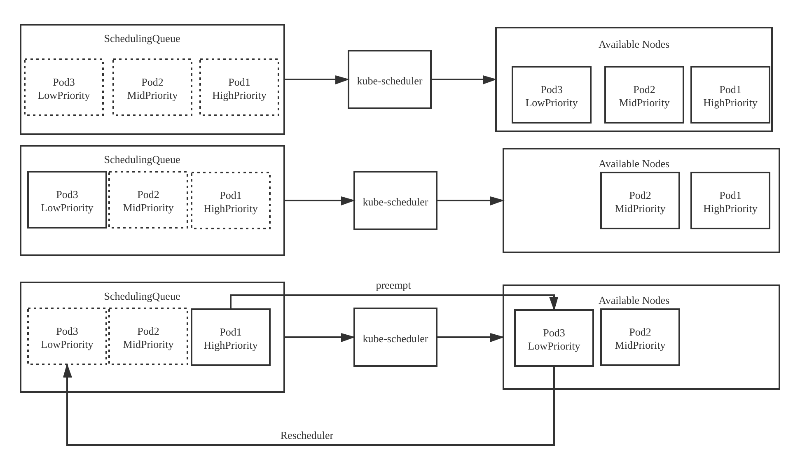

## 前言
当kube-scheduler调度器运行时，根据Pod资源对象的优先级进行调度，高优先级的Pod资源对象排在调度队列(SchedulingQueue)的前面，优先获得合适的节点(Node),然后为低优先级的Pod资源对象选择合适的节点

当高优先级的Pod资源对象没有找到合适的节点时，调度器会尝试抢占低优先级的Pod资源对象的节点，抢占的过程是将低优先及的Pod资源对象从所在节点上驱逐，事高优先级的Pod资源对象运行在该节点上，被驱逐的低优先级Pod资源对象会重新进入到调度队列并等待再次选择合适的节点

## kube-scheduler优先级与抢占机制的场景



SchedulingQueue调度队列中拥有高优先级(HighPriority),中优先级(MidPriority),低优先级(LowPriority)3个Pod资源对象，它们等待被调度。调度队列中的对象也被称作带调度Pod(Pending Pod)资源对象。

- 场景1：kube-scheduler调度其将待调度Pod资源对象按照优先级顺序调度到可用节点上
- 场景2：kube-scheduler调度器将待调度Pod资源对象按照优先级顺序调度到可用节点上。当调度Pod3资源对象时，可用节点没有可用资源运行Pod3。此时，Pod3在调度队列中处于待调度状态
- 场景3：kube-scheduler调度器将待调度Pod资源对象按照优先级顺序调度到可以节点上。可用节点上已调度了Pod2和Pod3资源对象，当调度Pod1时，可用节点上已经没有资源运行Pod1了，此时高优先级的Pod1将抢占低优先级的Pod3,而被抢占的Pod3重新进入调度队列等待再次选择合适的节点 

在默认情况下，若不启用优先级功能，则现有Pod资源对象的优先级都为0,可以通过PriorityClass对象设置优先级。
```yaml
apiVersion: scheduling.k8s.io/v1
kind: PriorityClass
metadata:
  name: high-priority
value: 100000
globalDefault: false
description: "This priority class should be used for XYZ service pods only"
```
value字段表示优先级，值越高优先级越高。注意:在k8s中，只能存在一个将globalDefault字段为true的PriorityClass。

为Pod设置优先级，在PodSpec中添加优先级对象的名称即可
```yaml
apiVersion: v1
kind: Pod
metadata:
  name: nginx
  labels:
    env: test
spec:
  containers:
    - name: nginx
      image: nginx
      imagePullPolicy: IfNotPresent
  priorityClassName: high-priority
```

## Preempt抢占机制
Preempt抢占机制的流程如下图


抢占只会发生在Pod资源没有调度成功，sched.schedule函数返回FitError错误时。

sched.config.PodPreemptor.GetUpdatedPod函数通过clientset向api-server发起请求，更新调度失败的Pod资源对象数据

sched.config.Algorithm.Preempt函数执行Preempt抢占算法，返回值为node(被抢占的节点),victims(被抢占节点上需要驱逐的Pods),nominatedPodsToClear(被抢占节点上所有的NominatedPods)

sched.config.PodPreemptor.DeletePod函数驱逐victims。驱逐过程通过clientset想api-server发起删除Pod资源对象请求

sched.config.PodPreemptor.RemoveNominateNodeName函数清除nominatedPodsToClear上的NominatedNodeName字段，因为被抢占的Pod已经不再适合此节点

重点介绍一下genericScheduler.Preempt函数，代码如下:

#### 1. 判断当前pod是否有资格去抢占其他Pod所在节点，代码路径`pkg/scheduler/scheduler.go：469`->`pkg/scheduler/core/generic_scheduler.go:295`->`pkg/scheduler/core/generic_scheduler.go:1131`
```go
func podEligibleToPreemptOthers(pod *v1.Pod, nodeNameToInfo map[string]*schedulernodeinfo.NodeInfo) bool {
	nomNodeName := pod.Status.NominatedNodeName
	if len(nomNodeName) > 0 {
		if nodeInfo, found := nodeNameToInfo[nomNodeName]; found {
			for _, p := range nodeInfo.Pods() {
				if p.DeletionTimestamp != nil && util.GetPodPriority(p) < util.GetPodPriority(pod) {
					// There is a terminating pod on the nominated node.
					return false
				}
			}
		}
	}
	return true
}
```
遍历节点上所有的Pod资源对象，如果发现节点上有Pod资源对象优先级小于待调度的Pod并处于终止状态，则返回false,不会发生抢占;否则返回true

#### 2. 从预选调度失败的节点中尝试找到能够调度成功的节点列表(潜在节点列表)

代码路径`pkg/scheduler/core/generic_scheduler.go:306`->`pkg/scheduler/core/generic_scheduler.go:1082`
```go
func nodesWherePreemptionMightHelp(nodes []*v1.Node, failedPredicatesMap FailedPredicateMap) []*v1.Node {
	potentialNodes := []*v1.Node{}
	for _, node := range nodes {
		unresolvableReasonExist := false
		failedPredicates, _ := failedPredicatesMap[node.Name]
		// If we assume that scheduler looks at all nodes and populates the failedPredicateMap
		// (which is the case today), the !found case should never happen, but we'd prefer
		// to rely less on such assumptions in the code when checking does not impose
		// significant overhead.
		// Also, we currently assume all failures returned by extender as resolvable.
		for _, failedPredicate := range failedPredicates {
			switch failedPredicate {
			case
				predicates.ErrNodeSelectorNotMatch,
				predicates.ErrPodAffinityRulesNotMatch,
				predicates.ErrPodNotMatchHostName,
				predicates.ErrTaintsTolerationsNotMatch,
				predicates.ErrNodeLabelPresenceViolated,
				// Node conditions won't change when scheduler simulates removal of preemption victims.
				// So, it is pointless to try nodes that have not been able to host the pod due to node
				// conditions. These include ErrNodeNotReady, ErrNodeUnderPIDPressure, ErrNodeUnderMemoryPressure, ....
				predicates.ErrNodeNotReady,
				predicates.ErrNodeNetworkUnavailable,
				predicates.ErrNodeUnderDiskPressure,
				predicates.ErrNodeUnderPIDPressure,
				predicates.ErrNodeUnderMemoryPressure,
				predicates.ErrNodeUnschedulable,
				predicates.ErrNodeUnknownCondition,
				predicates.ErrVolumeZoneConflict,
				predicates.ErrVolumeNodeConflict,
				predicates.ErrVolumeBindConflict:
				unresolvableReasonExist = true
				break
			}
		}
		if !unresolvableReasonExist {
			klog.V(3).Infof("Node %v is a potential node for preemption.", node.Name)
			potentialNodes = append(potentialNodes, node)
		}
	}
	return potentialNodes
}
```
failedPredicatesMap是在预选节点用来保存的不满足预选算法的节点和不满足的原因。

nodesWherePreemptionMightHelp函数做的是从failedPredicatesMap数组中尝试找到能够再次调度成功的节点列表，也称之为潜在的节点列表(potentialNodes)。
遍历failedPredicatesMap数组，如果节点预选失败的原因是ErrNodeSelectorNotMatch等(如代码中所示)，则节点无法加入潜在节点列表。

另外，还有一部分在预选优化阶段被过滤掉的节点，也会被加入潜在节点列表。

#### 3. 从潜在节点列表中尝试找到能够抢占成功的节点列表(驱逐的节点列表)

代码路径`pkg/scheduler/core/generic_scheduler.go:316`->`pkg/scheduler/core/generic_scheduler.go:916`
```go
func selectNodesForPreemption(pod *v1.Pod,
	nodeNameToInfo map[string]*schedulernodeinfo.NodeInfo,
	potentialNodes []*v1.Node,
	fitPredicates map[string]predicates.FitPredicate,
	metadataProducer predicates.PredicateMetadataProducer,
	queue internalqueue.SchedulingQueue,
	pdbs []*policy.PodDisruptionBudget,
) (map[*v1.Node]*schedulerapi.Victims, error) {
	nodeToVictims := map[*v1.Node]*schedulerapi.Victims{}
	var resultLock sync.Mutex

	// We can use the same metadata producer for all nodes.
	meta := metadataProducer(pod, nodeNameToInfo)
	checkNode := func(i int) {
		nodeName := potentialNodes[i].Name
		var metaCopy predicates.PredicateMetadata
		if meta != nil {
			metaCopy = meta.ShallowCopy()
		}
		pods, numPDBViolations, fits := selectVictimsOnNode(pod, metaCopy, nodeNameToInfo[nodeName], fitPredicates, queue, pdbs)
		if fits {
			resultLock.Lock()
			victims := schedulerapi.Victims{
				Pods:             pods,
				NumPDBViolations: numPDBViolations,
			}
			nodeToVictims[potentialNodes[i]] = &victims
			resultLock.Unlock()
		}
	}
	workqueue.ParallelizeUntil(context.TODO(), 16, len(potentialNodes), checkNode)
	return nodeToVictims, nil
}
```
selectNodesForPreemption函数并发的计算所有潜在节点中可能被抢占的节点。通过selectVictimsOnNode函数遍历节点上所有的Pods,并筛选出优先级低于当前待调度Pod资源对象的pod作为被驱逐的对象。

#### 4. 从驱逐的节点列表中选择一个节点用于最终被抢占的节点(别抢占的节点)

代码路径`pkg/scheduler/core/generic_scheduler.go：330`->`pkg/scheduler/core/generic_scheduler.go:809`
```go
func pickOneNodeForPreemption(nodesToVictims map[*v1.Node]*schedulerapi.Victims) *v1.Node {
	if len(nodesToVictims) == 0 {
		return nil
	}
	minNumPDBViolatingPods := math.MaxInt32
	var minNodes1 []*v1.Node
	lenNodes1 := 0
	for node, victims := range nodesToVictims {
		if len(victims.Pods) == 0 {
			// We found a node that doesn't need any preemption. Return it!
			// This should happen rarely when one or more pods are terminated between
			// the time that scheduler tries to schedule the pod and the time that
			// preemption logic tries to find nodes for preemption.
			return node
		}
		numPDBViolatingPods := victims.NumPDBViolations
		if numPDBViolatingPods < minNumPDBViolatingPods {
			minNumPDBViolatingPods = numPDBViolatingPods
			minNodes1 = nil
			lenNodes1 = 0
		}
		if numPDBViolatingPods == minNumPDBViolatingPods {
			minNodes1 = append(minNodes1, node)
			lenNodes1++
		}
	}
	if lenNodes1 == 1 {
		return minNodes1[0]
	}

	// There are more than one node with minimum number PDB violating pods. Find
	// the one with minimum highest priority victim.
	minHighestPriority := int32(math.MaxInt32)
	var minNodes2 = make([]*v1.Node, lenNodes1)
	lenNodes2 := 0
	for i := 0; i < lenNodes1; i++ {
		node := minNodes1[i]
		victims := nodesToVictims[node]
		// highestPodPriority is the highest priority among the victims on this node.
		highestPodPriority := util.GetPodPriority(victims.Pods[0])
		if highestPodPriority < minHighestPriority {
			minHighestPriority = highestPodPriority
			lenNodes2 = 0
		}
		if highestPodPriority == minHighestPriority {
			minNodes2[lenNodes2] = node
			lenNodes2++
		}
	}
	if lenNodes2 == 1 {
		return minNodes2[0]
	}

	// There are a few nodes with minimum highest priority victim. Find the
	// smallest sum of priorities.
	minSumPriorities := int64(math.MaxInt64)
	lenNodes1 = 0
	for i := 0; i < lenNodes2; i++ {
		var sumPriorities int64
		node := minNodes2[i]
		for _, pod := range nodesToVictims[node].Pods {
			// We add MaxInt32+1 to all priorities to make all of them >= 0. This is
			// needed so that a node with a few pods with negative priority is not
			// picked over a node with a smaller number of pods with the same negative
			// priority (and similar scenarios).
			sumPriorities += int64(util.GetPodPriority(pod)) + int64(math.MaxInt32+1)
		}
		if sumPriorities < minSumPriorities {
			minSumPriorities = sumPriorities
			lenNodes1 = 0
		}
		if sumPriorities == minSumPriorities {
			minNodes1[lenNodes1] = node
			lenNodes1++
		}
	}
	if lenNodes1 == 1 {
		return minNodes1[0]
	}

	// There are a few nodes with minimum highest priority victim and sum of priorities.
	// Find one with the minimum number of pods.
	minNumPods := math.MaxInt32
	lenNodes2 = 0
	for i := 0; i < lenNodes1; i++ {
		node := minNodes1[i]
		numPods := len(nodesToVictims[node].Pods)
		if numPods < minNumPods {
			minNumPods = numPods
			lenNodes2 = 0
		}
		if numPods == minNumPods {
			minNodes2[lenNodes2] = node
			lenNodes2++
		}
	}
	// At this point, even if there are more than one node with the same score,
	// return the first one.
	if lenNodes2 > 0 {
		return minNodes2[0]
	}
	klog.Errorf("Error in logic of node scoring for preemption. We should never reach here!")
	return nil
}
```
代码很长，主要逻辑找到满足如下条件的节点：
- PDB中断次数最少的节点。PDB,PodDisruptionBudget,能够限制同时中断的Pod资源对象的数量，以保证集群的高可用性
- 具有最少高优先及Pod资源对象的节点
- 具有优先级Pod资源对象总数最少的节点
- 具有被驱逐Pod资源对象总数最少的节点
- 最后，多个节点有相同的分数，直接返回第一个节点

#### 5. 获取被抢占节点上的所有NominatedPods

代码路径`pkg/scheduler/core/generic_scheduler.go：339`->`pkg/scheduler/core/generic_scheduler.go:393`
```go
func (g *genericScheduler) getLowerPriorityNominatedPods(pod *v1.Pod, nodeName string) []*v1.Pod {
	pods := g.schedulingQueue.NominatedPodsForNode(nodeName)

	if len(pods) == 0 {
		return nil
	}

	var lowerPriorityPods []*v1.Pod
	podPriority := util.GetPodPriority(pod)
	for _, p := range pods {
		if util.GetPodPriority(p) < podPriority {
			lowerPriorityPods = append(lowerPriorityPods, p)
		}
	}
	return lowerPriorityPods
}
```
getLowerPriorityNominatedPods函数从调度队列中获取被抢占节点上所有优先级低于待调度Pod资源对象NominatedPods列表。在驱逐被抢占节点上的Pod资源对象列表后，还需要清楚被抢占Pod资源对象的NominatedPods