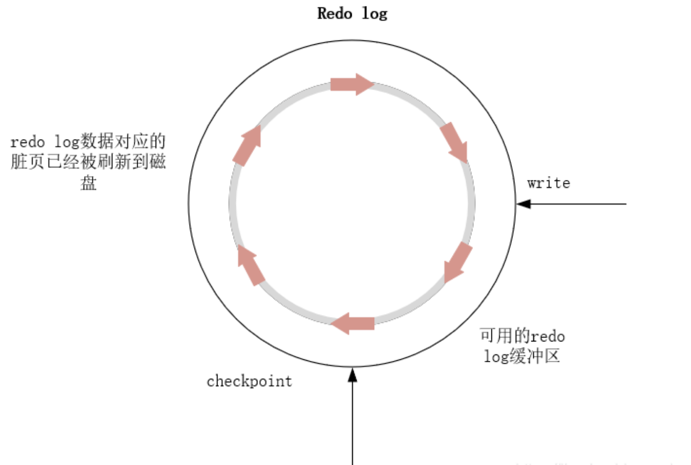

#### MySQL的Checkpoint机制介绍
Mysql对于持久性的实现是基于Write ahead log来实现的，在其管理的文件系统中有一个文件叫做重做日志(redo log)，其作用是在服务器宕机重启后通过它来实现数据恢复的功能。重做日志中记录的是事务对数据库所做的逻辑操作。这句话怎么理解呢？举个例子：

在事务A中修改了studenet表的一条记录：update student set sname = '张三' where sno = '1001';那么对于这个操作redo log记录的就是：修改sno='1001’的那条记录的sname=‘张三’，即对数据页的哪一行做什么操作，并不是直接记录sql操作后的数据值。另外需要理解的是，redo log采用了循环写机制，它被保存在共享表空间的ib_logfile0和ib_logfile1中，循环写的意思就是ib_logfile0写满了就写ib_logfile1，ib_logfile1满了就重写ib_logfile0。

那么它和Checkpoint机制有什么关系呢？所谓的Checkpoint机制其实就是什么时间将InnoDB缓存中的脏页刷新到磁盘中去，其隐含的语义是：保持redo log中的日志信息与磁盘数据一致。 即使服务器宕机了，也不会造成数据丢失。

首先来理解一下Checkpoint机制需要解决的问题。做个假设，当InnoDB缓冲区无限大以及redo log可以无限追加写的时候，我们还需要将缓冲区的脏页刷新到磁盘去吗？实际上是不需要的，因为数据读写只需要经过缓冲区即可，而且即使服务器宕机也可以通过redo log进行恢复。第一个条件现实条件很难满足(太贵了)，第二个条件其实还可以满足，因为硬盘比较便宜，但是这样子又带来了一个新的问题，就是当数据库运行了很长一段时间，redo log已经很大了，此时服务器宕机使用redo log恢复就会需要很长的时间，因此redo log被设计为了循环写。

好了，有了这个背景，我们就可以知道Checkpoint机制需要解决什么问题了。第一点，解决缓冲区有限的问题，当缓冲区中的脏页太多(75%)的时候就触发Checkpoint，将其中的脏页刷新到磁盘中去。第二，redo log不能无限追加写，如下图：InnoDB不断在redo log buffer中记录redo log的数据信息时，其Master Thread也在不断的将redo log buffer的内容刷新到磁盘，但是由于redo log是循环写，因此到一定时间就会出现redo log之前写的内容需要被覆盖，当发生redo log需要被覆盖时，触发Checkpoint机制，即下图的write追上了checkpoint。相信还是很好理解的，另外，这种机制还解决了数据库恢复慢的问题，因为现在redo log上记录信息对应的脏页有一部分已经被刷新到磁盘上去了，因此其恢复时间比较快。

#### InnoDB中的Checkpoint机制详细介绍
在其内部，有两种Checkpoint机制。
- Sharp Checkpoint
- Fuzzy Checkpoint
##### Sharp Checkpoint
它会在数据库关闭时将所有的脏页刷新到磁盘中去。

##### Fuzzy Checkpoint
它是利用InnoDB的Page Clear Thread在一定时机刷新一部分脏页到磁盘去。这是InnoDB默认采用的机制。

####总结

Checkpoint解决的三个问题：
- 解决了数据库恢复慢的问题(redo log循环写)
- 缓冲区不够用的问题(脏页比例达到75%强制刷新到磁盘)
- 重做日志不可用问题(在redo log的write追上checkpoint时刷新脏页到磁盘)