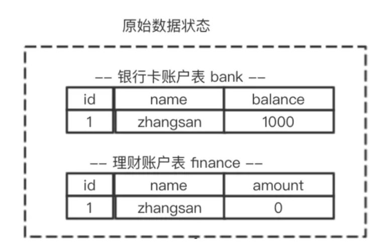
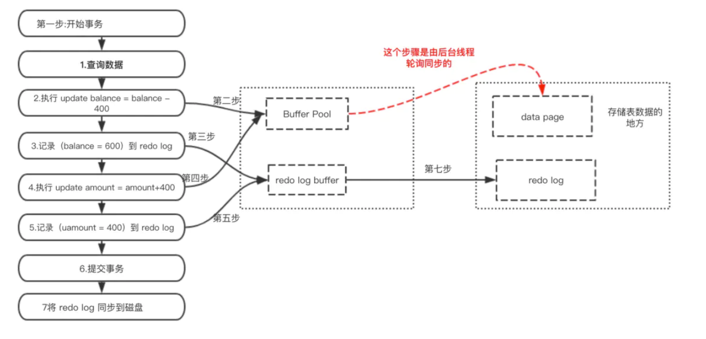
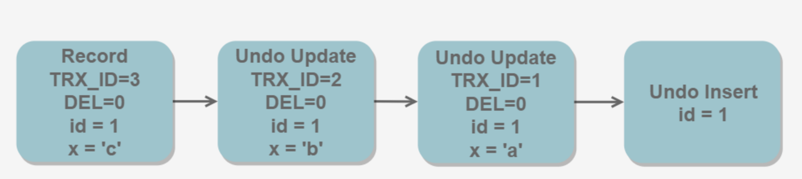
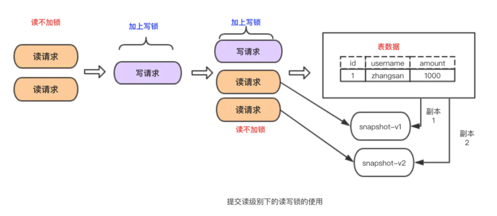
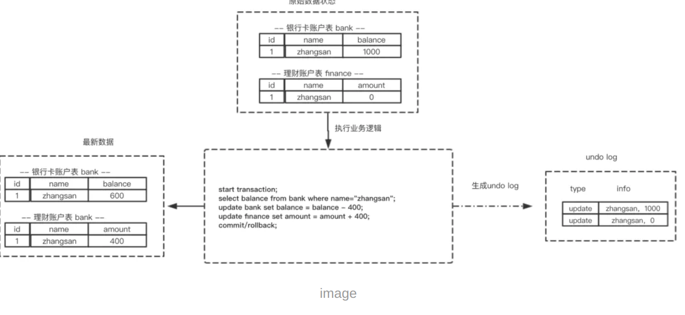
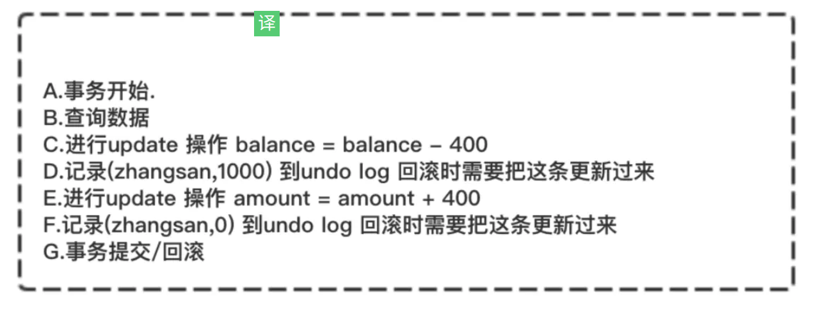
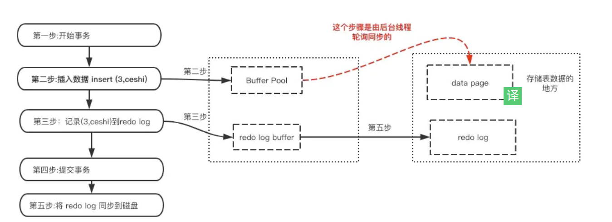

### 一、 redo log 与 undo log介绍
#### 1. redo log
什么是redo log ?

redo log叫做重做日志，是用来实现事务的持久性。该日志文件由两部分组成：重做日志缓冲（redo log buffer）以及重做日志文件（redo log）,前者是在内存中，后者在磁盘中。当事务提交之后会把所有修改信息都会存到该日志中。假设有个表叫做tb1(id,username) 现在要插入数据（3，ceshi）



```
start transaction;
select balance from bank where name="zhangsan";
// 生成 重做日志 balance=600
update bank set balance = balance - 400; 
// 生成 重做日志 amount=400
update finance set amount = amount + 400;
commit;
```


redo log 有什么作用？

mysql 为了提升性能不会把每次的修改都实时同步到磁盘，而是会先存到Boffer Pool(缓冲池)里头，把这个当作缓存来用。然后使用后台线程去做缓冲池和磁盘之间的同步。

那么问题来了，如果还没来的同步的时候宕机或断电了怎么办？还没来得及执行上面图中红色的操作。这样会导致丢部分已提交事务的修改信息！

所以引入了redo log来记录已成功提交事务的修改信息，并且会把redo log持久化到磁盘，系统重启之后在读取redo log恢复最新数据。


#### 2.undo log
什么是 undo log ？

undo log 叫做回滚日志，用于记录数据被修改前的信息。他正好跟前面所说的重做日志所记录的相反，重做日志记录数据被修改后的信息。undo log主要记录的是数据的逻辑变化，为了在发生错误时回滚之前的操作，需要将之前的操作都记录下来，然后在发生错误时才可以回滚。

还用上面那两张表


每次写入数据或者修改数据之前都会把修改前的信息记录到 undo log。

undo log 有什么作用？

undo log 记录事务修改之前版本的数据信息，因此假如由于系统错误或者rollback操作而回滚的话可以根据undo log的信息来进行回滚到没被修改前的状态。

#### 3. 总结：
redo log是用来恢复数据的 用于保障，已提交事务的持久化特性
undo log是用来回滚数据的用于保障 未提交事务的原子性

#### MVVC
MVCC (MultiVersion Concurrency Control) 叫做多版本并发控制。他的主要实现思想是通过数据多版本来做到读写分离。从而实现不加锁读进而做到读写并行。

MVCC在mysql中的实现依赖的是undo log与read view
- undo log :undo log 中记录某行数据的多个版本的数据。
- read view :用来判断当前版本数据的可见性



### 三 事物的实现
前面讲的重做日志，回滚日志以及锁技术就是实现事务的基础。

- 事务的原子性是通过 undo log 来实现的
- 事务的持久性性是通过 redo log 来实现的
- 事务的隔离性是通过 (读写锁+MVCC)来实现的
- 而事务的终极大 boss 一致性是通过原子性，持久性，隔离性来实现的！！！

#### 1.原子性的实现
一个事务必须被视为不可分割的最小工作单位，一个事务中的所有操作要么全部成功提交，要么全部失败回滚，对于一个事务来说不可能只执行其中的部分操作，这就是事务的原子性。

上面这段话取自《高性能MySQL》这本书对原子性的定义，原子性可以概括为就是要实现要么全部失败，要么全部成功。

以上概念相信大家伙儿都了解，那么数据库是怎么实现的呢？ 就是通过回滚操作。
所谓回滚操作就是当发生错误异常或者显式的执行rollback语句时需要把数据还原到原先的模样，所以这时候就需要用到undo log来进行回滚，接下来看一下undo log在实现事务原子性时怎么发挥作用的

##### 1.1 undo log 的生成
假设有两个表 bank和finance，表中原始数据如图所示，当进行插入，删除以及更新操作时生成的undo log如下面图所示：





根据上面流程可以得出如下结论：
1.每条数据变更(insert/update/delete)操作都伴随一条undo log的生成,并且回滚日志必须先于数据持久化到磁盘上
2.所谓的回滚就是根据回滚日志做逆向操作，比如delete的逆向操作为insert，insert的逆向操作为delete，update的逆向为update等。

##### 1.2 根据undo log 进行回滚
为了做到同时成功或者失败，当系统发生错误或者执行rollback操作时需要根据undo log 进行回滚,回滚操作就是要还原到原来的状态，undo log记录了数据被修改前的信息以及新增和被删除的数据信息，根据undo log生成回滚语句

#### 2.持久性的实现
事务一旦提交，其所作做的修改会永久保存到数据库中，此时即使系统崩溃修改的数据也不会丢失。

先了解一下MySQL的数据存储机制，MySQL的表数据是存放在磁盘上的，因此想要存取的时候都要经历磁盘IO,然而即使是使用SSD磁盘IO也是非常消耗性能的。
为此，为了提升性能InnoDB提供了缓冲池(Buffer Pool)，Buffer Pool中包含了磁盘数据页的映射，可以当做缓存来使用：

读数据：会首先从缓冲池中读取，如果缓冲池中没有，则从磁盘读取在放入缓冲池；

写数据：会首先写入缓冲池，缓冲池中的数据会定期同步到磁盘中；

上面这种缓冲池的措施虽然在性能方面带来了质的飞跃，但是它也带来了新的问题，当MySQL系统宕机，断电的时候可能会丢数据！！！

因为我们的数据已经提交了，但此时是在缓冲池里头，还没来得及在磁盘持久化，所以我们急需一种机制需要存一下已提交事务的数据，为恢复数据使用。

于是 redo log就派上用场了。下面看下redo log是什么时候产生的



既然redo log也需要存储，也涉及磁盘IO为啥还用它？

（1）redo log 的存储是顺序存储，而缓存同步是随机操作。

（2）缓存同步是以数据页为单位的，每次传输的数据大小大于redo log。

#### 3.隔离性实现
Mysql 隔离级别有以下四种（级别由低到高）：

- READ UNCOMMITED (未提交读): 因为读不会加任何锁，所以写操作在读的过程中修改数据，所以会造成脏读
- READ COMMITED (提交读): InnoDB在 READ COMMITTED，使用排它锁,读取数据不加锁而是使用了MVCC机制。或者换句话说他采用了读写分离机制。
- REPEATABLE READ (可重复读): Mysql默认隔离级别,mysql 有两种机制可以达到这种隔离级别的效果，分别是采用读写锁(只要没释放读锁，在次读的时候还是可以读到第一次读的数据)以及MVCC(因为多次读取只生成一个版本，读到的自然是相同数据)。
- SERIALIZABLE (可串行化)

### 结尾

实现事务采取了哪些技术以及思想？

- 原子性：使用 undo log ，从而达到回滚
- 持久性：使用 redo log，从而达到故障后恢复
- 隔离性：使用锁以及MVCC,运用的优化思想有读写分离，读读并行，读写并行
- 一致性：通过回滚，以及恢复，和在并发环境下的隔离做到一致性。


