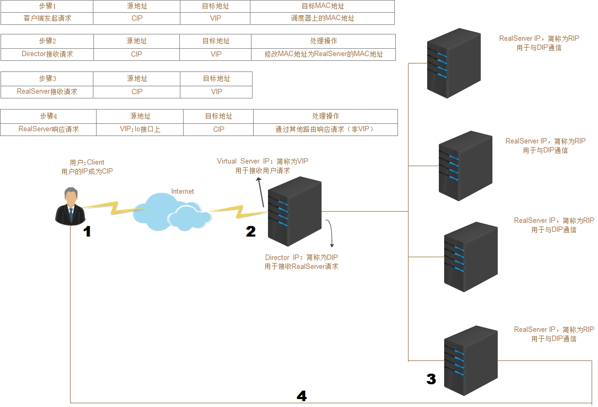
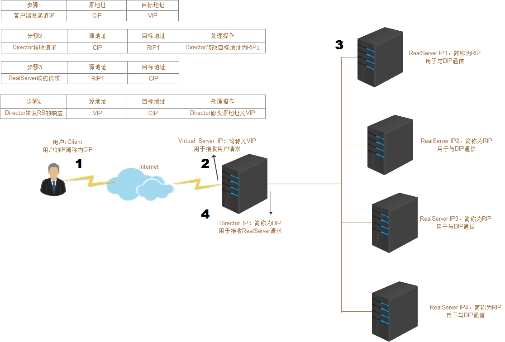
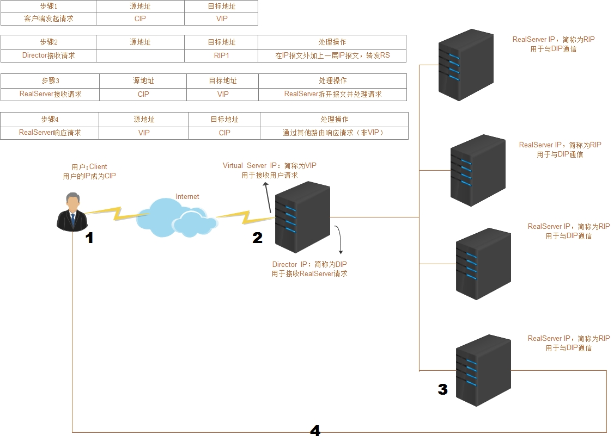

## 前言
LVS 是 Linux  Virtual Server ，Linux 虚拟服务器；是一个虚拟的服务器集群【多台机器 LB IP】。LVS 集群分为三层结构:

- 负载调度器(load balancer)：它是整个LVS 集群对外的前端机器，负责将client请求发送到一组服务器[多台LB IP]上执行，而client端认为是返回来一个同一个IP【通常把这个IP 称为虚拟IP/VIP】
- 服务器池(server pool)：一组真正执行client 请求的服务器，一般是我们的web服务器；除了web，还有FTP，MAIL，DNS
- 共享存储(shared stored)：它为 server pool 提供了一个共享的存储区，很容易让服务器池拥有相同的内容，提供相同的服务

几种术语缩写
```
cip：Client IP，客户端地址
vip：Virtual IP，虚IP
rip：Real IP，后端RS地址
RS: Real Server 后端真正提供服务的机器
LB： Load Balance 负载均衡器
LVS： Linux Virtual Server
sip： source ip，源IP
dip： destination ip，目的IP
NAT： Network Address Translation，网络地址转换
SNAT: Source Network Address Translation，源地址转换
DNAT: Destination Network Address Translation，目的地址转换
```
## IPVS
ipvs称之为IP虚拟服务器（IP Virtual Server，简写为IPVS）。是运行在LVS下的提供负载平衡功能的一种技术。ipvs安装在调度器上，同时在调度器虚拟出一个虚拟IP（VIP），用户通过这个虚拟IP访问服务，客户的请求到达调度器后，由调度器从Real Server列表中选取一个应用服务器响应客户的请求

## 四种常见模式
### 1.LVS DR模式

#### 1.1 示意图和调度步骤

#### 1.2 原理

- 1.请求流量(sip 200.200.200.2, dip 200.200.200.1) 先到达 LVS
- 2.然后LVS，根据负载策略挑选众多 RS中的一个，然后将这个网络包的MAC地址修改成这个选中的RS的MAC
- 3.LVS将处理过后的数据包丢给交换机，交换机根据二层MAC信息将这个包丢给选中的RS
- 4.接收到数据包的RS看到MAC地址是自己的、dip也是自己的（VIP配置在lo），愉快地收下并处理，并根据路由表将回复包（sip 200.200.200.1， dip 200.200.200.2）返回给交换机
- 5.回复包（sip 200.200.200.1， dip 200.200.200.2）经过交换机直接回复给client（不再走LVS）

可以看到经过上面的流程，请求包到达LVS后，LVS只对包的目的MAC地址作了修改，RS将回包直接回给了client。
由于LVS、RS都会接收处理到DIP为VIP的数据包，所以VIP必须绑定在网卡上，考虑到vlan内不能有多个设备对同一VIP进行ARP广播或应答，RS需将VIP配置在lo回环网卡上，并且对ARP进行相应的配置。

#### 1.3 LVS-DR的优点与缺点
- 优点：
1. RIP可以使用私有地址，也可以使用公网地址。
2. 只要求DIP和RIP的地址在同一个网段内。
3. 请求报文经由Director调度，但是响应报文不经由Director。
4. RS可以使用大多数OS
- 缺点：
1. 不支持端口映射。
2. 不能跨局域网。

### 2.LVS NAT(Network Address Transform)模式
#### 2.1 示意图和调度步骤


#### 2.2 原理
- 基于ip伪装MASQUERADES，原理是多目标DNAT。
- 所以请求和响应都经由Director调度器。

#### 2.3 LVS-NAT的优点与缺点
- 优点：
1. 支持端口映射
2. RS可以使用任意操作系统
3. 节省公有IP地址。
4. RIP和DIP都应该使用同一网段私有地址，而且RS的网关要指向DIP。
5. 使用nat另外一个好处就是后端的主机相对比较安全。
- 缺点：
1. 请求和响应报文都要经过Director转发;极高负载时，Director可能成为系统瓶颈。

## 3. full NAT模式
### 3.1 基本流程（类似NAT）
- client发出请求（sip 200.200.200.2 dip 200.200.200.1）
- 请求包到达lvs，lvs修改请求包为（sip 200.200.200.1， dip rip） 注意这里sip/dip都被修改了
- 请求包到达rs， rs回复（sip rip，dip 200.200.200.1）
- 这个回复包的目的IP是VIP(不像NAT中是 cip)，所以LVS和RS不在一个vlan通过IP路由也能到达lvs
- lvs修改sip为vip， dip为cip，修改后的回复包（sip 200.200.200.1，dip 200.200.200.2）发给client

### 3.2优缺点

- 优点：
1. 解决了NAT对LVS和RS要求在同一个vlan的问题，适用更复杂的部署形式
2. 不要求配置LVS为网关（LVS与RS可以通过三层通讯）
- 缺点：
1. RS看不到cip（NAT模式下可以看到）
2. 进出流量还是都走的lvs，容易成为瓶颈（跟NAT一样都有这个问题）

## 4. LVS IP TUNNEL

#### 4.1 示意图和调度步骤


#### 4.2 原理
- 基于隧道封装技术。在IP报文的外面再包一层IP报文。
- 当Director接收到请求的时候，选举出调度的RealServer
- 当接受到从Director而来的请求时，RealServer则会使用lo接口上的VIP直接响应CIP。
- 这样CIP请求VIP的资源，收到的也是VIP响应。

#### 4.3 LVS-TUN的优点与缺点
- 优点：
1. RIP,VIP,DIP都应该使用公网地址，且RS网关不指向DIP;
2. 只接受进站请求，解决了LVS-NAT时的问题，减少负载。
3. 请求报文经由Director调度，但是响应报文不需经由Director。
- 缺点：
1. 不指向Director所以不支持端口映射。
2. RS的OS必须支持隧道功能。
3. 隧道技术会额外花费性能，增大开销。

## LVS 调度算法
### 静态算法:仅依据算法本身进行轮询调度
- RR:Round Robin,轮调,一个接一个，自上而下
- WRR:Weighted RR，加权论调,加权，手动让能者多劳。
- SH:SourceIP Hash,来自同一个IP地址的请求都将调度到同一个RealServer
- DH:Destination Hash,不管IP，请求特定的东西，都定义到同一个RS上。

### 动态方法:根据算法及RS的当前负载状态进行调度
- LC:least connections(最小链接数)

链接最少，也就是Overhead最小就调度给谁。假如都一样，就根据配置的RS自上而下调度。

- WLC:Weighted Least Connection (加权最小连接数)


- SED:Shortest Expection Delay(最小期望延迟)

- NQ:Never Queue

- LBLC:Locality-Based Least-Connection,基于局部的的LC算法

正向代理缓存机制。访问缓存服务器，调高缓存的命中率。

和传统DH算法比较，考虑缓存服务器负载。可以看做是DH+LC

如果有两个缓存服务器

1.只要调度到其中的一个缓存服务器，那缓存服务器内就会记录下来。下一次访问同一个资源的时候也就是这个服务器了。 (DH)

2.有一个用户从来没有访问过这两个缓存服务器，那就分配到负载较小的服务器。LC

