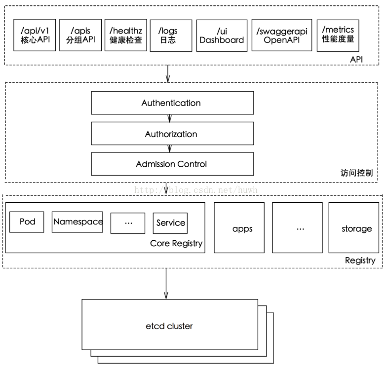

### ETCD 分布式的K-V存储系统
- http sever：（在etcd3里面变成了grpc server），主要处理client的操作请求以及节点间的数据同步和心跳保持
- raft状态机：通过对raft一致性协议的实现来保证etcd集群的高可用性
- store：负责etcd中事务操作的逻辑，是api server的命令的具体实现
- wal存储：负责具体的数据持久存储操作。它分为两部分，entry 负责实际的日志数据存储（在etcd里数据的存储都是带版本号的，对于同一个键值可能会有多个版本的记录存在，所以数据实际的存储方式即通过事务日志进行存储，而在内存里则存有键和版本号的映射关系以方便查询）。snapshot 则是对日志数据的的状态存储以防止过多的数据存在。

### API Server
ApiServer：对外提供增删查改etcd中资源配置数据，worker节点kubelet同master节点的API Server进行交互，

Master节点的scheduler和controller manager组件也需要同API Server进行交互以获取和修改对应资源的状态。

### 访问ApiServer三步骤
认证，授权，准入控制(资源管理方面的作用)

### kubernetes认证
kubernetes认证：kubernetes 提供了多种认证方式，比如客户端证书、静态token、静态密码文件、ServiceAccountTokens等等。你可以同时使用一种或多种认证方式。只要通过任何一个都被认作是认证通过。下面我们就认识几个常见的认证方式。
客户端证书认证：客户端证书认证叫作TLS双向认证，也就是服务器客户端互相验证证书的正确性，在都正确的情况下协调通信加密方案。为了使用这个方案，api-server 需要用 –client-ca-file 选项来开启。
静态Token：当我们有非常多的node节点时，手动为每个node节点配置TLS认证比较麻烦，这时就可以用到引导token的认证方式，前提是需要在api-server开启 experimental-bootstrap-token-auth 特性，客户端的token信息与预先定义的token匹配认证通过后，自动为node颁发证书。当然引导token是一种机制，可以用到各种场景中。
Service Account Tokens 认证：有些情况下，我们希望在pod内部访问api-server，获取集群的信息，甚至对集群进行改动。针对这种情况，kubernetes提供了一种特殊的认证方式：Service Account。 Service Account 和 pod、service、deployment 一样是 kubernetes 集群中的一种资源，用户也可以创建自己的 Service Account。
ServiceAccount 主要包含了三个内容：namespace、Token 和 CA。namespace 指定了 pod 所在的 namespace，CA 用于验证 apiserver 的证书，token 用作身份验证。它们都通过 mount 的方式保存在 pod 的文件系统中。
### kubernetes 授权
在 Kubernetes1.6 版本中新增角色访问控制机制（Role-Based Access，RBAC）让集群管理员可以针对特定使用者或服务账号的角色，进行更精确的资源访问控制。在RBAC中，权限与角色相关联，用户通过成为适当角色的成员而得到这些角色的权限。这就极大地简化了权限的管理。在一个组织中，角色是为了完成各种工作而创造，用户则依据它的责任和资格来被指派相应的角色，用户可以很容易地从一个角色被指派到另一个角色。

目前 Kubernetes 中有一系列的鉴权机制，因为Kubernetes社区的投入和偏好，相对于其它鉴权机制而言，RBAC是更好的选择。

### kubernetes 准入控制
准入控制（AdmissionControl）准入控制本质上为一段准入代码，在对kubernetes api的请求过程中，顺序为：先经过认证 & 授权，然后执行准入操作，最后对目标对象进行操作。这个准入代码在api-server中，而且必须被编译到二进制文件中才能被执行。

在对集群进行请求时，每个准入控制代码都按照一定顺序执行。如果有一个准入控制拒绝了此次请求，那么整个请求的结果将会立即返回，并提示用户相应的error信息。
常用组件（控制代码）如下：

- AlwaysAdmit：允许所有请求
- AlwaysDeny：禁止所有请求，多用于测试环境
- ServiceAccount：它将serviceAccounts实现了自动化，它会辅助serviceAccount做一些事情，比如如果pod没有serviceAccount属性，它会自动添加一个default，并确保pod的serviceAccount始终存在
- LimitRanger：他会观察所有的请求，确保没有违反已经定义好的约束条件，这些条件定义在namespace中LimitRange对象中。如果在kubernetes中使用LimitRange对象，则必须使用这个插件。
- NamespaceExists：它会观察所有的请求，如果请求尝试创建一个不存在的namespace，则这个请求被拒绝。

### Controller Manager
Controller Manager：以守护进程的形式运行着kubernetes几个核心的控制循环（也就是控制器），包括deployment，replicaset，namespace，serviceaccount，node等等，通过调用Api Server 的 list watch接口来监控自己负责的资源的配置变化.

### Scheduler
Scheduler：是一个策略丰富、拓扑感知、工作负载特定的功能，调度器显著影响可用性、性能和容量。调度器需要考虑个人和集体的资源要求、服务质量要求、硬件/软件/政策约束、亲和力和反亲和力规范、数据局部性、负载间干扰、完成期限等。
    
kube-scheduler 给一个 pod 做调度选择包含两个步骤：
- 过滤：过滤阶段会将所有满足 Pod 调度需求的 Node 选出来。例如，PodFitsResources 过滤函数会检查候选 Node 的可用资源能否满足 Pod 的资源请求。在过滤之后，得出一个 Node 列表，里面包含了所有可调度节点；通常情况下，这个 Node 列表包含不止一个 Node。如果这个列表是空的，代表这个 Pod 不可调度。
- 打分：打分阶段，调度器会为 Pod 从所有可调度节点中选取一个最合适的 Node。根据当前启用的打分规则，调度器会给每一个可调度节点进行打分。最后，kube-scheduler 会将 Pod 调度到得分最高的 Node 上。如果存在多个得分最高的 Node，kube-scheduler 会从中随机选取一个。
  
### kube-scheduler工作原理，多少节点对外提供服务(结合源码)
根据各种调度算法将 Pod 绑定到最合适的工作节点

预选（Predicates）：输入是所有节点，输出是满足预选条件的节点。kube-scheduler根据预选策略过滤掉不满足策略的Nodes。例如，如果某节点的资源不足或者不满足预选策略的条件如“Node的label必须与Pod的Selector一致”时则无法通过预选。

优选（Priorities）：输入是预选阶段筛选出的节点，优选会根据优先策略为通过预选的Nodes进行打分排名，选择得分最高的Node。例如，资源越富裕、负载越小的Node可能具有越高的排名。
  
### apiserver工作原理
  

apiserver 负载均衡：apiserver 服务是一个无状态服务，可以使用 Nginx + Keepalived、HAProxy + Keepalived和 云厂商LB（比如：阿里云SLB）

### headless-service使用场景
- 自主选择权 client可以自主选择哪个server
- Headless Service 的对应的每一个 Endpoints，即每一个Pod，都会有对应的DNS域名，这样Pod之间就可以互相访问。

### 集群使用的网络方案，pod如何和node网络通信的
Flannel：使用vxlan技术为各节点创建一个可以互通的Pod网络，使用的端口为UDP 8472（需要开放该端口，如公有云AWS等）。flanneld第一次启动时，从etcd获取配置的Pod网段信息，为本节点分配一个未使用的地址段，然后创建flannedl.1网络接口（也可能是其它名称，如flannel1等）。flannel将分配给自己的Pod网段信息写入 /run/flannel/subnet.env 文件，docker后续使用这个文件中的环境变量设置docker0网桥，从而从这个地址段为本节点的所有Pod容器分配IP。

Calico：在宿主机部署calico作为虚拟路由器，容器流量通过veth pair到达宿主机的网络命名空间上。

### 使用什么pod控制器，crd都需要定义什么,存活性监测和就绪性监测的实现方式
Pod控制器：Deployment，ReplicationController，StatefulSet，DaemonSet，Cronjob，Job

CRD定义：在 Kubernetes 中一切都可视为资源，Kubernetes 1.7 之后增加了对 CRD 自定义资源二次开发能力来扩展 Kubernetes API，通过 CRD 我们可以向 Kubernetes API 中增加新资源类型，而不需要修改 Kubernetes 源码来创建自定义的 API server，该功能大大提高了 Kubernetes 的扩展能力。当你创建一个新的CustomResourceDefinition (CRD)时，Kubernetes API服务器将为你指定的每个版本创建一个新的RESTful资源路径，我们可以根据该api路径来创建一些我们自己定义的类型资源。CRD可以是命名空间的，也可以是集群范围的，由CRD的作用域(scpoe)字段中所指定的，与现有的内置对象一样，删除名称空间将删除该名称空间中的所有自定义对象。customresourcedefinition本身没有名称空间，所有名称空间都可以使用。

存活性监测和就绪性监测的实现方式：readiness probe,liveness probe:HTTP请求，TCP连接，命令行

### 对外提供服务的pod暴露方式有哪些
- hostNetwork：在pod中使用该配置，在这种Pod中运行的应用程序可以直接看到pod启动的主机的网络接口
- hostPort：直接将容器的端口与所调度的节点上的端口路由，这样用户就可以通过主机的IP来访问Pod
- NodePort：是K8s里一个广泛应用的服务暴露方式。K8s中的service默认情况都是使用Cluster IP这种类型，会产生一个只能在内部访问的Cluster IP，如果想能够直接访问service，需要将service type修改为nodePort。同时给改service指定一个nodeport值(30000-32767)，用 --service-node-port-range 定义。
- LoadBalancer：只能在service上定义，是公有云提供的负载均衡器
- Ingress：ingress controller是由K8s管理的负载均衡容器，它的镜像包含一个nginx或HAProxy负载均衡器和一个控制器守护进程。

### 存储卷使用方式
- 动态存储使用 storageclass
- 静态存储使用 persistentvolume

### traefik的实现原理
Traefik 作为一种边缘路由器，动态感知后端服务实例变化，进行动态调整转发配置，会与ApiServer进行交互，发现k8s集群内部容器状态变化

### cgroup中的CPU有哪几种限制方式。Kubernetes是如何使用实现request和limit的？

### deployment/rs有什么区别，其使用方式、使用条件和原理是什么？

### 详述kube-proxy的工作原理，一个请求是如何经过层层转发落到某个Pod上的？注意请求可能来自Pod也可能来自外部。

### rc/rs功能是怎么实现的？请详述从API接收到一个创建rc/rs的请求，到最终在节点上创建Pod的全过程，尽可能详细。另外，当一个Pod失效时，Kubernetes是如何发现并重启另一个Pod的？
Replica Set 和 Replication Controller几乎完全相同。它们都确保在任何给定时间运行指定数量的pod副本。不同之处在于复制pod使用的选择器。Replica Set使用基于集合的选择器，而Replication Controller使用基于权限的选择器。
- Equity-Based选择器：这种类型的选择器允许按标签键和值进行过滤。因此，在外行术语中，基于Equity的选择器将仅查找与标签具有完全相同短语的pod。 示例：假设您的标签键表示app = nginx，那么，使用此选择器，您只能查找标签应用程序等于nginx的那些pod。
- Selector-Based选择器：此类型的选择器允许根据一组值过滤键。因此，换句话说，基于Selector的选择器将查找已在集合中提及其标签的pod。 示例：假设您的标签键在（nginx，NPS，Apache）中显示应用程序。然后，使用此选择器，如果您的应用程序等于任何nginx，NPS或Apache，则选择器将其视为真实结果。